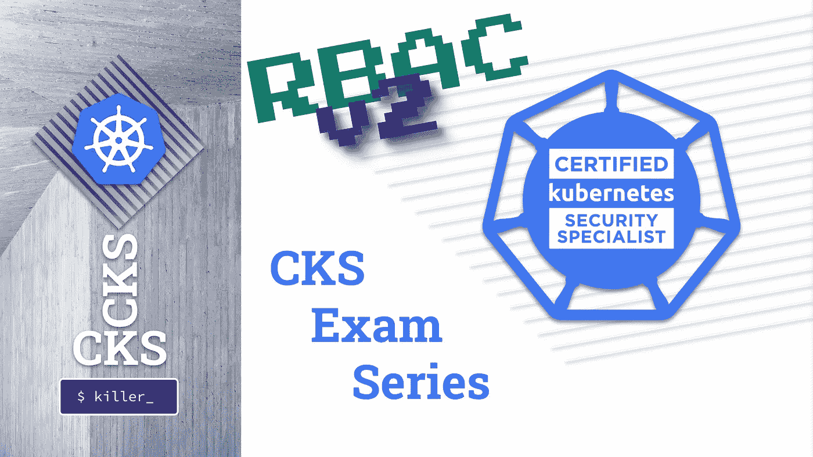

# CKS 考试系列#9 RBAC v2

> 原文：<https://itnext.io/cks-exam-series-9-rbac-v2-23ee24dd77cd?source=collection_archive---------3----------------------->

## Kubernetes CKS 示例考试问题系列



> [CKS 考试系列](https://killer.sh/r?d=cks-series) | [CKA 考试系列](https://killer.sh/r?d=cka-series) | [CKAD 考试系列](https://killer.sh/r?d=ckad-series)

**## # # # # # # # # # # # # # # # # # # # ##**

**此挑战不会在此更新，将移至:**

[https://killercoda.com/killer-shell-cks](https://killercoda.com/killer-shell-cks)

**## # # # # # # # # # # # # # # # # # # # # # # ##**

# 内容

1.  [创建集群&安全最佳实践](https://wuestkamp.medium.com/cks-exam-series-1-create-cluster-security-best-practices-50e35aaa67ae?source=friends_link&sk=8bc466dae0ea90412251e32d4eaf7539)
2.  [pod、机密和服务帐户](https://wuestkamp.medium.com/cks-exam-series-2-pods-and-secrets-3d92a6fba331?source=friends_link&sk=379fa6e196233c73ef7845d84a3aa34d)
3.  [不可变豆荚](https://wuestkamp.medium.com/cks-exam-series-3-immutable-pods-3812cf76cff4?source=friends_link&sk=ed1231a0382d97bd5c8267afe75f14ac)
4.  [崩溃那个 Apiserver &检查日志](https://wuestkamp.medium.com/cks-exam-series-4-crash-that-apiserver-5f4d3d503028?source=friends_link&sk=3ccd9bf1b728e85f86157ef1af23d455)
5.  [ImagePolicyWebhook/admission controller](https://wuestkamp.medium.com/cks-exam-series-5-imagepolicywebhook-8d09f1ceee70?source=friends_link&sk=93017beeae20f640f52db41d20d3ffcd)
6.  [用户和证书签名请求](https://wuestkamp.medium.com/cks-exam-series-6-users-and-certificatesigningrequests-368a5b2c6a3f)
7.  [服务帐户令牌安装](https://wuestkamp.medium.com/cks-exam-series-7-serviceaccount-tokens-1158c93612d4?source=friends_link&sk=1064eaf2f3d4d03576bcde207eaf7cfb)
8.  [基于角色的访问控制(RBAC)](https://wuestkamp.medium.com/cks-exam-series-8-rbac-db8a0984059e?source=friends_link&sk=8a1abe2d51275faed47f3d36858b14d5)
9.  [基于角色的访问控制(RBAC) v2](https://wuestkamp.medium.com/cks-exam-series-9-rbac-v2-23ee24dd77cd?source=friends_link&sk=2a6027eb75fbcf7876216cab222fa953)
10.  [容器硬化](https://wuestkamp.medium.com/cks-exam-series-10-container-hardening-177588b8bbfe?source=friends_link&sk=dbdddc1ee9321a946ee2e3f778c0711a)
11.  [网络策略(默认拒绝+允许列表)](https://wuestkamp.medium.com/cks-exam-series-11-networkpolicies-default-deny-and-allowlist-b2ce4186551f?source=friends_link&sk=bdcc071a32f26b93d6c4a51b9a9436a7)

~~~~~~~~~~~~~~~~~~~~~~~~~~~~~~~~~~

→查看 Udemy 上的 [**全 CKS 课程**](https://killer.sh/r?d=cks-course)

~~~~~~~~~~~~~~~~~~~~~~~~~~~~~~~~~~

# 规则！

1.  速度要快，避免从头开始手动创建 yaml
2.  只使用 kubernetes.io/docs 的[帮忙。](https://kubernetes.io/docs/home/)
3.  完成您的解决方案后，请查看我们的解决方案。你可能有一个更好的！

# 今天的任务:RBAC

1.  创建*名称空间*
2.  应该允许用户`smoke`在*命名空间* `applications`中`create`和`delete` *窗格*、*部署*和*状态集*
3.  用户`smoke`应该在所有*名称空间* **中拥有`view`权限(类似于默认 *ClusterRole* 名为`view`的权限)，但在** `kube-system`中没有
4.  用户`smoke`应该被允许**查看**可用的*机密*在*命名空间* `applications`中。只有*的秘密*的名字，没有数据。
5.  使用`kubectl auth can-i`验证一切
6.  使用实际用户`smoke`通过创建[来验证一切，就像这里所做的](https://wuestkamp.medium.com/cks-exam-series-6-users-and-certificatesigningrequests-368a5b2c6a3f)

.

.

.

.

.

# 解决办法

```
alias k=kubectl
```

## 1.创建名称空间

```
k create ns applications
```

## 2.RBAC 应用

```
k -n applications create role smoke --verb create,delete --resource pods,deployments,stsk -n applications create rolebinding smoke --role smoke --user smoke
```

## 3.RBAC 无处不在，但不是 kube 系统

到目前为止，还不能在 K8s 中创建否认 RBAC，只能允许一些事情。

```
k get ns **# get all namespaces**k -n **applications** create rolebinding smoke-view --clusterrole view --user smokek -n **default** create rolebinding smoke-view --clusterrole view --user smokek -n **kube-node-lease** create rolebinding smoke-view --clusterrole view --user smokek -n **kube-public** create rolebinding smoke-view --clusterrole view --user smoke
```

## 4.RBAC 只查看秘密姓名

这是**不可能**使用普通 K8s RBAC。您可能会考虑这样做:

```
**# NOT POSSIBLE like this**
k -n applications create role list-secrets --verb list --resource secretsk -n applications create rolebinding...
```

有了`list`动词，您可以简单地运行`kubectl get secrets -oyaml`并查看所有内容。危险的错误配置！

## 5.核实

```
**# applications**
k auth can-i create deployments --as smoke -n applications **# YES**k auth can-i delete deployments --as smoke -n applications **# YES**k auth can-i delete pods --as smoke -n applications **# YES**k auth can-i delete sts --as smoke -n applications **# YES**k auth can-i delete secrets --as smoke -n applications **# NO**k auth can-i list deployments --as smoke -n applications **# YES**k auth can-i list secrets --as smoke -n applications **# NO****# view in all namespaces but not kube-system** k auth can-i list pods --as smoke -n default **# YES**k auth can-i list pods --as smoke -n applications **# YES**k auth can-i list pods --as smoke -n kube-public **# YES**k auth can-i list pods --as smoke -n kube-node-lease **# YES**k auth can-i list pods --as smoke -n kube-system **# NO**
```

## 6.以真实用户身份验证

像这里的一样创建用户[。](https://wuestkamp.medium.com/cks-exam-series-6-users-and-certificatesigningrequests-368a5b2c6a3f)

```
k config use-context smokek get pods -n kube-system **# NO**k get pods -n applications **# YES**etc...
```

.

.

.

.

.

# 最小特权原则

只将所需的最低权限分配给*sa*或*用户*。使用 *ClusterRoleBindings* 时要小心，因为它们授予集群范围的访问权限以及对所有现有和未来的*名称空间*的访问权限。

# 快速回答 RBAC 的问题

总是使用`kubectl`命令来生成您的角色和绑定。不要从例子中复制现有的 YAML，并试图让它发挥作用。帮助页面展示了很好的例子。

# 你有不同的解决方法？

请在下面留言告诉我们！

# — — —结尾————

本次会议到此为止。下次再见，祝学习愉快！

# 准备好加入黑仔壳牌了吗？

## 完整的 CKS 课程

[](https://killer.sh/r?d=cks-course)

[链接](https://killer.sh/r?d=cks-course)

## …或者 CKS 模拟器

[](https://killer.sh/cks)

[https://killer.sh/cks](https://killer.sh/cks)