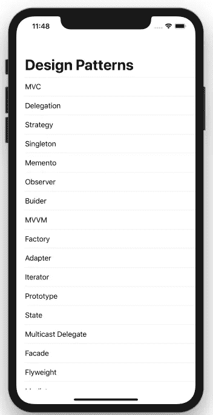
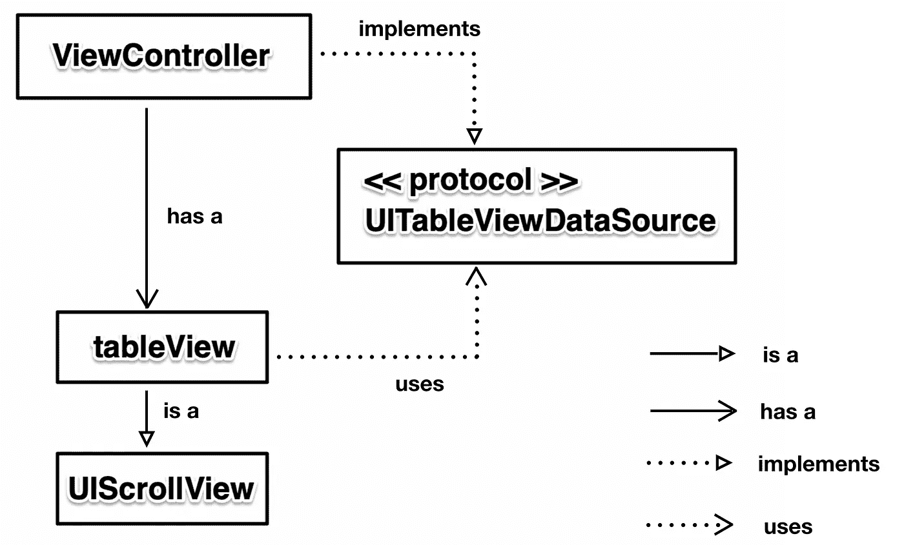
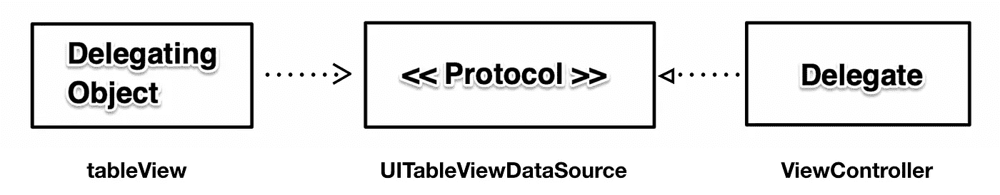
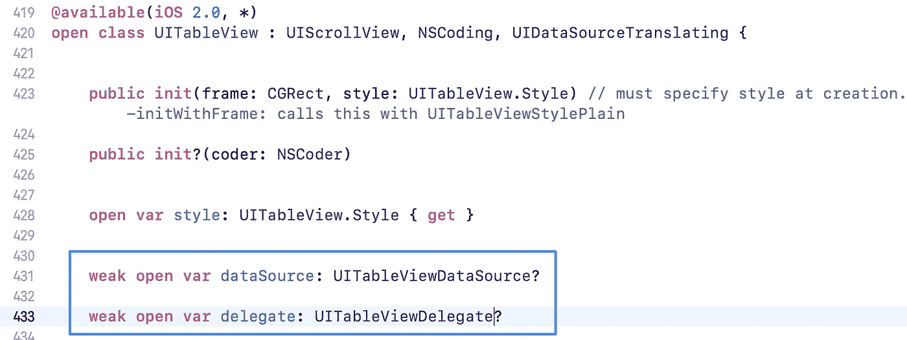
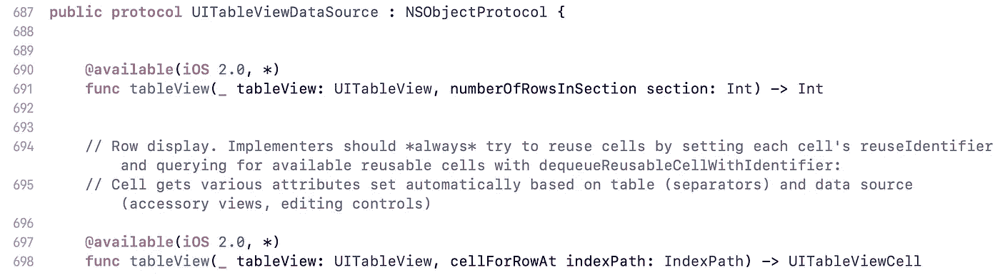

# 传达委托模式的类图

> 原文：<https://itnext.io/class-diagram-to-convey-the-delegate-pattern-bca0a8b28d2d?source=collection_archive---------3----------------------->

## 类图是学习设计模式的先决条件

一个*类图*是 UML(统一建模语言)的简化版本，帮助我们获得软件项目的蓝图。在类图的帮助下，我们可以很容易地理解每个组件是如何相互关联的，从而使我们能够将软件修改到更易于维护的地方。例如，我们总是希望避免依赖链，这样我们的类就可以很容易地改变。

让我们直接从最常见的设计模式之一——带有 UITableView 示例的委托模式——来学习类图。

如您所见，不同的箭头代表四种类型的关系。

*   “是一个”代表“继承自”。例如 UITableView 是一个 UIScrollView。
*   “有一个”是表示一个属性。例如，ViewController 有一个 tableView。
*   “实现”代表“符合”。例如，ViewController 符合 UITableViewDataSource。
*   “uses”可以替换为“delegates to”，这是 UML 形式中的“dependency”。例如，tableView 使用 UITableViewDataSource。

## 代表模式

这种模式可以分解大型类，创建通用的、可重用的组件。在 UITableView 示例中，UITableView 是一个可重用的组件，可以帮助我们分解 UIViewControllers。代理模式有如下三个主要角色。

*   **委托对象**:即*拥有* `weak var delegate`的对象。例如 UITableView

由于`UITableView`和`UIViewController`是引用类型，容易导致保留循环。因此，**我们应该在我们的委托对象**中将委托声明为弱 var。

*   **委托协议**:委托人和委托对象之间的接口；它定义了委托应该实现什么，以及委托对象可以调用什么方法。

为什么协议方法传递 tableView？这样，如果需要，ViewContoller 可以方便地检查 tableView。因此，**在协议方法**中传递委托对象成了惯例。

*   **委托**:符合委托并实现方法的对象。

## 要点

*   使用类图来帮助您获得软件的蓝图并获得可维护性。
*   委托模式非常适合分解大型类和创建通用的、可重用的组件。
*   委托模式有三个主要部分:委托对象、协议和委托。
*   使用委托模式时要注意保持循环。