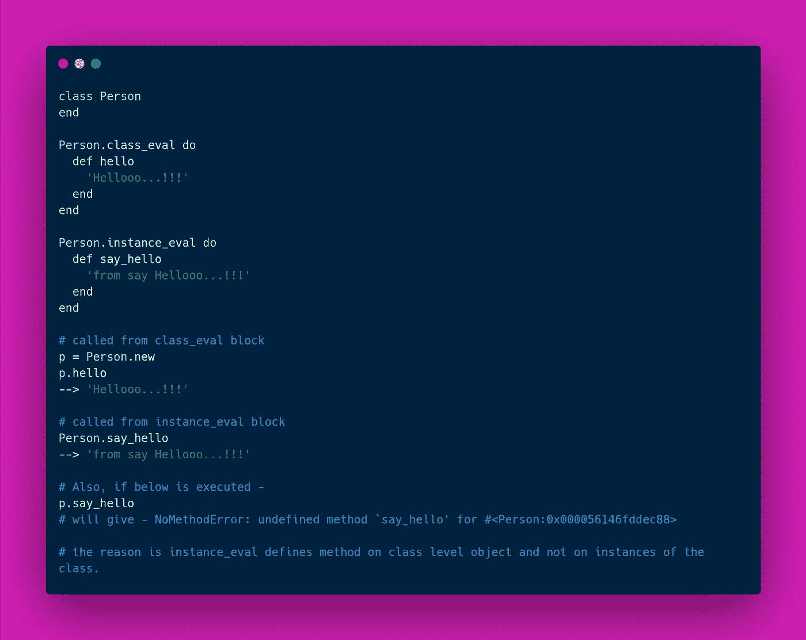

# Ruby 元编程中的类求值和实例求值

> 原文：<https://itnext.io/class-eval-instance-eval-in-ruby-metaprogramming-7fef0f0e163e?source=collection_archive---------3----------------------->

Ruby 中的类和实例评估

Ruby 的`class_eval`和`instance_eval`虽然名字相似，但行为却颇为违反直觉。

**对每一种的简单解释是**:

> `ClassName.class_eval`:用于在类对象上定义一个实例方法，应用于该类的所有实例。
> 
> `ClassName.instance_eval`:用于定义一个与类对象关联的类方法，但是对该类的实例对象不可见。

在上面的`Person`类的例子中，`class_eval`允许我们在`Person`类之外定义一个方法`hello`，而不用用标准语法重新打开这个类。当我们直到运行时才知道要将这个方法添加到哪个类时，这是很有用的。

在上面的例子中，`instance_eval`允许我们在类对象实例的上下文中定义方法`say_hello`。这意味着`Person.instance_eval`是在`Person`对象的上下文中计算的。

简单来说，`Person.class_eval`会创建实例方法，`Person.instance_eval`会创建类方法。

**从技术上更简化上面的**，`class_eval`相当于在 class 语句中键入如下代码:

`Person.class_eval do def test 'hello...!!!' ; end`行为与下面完全相同:

`class Person def test 'hello...!!!'; end`

因此，我们可以得出结论，我们可以用`instance_eval`打开一个不是类的对象，用`class_eval`打开一个类定义，并用`def`定义方法。

然而，你应该选择最能表达你意图的方法。如果你在想，“**我想打开这个对象，并且
并不特别在意它是一个类**，”那么`instance_eval`就可以了。如果你在想，“**我想在这里开一个公开课**，”那么`class_eval`几乎肯定是一个更好的匹配。

我希望以上的概念现在对你们所有人都很清楚，如果需要，请提出任何建议或编辑意见。