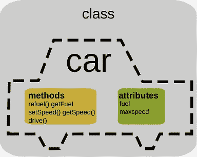
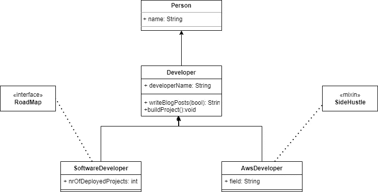

# Dart 中的类层次结构

> 原文：<https://itnext.io/class-hierarchy-in-dart-ecacc28d0581?source=collection_archive---------0----------------------->

面向对象编程是每个开发人员在工作时都会接触到的一种范式。这种编程范式将数据结构化为一个对象，该对象可以具有被描述为方法的特定行为。

Dart 是一种面向对象的编程语言，这意味着它允许我们创建包含数据和函数的对象。Dart 支持如此多的 OOP 特性，但是在本文中，我们将讨论层次结构、抽象类、接口和混合。

所以，我们先来说说等级制度。

# 等级制度

不谈阶级，就谈不上等级。

[“类是定义数据和处理数据的方法的结构”](https://www.oracle.com/java/technologies/oop.html)

换句话说，我们可以将类描述为一个模板，以创建一组共享公共数据和行为的对象。

在编程中，类的层次结构是当一个类扩展另一个类(超类)时，获得超类的属性和功能。

如你所见，developer 的类扩展了 person 的类，这意味着开发者可以访问 Person 类中的每个公共变量和函数。

> **如果没有定义超类默认构造函数，就必须像上面**的代码中一样提到超类构造函数。*如果*语法*对你来说是新的，查看一下* [*重定向构造函数*](https://medium.com/flutter-community/types-of-construtors-in-dart-8642d3f176ae) *的定义。*

子类可以通过使用关键字`@override`改变超类的扩展方法的行为。嗯，`@override`注释不是必须要用的，但是推荐使用。您还可以重写 getters 和 setters 方法。

## 创建类的实例。

在上面的例子中，你可以看到我们使用`Developer()`构造函数创建了一个`Person`对象。这是因为`Developer`的类型是`Person`，所以我们可以在 Person 实例中分配一个 Developer 对象。
但是同样的事情不会反过来发生:

> 这不起作用，因为 Person 不是 Developer 的子类型。
> 
> Dart 中不能做的另一件事是多重继承，extends 关键字只允许子类从另一个类扩展。

# 抽象类

每个无法实例化的类，至少有一个方法没有体(方法声明以“；”结尾))被称为抽象类，正如关键字所暗示的。

> 注意:所有至少有一个方法没有主体的类，必须声明为抽象类。

让我们在最后一个层次示例中创建一个抽象类。

注意，在我们的`Person`和`SoftwareDeveloper` / `AwsDeveloper`类中间有一个抽象类，这就是 Developer 类。当我们有共享相同方法实现逻辑的类时，使用这个类可以帮助我们避免代码重复，在我们的例子中是 writeBlogPosts 方法。

当抽象类中的方法有主体时，它的子类不需要在它们的类内部调用它们，因为已经有了一个实现，当抽象方法上没有主体时，就需要一个方法实现。

# 接口

是啊！这就是我们如何定义一个接口，就像我们定义一个抽象类一样，没有`interface`关键字来声明它。但是编译器还不知道它是接口还是子类的抽象类。

**那么，它怎么知道是不是呢？**

当我们声明我们的子类时，我们使用`*implements*` 关键字来指定我们想要作为接口的抽象类。

所以，让我们把我们的`RoadMap` 类变成`SoftwareDeveloper`接口。

一旦我们将`*implements RoadMap*` 添加到`SoftwareDeveloper`定义中，编译器就会触发一个警告，要求我们实现`RoadMap`接口中的方法。

> 一个重要的注意事项是，一个类可以实现不止一个接口，这与关键字`extends`不同，关键字只允许一个类扩展另一个类。

# 混合蛋白

嘿，我说混血儿！

这是类层次结构主题中的另一个概念。Mixins 的行为类似于抽象类，但没有构造函数，它们用于提供方法并避免代码重复(当两个或更多的类共享时)。

要将一个 mixin 附加到一个类，我们只需使用`*with*`关键字，后跟 mixin 名称。我们也可以将多个 mixins 附加到一个类中。

让我们将它附加到我们的`AwsDeveloper`类中。

现在`AwsDeveloper`可以访问`SideHustle` mixin 方法了🙂。

如果我们想把它附加到我们的`SoftwareDeveloper`类，我们必须在`*implements*`关键字之前设置`*with*`关键字，就像这样:

当不需要使用 Mixins 来实现所提供的方法时，您可以在任何需要的时候访问它们。

关于 mixin 的另一个有趣的事实是，一个 mixin 可以附加到另一个 mixin 上。

在上面的例子中，`justAmixin`可以访问`SideHustle` mixin。

我们的类层次结构如下所示:

# 实际的例子

让我们用我们到目前为止所做的。在这一小节中，我们将对我们编写的代码做一些小的改动。让我们这样做:

我们向 Person 类添加了三(3)个方法`toString()`、`Person.fromJson`和默认构造函数`Person.ordinary()`。

*   `toString`显示人名。
*   `Person.fromJson()`生成`SoftwareDeveloper`和`AwsDeveloper`等人员实例
*   `Person.ordinary()`如果我们从 Json 收到一个非预期的对象，创建一个默认的 Person。

让我们使用`Person.fromJson()`工厂构造函数创建对象。

**输出**:

`Algy jr : 5 deployed Projects`

`Almeida de Almeida : is working as a Cloud developer and sometimes produces youtube videos`

`Feliciano Jr : 5 deployed Projects`

`John Doe`

请注意，我们将 John Doe 作为输出，这是因为 json 中的最后一个对象有一个非预期类型，在本例中，我们使用默认构造函数创建了一个默认的 Person 对象。还要注意，我们使用了附加到`AwsDeveloper`类的`SideHustle` mixin 中的`videoCreator`方法。

# 结论

当我们希望一个类(或多个类)可以访问父方法和属性时，我们使用 extend，并且不要求子类实现超类提供的所有方法，但要求在子类构造函数中调用超类构造函数。

抽象类不是实例化类，这意味着您不能直接从它们创建对象，而是从它们的派生类创建。当我们想要将方法实现分组到一个地方时，我们可以使用抽象类，这样子类可以在以后实现它们。

Dart 中的接口是包含方法签名的抽象类(空体)。接口中定义的签名必须在实现它的类中重写。

Mixins 可用于保存方法实现和方法签名，这些方法签名可由它们所附加的类在以后使用。

> 什么时候使用接口而不是混合或抽象类？
> 
> 答案是没有规则，因为这取决于业务规则或您试图解决的问题。一个很好的建议是通过尽量避免代码重复和编写高质量的代码来使用它们。

**谢谢！**阅读这篇文章，希望对你有所帮助。

如果你有任何疑问或者你可能觉得有什么遗漏，你可以通过[推特](https://twitter.com/a_azinar)或者[电报](https://t.me/albertoazinar)联系我。我很乐意和你谈谈这件事。

***一切都是小工具！***