# 使用 Python 和人工神经网络对衣服进行分类

> 原文：<https://itnext.io/classify-clothes-using-python-and-artificial-neural-networks-3f417ed66bb?source=collection_archive---------4----------------------->

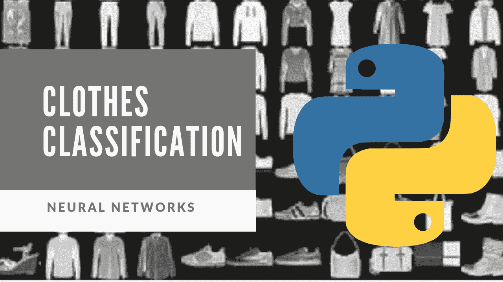

在本文中，我将向您展示如何使用 **python 编程语言**和一种称为**人工神经网络的机器学习技术，从 [**时尚 MNIST**](https://github.com/zalandoresearch/fashion-mnist) **数据集**中对服装**进行分类！

如果你不想读这篇文章，想要一个视频演示，你可以看看下面的 [**视频**](https://youtu.be/011zH9n6ag4) 。它详细介绍了本文中的所有内容，并且将有助于您轻松地开始编写自己的人工神经网络(ANN)模型，即使您的计算机上没有安装编程语言 Python。或者你可以把视频和这篇文章都作为学习安氏症的补充材料！

# 开始编程:

首先我会写一份这个程序将会做什么的描述。这样，当我将来回头看它时，我或其他人就能确切地知道它在做什么。

```
# Description: This program classifies clothes from the Fashion MNIST data set
```

接下来，我需要**安装依赖项/包**。如果您还没有安装这些包，请在您的终端、命令提示符或 Google Colab 网站(取决于您安装 python 编程语言的位置)中运行以下命令。

```
pip install tensorflow keras numpy matplotlib
```

现在我已经安装完了所有必要的包，我想把这些包导入到我的程序中。

```
#Import the libraries
import tensorflow as tf
from tensorflow import keras
import numpy as np
import matplotlib.pyplot as plt
```

接下来，**将数据集**加载到变量`train_images`(包含要训练的图像的变量)、`train_labels`(包含训练集中图像的标签的变量)、`test_images`(包含要测试的图像的变量)和`test_labels`(包含测试集中图像的标签的变量)。

```
#Load the data set
fashion_mnist = keras.datasets.fashion_mnist
(train_images, train_labels), (test_images, test_labels) = fashion_mnist.load_data()
```

获取`train_images`和`test_images`中的图像数量。

```
#Print the shape 
print(train_images.shape)# 60,000 rows of 28 x 28 pixel images
print(test_images.shape) # 10,000 rows of 28 x 28 pixel images
```

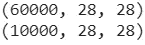

**训练 _ 图像:** 60，000 行 28×28 像素图像，**测试 _ 图像:** 10，000 行 28×28 像素图像

查看训练图像，并打印标签。

> **数据集的标签:**
> 0 = T 恤/上衣
> 1 =裤子
> 2 =套头衫
> 3 =连衣裙
> 4 =外套
> 5 =凉鞋
> 6 =衬衫
> 7 =运动鞋
> 8 =包包包
> 9 =短靴

```
#View a training image
img_index = 2 #<<< You can update this value to look at other images
img = train_images[img_index]
print("Image Label: " + str(train_labels[img_index]))
plt.imshow(img)
```

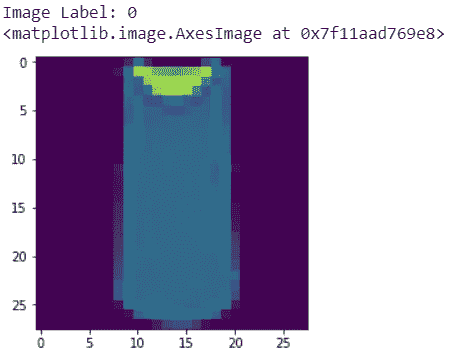

标签为“0”的图像= T 恤

**建立 3 层模型**(1 层将图像展平为 28 x 28 = 784 矢量，1 层 128 个神经元和 relu 激活函数& 1 层 10 个神经元和 Softmax 函数)。我们有 10 个神经元，因为图像数据集有 10 个标签。

```
#Build the model
# 3 layers, 1 layer to flatten the image to a 28 x 28 = 784 vector
#           1 layer with 128 neurons and relu function
#           1 layer with 10 neurons and softmax function#Create the neural network model
model = keras.Sequential([
    keras.layers.Flatten(input_shape=(28,28)),
    keras.layers.Dense(128, activation=tf.nn.relu),
    keras.layers.Dense(10, activation=tf.nn.softmax)
])
```

**使用损失函数`sparse_categorical_crossentropy`编译模型**，该函数用于大于 2 的类，因为我们将有 9 个类，所以我们将使用该函数。这些类是从 0 到 9 的数字，例如:0，1，2，3，…9。我还将添加一个指标来显示模型的准确性。`Adam`是一种优化算法，可以用来代替经典的随机梯度下降过程来更新训练数据上的网络权重。

> **优化函数:**寻求最小化损失函数的函数
> 
> **损失函数:**在数学优化和决策理论中，损失函数或成本函数是将事件或一个或多个变量的值映射到一个实数上的函数，该实数直观地表示与该事件相关的一些“成本”。本质上，它是一种评估你的算法对你的数据集建模有多好的方法。

```
#Compile the model
#The loss function measures how well the model did on training , and then tries 
#to improve on it using the optimizer

model.compile(
   optimizer=tf.train.AdamOptimizer(), 
   loss='sparse_categorical_crossentropy', 
   metrics = ['accuracy'])
```

**使用`train_images`和`train_labels`变量(包含训练数据的变量/数据集)训练模式** l。我将在整个数据集上迭代 5 次进行训练，每次梯度更新 32 个样本进行训练。

```
#Train the modelmodel.fit(train_images, 
          train_labels,  #It expects integers because of the sparse_categorical_crossentropy loss function
          epochs=5, #number of iterations over the entire dataset to train on
          batch_size=32)#number of samples per gradient update for training
```

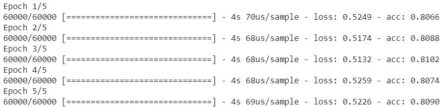

每个训练步骤/时期的模型损失和准确性

现在是时候**评估模型**了，看看它在测试数据集上的表现如何。该模型表现良好，准确率约为 81.15%。

```
#Evaluate the model
model.evaluate(test_images, test_labels)
```

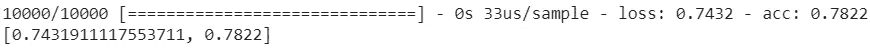

图像显示损失约为 0.7431，准确度约为 78.22%

**注意:**您可以将该模型保存在一个. h5 文件中，以便以后在另一个程序中使用该模型/模型权重。确保包括您想要保存模型/文件的位置。例如' **Desktop/model.h5** '。

```
#model.save_weights('model.h5')
```

使用模型进行预测。我将使用这个模型预测前 5 个测试图像的类别，以及实际的标签。

```
#Make a prediction
predictions = model.predict(test_images[:5])
print(np.argmax(predictions, axis=1)) #Print the predicted labels
print(test_labels[:5]) #Print the actual labels
```

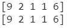

模型的预测和实际标签

最后我将**把服装时尚图片**打印到屏幕上。更具体地说，我将把测试数据的前 5 幅图像以 28 x 28 像素的灰色打印到屏幕上。

注意:使用下面的代码，你可以读入任何大小的图像，这段代码会将图像大小调整为 28 x 28 像素，并打印到屏幕上。

```
for i in range(0,5):
  first_image = test_images[i]
  first_image = np.array(first_image, dtype='float')
  pixels = first_image.reshape((28, 28))
  plt.imshow(pixels, cmap='gray')
  plt.show()
```

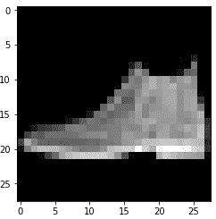

踝靴的图像(9)

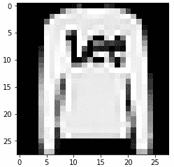

靠边停车的图像(2)

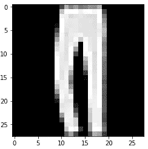

裤子的图像(1)

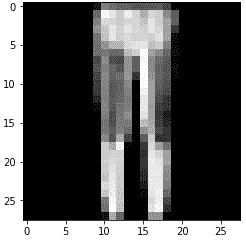

裤子的图像(1)

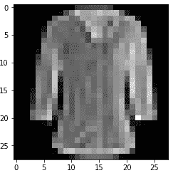

衬衫的图像(6)

你可以看上面的视频，了解我是如何编写这个程序的，并和我一起编写一些更详细的解释，或者你可以点击 YouTube 上的 [**链接，这里是**](https://youtu.be/011zH9n6ag4) 。

如果你也有兴趣阅读更多关于机器学习的内容，以立即开始处理问题和示例，那么我强烈建议你查看[用 Scikit-Learn 和 TensorFlow 进行机器学习实践:构建智能系统的概念、工具和技术](https://www.amazon.com/gp/product/1491962291?ie=UTF8&tag=medium074-20&camp=1789&linkCode=xm2&creativeASIN=1491962291)。这是一本帮助初学者学习如何编写机器学习程序和理解机器学习概念的好书。


[使用 Scikit-Learn 和 TensorFlow 进行机器学习:构建智能系统的概念、工具和技术](https://www.amazon.com/gp/product/1491962291?ie=UTF8&tag=medium074-20&camp=1789&linkCode=xm2&creativeASIN=1491962291)

感谢你阅读这篇文章，希望对你有所帮助！如果你喜欢这篇文章，并发现它很有帮助，请留下一些掌声，以示感谢。坚持学习，如果你喜欢机器学习、数学、计算机科学、编程或算法分析，请访问并订阅我的 [YouTube](https://www.youtube.com/channel/UCaV_0qp2NZd319K4_K8Z5SQ) 频道([randers 112358](https://www.youtube.com/channel/UCaV_0qp2NZd319K4_K8Z5SQ)&[compsci 112358](https://www.youtube.com/channel/UCbmb5IoBtHZTpYZCDBOC1CA))。


# 资源:

[1] [Keras 神经网络教程](https://victorzhou.com/blog/keras-neural-network-tutorial/)
【2】[Keras 网站](https://keras.io/)
【3】[利用 Python 和人工神经网络对手写数字进行分类](https://levelup.gitconnected.com/classify-hand-written-digits-5fdbe5d99ee7)