# 使用 Python 和卷积神经网络对手写数字进行分类

> 原文：<https://itnext.io/classify-hand-written-digits-using-python-and-convolutional-neural-networks-26ccfc06b95c?source=collection_archive---------1----------------------->


在本文中，我将向您展示如何使用 **python 编程语言**和一种叫做**卷积神经网络的机器学习技术**对来自 **MNIST 数据库**的手写数字**进行分类！**

如果你不想读这篇文章，想要一个视频演示，你可以看看下面的 [**视频**](https://youtu.be/V4dd2Bt9OHY) 。它详细介绍了本文中的所有内容，并且将有助于您轻松地开始编写自己的卷积神经网络(CNN)模型，即使您的计算机上没有安装编程语言 Python。或者你可以把视频和这篇文章都作为学习 CNN 的补充材料！

# 开始编程:

首先我将**写一个这个程序将做什么的描述。这样，当我将来回头看它时，我或其他人就能确切地知道它在做什么。**

```
*# Description: This program uses Convolutional Neural Networks (CNN)* 
*#              to classify handwritten digits as numbers 0 - 9*
```

接下来，我需要**安装依赖项/包**。如果您还没有安装这些包，请在您的终端、命令提示符或 Google Colab 网站(取决于您安装 python 编程语言的位置)中运行以下命令。

```
pip install tensorflow keras numpy matplotlib
```

现在我已经安装完了所有必要的包，我想把这些包导入到我的程序中。

```
*#import the libraries*
**from** **keras.models** **import** Sequential
**from** **keras.layers** **import** Dense, Conv2D, Flatten
**from** **keras.datasets** **import** mnist
**from** **keras.utils** **import** to_categorical
**import** **matplotlib.pyplot** **as** **plt**
**import** **numpy** **as** **np**
```

接下来，**将数据集**加载到变量`X_train`(包含要训练的图像的变量)、`y_train`(包含训练集中图像的标签的变量)、`X_test`(包含要测试的图像的变量)和`y_test`(包含测试集中图像的标签的变量)。

```
*#Load the data and split it into train and test sets*
(X_train,y_train), (X_test, y_test) = mnist.load_data()
```

**得到特征数据集的图像形状**。注意`X_train`形状包含 60，000 行 28 x 28 像素的图像。`X_test`形状包含 10，000 行 28 x 28 像素的图像。

```
*#Get the image shape*
print(X_train.shape)
print(X_test.shape)
```

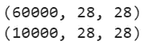

特征数据集的图像形状

以 numpy 数组的形式查看训练数据集中的第一幅图像。这将图像显示为一系列像素值。

```
X_train[0]
```

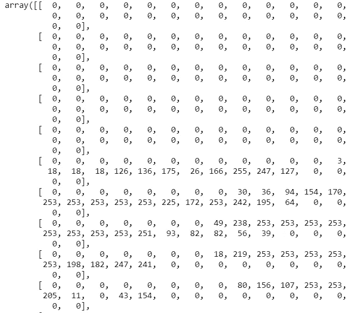

作为数组的训练数据集中第一幅图像的样本

**打印训练数据集中第一张图像的图像标签**。印上的标签是数字 5。

```
*#Print the image label*
y_train[0]
```


训练数据集中第一幅图像的标签

**显示图像**不是作为一系列像素值，而是作为实际图像。

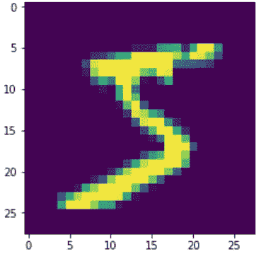

训练集中第一个手写数字的图像

**重塑特征** ( `X_train`和`X_test`)以适应模型。因此，现在训练特征集将具有 60，000 行深度=1(灰度)的 28×28 像素图像，而测试特征集将具有 10，000 行深度=1(灰度)的 28×28 像素图像。

```
*#Reshape the data to fit the model*
X_train = X_train.reshape(60000, 28,28,1)
X_test = X_test.reshape(10000, 28, 28, 1)
```

**一键编码目标** ( `y_train`和`y_test`)以适应模型。本质上，我们将把这些数据集转换成一组 10 个数字，输入到神经网络中。完成后，我们将为第一张图片打印列车组的新标签。

```
#One-Hot Encoding
y_train_one_hot = to_categorical(y_train)
y_test_one_hot = to_categorical(y_test)

*#Print the new label*
print(y_train_one_hot[0])
```

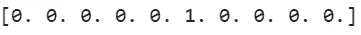

标签 5 被热编码

是时候**造模型**了！两层将是卷积层，第一层具有 64 个通道，3×3 内核和整流器线性单元(ReLu)函数将 64 个图像馈送到第二层，而第二层将具有 32 个通道，3×3 内核和整流器线性单元(ReLu)函数将 32 个图像馈送到第三层。第三层是扁平化层，将图像的维数转换为一维数组，与最后一层连接，最后一层包含 10 个神经元和激活函数 softmax。

```
model = Sequential()model.add(Conv2D(64, kernel_size=3, activation='relu', input_shape=(28,28,1)))model.add(Conv2D(32, kernel_size=3, activation='relu'))model.add(Flatten())model.add(Dense(10, activation='softmax'))
```

接下来我们需要**编译模型**。我们将使用 adam 优化器来控制学习速率，一个称为 categorical _ crossentropy 的损失函数，用于大于 2 的多个类(如目标数据集中的 10 个不同标签)，以及在我们训练模型时查看验证集的准确性分数的指标。

```
*#Compile the model* model.compile(optimizer='adam', loss='categorical_crossentropy', metrics=['accuracy'])
```

**在训练数据集上训练模型**(`X_train`和`y_train`)。我将在整个数据集上迭代 3 次进行训练，每次梯度更新 32 个样本进行训练。然后将这个训练好的模型存储到变量`hist`中。

**注:**我没有指定样品的数量( ***批次*** )，如果没有指定批次，默认为 32。

> ***批次*** *:每次梯度更新出现的训练样本总数*
> 
> ***Epoch:*** *整个数据集在神经网络中只前后传递一次的迭代次数。*
> 
> ***合体:*** *火车的别称*

```
hist = model.fit(X_train, y_train_one_hot, validation_data=(X_test, y_test_one_hot), epochs=3)
```

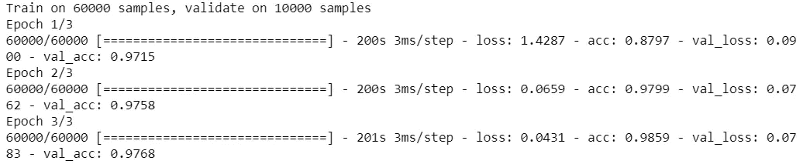

训练 CNN 模型

看起来模型在训练数据上 **98.59%** **准确**，在测试数据上 **97.68%准确**。让我们来看看模型的准确性。

```
*#Visualize the models accuracy*
plt.plot(hist.history['acc'])
plt.plot(hist.history['val_acc'])
plt.title('Model Accuracy')
plt.ylabel('Accuracy')
plt.xlabel('Epoch')
plt.legend(['Train', 'Val'], loc='upper left')
plt.show()
```

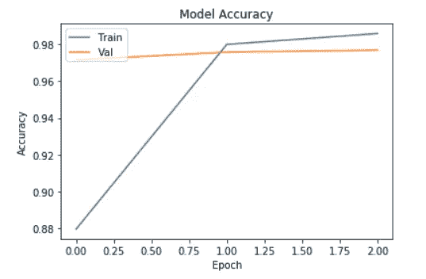

模型训练和验证/测试准确度分数图

该模型只返回概率。因此，让我们**显示测试集中前 4 幅图像的概率**。

```
predictions = model.predict(X_test[:4])
predictions
```

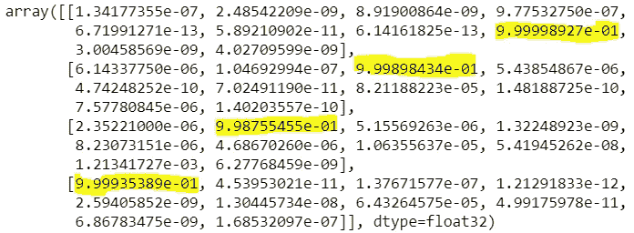

突出显示最大可能性的每个图像的概率(7，2，1，0)

概率很难解读。要理解它们，你必须找到集合中最大的数字，然后计算该数字的索引，以找出标签是什么，哪个是索引号。例如，在上面的第三幅图像中，最高概率是 9.98755455e-01，这意味着 99.8755%，该数字位于索引 1 处，因此标签为 1。因此，让我们**打印前 4 幅图像的预测值作为标签**，而不是上面的概率，让我们打印每幅图像的实际值/标签，看看它们是如何匹配的。

```
*#Print our predicitons as number labels for the first 4 images*
print( np.argmax(predictions, axis=1))
*#Print the actual labels*
print(y_test[:4])
```

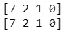

**顶部:**预测标签，**底部:**实际标签

让我们**将前四张图片显示为图片**！

```
*#Show the first 4 images as pictures* 
**for** i **in** range(0,4):   
   image = X_test[i]   
   image = np.array(image, dtype='float')   
   pixels = image.reshape((28,28))  
   plt.imshow(pixels, cmap='gray')   
   plt.show()
```

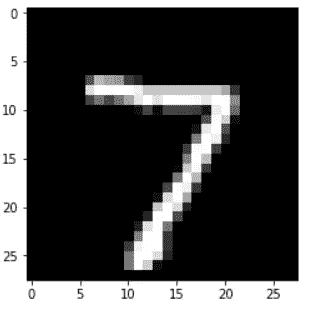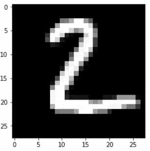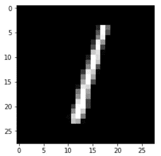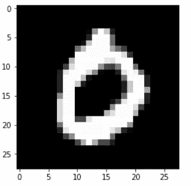

我们完成了程序的创建！你可以在上面的视频中看到我是如何编写这个程序和代码的，还有一些更详细的解释，或者你可以点击 [**YouTube 链接这里**](https://youtu.be/V4dd2Bt9OHY) 。

如果您也有兴趣阅读更多关于机器学习的内容，以便立即开始处理问题和示例，那么我强烈建议您查看[使用 Scikit-Learn 和 TensorFlow 进行机器学习实践:构建智能系统的概念、工具和技术](https://www.amazon.com/gp/product/1491962291?ie=UTF8&tag=medium074-20&camp=1789&linkCode=xm2&creativeASIN=1491962291)。这是一本帮助初学者学习如何编写机器学习程序和理解机器学习概念的好书。


[使用 Scikit-Learn 和 TensorFlow 进行机器实践学习:构建智能系统的概念、工具和技术](https://www.amazon.com/gp/product/1491962291?ie=UTF8&tag=medium074-20&camp=1789&linkCode=xm2&creativeASIN=1491962291)

感谢阅读这篇文章，我希望它对你们所有人都是有趣的！如果你喜欢这篇文章，并发现它很有帮助，请留下一些掌声，以示感谢。如果你还不是 Medium 的[会员，那么考虑成为会员，如果不是我的文章的会员，那么也是这个网站上所有其他了不起的文章&作者的会员。使用这里的](https://randerson112358.medium.com/membership)[链接](https://randerson112358.medium.com/membership)，你可以轻松成为灵媒的一员。继续学习，如果你喜欢金融、计算机科学或编程，请访问并订阅我的 [YouTube](https://www.youtube.com/channel/UCaV_0qp2NZd319K4_K8Z5SQ) 频道([randers 112358](https://www.youtube.com/channel/UCaV_0qp2NZd319K4_K8Z5SQ)&[计算机科学](https://www.youtube.com/channel/UCbmb5IoBtHZTpYZCDBOC1CA))。

# 资源:

[1][https://towards data science . com/building-a-convolutionary-neural-network-CNN-in-keras-329 fbbadc5 F5](https://towardsdatascience.com/building-a-convolutional-neural-network-cnn-in-keras-329fbbadc5f5)

[2][https://github . com/eijaz 1/Building-a-CNN-in-Keras-Tutorial/blob/master/CNN _ Tutorial . ipynb](https://github.com/eijaz1/Building-a-CNN-in-Keras-Tutorial/blob/master/cnn_tutorial.ipynb)

[3][https://www . tensor flow . org/beta/tutorials/images/intro _ to _ CNNs](https://www.tensorflow.org/beta/tutorials/images/intro_to_cnns)