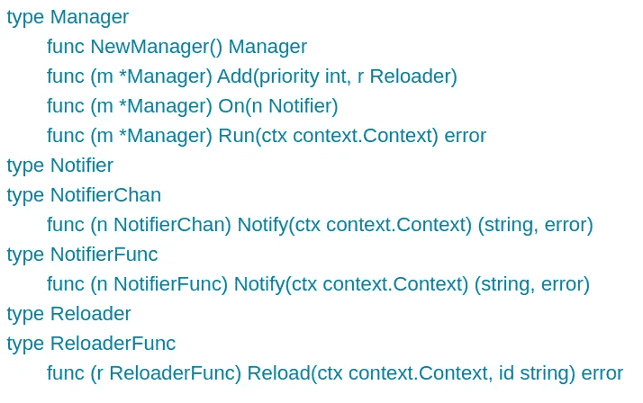
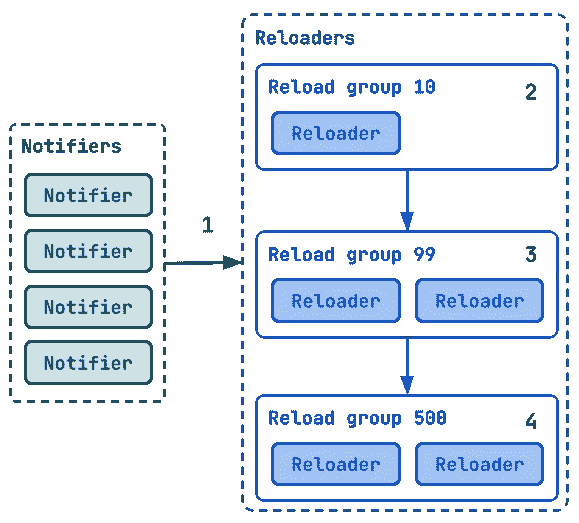

# 在不间断的 go 应用程序上进行干净简单的热重装

> 原文：<https://itnext.io/clean-and-simple-hot-reloading-on-uninterrupted-go-applications-5974230ab4c5?source=collection_archive---------2----------------------->

[档位](https://www.pexels.com/photo/gray-scale-photo-of-gears-159298/)

在本文中，我们将学习如何使用 [**slok/reload**](https://github.com/slok/reload) 库，在不停止正在运行的 Go 应用程序的情况下，以一种简单、结构良好且干净的方式热重装任何应用程序组件。但是让我们从头开始…

# 介绍

通常，人们会将应用程序的热重新加载(查看一些文件，终止进程并重新运行)与热重新加载应用程序组件相混淆，其中**主进程根本没有被终止，我们在运行中重新创建/重新配置应用程序的一些组件，同时应用程序继续运行，没有中断**。

这对于一些应用程序来说很重要，因为我们需要在不需要的时候减少中断时间，而这可以通过使用热/实时重载来避免。

一些最常用的应用程序需要这样，例如:

*   [普罗米修斯](https://prometheus.io/)
*   [Nginx](https://www.nginx.com/)
*   [PostgreSQL](https://www.postgresql.org/)
*   [特使](https://www.envoyproxy.io/)

通常，这个重新加载过程可以通过使用 HTTP 端点(例如:在" */-/reload"* 路径上的 POST 请求)或使用 [SIGHUP](https://en.wikipedia.org/wiki/SIGHUP) OS 信号来触发。

# oklog/run

几年前，我偶然发现了 [**oklog/run**](https://github.com/oklog/run) ，这是一个非常小的 go 库，但是功能非常强大并且易于使用。

*oklog/run* 让您控制不同的主应用程序执行入口点生命周期。例如，当您启动一个应用程序时，您将:

*   在一个 goroutine 中为 REST API 启动一个 HTTP 服务器。
*   为另一个 goroutine 中的度量启动 HTTP 服务器。
*   启动一个长期运行的 goroutine，定期通过一些检查。
*   侦听操作系统信号的通道，当收到信号时，它会停止应用程序。
*   …

您可以使用 oklog/ *run* 用运行和停止函数来定义这些执行入口点。Oklog/r *un，*将在其中一个组件有或无错误结束时管理启动和正常关闭(在所有组件上)。例如:

oklog/run 示例

这样，您就获得了一个干净可靠的应用程序的启动/停止，因为您的所有入口点都有一个干净的方式来声明在开始时做什么(例如运行一个服务器)和在停止时做什么(例如关闭服务器和排出连接)。此外，该应用程序迫使您在一个地方以单一方式管理每个运行的入口点。这么简单干净…牛逼。

# 慢装/重装

让我们深入了解热重装过程…这就是我们在这里的原因，对吗？

有时，当我们创建一个应用程序时，一些组件(服务、功能……)需要在任何给定的时间点热重装，这种重装逻辑通常在组件本身内部，然而，事情并不那么简单:多个组件需要同时重装，或者我们需要一个重装顺序，同样，存在重装错误，重装是从相同的源触发的，或者可能是从不同的源触发的…

简而言之，这不是一件容易的事情，而且很容易变得凌乱。我们需要一种清晰的、结构良好的方式来声明这些热重载操作。

受 [oklog/run](https://github.com/oklog/run) 及其简单性的启发，我开始思考如何以类似的方式管理干净的重新加载过程…

**向**[**slok/reload**](https://github.com/slok/reload)**问好！**

除了 *oklog/run* 已经提出并解决的要求之外，我还有一些其他要求:

*   管理所有热重装进程的单一入口点(例如: *func main()* )。
*   易于使用和配置一个小的 API 和库。
*   以单一方式管理应用组件的重新加载。
*   由多个触发器触发的多个重新加载组件。
*   能够按顺序重新加载不同的组件。
*   多个重载触发器同时发生时的可靠重载。
*   足够灵活，可用于任何类型的重新加载过程。

## 应用程序接口

先来展示一下库的小 API。

[锁定/重新加载](https://github.com/slok/reload) API

该 API 基于 3 个主要组件:

*   [通知器](https://pkg.go.dev/github.com/slok/reload#Notifier):当结束执行时，触发重新加载进程(例如:HTTP 处理程序、OS 信号……)。
*   [重新加载器](https://pkg.go.dev/github.com/slok/reload#Reloader):执行组件重新加载过程(例如:配置加载器，客户端工厂…)。
*   [管理器](https://pkg.go.dev/github.com/slok/reload#Manager):使用通知器和重装器管理重装生命周期。它将永远运行，直到通知程序或重新加载程序返回一个错误或上下文结束。

API 附带了一些方便的助手，所以用户不需要声明新的类型来创建通知器和重载器(例如:从函数或通道创建通知器)。

## 它是如何工作的

在下图中，我们看到了在[管理器](https://pkg.go.dev/github.com/slok/reload#Manager)中运行的内容。

我们有 5 个已经执行的通知程序，等待在某个时间结束以触发重新加载过程。

当通知程序触发重新加载过程时，我们有 5 个重新加载程序(分为 3 组)等待执行。

[slok/reload](https://github.com/slok/reload) 高层架构

*   1:其中一个通知程序将结束其执行，并将触发重新加载过程。
*   2:优先级为 10 的第一个重装程序组将执行它拥有的单个重装程序。
*   3:优先级为 99 的第二个重装程序将同时执行这两个重装程序。
*   4:优先级为 500 的第三个重新加载组将同时执行两个重新加载程序，所有操作都将结束。

管理器将确保在执行重新加载器组时，没有其他通知程序可以触发该重新加载组的重新加载过程。

当通知程序的一个执行结束时(为了触发重新加载进程)，它将立即再次启动，以便通知程序为新的重新加载触发器做好准备。

# 实际例子

[灯塔蜗牛楼梯](https://www.pexels.com/photo/lighthouse-snail-staircase-53554/)

我们将创建一个简单的应用程序来展示我们如何通过使用以下代码来设置一个可靠、简单、干净的具有热/实时重载特性的应用程序启动和卸载:

*   **oklog/run** :管理正在运行的入口点生命周期。
*   **锁定/重装**:管理热重装生命周期。

**TL；** [**博士:完整示例此处**](https://github.com/slok/reload/tree/main/_examples/simpleapp)

## 要求

我们有一个加载 JSON 配置文件的应用程序。此配置将用于创建两个域服务:

*   Printer:用配置中的内容打印一条消息。
*   Curler:使用配置中的内容向 URL 发出请求。

该应用程序应该能够热重新加载配置，然后这两个服务。

热重装应以多种方式触发:

*   SIGHUP(按需)。
*   HTTP API 处理程序(按需)。
*   文件系统文件更改(在文件更改事件时)。

当应用程序启动时，它应该运行 4 个入口点:

*   一个操作系统信号处理程序:处理停止信号和热重装触发器。
*   HTTP 服务器:处理域服务执行和热重装触发器。
*   文件监视器:在文件改变时触发热重装。
*   热重装管理器:处理所有热重装过程的执行。

## 配置加载程序

示例配置负载

在上面的代码中，我们看到了配置加载器。这是一个知道如何从文件中加载配置的服务，代码的任何组件都可以使用它通过公共方法来获取配置。

*   使用 RW 互斥锁锁定加载程序内部的读/写配置值。
*   有一个 *Reload* 方法重新读取配置文件并加载它。
*   有一个 *Get* 方法，该方法返回当时加载的配置。

## 域服务

示例打印机服务

在上面的代码中，我们可以看到*打印机*服务，最重要的部分是这些:

*   使用 RW 互斥锁来锁定读/写值访问，我们将使用它来重新加载和打印。
*   有一个 *Reload* 公共方法，可以在服务内部重新加载配置(使用配置加载器),并设置所需的服务配置消息，以便服务可以打印它。

对于卷发器服务，我们也有类似的事情。

## 重装机

让我们来讨论一下加载器:*配置加载器，卷曲器，打印机*。

重装机

我们刚刚开始分析应用程序主代码，在上面代码的第一部分，创建了域服务。然后我们创建重载管理器。

有趣的部分发生在我们开始使用 *slok/reload* 的时候。我们以一种非常简单明了的方式按照特定的顺序声明了 3 个重载操作:

*   首先，0 优先级重新加载器，配置服务(我们警告配置加载失败，但没有错误)。
*   第二，100 优先级重新加载器，重新加载卷曲器和打印机服务(当这个重新加载时，配置加载器已经被重新加载了，所以，它们将选择新的配置)。

## 信号重新加载通知程序

最后是最后一部分，通知程序。让我们从 OS 信号通知程序开始。

我们想监听操作系统信号。当出现 SIGHUP 时，我们希望通过 *slok/reload 来触发重载过程。经理*

操作系统信号重载通知程序

在上面的代码中，我们看到我们创建了多个通道:

*   sigC:接收操作系统信号。
*   exitC:明确停止监听 OS 信号。
*   reloadC:触发重新加载过程(该通道用作使用 [*reload 的通知器。*](https://pkg.go.dev/github.com/slok/reload?utm_source=godoc#NotifierChan) 助手通知人)。

所以，逻辑主要是，永远等待 OS 信号*的 *sigC* ，当我们接收到 SIGHUP 类型的信号时，使用 *reloadC* 来触发重新加载过程。其他的，请退出。*

## HTTP 重新加载通知程序

HTTP 重新加载通知程序

在上面的代码中，我们为 HTTP 服务声明了通知程序，就像 SIGHUP 通知程序一样，我们使用将 *chan 字符串*转换为通知程序的[*Notifier chan*](https://pkg.go.dev/github.com/slok/reload?utm_source=godoc#NotifierChan)helper 来完成。

逻辑很小，我们注册我们的热重新加载 HTTP 处理程序，当 HTTP 服务器在" */-/reload* "路径上收到请求时，我们将使用这个 *chan 字符串*通道触发重新加载过程。

## 配置文件观察器通知程序

最后，我们有一个通知程序，它监视配置文件的变化并触发重新加载

配置文件观察器通知程序

为了观察这个文件，我们使用了 [fsnotify](https://github.com/fsnotify/fsnotify) 库。我们创建一个自动开始监视所有指定文件的监视器，然后我们添加要监视的配置文件的路径。

观察器有一个称为*事件的事件通道。*我们将使用它来获取文件上的事件更改并触发重新加载。

与其他两个通知程序不同，这个通知程序不使用 *NotifierChan* 助手，而是使用 [*NotifierFunc*](https://pkg.go.dev/github.com/slok/reload?utm_source=godoc#NotifierFunc) 助手。这个助手将一个函数转换成一个通知程序。这个函数将由重载管理器执行，当它结束执行时，将触发重载过程。

在这种情况下，该函数将通过监听文件监视器通道上的事件(事件和错误)来等待，并且根据它接收到的内容，它将触发重新加载，或者告诉重新加载管理器存在错误。

# 结论

控制和协调一个可靠的应用程序启动并不是一件容易的事情。如果我们增加热重装需求，事情会变得非常混乱和复杂。然而，我们已经看到了如何为任何类型的 Go 应用程序设计和实现一个简单的、结构良好的、干净的、运行/热重装过程。

此外，[slok/reload](https://github.com/slok/reload)library*迫使*你以某种方式设置所有重新加载的组件，并且大部分都在同一个地方(应用程序的主要入口点)，让代码对你和未来的人来说都很清楚。

作为奖励，我们已经看到了 [oklog/run](https://github.com/oklog/run) ，这是一个定义应用程序启动的令人惊叹的简单软件(它与 [slok/reload](https://github.com/slok/reload) 配合得非常好)。

感谢您的阅读，如果您有评论、建议、问题或意见，请在此留下评论或提出问题[。](https://github.com/slok/reload/issues)

再见！