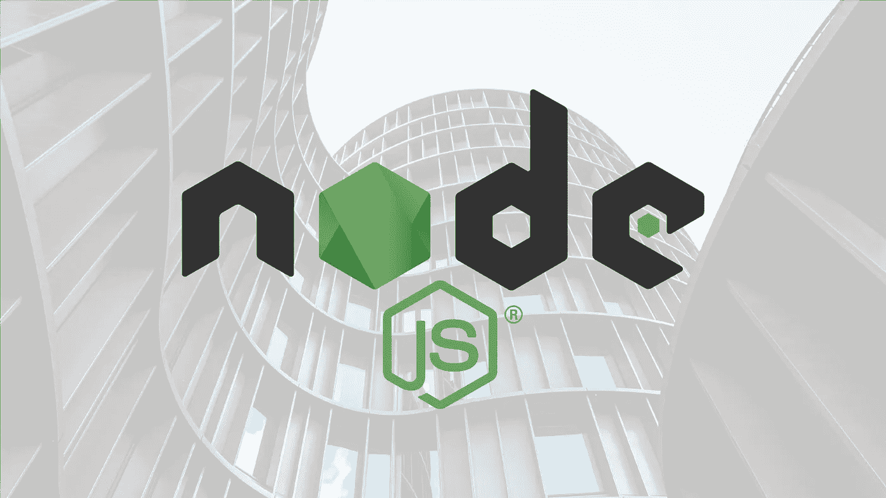
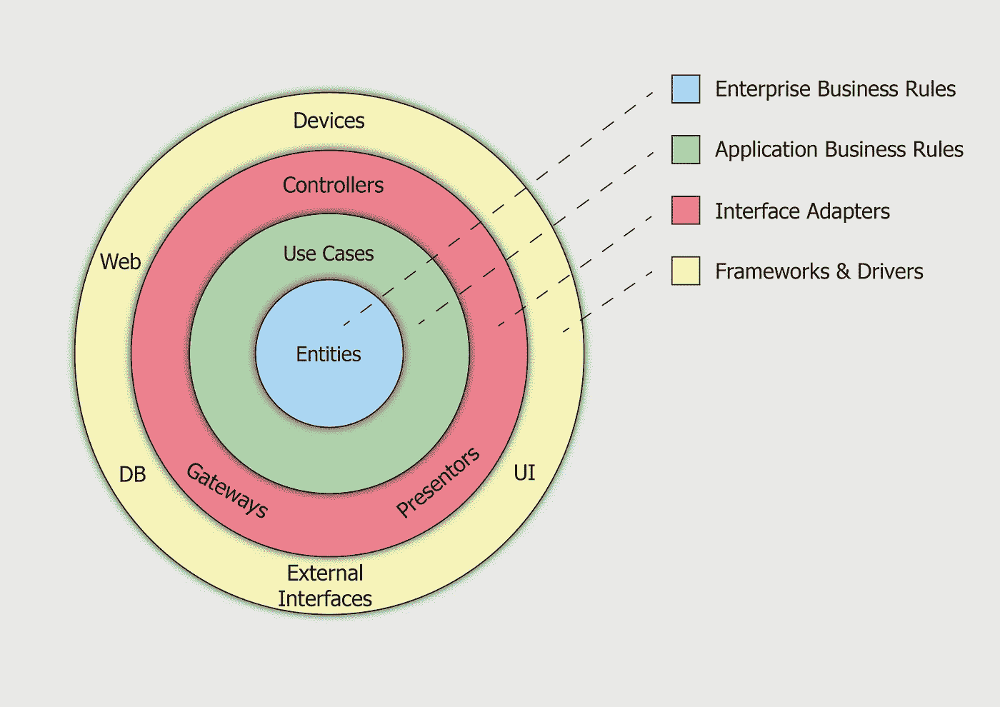
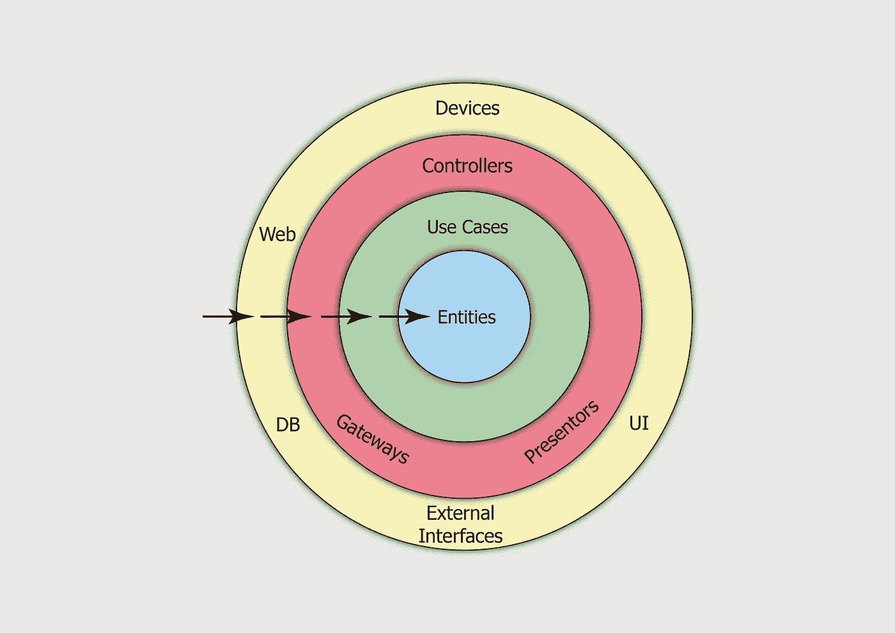

# 干净的架构——让 Node.js API 大放异彩！

> 原文：<https://itnext.io/clean-architecture-making-node-js-api-shine-38134b8f9b5c?source=collection_archive---------2----------------------->

当我作为一名原生 Android 开发人员工作时，我第一次遇到了[干净架构](https://blog.cleancoder.com/uncle-bob/2012/08/13/the-clean-architecture.html)的主题，在那里我们花了很多时间思考架构和设计模式。当我过渡到 JavaScript 堆栈时，我注意到许多生产项目没有对代码架构投入太多的思考。

**想做关于 Clean architecture 和 Node.js 的实践培训？**
邀请你来看看我创建的课程，在我的指导下，你将在 Node.js 中基于干净架构原则编写一个完整的系统。
[***为 Node.js API Bootcamp 使用干净的架构***](https://www.udemy.com/course/nodejs-api-with-clean-architecture/?referralCode=B0B06E239941EF0916A2)

**那么，我们为什么要考虑代码架构呢？**

**代码可伸缩性:**如果你没有正确地构建代码，那么添加一个新特性是具有挑战性的——为了做出改变，你会发现自己违反了许多坚实的原则。

**可维护性:**让我们假设一些系统需求改变了，或者你决定改变你的一个框架或者库。当所有的系统组件都相互分离时，这种转换会很简单，很少发生重大变化。

**可测试性:**我们需要使用不同类型的测试来测试我们的应用程序，其中包括单元、集成、功能、冒烟和 e2e 测试。元素的分离有助于更容易的测试，我们可以用特定的注入属性独立地测试每个模块。

可读性:开发人员对代码的可读性有不同的看法，但是每个人都会同意，当你的代码与单一的明确定义的职责分离时，可读性会增加。

看看下面的例子，在许多生产项目中都能找到，让我们分析一下这段代码有问题的地方。

**代码可伸缩性:**假设我们想要在模型执行之前添加 ID 参数的验证，我们将需要在请求处理程序中添加验证逻辑，这将打破单一责任原则，因为控制器的责任是解析请求数据并回复相关结果。
**解决方案:**调用负责处理这个请求的服务层。

**可维护性:**假设出于某种原因，您决定将数据库层更改为 Azure Cosmos DB 而不是 Mongo DB，在这种情况下，除了许多数据迁移之外，您还需要更改许多代码库。
**解决方案:**准备一个并行存储库层，它将执行 Cosmos DB 而不是 Mongo DB，当它准备好并经过测试后，只需用一些依赖注入机制来替换它。该解决方案将允许您使用某种切换机制在类似生产的环境中安全地并行测试解决方案。

**可测试性:**为了测试这个函数，您需要使用某种形式的模拟数据库，并使用 chai-http 之类的东西发出一个假请求。这里的问题是这个测试很难初始化，并且需要很长时间来执行。
这里的第二个问题是，你不能独立测试这段代码的每一部分。
**解决方案:**这个控制器应该调用一个负责处理请求的服务层。一旦你做到了这一点，测试应该很容易:只要用你期望的数据响应创建一个模拟服务，并独立地测试服务逻辑——这样你就把业务逻辑从繁琐的测试获取技术(在本例中是 HTTP)中分离出来了。

那么，我们如何在代码中使用干净的架构呢？

干净架构是一种软件设计哲学，提倡代码层的分离。对于一个基本的 Node.js API 项目，我们将使用上图中形象化的层作为环的隐喻概念来快速检查这一原理。

**黄色层:**Web 服务器层——包括路由，将执行控制器。

**红色层:**控制器层，将接收用户的数据，执行相关的用例，并编译结构化的响应。

**绿色层:**用例层，将接收用户数据并处理该请求，包括验证和外部系统报告(如 Kafka 或 Kibana)，它将从实体存储库层接收数据作为事实的来源。

**蓝色层:**实体层，将包括实体和实体存储库——只有这一层将进行数据库查询，并访问其他服务或第三方以获取数据。

**代码依赖规则:**代码依赖只能从外层向内移动。内层的代码可能不知道外层的功能。外层中的变量、函数和类不能在更内部的级别中提及。

**依赖注入:**为了灵活地处理项目依赖，使用任何依赖注入机制，它可以基于特定的配置注入您的层。

**响应契约:**为了让你的 API 可预测，使用响应契约层，这意味着每一个响应都要结构化，包括错误。

如果您想了解如何在实践中使用响应契约层，请加入我的 udemy.com 课程

[***对 Node.js API Bootcamp 使用干净的架构***](https://www.udemy.com/course/nodejs-api-with-clean-architecture/?referralCode=B0B06E239941EF0916A2)

请记住——干净的架构是一个建议，而不是规则！

对于程序员来说，干净的架构第一次遇到这种哲学可能是困难和耗时的，如果你没有时间做你的项目，就使用一个基本的关注点逻辑分离。

**控制器**将接收用户的请求，并用结构化的响应进行回复。

**服务**将处理用户的请求，包括验证和第三方报告，并将使用存储库层作为事实来源接收数据。

**存储库**将作为应用程序的事实来源，包括数据库和外部服务查询。

> “你的架构应该告诉读者关于系统的信息，而不是你在系统中使用的框架。”——Robert c . Martin。

**结论**

良好的架构是构建模块化、可伸缩、可维护和可测试的应用程序的关键。最流行的架构之一是干净的架构，但是每个项目都有特定的需求。只要开始考虑关注点的分离，以及如何不把你的代码写成一个大块，你就会得到一个好的项目，它维护起来并不可怕，而且易于测试。

**想了解更多信息？邀请你看一下我创建的课程，在我的指导下，你将基于干净架构原则用 Node.js 编写一个完整的系统**

[***使用干净的架构进行 node . js API boot camp***](https://www.udemy.com/course/nodejs-api-with-clean-architecture/?referralCode=B0B06E239941EF0916A2)

黑客快乐！:)