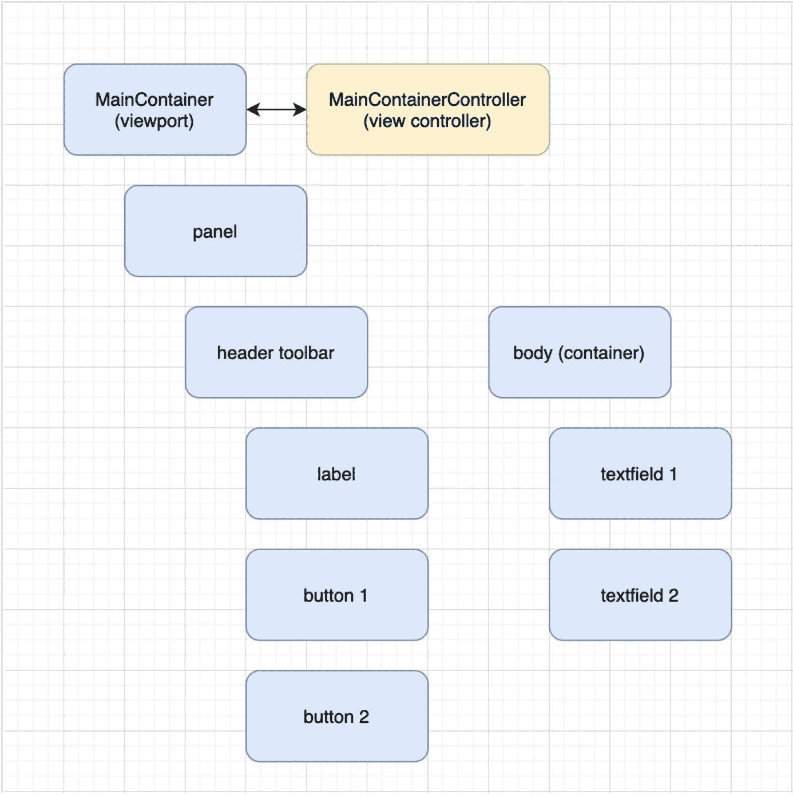

# 干净的架构:使用视图控制器的好处

> 原文：<https://itnext.io/clean-architectures-your-benefits-of-using-view-controllers-7ce6b00f0ad5?source=collection_archive---------2----------------------->

视图控制器提供了一种简单明了的方法来将业务逻辑从组件中分离出来。

# 内容

1.  演示应用程序
2.  没有视图控制器的演示主视图
3.  使用视图控制器演示主视图
4.  视图控制器逻辑
5.  摘要

# 1.演示应用程序

演示应用程序相当简单，在我的上一篇文章中有所介绍:

 [## 截取组件状态以确保平滑的动画转换

### 剧透:这篇文章中的全部代码可以直接在你的浏览器中运行(不需要任何编译)

itnext.io](/intercepting-component-state-to-ensure-smooth-animated-transitions-4facd46414dd) 

如果您对内部业务逻辑感到好奇，请随意深入研究这一点。但是，并不要求遵循这篇文章。

# 2.没有视图控制器的演示主视图

让我们先看看不使用视图控制器的 MainContainer 实现:

如果我们愿意，我们可以在类的`construct()`方法中设置我们的配置。由于`getConfig()`是一个静态方法，我们无法访问它内部的`this`指针。在构造(or)中，我们现在可以将事件侦听器直接映射到该范围内的方法。

这种技术本身可以很好地创建组件，但是一旦我们创建了一个应用程序，我们就希望在我们的视图和业务相关逻辑之间有一个清晰的分离。

# 3.使用视图控制器演示主视图

让我们在添加了视图控制器之后再来看一下同一个视图:

我们导入了一个新的视图控制器类，并简单地将模块添加为控制器配置。

我们用字符串(方法的名称)替换了所有的事件侦听器。因为我们移除了`items`定义中所有出现的`this`指针，现在我们可以将它直接移到静态`getConfig()`方法中。

视图控制器是可选的，这意味着:并不是每个视图都需要一个视图控制器。

框架会将基于字符串的方法名与实现它的父树中最近的视图控制器进行匹配。

**提示**:你应该总是尽量在组件(和控制器)树的底层定义你的实现。但是，您可以向上移动逻辑，以防减少冗余(意思是:如果同级控制器包含相同的逻辑，请将其向上移动)。

**提示 2** :我们还在组合中添加了参考配置。这些可以从父链中的任何视图控制器中访问。这是让它们保持独特的一个好理由。

# 4.视图控制器逻辑

逻辑本身的工作等同于不使用视图控制器的实现。

我们现在使用`this.getReference()`来访问组件，而不是手动使用组件查询。

我们现在有了业务逻辑和视图定义的清晰分离。

# 5.摘要

为了在框架层次上创建复杂的组件，我尽量避免使用视图控制器。即使它变得像日历实现一样复杂: [src/calendar](https://github.com/neomjs/neo/tree/dev/src/calendar)

对于创建应用程序，我真的很喜欢使用它们:[应用程序/covid](https://github.com/neomjs/neo/tree/dev/apps/covid)

视图控制器可以很容易地与可选的视图模型(状态提供者)相结合，这使得它们更加强大。请给我一个提示，如果你想读更多关于这方面的内容。

当我谈论事件时，我指的不是基于 DOM 的事件，而是自定义的**可观察的**实现。

对于基于 neo 的范围，您的应用程序和组件存在于应用程序工作器中，遵循“应用程序工作器是主要参与者”的设计模式:

 [## GitHub - neomjs/neo:应用工人驱动的前端框架

### neo.mjs 使您能够使用一个以上的 CPU 创建可扩展的高性能应用程序。不需要照顾一个…

github.com](https://github.com/neomjs/neo) 

问候&快乐编码，
托拜厄斯

预览图像:

