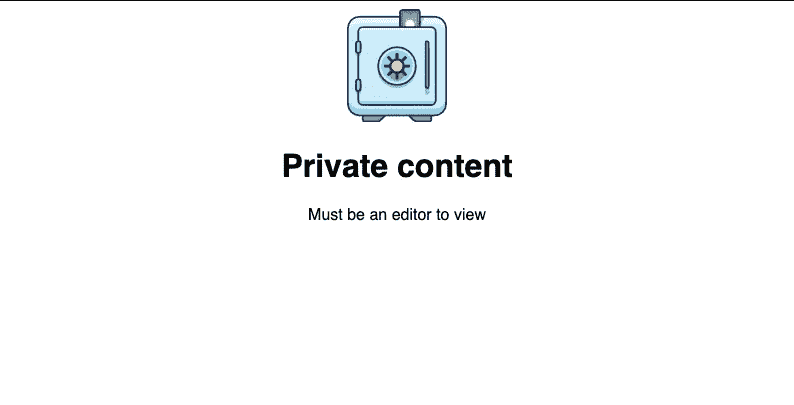

# 大规模 React 应用中处理角色和权限的清晰模式

> 原文：<https://itnext.io/clean-pattern-for-handling-roles-and-permissions-in-large-scale-react-apps-99531869ad71?source=collection_archive---------1----------------------->

在这篇文章中，我们将讨论如何在 React 中管理精细的角色和权限。

任何 React 应用程序在开始时都非常整洁，直到您开始在它上面放置条件逻辑。当您开始添加粒度权限和角色时，情况会变得更糟。

当使用简单的条件句或`switch`语句时，处理所有这些细微差别是一场噩梦。有一个更好的方法来做这件事。

# 模式概述

如果分解一下，模式就简单了。它包括构建一个门控包装器，并定义一组具有角色、范围和权限的映射。

门控包装接受用户查看受保护组件必须拥有的范围数组。我们还将为某些边缘情况提供一些便利的道具。

# 辅导的

## 门控组件

我们将从添加门控组件开始。姑且称之为`PermissionsGate`:

`PermssionsGate`承接`children`和`scopes`房产。我们使用`scopes`来声明用户必须拥有哪些权限才能查看`PermissionsGate`的内容。

`useGetRole`是您必须定义的自定义挂钩，它返回当前用户的角色。

`hasPermission`根据所需的范围和用户的权限，返回是否授予用户访问权限的布尔值。

## 角色和权限的映射

现在让我们定义我们需要的范围、用户角色和权限映射。我们将它们放在一个单独的`permission-maps.js`文件中:

我们有三张地图:

*   `ROLES` -我们应用程序中的所有用户角色。
*   `SCOPES` -我们传递给门控包装器的作用域。
*   `PERMISSIONS` -映射定义了每个用户角色拥有的范围集。

现在让我们看看`PermissionsGate`的运行情况。假设用户必须是编辑才能查看下面的页面:

私人内容

我们需要做的就是用`PermissionsGate`包装受保护的内容，并提供查看内容所需的范围。

客户端 API 是干净的，如果将来业务需求发生变化，可以很容易地调整范围。

# 其他使用案例

到目前为止，一切顺利。但是我们可以进一步改进`PermissionsGate`。让我们对其进行修改，以涵盖经常出现的另外两种用例:

*   如果用户没有正确的权限，则显示自定义错误消息。
*   如果用户没有正确的权限，则沿着组件树向下传递一组自定义的道具。

先说第一个。在某些情况下，如果用户没有适当的权限，我们希望显示一个自定义的错误组件。我们可以通过给我们的`PermissionsGate`添加一个道具来做到这一点。姑且称之为`RenderError`:

让我们来看看它的实际应用:

这是我们现在看到的:

自定义错误消息

`PermissionsGate`没有呈现受保护的组件，而是呈现我们自定义的错误消息。这是因为我们需要`canCreate`范围来查看内容，而我们的用户没有。

让我们继续第二个用例。有时候，你不一定想藏孩子。相反，您可能希望通过传递一组自定义的道具来让孩子们知道。一个例子是，如果用户不是编辑者，可以通过提供一个`disabled`属性来禁用输入。

要将自定义道具传递给孩子，我们可以使用 [React.cloneElement](https://reactjs.org/docs/react-api.html#cloneelement) :

你可以这样使用它:

对于没有`SCOPE.canEdit`范围的任何人，我们的输入将被禁用。

现在我们的`PermissionsGate`准备好了！通过处理这两个边缘案例，我们确保了我们可以接受任何抛给我们的与权限相关的需求。

# 结论

有了我们的门控组件，我们有了一个清晰的可扩展的解决方案，让我们可以根据需要细化权限。

根据您的服务器和数据库设置，您的门控包装器和权限映射的实现可能略有不同。但主要原则保持不变。

作为一个快速提醒:永远不要只依赖于检查前端应用程序的权限。永远记住在服务器上添加额外的权限验证。

*原载于 2021 年 5 月 16 日 https://isamatov.com***。**