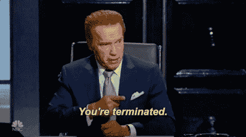
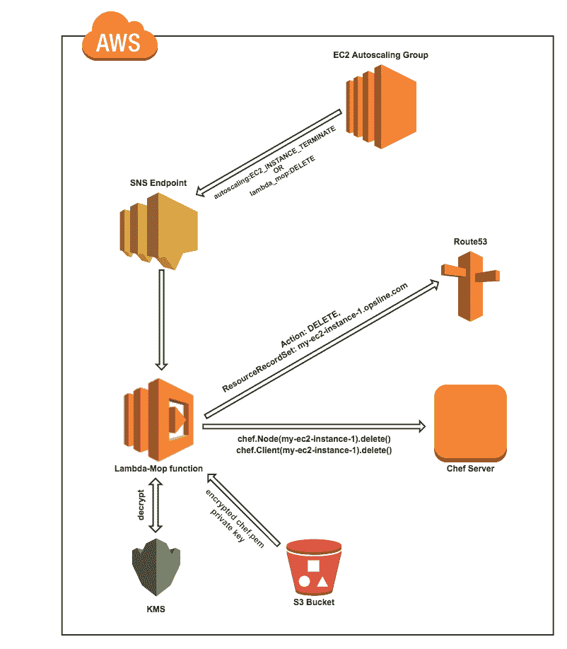

# 清理完节点后

> 原文：<https://itnext.io/cleaning-up-after-your-nodes-b51b96fc63c5?source=collection_archive---------4----------------------->

由[斯科特·莫里斯](https://www.linkedin.com/in/scott-morris-6490388/)

在 [Opsline](https://opsline.com) 中，我们经常使用 [Chef](https://www.chef.io/) 对部署在云中的基础设施进行配置管理。在我们的典型配置中，EC2 实例通过自动扩展组启动，并由`chef-client`在第一次引导时进行配置。Chef 客户端进程向 Chef 服务器注册新实例，创建 Chef“节点”和“客户端”对象，并创建用户友好的 Route53 记录来寻址新实例。

**但是当…** 发生了什么



当实例终止时，实例的 Chef 节点对象、客户机对象和 Route53 记录仍然存在。为了解决这个问题，我们创建了一个名为 Lambda-Mop 的工具。每当实例被自动缩放组终止或启动后引导失败时，此工具处理 chef 节点、客户机和 Route53 记录的删除。

# **工作原理**



Lambda-Mop 利用几种 AWS 服务:

**AWS Lambda**—Lambda-Mop 的主要组件是一个 Lambda python 函数。该功能有两种触发方式:

1.  当一个自动缩放组终止一个现有的实例并将`autoscaling:EC2_INSTANCE_TERMINATE`信号连同实例 id 一起发送到已配置的 SNS 缩放通知 ARN 时。
2.  当新启动的实例在引导期间失败时，它可能没有向 Chef 服务器注册其实例 id，从而阻止通过实例 id 查找节点/客户机对象。在这种情况下，我们有一个小的 Python 脚本(在引导过程中下载到实例)，它将通过`cfn-signal`检测引导失败，并向类型为`lambda_mop:DELETE`的 SNS 主题发送一个定制事件，包含相关的 Chef 节点名称和/或 IP 地址。然后 Lambda-Mop 使用这些信息来删除匹配的 Chef 对象和 Route53 记录。

**SNS**—SNS 主题从自动缩放组或 EC2 实例本身接收信号。Lambda-Mop 订阅了这个 SNS 话题。

**KMS** —为了与 Chef 服务器通信，Lambda-Mop 需要一个已经向 Chef 服务器注册的私钥。我们使用 KMS 加密这个私钥，并将其存储在 S3 桶中，Lambda-Mop 从那里下载并解密它。

# 建立基础设施

1.  为实例创建自动缩放组。我们使用 CloudFormation 来设置 ASG，以及通知信号配置。

```
"AutoScalingGroup": {
  "Type": "AWS::AutoScaling::AutoScalingGroup",
  "Properties": {
    "MinSize": { "Ref": "AutoScalingMinSize" },
    "MaxSize": { "Ref": "AutoScalingMaxSize" },
    "DesiredCapacity": { "Ref": "AutoScalingDesiredCapacity" },
    "NotificationConfiguration": {
      "TopicARN": { "Ref": "ScalingNotificationsTopicArn" },
      "NotificationTypes": [
        "autoscaling:EC2_INSTANCE_LAUNCH",
        "autoscaling:EC2_INSTANCE_LAUNCH_ERROR",
        "autoscaling:EC2_INSTANCE_TERMINATE",
        "autoscaling:EC2_INSTANCE_TERMINATE_ERROR"
      ]
    }
… (further ASG configuration)
}
```

2.创建 [SNS 主题](https://docs.aws.amazon.com/sns/latest/dg/CreateTopic.html)(在上面的 ASG 配置中引用为`ScalingNotificationsTopicArn`)

3.创建由 SNS 主题消息触发的 [Lambda 函数](https://docs.aws.amazon.com/lambda/latest/dg/get-started-create-function.html)

4.创建一个 [KMS 密钥](https://docs.aws.amazon.com/kms/latest/developerguide/create-keys.html)用于加密厨师私钥

5.使用 [Chef API](https://pychef.readthedocs.io/en/latest/api.html) 在 Chef 服务器中搜索实例

6.使用 Chef API 从 Chef 服务器中删除实例的节点和客户端对象

7.为了支持新实例在引导期间失败的边缘情况，使用脚本向 Lambda-Mop 发信号通知应该从 Chef 服务器和 Route53 中移除该实例

我们在招人！想来帮助我们解决 DevOps 领域的一些复杂问题吗？请将你的简历发至 work@opsline.com[](mailto:work@opsline.com)**给我们写信，我们会保持联系。**