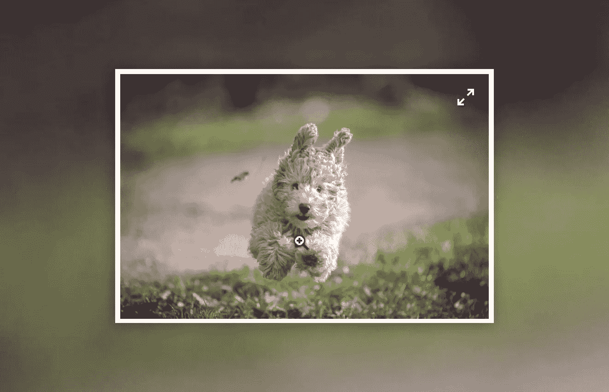

# 单击图像并以全尺寸显示，这是 Vue 中可重复使用的解决方案

> 原文：<https://itnext.io/click-images-and-show-them-in-full-size-a-reusable-solution-in-vue-8b042f646809?source=collection_archive---------2----------------------->



无论你是建立一个简单的博客还是一个电子商务，你可能需要一种方法在点击图片时以窗口的全尺寸查看图片。

虽然这看起来不是一个很难的任务，但是在 Vue 中为它创建一个可重用的解决方案有点棘手。原因是你应该能够在任何图像上使用这个解决方案，不管它在 DOM 树中嵌套的有多深。

*如果你只是想马上使用这个解决方案而不遵循教程，* [*看看我创建的这个插件*](https://github.com/TahaSh/vue-expandable-image/) *。*

在进入下一部分之前，看一下 [CodePen](https://codepen.io/tahazsh/pen/aMbooL) 中的最终结果:

# 可重用的解决方案会是什么样子？

应该和用`<expandable-image/>`组件替换``标签一样简单！

# 主页

让我们用 [Vue CLI 3 的即时原型](https://medium.com/@Taha_Shashtari/test-out-your-vue-component-ideas-in-no-time-with-instant-prototyping-5fdf22688c08)快速启动一个新项目。因此，在新目录中创建`App.vue`和`ExpandableImage.vue`，然后从终端运行:

```
vue serve App.vue
```

然后，把这个放进`App.vue`:

```
<template>
  <div id="app">
    <expandable-image
      class="image"
      src="https://images.unsplash.com/photo-1550948537-130a1ce83314?ixlib=rb-1.2.1&ixid=eyJhcHBfaWQiOjEyMDd9&auto=format&fit=crop&w=2552&q=80"
      alt="dog"
      title="dog"
    />
  </div>
</template><script>
**import** ExpandableImage **from** './ExpandableImage'
**export** **default** {
  components: { ExpandableImage }
}
</script><style>
**#app** {
  display: flex;
  justify-content: center;
  align-items: center;
  flex-direction: column;
  width: 600px;
  max-width: 100%;
  margin: 50px auto;
  position: relative;
}.image {
  width: 400px;
  max-width: 100%;
}
</style>
```

我们只是显示一个带有`<expandable-image/>`的图像，我们还没有创建它。

# 实现 ExpandableImage.vue

首先，我们希望这个组件是一个``元素的包装器，以确保它被视为一个普通的图像元素。

为此，我们需要使用 [$attrs](https://tahazsh.com/vuebyte-non-prop-attributes) 将`<expandable-image/>`上使用的所有属性直接传递给``。方法如下:

```
<template>
  <div class="expandable-image">
    
  </div>
</template>
```

现在你在`<expandable-image/>`上使用的任何东西(除了`style`和`class`)都将被传递给``。但是如果您检查浏览器，您会看到不仅``在使用这些属性，而且包装器组件:`<div class="expandable-image">`。要解决这个问题，将`inheritAttrs: false`添加到组件的根对象。像这样:

```
<script>
**export** **default** {
  inheritAttrs: false
}
</script>
```

现在我们需要一种方法来判断图像是否处于展开状态。因此，让我们将`expanded`添加到组件的数据列表中。

```
data () {
  **return** {
    expanded: false
  }
}
```

我们需要使用该属性来设计不同的组件样式。因此，将`:class`添加到根元素，如下所示:

```
<div
  class="expandable-image"
  :class="{ expanded }"
>
```

此外，基于该属性，我们将显示展开图标或关闭图标(如果您不知道我在说什么，请查看演示)。

让我们修改模板部分以包含这些图标。

```
<template>
  <div
    class="expandable-image"
    :class="{ expanded }"
  >
    <i
      v-if="expanded"
      class="close-button"
    >
      <svg
        style="width:24px;height:24px"
        viewBox="0 0 24 24"
      >
        <path
          fill="#666666"
          d="M19,6.41L17.59,5L12,10.59L6.41,5L5,6.41L10.59,12L5,17.59L6.41,19L12,13.41L17.59,19L19,17.59L13.41,12L19,6.41Z"
        />
      </svg>
    </i>
    <i
      v-else
      class="expand-button"
    >
      <svg
        style="width:24px;height:24px"
        viewBox="0 0 24 24"
      >
        <path
          fill="#000000"
          d="M10,21V19H6.41L10.91,14.5L9.5,13.09L5,17.59V14H3V21H10M14.5,10.91L19,6.41V10H21V3H14V5H17.59L13.09,9.5L14.5,10.91Z"
        />
      </svg>
    </i>
    
  </div>
</template>
```

在我们深入了解这是如何工作的之前，让我们在用户点击图像时将`expanded`属性切换到`true`。我们将通过向根元素添加`@click`来实现，就像这样:

```
<div
  class="expandable-image"
  :class="{ expanded }"
  @click="expanded = true"
>
```

# 扩张是如何进行的？

让我们一步一步地解释这一点:

1.  用户点击图像
2.  `expanded`属性变为`true`
3.  `expanded`观察器将在`expanded`设置为`true`的情况下运行(我们稍后将实现该观察器)
4.  我们将检查`expanded`是否为`true`。如果是，我们将执行以下操作
5.  克隆这个组件的根元素，并将其存储到一个名为`cloned`的属性中
6.  存储关闭按钮的引用，并向其添加一个`click`事件监听器
7.  将克隆的元素添加到`<body>`
8.  禁用页面滚动
9.  最后，显示带有渐隐过渡的扩展图像

这些步骤是为了显示扩展的图像(当您看到代码时，它们会变得更加清晰)。

现在，让我们看看关闭展开图像的步骤:

1.  用户点击关闭按钮
2.  我们隐藏带有过渡的扩展图像
3.  完成后，我们从关闭按钮中移除点击事件监听器
4.  从`<body>`中移除克隆的元素
5.  最后，重新启用页面滚动

# 扩展的监视器

让我们看看`expanded`观察器在代码中是什么样子的。

```
watch: {
  expanded (expanded) {
    **this**.$nextTick(() => {
      *// Run this if when we're expanding the image*
      **if** (expanded) {
        *// Clone the entire expandable-image element*
        **this**.cloned = **this**.$el.cloneNode(true)
        *// Store a reference for the close button*
        **this**.closeButtonRef = **this**.cloned.querySelector('.close-button')
        *// Call closeImage when the close button is clicked*
        **this**.closeButtonRef.addEventListener('click', **this**.closeImage)
        *// Add the cloned element into <body>*
        document.body.appendChild(**this**.cloned)
        *// Prevent the page from scrolling*
        document.body.style.overflow = 'hidden'
        setTimeout(() => {
          *// Show the cloned element*
          **this**.cloned.style.opacity = 1
        }, 0)
      } **else** {
        *// This section will run when the image is closing* *// Hide the expanded image*
        **this**.cloned.style.opacity = 0
        setTimeout(() => {
          *// Then, remove the click event listener from the close button*
          **this**.closeButtonRef.removeEventListener('click', **this**.closeImage)
          *// Remove the cloned element and the references*
          **this**.cloned.remove()
          **this**.cloned = null
          **this**.closeButtonRef = null
          *// Re-enable the scrolling*
          document.body.style.overflow = 'auto'
        }, 250)
      }
    })
  }
}
```

# 为组件添加样式

我们的最后一步是为组件添加样式。这一步对于使我们的组件正常工作非常重要，所以你可能需要阅读和理解这个组件的 css。

```
<**style**>
.expandable-image {
  position: relative;
  transition: 0.25s opacity;
  cursor: zoom-in;
}**body** > .expandable-image.expanded {
  position: fixed;
  z-index: 999999;
  top: 0;
  left: 0;
  width: 100%;
  height: 100%;
  background: black;
  display: flex;
  align-items: center;
  opacity: 0;
  padding-bottom: 0 **!important**;
  cursor: default;
}**body** > .expandable-image.expanded > **img** {
  width: 100%;
  max-width: 1200px;
  max-height: 100%;
  object-fit: contain;
  margin: 0 auto;
}**body** > .expandable-image.expanded > .close-button {
  display: block;
}.close-button {
  position: fixed;
  top: 10px;
  right: 10px;
  display: none;
  cursor: pointer;
}
**svg** {
  filter: drop-shadow(1px 1px 1px rgba(0,0,0,0.5));
}
**svg** **path** {
  fill: #FFF;
}
.expand-button {
  position: absolute;
  z-index: 999;
  right: 10px;
  top: 10px;
  padding: 0px;
  align-items: center;
  justify-content: center;
  padding: 3px;
  opacity: 0;
  transition: 0.2s opacity;
}.expandable-image:hover .expand-button {
  opacity: 1;
}
.expand-button **svg** {
  width: 20px;
  height: 20px;
}
.expand-button **path** {
  fill: #FFF;
}.expandable-image **img** {
  width: 100%;
}
</**style**>
```

我认为如果你了解 css，这些应该很容易理解，但是有一点要注意，我们使用这个选择器:`body > .expandable-image.expanded`来定位在`<body>`中显示的扩展图像。

我们完了！现在，只要你想让你的图像以全尺寸观看，只需使用`<expandable-image/>`而不是``。

另外，不要忘记你可以省去这些工作，使用 [vue-expandable-image](https://github.com/TahaSh/vue-expandable-image/) 来代替。但是从头学起怎么实现还是不错的。