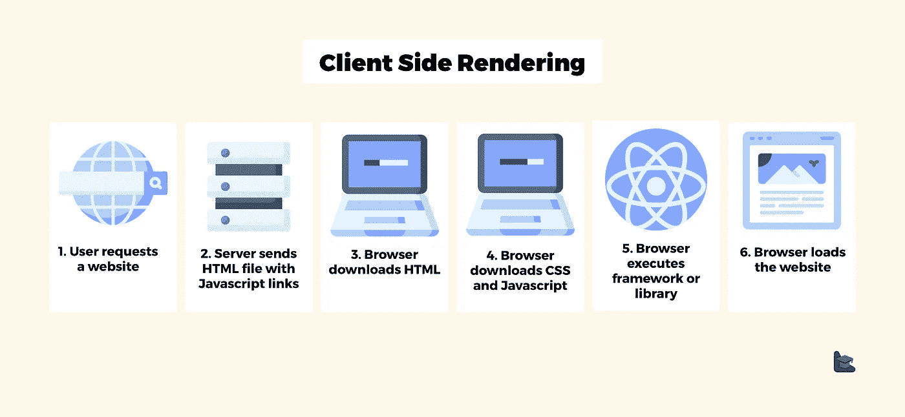
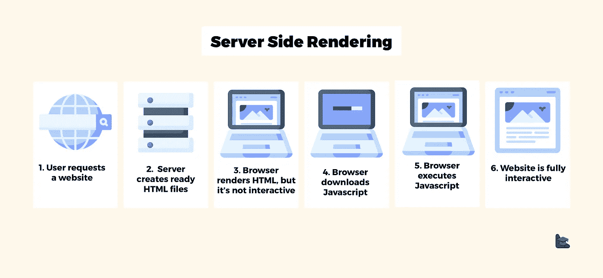
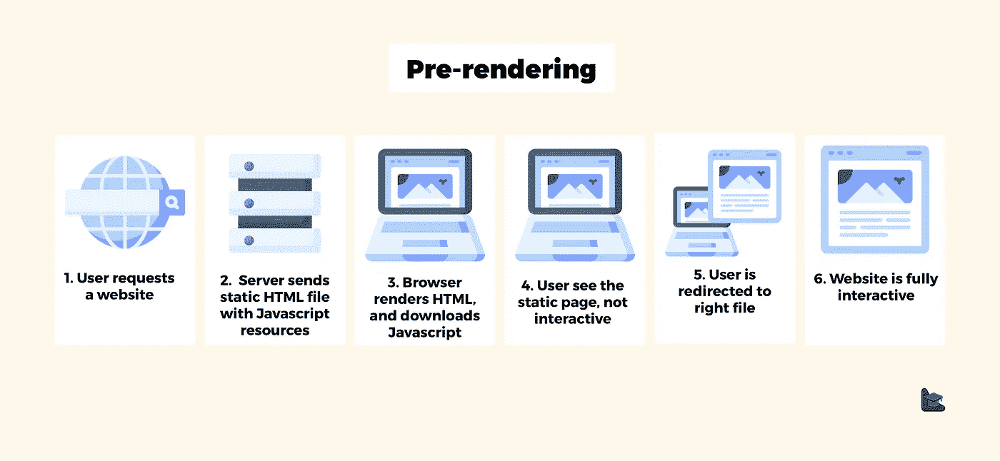

# 客户端渲染与服务器端渲染与预渲染

> 原文：<https://itnext.io/client-side-rendering-vs-server-side-rendering-vs-pre-rendering-5d5962221925?source=collection_archive---------3----------------------->

[客户端渲染对比服务器端渲染对比预渲染](https://www.blog.duomly.com/client-side-rendering-vs-server-side-rendering-vs-prerendering/)

本文原载于[https://www . blog . duomly . com/client-side-rendering-vs-server-side-rendering-vs-pre rendering/](https://www.blog.duomly.com/client-side-rendering-vs-server-side-rendering-vs-prerendering/)

# 客户端渲染与服务器端渲染简介

我们可以用现有的技术创建令人惊叹的 web 应用程序和网站，但是仍然需要考虑性能。开发人员互相超越，以在他们的项目中实现加载速度和用户体验的最佳结果。在这一点上，有许多关于应用程序呈现方式的讨论。

在现代前端框架开始如此普遍地使用之前，网站已经呈现在服务器上，并且准备就绪。html 文件被发送到浏览器。

当开发人员开始使用 ReactJS 或 Angular 时，网页开始在浏览器中呈现。话说回来，为了加快加载速度和改善用户体验，像 Next.js 这样的服务器端渲染框架开始变得更加流行。

还有一种预渲染，这是渲染 web 应用程序的另一种方法。但是哪一个最适合你的下一个项目呢？

在本文中，我将详细介绍这三个概念，客户端渲染、服务器端渲染和预渲染，逐一解释并进行比较。

如果你喜欢看，然后阅读，请随时加入我们的 YouTube 频道。

让我们来看看可用解决方案之间的区别是什么！

# 什么是客户端渲染(CSR)？

客户端呈现是在浏览器端呈现网页的一种方式。自从现代前端框架普及了这种解决方案，这种方法就变得普遍使用。因为现在大多数应用程序都是用 ReactJS 或 Angular 创建的，所以它们也使用客户端渲染。

现在，让我根据下图来解释客户端渲染是如何工作的。

什么是客户端渲染？

当用户在浏览器中输入一个地址时，服务器用一个空的 HTML 文件响应，Javascript 负责呈现所有内容。

在下载完所有的 Javascript 之前，用户可以看到一个空页面或加载屏幕，这取决于开发人员。Javascript 下载的时候需要把所有的东西都编译好，接下来的内容才能展示给用户。

如果需要任何额外的数据来显示屏幕并使网页完全交互，Javascript 可能会执行一些 API 调用。

在客户端渲染的情况下，初始加载稍微慢一点，但是之后，每次加载都非常快。此外，不需要重新呈现整个 UI，只需要改变单个元素。

如果您了解客户端渲染是如何工作的，那么是时候来看看服务器端渲染了。

# 什么是服务器端渲染？

服务器端呈现是呈现网页的另一种方式，但是这种方式在服务器中呈现内容并发送就绪。html 文件到浏览器。让我们看一下说明流程的图形。

什么是服务器端渲染？

当用户在浏览器中输入地址时，请求会发送到服务器。接下来，服务器准备特定的 HTML 文件，获取特定视图所需的数据。服务器将这个文件发送到浏览器，它将内容呈现在屏幕上，这样用户就可以看到了。
整个过程完全发生在服务器上，每次用户触发任何动作时都会重复。

现在，让我们关注第三种可能性，即预渲染。

## 服务器端渲染框架

**Angular**:Angular Universal
ReactJS:自定义设置 react js，next . js
vue js:nuxt . js

# 什么是预渲染？

虽然在一些项目中，服务器端渲染在其他项目中可能很棒，但这可能是一场噩梦。为了结合两种解决方案的优点，这是另一种可以用来渲染项目的方法，即预渲染。

预渲染是服务器端渲染和客户端渲染之间的权衡。当用户输入浏览器的地址时，服务器发回静态的。带 Javascript 的 html，在后台加载。用户可以看到静态网站，但是在 Javascript 完全下载之前没有交互性。然后 Javascript 获取特定视图的必要数据，并将用户重定向到正确的文件，但它是不可见的。

什么是预渲染？

预渲染是一个很好的想法，特别是如果你关心你的页面的搜索引擎优化，因为机器人可以读取预渲染的内容。

# 比较

当我们知道每种渲染方式的工作原理以及它们之间的区别时，我们就可以考虑它们的优缺点，这样我们就能够总结出在不同的项目中使用任何一种解决方案。

## 客户端渲染

**优点:**

*   初始加载后快速渲染
*   适用于具有大量逻辑的 web 应用程序，以及需要授权的大部分
*   许多支持 CSR 的 Javascript 框架和库

**缺点:**

*   低搜索引擎优化
*   初始加载可能需要一些时间

**何时使用客户端渲染？**

*   如果您的应用程序有大量动态数据
*   如果您的应用程序有一个非常复杂的 UI
*   如果您的应用程序关注大量用户
*   如果您的应用程序需要授权才能被访问
*   如果您的应用程序没有很多用于 SEO 的内容

## 服务器端渲染

**优点:**

*   搜索引擎机器人可以抓取更好的搜索引擎优化
*   初始加载更快

**缺点:**

*   大量的服务器请求
*   整页重新加载
*   当应用程序具有大量交互性时，渲染速度较慢

**什么时候使用服务器端渲染？**

*   如果您的应用程序 UI 很复杂，但是交互性很少
*   如果您的应用程序是一个更加静态的页面
*   如果用户数量不大

## 预退保

**优点:**

*   更好的首次加载用户体验
*   更好的搜索引擎优化
*   比 SSR 的请求更少

**缺点:**

*   需要等待交互性，直到加载 Javascript
*   如果需要数据，需要为首次装载提供用户友好的设计

**什么时候使用预渲染？**

*   如果你的应用程序有一个包含搜索引擎优化内容的用户界面
*   如果您的应用程序的一部分可供未经身份验证的用户使用
*   如果你不想使用 SSR，但你需要改善加载时间和 SEO
*   如果您的应用程序在第一页有更多的静态内容

# 结论

本文介绍了应用程序的三种呈现方式，客户端呈现、服务器端呈现和预呈现。我解释了每种渲染方式的工作原理，以便您能够为您的应用程序选择最佳解决方案。

除此之外，我们仔细研究了每种方法的优缺点，并总结了何时使用某个解决方案是好的。

没有一种完美的渲染方式，很大程度上取决于你创建的应用程序和你想要达到的效果。如果你有一个静态的应用程序，并关心搜索引擎优化和加载时间，你会选择不同的方式，然后如果你的应用程序是动态的，需要大量的服务器内容。

我希望当你计划下一个应用程序时，这篇文章会对你有用。

[Duomly —编程在线课程](https://www.duomly.com)

感谢阅读，
安娜