# Clio 编程语言:v0.12 中的渐进打字等！

> 原文：<https://itnext.io/clio-programming-language-gradual-typing-and-more-in-v0-12-1ba1083703b3?source=collection_archive---------3----------------------->

Clio 是一种快速的多线程函数式编程语言，可以编译成 JavaScript。Clio 0.12 是最近发布的，它为该语言本身带来了许多新特性。在这些新特性中，有一个简单而有效的类型系统，以及一个渐进的类型检查系统。查看我们的[网站](https://clio-lang.org/)以了解更多关于 Clio 的信息，或者继续阅读以了解更多新功能！

# 装修工

装饰者是 Clio 编程语言的最新成员！根据定义，装饰器是包装另一个函数并对其进行适当修改的函数。它们在许多情况下非常有用，例如，看看下面用 Clio 编写的 Express hello world 应用程序:

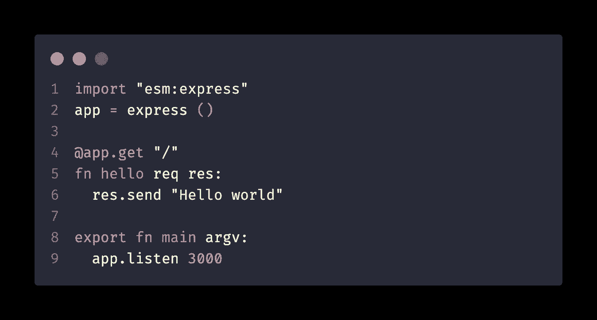

用 Clio 编写的一个简单的 hello world web 应用程序

它们也可以用来记录你的功能，以一种 [JSDoc](https://jsdoc.app/) 的方式:

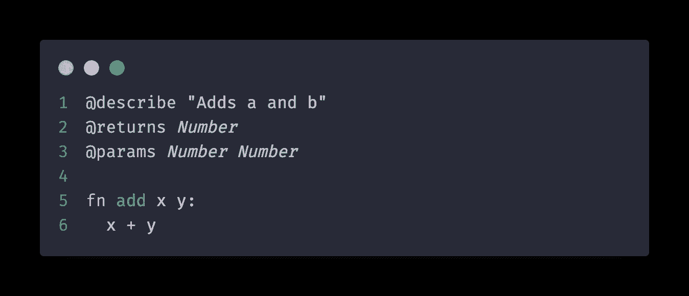

JSDoc 启发的类型注释

您可以使用`clio docs`命令来检查 Clio 项目的文档:

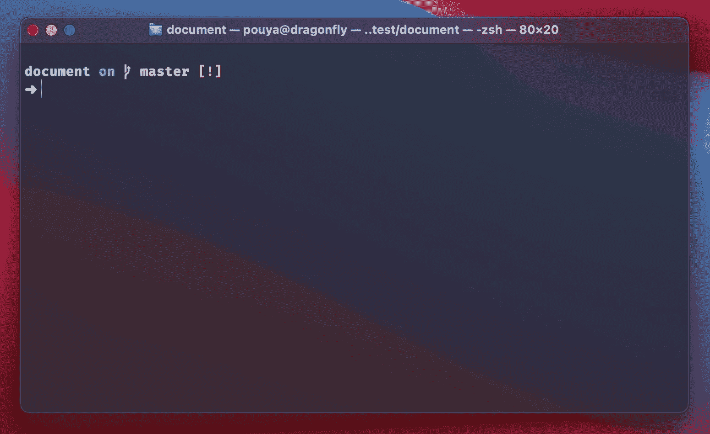

Clio docs 命令

很酷，不是吗？？

# 渐进静态和动态分型

Clio 0.12 给语言增加了一个渐进的打字系统！想静态地对代码的某些部分进行类型检查，而对其他部分只在运行时进行检查吗？没问题，只在对你有意义的地方添加类型信息，跳过其他的！你会问，静态类型的语法是什么？你已经看过了！Clio 使用`@decorators`进行函数类型注释！

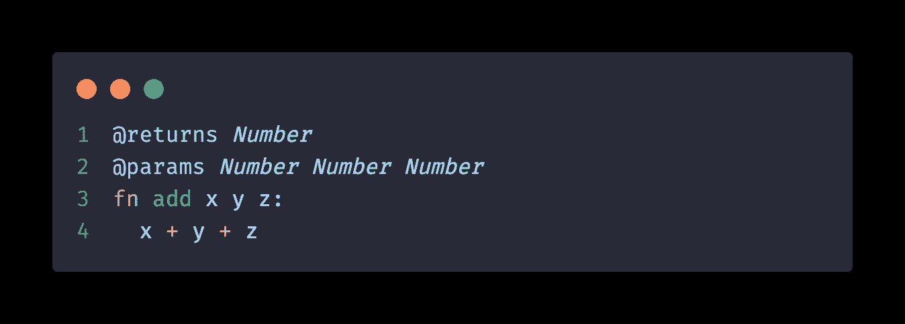

Clio 类型注释

类型注释也可以应用于常量和赋值:

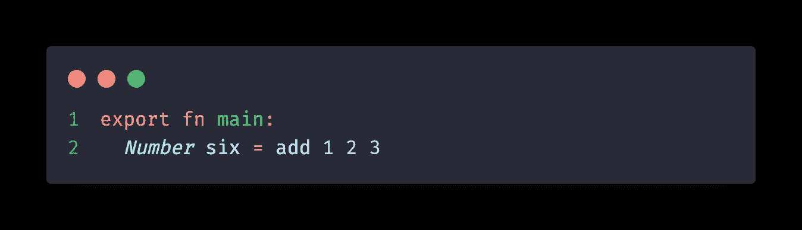

常数上的 Clio 类型注释

给你的函数添加动态类型检查也非常简单，只需给你的函数加注释，最后添加`@check`装饰器:

函数的动态类型检查

`@check` decorator 在运行时强制执行函数的类型正确性:它包装函数，如果传递给函数的返回值或参数与您定义的类型签名不匹配，它将抛出类型错误。

# 自定义类型

Clio 0.12 为类型声明添加了两个关键字:`type`和`list`关键字。第一个用于声明自定义类型。要定义自定义类型，您可以:

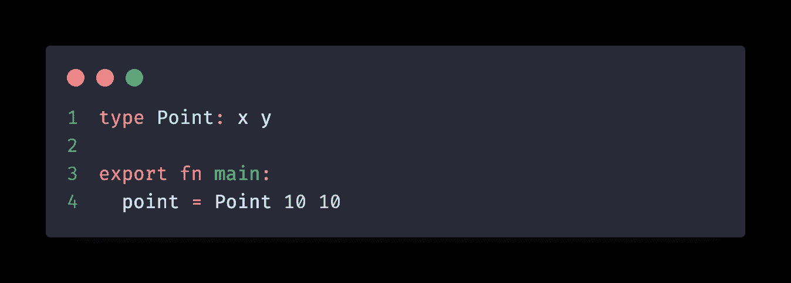

Clio 自定义类型

您还可以为自定义类型的成员添加类型信息:

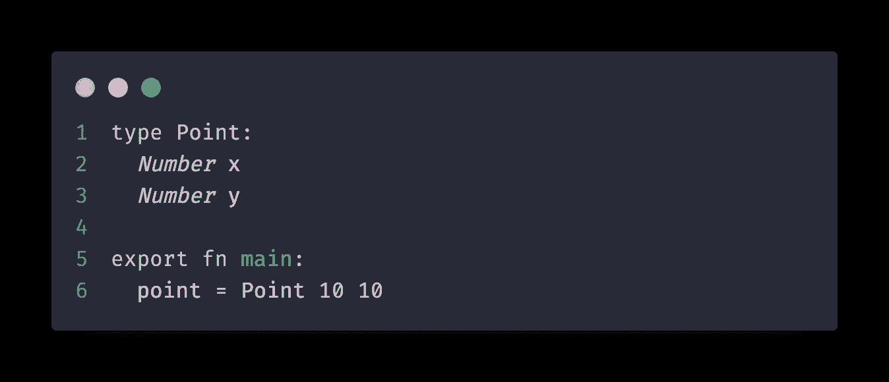

自定义类型成员的类型信息

最后，`list`用于定义一个数组类型，其中包含某种类型的项:

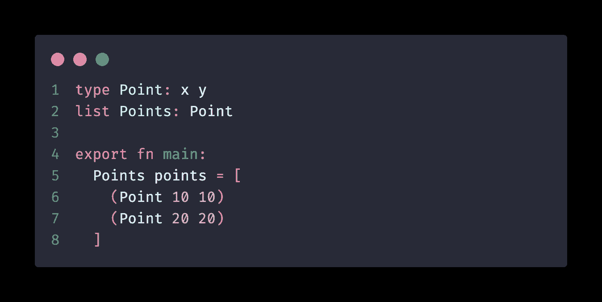

在 Clio 中创建数组类型

# 不再有隐含的强制

如果你试图在 JavaScript 中将一个`Number`和一个`String`加在一起，那么，你会大吃一惊的！你可以！以下代码是有效的 JavaScript 代码:

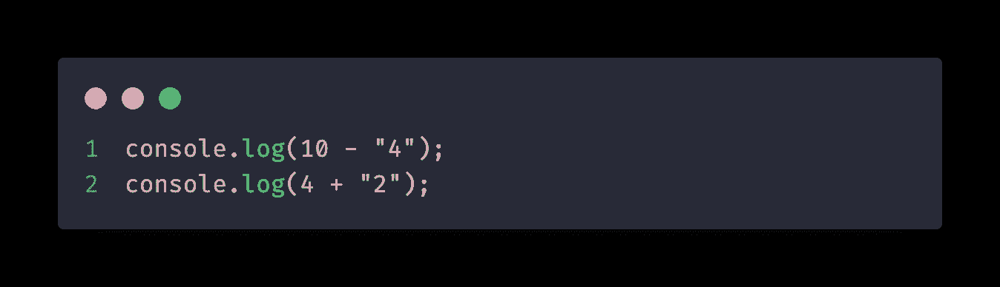

JavaScript 中的隐式强制

上面的代码在第一行打印数字`6`，在第二行打印字符串`"42"`。很困惑，不是吗？Clio 编译器现在遇到这种情况时会抛出错误。

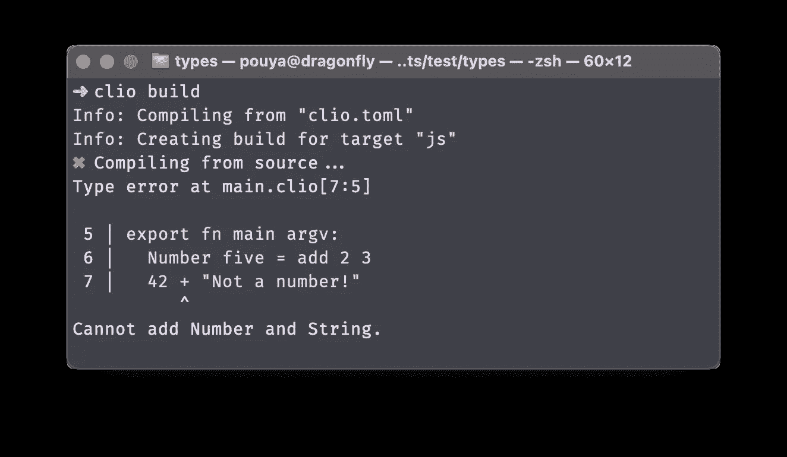

使用 Clio 0.12 进行编译时类型检查

# 绝对进口

JavaScript 中的相对导入会导致非常混乱的语句，如下所示:

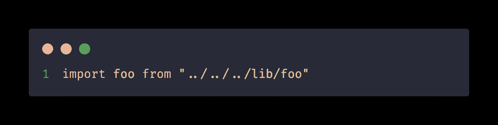

JavaScript 混淆了相对导入

这对于编译器或代码编辑器来说可能很容易理解和解决，但是对于开发人员来说就不那么容易了。为什么我们不能使用绝对导入，从项目的根开始？Clio 0.12 现在允许:

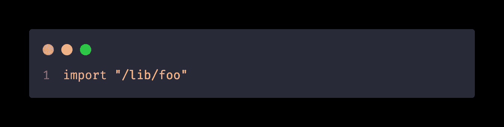

绝对进口

看起来干净多了，不是吗？

# 更快，更好的编译！

在 0.12 版本之前，Clio 曾经编译项目的源目录中的每个 Clio 文件！这种行为改变了，而且变得更好了！现在 Clio 跟踪您的导入，并且只编译您导入到项目中的文件。编译器现在缓存结果，如果文件没有被修改就不会重新编译！

编译器现在知道环境、声明以及函数和变量的范围了！这允许它执行准确的类型检查，并向第三方工具(如 VSCode)提供附加信息:

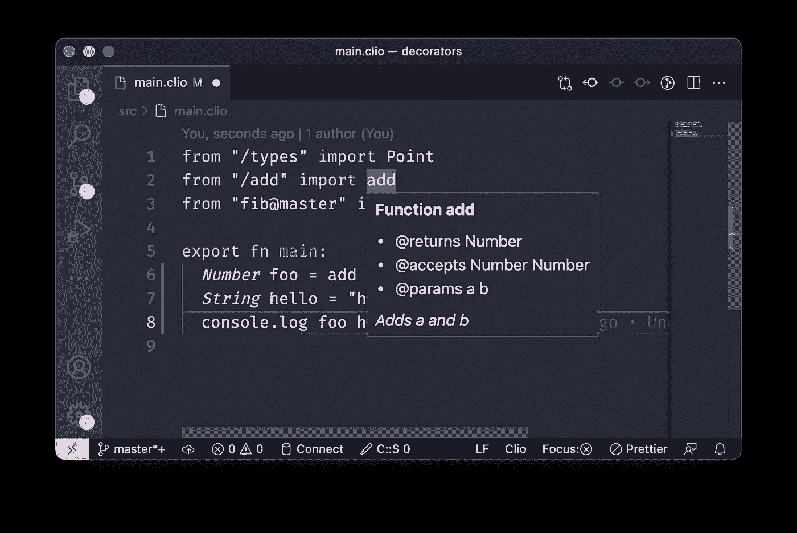

Clio VSCode 扩展

你觉得你读的东西有趣吗？通过查看我们的[网站](https://clio-lang.org/)或我们的 [GitHub 资源库](https://github.com/clio-lang/clio)来了解更多关于 Clio 的信息。你也可以在 Telegram 上加入我们的[社区聊天](https://t.me/clio_lang)，我们很友好！

Clio 编程语言