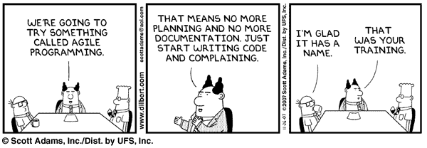
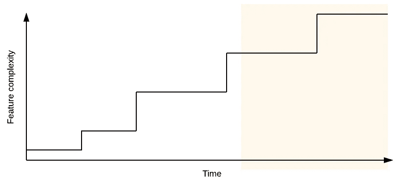
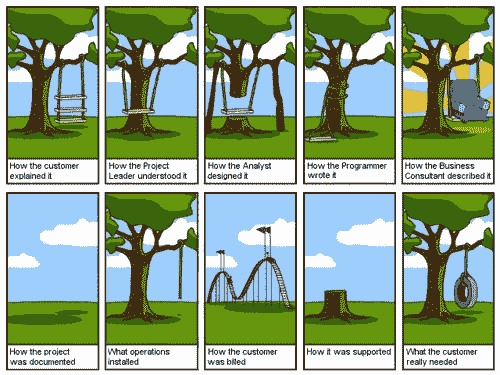
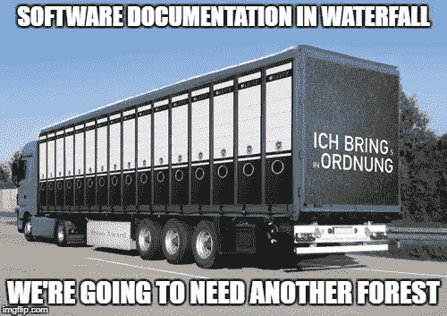

# 云可以修复你失败的敏捷采用。

> 原文：<https://itnext.io/cloud-can-fix-your-failing-agile-adoption-cd820787c2fd?source=collection_archive---------3----------------------->

敏捷和瀑布是根本不同的实践，试图两者都做就像在健身房抽烟一样。

[*点击这里在 LinkedIn*](https://www.linkedin.com/cws/share?url=https%3A%2F%2Fitnext.io%2Fcloud-can-fix-your-failing-agile-adoption-cd820787c2fd) 上分享这篇文章

15 年前，当我读到《敏捷原则》时，我差点哭了，我是软件开发出身。如此简单，如此简洁，如此优雅——然而我发现在公司开发团队中*如此糟糕。从前似乎很明显，跳出瀑布进入敏捷将是完成事情的*方式。但我看到的一些低劣的、混合的“混乱-堕落”科学怪人的作品揭示了我们还有很长的路要走。**

如果你花一点时间阅读他们噩梦般的 20 世纪 90 年代网页上的[敏捷原则](http://agilemanifesto.org/principles.html)，对于软件开发人员和产品经理来说，这就相当于品尝第一块比萨饼。这些原则与瀑布的高压锅相比就像禅宗一样——文字中有一种美丽的智慧，你意识到之前发生的一切都是错的。

敏捷原则以谦逊的方式支持简单而强大的事物:

*   **我们自始至终都欢迎**并鼓励变革，这样你就不必与那些没有准确预测未来的客户斗争。
*   **团队是自组织的**，传统的层级是多余的。这对多面手或聪明的员工来说很好，事实证明，这对许多人来说也是好事。
*   焦点是**工作软件**的频繁交付，而不是文档或过程。这意味着你的努力变成了有用的东西。

简而言之，敏捷允许团队掌控自己的生活，交付有价值的东西，并以自己的工作为荣。哈利路亚。但是等等，如果都这么容易，为什么敏捷这么破？云是如何解决这一切的呢？

## 处理云中不断变化的需求。

在许多公司，“变革能力”被误解为“管理层可以不断改变主意”。这不是一回事。这个想法是利用持续的客户反馈来修正你的项目，而不是根据高管的突发奇想来改变整个项目。当你毫无理由地引入无方向的变更时，项目就曲折了，不管敏捷与否。

但是在大型项目中真正重要的变化是你从未计划过的，并且每 12-18 个月就会发生一次。如果你在时间旁边画出特征复杂度，往往会发生的是，在中期间隔，复杂度会有越来越大的跳跃。

黄色阴影区域是“哦，去它的，让我们重写它”区域。

这些跳跃最终变得如此之大，以至于通常在几次迭代之后，整个应用程序都被丢弃，以利于整体重写。它总是会发生。总有一些你不知道的大事情即将到来——互联网、机器学习或机器人——它们对你的 5 年路线图嗤之以鼻。

在云中，我们可以灵巧地处理这些大的变化。我们没有承诺的基础设施。如果我们需要更多的服务器、不同的数据库、新的区域或任何东西，我们只需扔掉旧的，开发新的。没有硬件需求、沉没成本、数据中心或浪费。

围绕无服务器的以云为中心的开发也有巨大的影响。随着工作负载分解成数百个非常小的功能单元，这是改变的必经之路——由于整个平台一直在发展，进行更大规模的转变就不那么困难了。

每一个软件应用程序。

## 与用户实时合作。

在瀑布中，用户/客户只参与开始和结束，不能影响过程。你的团队可以愉快地完成一个长达一年的软件项目，但最终却发现用户的需求已经完全不同了，或者你一开始就误解了这个问题。

在敏捷中，目标是提供一个具有用户想要的特性的连续发布流。在实践中，我看到这变成了无休止的小前端调整，因为在非云环境中很难经常做更大的事情。

“左侧肉披萨”

云与用户合作的最大好处之一是易于部署。新版本可以针对单个用户，可能只影响一项服务或整个系统。配置多个开发、试运行和生产环境也很容易，因此我们可以不断地向测试用户组发布不可见的更新。

虽然不频繁的大爆炸式更新会让每个人害怕，但是开发团队很快会对持续的发布过程变得非常自信，并且当事情出错时，它往往会导致更少的错误和更快的恢复。

但是最大的好处是最终用户，他们看到你的团队倾听他们的反馈，并且见证了一个非常有效的发布周期。

## 朝着简单的方向前进。

在其设计的每一个层面上，云都促进了更小、更简单的系统。无论是横向扩展比纵向扩展容易这一基本事实，还是无服务器迫使您分解和构建微小的功能单元。甚至使用厂商的云工具(Cognito、Firebase 等。)要求分离关注点，因此云应用程序通常是集成供应商服务的小块胶水的共生集合。

这些更小的单元更容易定义、开发和测试，并且可以完全由小团队管理。小团队肯定更有效率和自我管理能力，但是真正的胜利是在测试中。分离这些系统减少了意想不到的副作用，在编写自动化测试时实现了更大的覆盖率，并促进了更快的发布周期。

由于应用程序的底层组件在不断更新，更新更快，因此功能的中期跳跃得到了更好的处理。一个全新的工作分支变成了一个小型的无服务器功能集合，这些功能利用了现有的基础设施。通过避免史诗般的重写，您节省了大量的时间和金钱，而且发展得非常快。

在云中，对小组件之间的 API 和消息传递的关注也避免了旧世界 n 层系统将一切推回数据库的趋势。将世界的逻辑捆绑到存储过程中是旧系统的反模式，这使它们变得脆弱，无法扩展或轻松集成到外部系统中。好的云设计习惯于将这一点推到边缘，并将逻辑隔离在组件中——在那里进行更改比在企业数据库巨兽的内部进行更改要少得多。

简单被低估了。

## “自组织团队”又名。别挡路

最终，敏捷在一个组织中的生死取决于团队中的人。你可以有所有你喜欢的站立和回顾，但是如果不让团队知道如何做决定、承担责任和管理自己，你将会剩下一托盘的便利贴和空的白板。

敏捷在许多公司都失败了，因为团队从一开始就没有被授权，或者他们不得不适应根深蒂固的瀑布过程。这里的警告信号是产品经理被来自上面的力量否决了，开发者领导没有权力做技术决策，还有，我最喜欢的，出现在所有可交付物上的日期。

对我来说，完美的敏捷云团队由产品经理、开发主管和 5-6 名混合了编码印章、DevOps 和 stellar UI/UX 的开发人员组成。这个小组可以做任何事情，最重要的是可以交叉训练，变得非常快速和熟练，在*完成事情*。关键部分是确保所有团队成员在其使用的云中获得认证。

这个团队还可以处理发布周期中通常被推给“矩阵团队”的部分，如安全或网络，这些部分会导致速度减慢和“无法”阻碍进度。云提供了他们管理应用程序功能、规模和安全性的所有元素所需的所有工具，他们是一个真正的自组织团队。

## “我们敏捷了吗？我们敏捷了吗？我们敏捷了吗？”

有些组织天生无法跳出瀑布思维，所以一切都开始变得“混乱”或“脆弱”。我知道的一家公司提前几个月计划了 2 周的冲刺:需求冲刺#1，设计冲刺#2，编码冲刺#3，测试冲刺#4，安全审查冲刺#5，发布冲刺#6。这是超过 12 周的瀑布，完全没有抓住重点。

其他人发现不可能放弃控制、流程、文档、计划和交付日期。他们的基因里没有研究一个未填补的空白，不知道 12 个月后软件会是什么样子。他们自欺欺人地说，在一开始就规划一个应用程序——当你对你要解决的问题知之甚少的时候——就是良好的公司治理。

“做 scrum”不会让你变得敏捷，就像站在车库里不会让你变成一辆车一样——这都是为了满足用户需求的软件产品的持续交付。云为您的团队提供了拥抱敏捷并取得成功所需的所有工具，但经常检查您在哪里也很重要。“敏捷”就像吃得好一样——很容易掉链子，回到旧习惯。