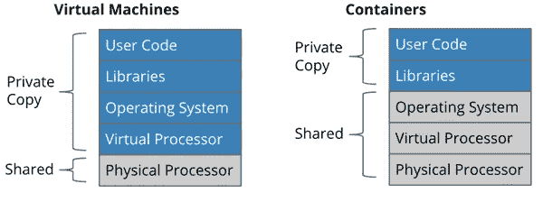
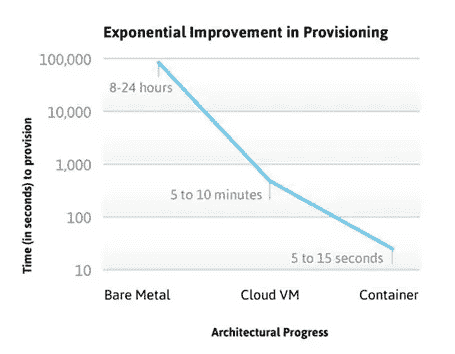

# 云容器技术:旧与新

> 原文：<https://itnext.io/cloud-container-technology-the-old-and-the-new-2a65ce6bd04d?source=collection_archive---------0----------------------->

## **云和虚拟化**

旧的和新的，这意味着什么？云作为一种主导技术的出现，基于其核心功能的充分利用，是平台场景中相对较新的事物。相比较而言，容器技术是一项相对古老的技术。云使用虚拟化作为一种手段，通过网络技术使应用程序可用。然而，这意味着建立一个完整的 OS(操作系统)。这是通过[虚拟机管理程序](http://www.ibm.com/developerworks/cloud/library/cl-hypervisorcompare/)完成的，因此需要适当的资源，这是对可能很少使用的巨大承诺。

可以想象，计算资源的最佳使用将需要提供商对这些资源进行适当的管理，并且可能达不到标准。各种不同的订阅方法以及公共云和私有云的使用方式都会受到影响。

另一方面，容器技术与云一起应用，可以更容易地提供应用程序大小的虚拟化。这意味着容器只包含应用程序及其所有依赖项、库和运行时环境。

## **云容器**

你们中的一些人可能会想，这与虚拟化有什么不同，为什么应用程序规模的虚拟化是一种优势？如前所述，正常的虚拟化要求每个提供的环境都有单独的虚拟机和操作系统。

但是容器化就不同了，因为容器本身是和其他容器一起运行在一个操作系统上的。这些容器可能都是不同的服务，但是它们共享基本的操作系统内核。容器可以有不同的内部环境，只要它们可以在它们所移植的操作系统上运行，这允许在计算资源的最佳使用上有很大的变化。最重要的是，在开发应用程序时，开发环境的基本组件可以在容器大小而不是整个虚拟机中进行虚拟化。

然而，移植容器既困难又容易，因为只要基本操作系统保持不变，容器就可以很容易地从一个环境转移到另一个环境。对于虚拟机，只要有正确的虚拟机管理程序，大多数虚拟机都可以在任何系统上运行，但它们需要更多的计算资源。

时任谷歌高级软件工程师的布伦丹·伯恩斯在谷歌博客上很好地展现了这些差异。他将计算资源分为私有资源和共享资源。正如我们所看到的，唯一被私有提供并与容器一起使用的是用户代码和库。这与使用虚拟机时私有提供的操作系统有很大的不同。

图 1 计算资源:虚拟机与容器

可以想象，这也会对资源调配产生严重影响。通过资源调配，当需要扩展服务时，共享的资源越多，需要调配的资源就越少。如果你看一下 linux 期刊上的[下图](http://www.linuxjournal.com/content/containers%2525E2%252580%252594not-virtual-machines%2525E2%252580%252594are-future-cloud?page=0,1)，你会看到裸机(即你个人电脑上的软件)配置、虚拟机上的云配置和容器中的云配置的时间对比。如您所见，云和容器之间的调配时间有很大不同，尤其是当您考虑在云环境中进行扩展时。更快的扩展意味着更短的客户等待时间和更少的付费服务使用。

图 2 虚拟化将配置与硬件部署分离开来。www.linuxjournal.com的容器将供应与操作系统部署和启动分离

到目前为止，安全问题的话题无疑已经进入了你的脑海，容器没有虚拟机应有的安全级别。一旦入侵者可以访问虚拟机或容器，访问许多不同的容器就相对容易了。这是因为操作系统和其他计算机资源是共享的，如 Brendan Burns 的例子所示。这可能会影响多个不同的功能和使用该服务的客户端。

对于通过虚拟机管理程序进行的普通虚拟化，只有虚拟机受到影响。然而，最近的发展表明，当在虚拟机上运行容器时，对虚拟机的任何攻击都是孤立的。容器的优点不会丧失，因为容器不会失去它们的便携性、应用程序大小的环境、资源的共享和多个不同的用户。然而，它们是孤立的，并获得了虚拟机所具有的优势。

## **利弊**

既然我们已经在很大程度上确定了容器和 VM 之间的重要区别，让我们总结一下优缺点。

## **当前利弊:**

*应用程序开发:*更适合应用程序开发，因为部分开发环境可以更容易地以容器格式提供，减少了错误和故障。使用容器测试不同版本也更容易，不需要不同的虚拟机。

*共享:*更多的资源共享的结果是只有智能部分的服务需要更少的资源和更有效的私有提供

*引导时间:*因为使用容器时更多的资源被共享，引导时间得到了显著的改善

*微服务:*当容器的提供者可以将应用程序拆分成微服务时，就可以扩展应用程序的某些部分，比如数据库。

## **目前的不利因素:**

*多功能性:*特别适合使用微服务的应用程序，因此这些应用程序可以被分成构建块。其他较大的整体应用可能不适合集装箱化。

*依赖关系:*因为容器依赖并共享操作内核和操作系统类型，所以在增加供应的同时也增加了对 it 的依赖。

*安全性:*因为容器共享大量的计算资源，包括操作系统，任何入侵都可能影响其他容器，因为当前的安全层处于操作系统级别。在 VM 上运行容器或者为容器添加更高级的安全性的未来发展可以解决这个问题。

*资源的扩展:*因为扩展资源以使用计算资源要快得多，也容易得多，所以需要密切关注容器资源的使用。

*容器管理:*因为云容器技术是一种相对较新的技术，所以容器管理工具并不多。也没有很多容器提供商可供选择。