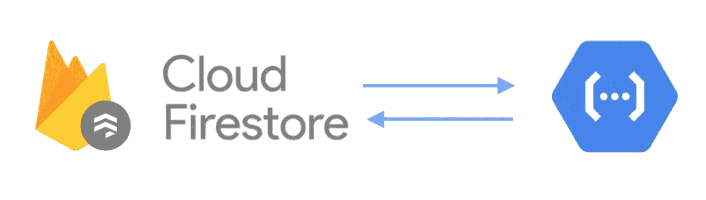
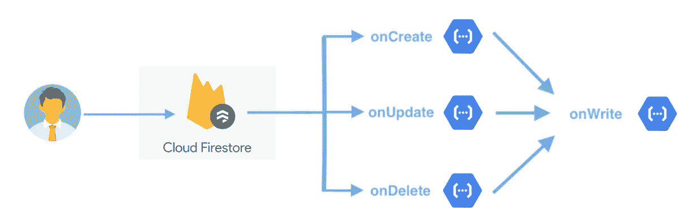

# Firebase 云功能— Firestore 触发器

> 原文：<https://itnext.io/cloud-functions-firestore-triggers-d6fa30169ec8?source=collection_archive---------2----------------------->

C loud Functions 是 Firebase 提供的一项功能，用于在 Google 基础设施上运行服务器代码，以响应由 Firebase 事件和 HTTPS 请求触发的事件。开发人员不必处理维护和可伸缩性问题。Firebase 会自动扩展计算资源，以匹配用户的使用模式。每个功能都在自己的环境中独立运行，并有自己的配置。开发人员只需编写业务逻辑，并让谷歌为我们处理服务器。

有很多可用的 Firebase 事件，其中之一是 Firestore 事件。一旦在特定集合中创建、更新和删除了任何文档，Firestore 就会通知云功能。它有助于在文档初始化时添加额外信息，在文档更新时验证信息，并在管理员/用户的信息被删除时通知他们。

实现并不难，但需要一些技巧。让我们看看这里！

# 简介

## 1.onCreate

一旦创建了特定集合中的新文档，就会触发`onCreate`(第 8 行的`fooCollection`)。回调包含一个`QueryDocumentSnapshot`和一个`EventContext`。可以从它们中检索文档 id 和文档数据，以便进一步检查(参见第 11 行到第 17 行)。

## 2.onUpdate

`onUpdate`在特定集合中的文档的字段被更新时被触发。它返回一个包含原始数据和新数据的`[*Change*](https://firebase.google.com/docs/reference/functions/cloud_functions_.change)<*QueryDocumentSnapshot*>`。

子集合文档中的更改不会触发其父文档的`onUpdate`事件。

> `onUpdate`当客户端使用完全相同的值更新文档时，不会触发事件。换句话说，只有当任何一个字段值更改为另一个值时，才会触发它。

## 3.onDelete

`onDelete`在删除单据时触发。语法与`onCreate`的语法相同。用例可以是使用 [Sendgrid](https://sendgrid.com/marketing/sendgrid-services-cro/?extProvId=5&extPu=49397-gaw&extLi=10112337553&sem_adg=102556643438&extCr=102556643438-437015015279&extSi=&extTg=&keyword=sendgrid&extAP=&extMT=e&utm_medium=cpc&utm_source=google&gclid=Cj0KCQjw7ZL6BRCmARIsAH6XFDI5ABmR9JmTDh92pb49DSe0NgOH9CzbNashbrySFvwjGduZXzLqTtoaAjNaEALw_wcB) 在管理员从系统中删除用户帐户后向用户发送电子邮件。

## 4.onWrite

onCreate:Google . firestore . document . create on update:Google . firestore . document . update on delete:Google . firestore . document . write

当`onCreate`、`onUpdate`、&、`onDelete`中的任意一个被触发时，就会触发`onWrite`。为了区分它们，可以使用`eventType`(参见第 7 行到第 12 行)。可能的值可以是:

1.  onCreate: `google.firestore.document.create`
2.  更新日期:`google.firestore.document.update`
3.  onDelete: `google.firestore.document.delete`

为防止重复处理，不建议同时执行`onWrite`和`onCreate`、`onUpdate`和`onDelete`中的任何一个。

# 本地 Firebase 仿真器 UI

Firebase 将在 2020 年发布一个本地 Firebase 模拟器 UI，它可以同时模拟云功能和 Firestore。因此，在部署到 Firebase server 之前，您可以在本地测试所有触发器。更多信息见下面的文章。

 [## 云功能— Firestore 触发器

### 云功能是 Firebase 提供的一个特性，用于在 Google 基础设施上运行后端代码，以响应…

itnext.io](/cloud-functions-firestore-triggers-d6fa30169ec8) 

# 限制和技巧

1.  每个云 Firestore 触发器的超时时间只有 10 秒
2.  不保证触发的顺序。快速变化会以意想不到的顺序触发函数调用。
3.  在云函数中执行的读写不受安全规则的控制，它们可以访问数据库的任何部分。

# 阅读材料:

## 1.云 Firestore 触发官方文档

 [## 云 Firestore 触发器| Firebase

### 通过云功能，您可以在云 Firestore 中处理事件，而无需更新客户端代码。您可以制作云…

firebase.google.com](https://firebase.google.com/docs/functions/firestore-events) 

# 2.幂等函数

 [## 云函数专家提示:构建幂等函数

### 编辑描述

cloud.google.com](https://cloud.google.com/blog/products/serverless/cloud-functions-pro-tips-building-idempotent-functions) 

欢迎您通过[Twitter @ my rik _ chow](https://twitter.com/myrick_chow)关注我，了解更多信息和文章。感谢您阅读这篇文章。祝您愉快！😄