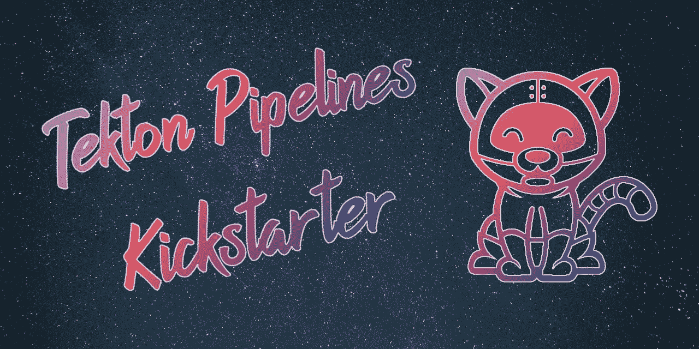
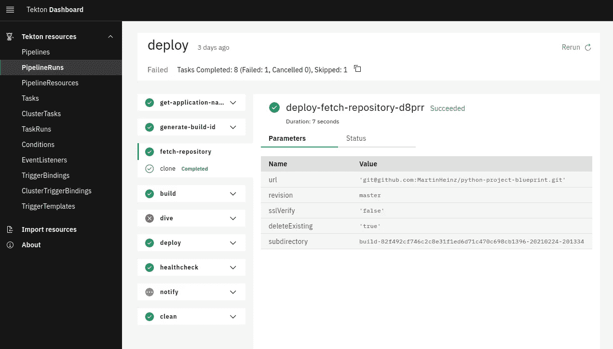

# 使用 Tekton 的云原生 CI/CD—奠定基础

> 原文：<https://itnext.io/cloud-native-ci-cd-with-tekton-laying-the-foundation-a377a1b59ac0?source=collection_archive---------5----------------------->

## 借助 Tekton Pipelines 在 Kubernetes 上启动云原生 CI/CD 之旅的最简单方式…

我们都知道每一个严肃的项目都需要 CI/CD，我很确定没有必要解释为什么。但是，在决定在哪里构建 CI/CD 时，有很多工具、平台和解决方案可供选择。您可以选择 Jenkins、Travis、CircleCI、Bamboo 等等，但是如果您正在为运行在 Kubernetes 上的云原生应用程序构建 CI/CD，那么使用适当的工具同时运行云原生 CI/CD 是有意义的。

允许您在 Kubernetes 上本机运行 CI/CD 的一个解决方案是 [Tekton](https://tekton.dev/) ，因此在本文中，我们将开始关于使用 Tekton 构建 CI/CD 的系列文章，从 Tekton 的介绍、安装和定制开始，开始我们在 Kubernetes 上的云本机 CI/CD 之旅。

*TL；DR:在 https://github.com/MartinHeinz/tekton-kickstarter***可以获得使用 Tekton 启动您的 CI/CD 所需的所有资源、脚本和文件。**

# *这是什么？(何必呢？)*

*顾名思义，Tekton 是云原生 CI/CD 工具。它最初是由谷歌开发的，被称为 *Knative* pipelines。它在 Kubernetes 上作为一组定制资源(CRD)运行，如*管道*或*任务*，其生命周期由 Tekton 的控制器管理。它原生运行在 Kubernetes 上，这使得它非常适合管理/构建/部署也部署在 Kubernetes 上的任何应用程序和资源。*

*这表明它适合管理 Kubernetes 工作负载，但是为什么不使用其他更流行的工具呢？*

*Jenkins、Travis 或 Bamboo 等常用的 CI/CD 解决方案不是为在 Kubernetes 上运行而构建的，或者缺乏与 Kubernetes 的适当集成。这使得部署、维护和管理 CI/CD 工具本身以及使用它来部署任何 Kubernetes-native 应用程序变得困难和/或令人烦恼。另一方面，Tekton 可以很容易地作为 Kubernetes 运营商与所有其他容器化应用程序一起部署，每个 Tekton 管道都是另一个 Kubernetes 资源，其管理方式与传统的 *Pods* 或*部署*相同。*

*这也使得 Tekton 能够很好地与 GitOps 实践合作，因为您可以将所有的管道和配置放在 git 中进行维护，这对于上面提到的工具中的至少一个来说是不可能的(是的，我非常讨厌 Jenkins)。资源消耗也是如此——考虑到整个 Tekton 部署只是几个 pod——与其他 CI/CD 工具相比，当管道不运行时，消耗的内存和 CPU 非常少。*

*也就是说，很明显，如果您在 Kubernetes 上运行所有的工作负载，那么非常建议为您的 CI/CD 使用一些 Kubernetes 本地工具。泰克顿是唯一的选择吗？不，当然，你可以使用其他工具，其中之一是 *JenkinsX* ，这是一种*固执己见的方式，通过 Kubernetes 进行持续交付，即本地*。它打包了许多工具，如果您对替代工具没有任何强烈的偏好，这可以让您的生活更轻松，但如果您想要定制您的技术堆栈，这也可能非常烦人。不过，JenkinsX 在后台使用 Tekton，所以您也可以学习使用 Tekton，然后决定是否还需要 JenkinsX 提供的所有其他组件。*

*另一个选择是*Spinnaker*——这是一个已经存在很长时间的云计算解决方案。它使用插件来集成各种提供商，其中之一就是 Kubernetes。然而，它不是一个构建引擎——它不提供工具来测试您的代码、构建您的应用程序映像或将它们推送到 registry，对于这些任务，您仍然需要一些其他 CI 工具。*

*现在让我们仔细看看 Tekton 由什么组成——Tekton 的核心仅由几个*customresourcediations(CRDs)*组成，它们是*任务*和*管道*，充当*任务运行*和*管道运行*的蓝图。这四个(加上其他几个即将被否决或现在不相关的)足以开始运行一些管道和任务。*

*然而，这通常是不够的，考虑到大多数设置需要构建、部署——因此——以及由一些事件触发的管道。这就是为什么我们还安装了提供额外资源的 *Tekton 触发器*，即 *EventListener* 、 *TriggerBinding* 和 *TriggerTemplate* 。这三个资源为我们提供了监听特定事件的方法——比如(GitHub) webhooks、 *CloudEvents* 或 cron jobs 发送的事件——并启动特定的管道。*

*最后一个也是非常可选的组件是 *Tekton Dashboard* ，这是一个非常简单的 GUI，但也是检查所有 CRD 的非常方便的工具，包括任务、管道和触发器。它还允许搜索和过滤，这在查找*任务运行*和*管道运行*时会很有帮助。您还可以使用它从现有任务和管道创建任务运行和管道运行。*

*所有这些部分都由控制器部署和 pod 管理，它们负责上述 CRD 的生命周期。*

# *设置事物*

*考虑到 Tekton 由多个组件组成，安装可能会有点复杂，并且可以通过多种方式完成。通常您至少需要安装管道和触发器，最明显的方法是使用原始的 Kubernetes 清单来安装，但是您可以选择更简单的方法，从 OperatorHub 安装 Tekton Operator，它已经包含了所有的部分。作为先决条件(对于任何安装方法)，我们显然需要一个集群，这里我们将使用*KinD(Docker 中的 Kubernetes)*进行本地管道开发。我们将使用以下自定义配置，因为我们需要部署入口控制器并暴露端口 80/443，以便能够访问 Tekton 触发器事件监听器。*

*我们可以使用以下命令创建集群:*

*现在，对于 Tekton Pipeline 和触发器的实际部署，我提到了通过 Tekton Operator 进行安装，这可能是启动和运行一切预配置的最快和最好的方式，但是该 Operator(在撰写本文时)缺乏任何实际的文档，因此您需要挖掘大量内容才能找到关于如何工作的任何解释，这对我个人来说不是大问题。然而，真正的问题是 OperatorHub 中的操作程序不是最新的，我找不到当前的版本/映像，这使它多少有些无用。我敢肯定，当 Tekton Operator 稍微成熟一点时，这种情况会有所改变(所以请关注它的[库](https://github.com/tektoncd/operator))，但在此之前，应该使用其他安装选项。*

*如果您碰巧在 OpenShift 上运行，您可以使用的选项是 *Red Hat Pipeline Operator* ，它也是——Kubernetes Operator，但在本例中是由 Red Hat 管理并为 OpenShift 定制的。只需在 web 控制台中点击几下就可以安装它，因此如果您可以访问 OpenShift cluster，那么您应该尝试一下。使用它的一个缺点是发布周期较慢，所以你将被迫使用不是最新版本的 Tekton。*

*如果 OpenShift 不是一个选项，或者您只想在 Kubernetes 上运行，那么使用原始清单进行安装就可以了，这是如何做到的:*

*如果您还想在此安装中包含 Tekton Dashboard，则需要再应用一组清单:*

*除此之外，我们还需要额外的*入口*才能到达仪表板:*

*默认情况下，以前应用的仪表板资源是在`tekton-pipelines`名称空间中创建的，并且包括使用端口`9097`的名为`tekton-dashboard`的*服务*，这是上面的入口中引用的值。这个入口也有重写规则，在`/dashboard/...`路径而不是`/`显示仪表板。这是因为我们希望使用默认的`/`(根)路径作为事件监听器的 webhook(稍后讨论)。*

*要验证仪表板是否真的是活动的，一切都在运行，您可以浏览到`localhost/dashboard/`(假设您使用的是*类*)，您应该会看到类似这样的内容(减去实际的管道):*

**

*仪表盘*

*如果所有这些设置看起来太费力，那么你可以抓取`[tekton-kickstarter](https://github.com/MartinHeinz/tekton-kickstarter)` [库](https://github.com/MartinHeinz/tekton-kickstarter)并运行`make`，你将在一分钟内准备好以上所有内容。*

*部署完成后，所有(非常)基本的部分都已启动并运行，所以让我们在 CLI 中四处看看我们实际部署了哪些命令…*

# *探索自定义资源*

*如果您遵循了上面的步骤(或者只是使用了启动存储库中的`make` target)，那么现在您的集群中应该有相当多的新资源了。Tekton 的所有组件将位于`tekton-pipelines`名称空间中，并应包括以下内容:*

*这些包括所有的部署、服务以及 autoscaler，它们有助于在请求数量增加的情况下提高可用性。如果需要 HA，那么你也可以查看[文档部分](https://github.com/tektoncd/pipeline/blob/master/docs/install.md#configuring-high-availability)，它解释了如何为 HA 配置 Tekton。*

*除了上面显示的资源，您还可以在`default`名称空间中找到事件监听器及其资源。这些可以与核心组件共享名称空间，但是像这样划分它们允许您根据它们所用于的应用程序/项目来划分管道及其 webhooks:*

*Tekton 的安装还带来了几个 CRD，用于管理所有任务、管道和触发器:*

*您可以使用这些 CRD 通过`kubectl get`或`kubectl describe`列出并检查任务和管道。*

*对于 Kubernetes 的每个用户来说，与资源交互的自然方式是使用`kubectl`，但 Tekton 也有自己的 CLI 工具，名为`tkn`。你可以从这个[发布页面](https://github.com/tektoncd/cli/releases/tag/v0.16.0)下载。*

*这个 CLI 允许您与 Tekton 资源进行交互，而不必处理 CRD。例如，您可以列出或检查管线:*

*除了检查资源之外，您还可以使用它来启动任务运行或管道运行，并随后读取日志，而不必查找各个 pod:*

*正如您在上面看到的，如果您最初没有指定参数，它甚至会提示您输入参数！*

*不过，有一件事让我非常恼火，那就是这个 CLI 工具与`kubectl`相比使用的参数顺序颠倒了。使用`kubectl`命令是`kubectl <VERB> <RESOURCE>`而使用`tkn`命令是`tkn <RESOURCE> <VERB>` -一个对其他非常方便的工具的小挑剔。*

# *定制一切*

*我们已经完成的安装为所有配置提供了一些合理的默认值。这些可以稍加改变，以更好地满足您的需求，并简化事情。我们将了解 2 个*配置图*:*

*第一个是`config-defaults`，顾名思义，它为管道和任务执行设置默认值。这些包括默认超时、*服务账户*或节点选择器。这个 ConfigMap 最初还包括`_example`键，它有所有可能的(注释掉的)选项及其描述，所以当有疑问时，只需运行`kubectl get cm config-defaults -n tekton-pipelines -o=jsonpath='{ .data._example }'`。*

*另一个可用的配置图是`feature-flags`，它允许您打开/关闭一些 Tekton 功能。大多数情况下，您可以保留默认值。我只修改了`require-git-ssh-secret-known-hosts`，我更喜欢打开它，要求在使用 SSH 验证 git 时包含`known_hosts`。要查看当前设置，您可以运行`kubectl get cm feature-flags -n tekton-pipelines -o=jsonpath='{.data}' | jq .`。*

*如果您想要这两种配置的完整定制版本，您可以在我的库[这里](https://github.com/MartinHeinz/tekton-kickstarter/tree/master/config)获取它们。如果您在这个存储库中使用了`make`脚本来设置 Tekton 环境，那么这些已经在安装过程中应用了。*

*除了这些全局缺省值之外，您可能还想设置其他配置。其中最重要的是向 git 认证的 SSH 密钥。这在包含 SSH 私钥的 Kubernetes *Secret* 和`base64`格式的`known_hosts`文件中进行配置:*

*这个秘密还包括 Tekton 注释(`tekton.dev/git-*`)，以使它知道应该使用它来对指定的提供者进行身份验证。*

*另一个重要的秘密是注册表凭证，它允许您推送 Docker 图像(或从私有注册表中拉出)。对于这一个，我们使用`dockerconfigjson`秘密类型，并且我们再一次用你的提供者的注册 URL 指定 Tekton 注释:*

*然后，这两者都需要添加到任务和管道将使用的 ServiceAccount 中。这应该是之前在`config-defaults`配置图中指定的 ServiceAccount。*

*说到 service accounts——您需要给它足够的权限来与管道交互，并根据管道将要做的事情有选择地添加额外的权限。例如，如果您想运行`kubectl rollout`，那么您的 ServiceAccount 将需要相应的权限。*

*ServiceAccount 和 rational role 以及 RoleBindings 都可以在这里的库[中获得。](https://github.com/MartinHeinz/tekton-kickstarter/blob/master/misc/sa.yaml)*

*最后但同样重要的是，我还建议设置 *LimitRange* 以确保你的每个任务都获得足够的 CPU 和内存，同时不会消耗太多。确切的值取决于您的使用情况，但这里显示了一些合理的默认值。*

*至此，我们已经为 Tekton 的安装做好了充分的准备和定制，包括所有组件及其配置，准备运行一些管道！*

# *结论*

*Tekton 是一个多功能的工具，可以变得非常复杂，因此一篇短文肯定不足以详细介绍它的每一部分。这一介绍应该足以让您开始并运行所有的配置。在本系列的后续文章中，我们将探索如何使用和构建您自己的定制任务和管道，处理事件处理 HTTP 事件和用 cron 调度等等。因此，请继续关注下一篇文章，同时您可以先睹为快地浏览一下 [tekton-kickstarter 资源库](https://github.com/MartinHeinz/tekton-kickstarter)中的文件，这里已经提供了本文和后续文章中的所有资源。如果你有一些反馈或建议，请随时在知识库中打开一个问题，或者如果你喜欢它的内容，就开始讨论。😉*

**本文原帖*[*martinheinz . dev*](https://martinheinz.dev/blog/45?utm_source=medium&utm_medium=referral&utm_campaign=blog_post_45)*

* [## 将任何 Python 项目部署到 Kubernetes

### 是时候深入 Kubernetes，使用这个成熟的项目模板将您的 Python 项目带到云中了！

towardsdatascience.com](https://towardsdatascience.com/deploy-any-python-project-to-kubernetes-2c6ad4d41f14)  [## 用 seccomp 强化 Docker 和 Kubernetes

### 您的容器可能不像您想象的那样安全，但是 seccomp 配置文件可以帮助您解决这个问题…

itnext.io](/hardening-docker-and-kubernetes-with-seccomp-a88b1b4e2111)  [## 使用 Python 调度各种循环作业

### 让我们探索一下运行 cron 作业、延迟任务、重复任务或任何其他计划作业的所有库…

towardsdatascience.com](https://towardsdatascience.com/scheduling-all-kinds-of-recurring-jobs-with-python-b8784c74d5dc)*