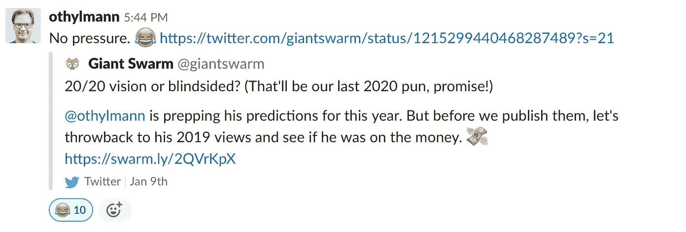

# 2020 年云原生预测

> 原文：<https://itnext.io/cloud-native-predictions-for-2020-20aa6a2fec01?source=collection_archive---------5----------------------->

两年前，我写了关于[库伯内特](https://blog.giantswarm.io/kubernetes-and-giantswarm-in-2018/)的预测，并且完全正确，这显然意味着我完全有动力再写一篇，题为[“2019 年的库伯内特状态”](https://blog.giantswarm.io/the-state-of-kubernetes-2019/)。所以，我现在被鼓励为 2020 年再写一篇。

*所以，首先要做的是。我去年过得怎么样？*

# 1.大公司会在 Kubernetes 上加倍下注

我想我们可以响亮地说“是！”

虽然还没有完成，但是 [Suse 停止了他们的 Openstack 产品](https://www.suse.com/c/suse-doubles-down-on-application-delivery-to-meet-customer-needs/)，VMWare 正在重新设计其 vSphere 产品，以真正成为一个[增强的 Kubernetes](https://www.infoworld.com/article/3433942/vmware-vsphere-goes-kubernetes-native.html) ，云提供商正在相互超越，以拥有[他们自己的 Kubernetes 产品](https://siliconangle.com/2019/12/11/aws-ups-game-battle-edge-reinvent/)。我的意思是，你现在可以让 [Fargate 成为你与 Kubernetes](https://aws.amazon.com/blogs/aws/amazon-eks-on-aws-fargate-now-generally-available/) 的接口。

# 2.重点将放在第 2 天的操作上

对于这一点，我很遗憾没有明确的证据，除了[中间层更名为 D2iQ](https://siliconangle.com/2019/11/25/qa-d2iq-focuses-managing-kubernetes-day-2-operations-kubecon/) 来关注 Kubernetes 的第二天运营。

好吧，你必须承认，这是一个很大的告诉，那天 2 *是*重要。我还可以补充一点，我们看到了更多(受欢迎的)竞争，Gartner 告诉我们，第 2 天变得越来越重要。当一家公司更名为 Day 2iQ 时，我认为我的案例已经结束，事实上它最初并不做 Kubernetes，而是建立在一项竞争技术上。

# 3.大数据将转移到 Kubernetes

我会说，这必须等到 2020 年，即使你可以在圣地亚哥举行的 KubeCon 2019 上忙于大数据和机器学习演讲。

毫无疑问，迁移已经开始，我们正在与那些已经带着大数据堆栈迁移到云的客户进行对话，他们现在希望将其迁移到 Kubernetes，以获得更大的灵活性。我可以举出谷歌用 Kubernetes 代替 YARN 来进行 Spark 管理，或者 T2 Tigera 关于大数据和 Kubernetes 的帖子，或者 T4 的微软 SQL Server 大数据集群实际上在 Kubernetes T5 上运行，但这些都是间接的。

# 4.控制平面的崛起

我认为这是另一个明显的胜利。每个人都会运行多个 Kubernetes 集群，我们从一开始就这么说。

cluster API 做了很多出色的工作，我们实际上与不同的方面举行了不同的(定期)会议来进行协作。它还没有完全达到我们需要的程度。然而，它正在实现，未来看起来是光明的。

除此之外，您可能听说过现在还有控制平面或“多集群功能”，这是一种围绕 [Openshift 4](https://blog.openshift.com/introducing-red-hat-openshift-4/) 、 [vSphere Project Pacific](https://blogs.vmware.com/vsphere/2019/08/introducing-project-pacific.html) 及其 [Tanzu SaaS 控制平面](https://blogs.vmware.com/cloudnative/2019/08/26/vmware-tanzu-mission-control/)轻松启动集群的方式，用于管理集群和应用。

# 5.扩展 Kubernetes API

这个问题有多个部分。首先，这是关于 CRDs 接管，是的，如果你想听蒂姆·霍金的意见，一切都将成为 CRD。这就解决了。

但是更详细一点，我把时间交给我们自己的 [Puja Abbassi](https://twitter.com/puja108) ，他实际上在 KubeCon 做了一个关于 CRDs 的[演讲:](https://www.youtube.com/watch?v=DUe_8nf42Ik)

“CRDs 的兴起已经成为一个话题，在最近的 KubeCons 上，通过 CRD 和运营商/控制者的相关谈话已经可以感觉到这一点。更重要的是，我们已经看到上游扩展，如 [*服务代理 API*](https://kubernetes.io/docs/concepts/extend-kubernetes/service-catalog/) *从聚合 API 转移到 CRDs，可选的云提供商服务集成也是如此(例如* [*AWS 服务运营商*](https://github.com/aws/aws-service-operator-k8s) *)。在 main upstream 附近，许多当前的扩展都在它们的下一个版本中，如果可能的话，是基于 CRDs 构建的。最突出的是* [*集群 API*](https://cluster-api.sigs.k8s.io/) *项目，他们和我们一样，是复杂的互联多 CRD 和多控制器系统的先驱，这些系统一起工作以建立一个复杂的结构，例如在这种情况下完整的 Kubernetes 集群。看看前面提到的多集群控制平面，Openshift v4 和 VMware Project Pacific 都非常依赖 CRD 和定制控制器。我不认为我们会冒险说 Kubernetes 的几乎所有扩展都将使用 CRDs 作为主要的 API 组件来构建，无论是核心的扩展还是基于 Kubernetes 的面向用例的开发人员平台。还记得乔·贝达说的 Kubernetes 是一个搭建平台的平台吗？’”*

老实说，我需要兜一圈，说事情正在专业化，因此，它们不再以极快的创业速度发展。

我去年说过的许多话仍然适用。更多 CRD、更多 ClusterAPI、更多大数据和更多第 2 天操作。我可以补充一点，人们会理解管理 Kubernetes 并不适合胆小的人，服务网格和边缘集群将继续是应该做的事情，人们会理解为什么我们在 Giant Swarm 如此关注安全性。但所有这一切都很难预测或奇怪，你会说；“哇，还没想到呢。”

所以我们到了:

# **1。Pivotal 平台将会消亡，VMWare 将专注于本地 Kubernetes**

诚然，2020 年在这里可能太短暂了，但我们都知道这只是时间问题。

对 VMWare 的整个收购只是一场控制游戏，让他们可以利用 Pivotal 公司和 Pivotal 平台做更多的事情，并在它慢慢消亡的时候让事情看起来不错。我确信我们至少会看到巨大的收入下降。如果他们再给我们看数字的话。

同时，我也希望一些对 Kubernetes 有益的东西能够成为伟大的开源项目。Pivotal 平台的真正用途是一个非常严格的部署系统，以可控的方式管理大量开发人员。这很可能仍然需要，我们将看到 OPA 和其他工具将如何工作或在这里长期可用。

# **2。至少会有两项重大收购**

随着 Kubernetes 领域的升温，将会有一个持续的整合，因此，在 Kubernetes 领域至少会有两个主要的早期参与者被收购(1-2)或被收购(2-3)。

许多公司仍在努力寻找自己的商业模式，但他们有充足的风投资金和优秀的人才。让我们稍微限定一下。一项重大收购意味着超过 5 亿美元，并且该公司已经在 KubeCons 上存在了几年——如果不是赞助该活动，至少会参加。收购可能会更便宜，也可能不会，但显然主要是为了车队。

# **3。Redhat 将宣布完全兼容 K8s 的 Openshift 版本**

虽然他们已经或多或少地兼容，但与本地 Kubernetes 仍有差异，这意味着标准的舵图通常不工作。

Redhat 有一个特别的 istio 版本，非常特别…

嗯，它确实实现了对上游的更改，这些更改是使 istio 在 Openshift 中工作所必需的。客户会开始抱怨，Redhat 需要改变。但以前的 OpenShift 是 OpenShift，现在它在很大程度上是一个打包的 Kubernetes，随着构造的集成变得更加如此。也许旧的已经死了。

*这就是我对 2020 年的预测。你的呢？*

由 [Oliver Thylmann](https://twitter.com/othylmann) 联合创始人和[巨型蜂群](https://www.giantswarm.io/)的首席运营官撰写

 [## 奥利弗·蒂尔曼

### 奥利弗·蒂尔曼的最新推文(@othylmann)。父亲，连续企业家，开发者耳语者和目前…

twitter.com](https://twitter.com/othylmann)