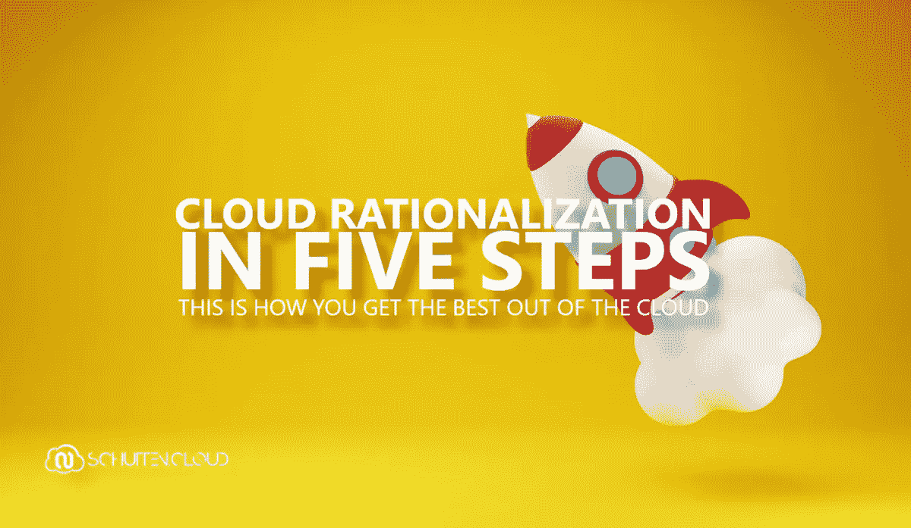
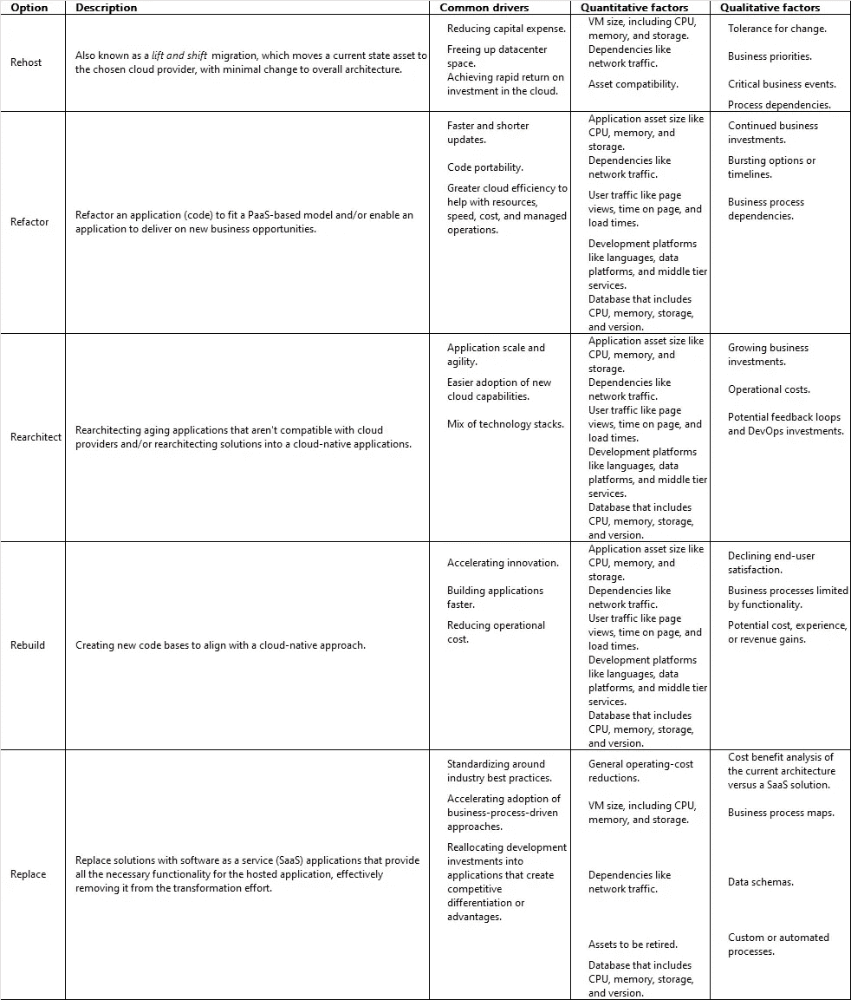
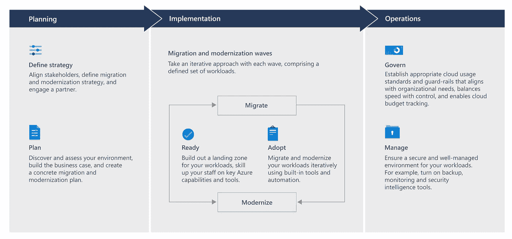
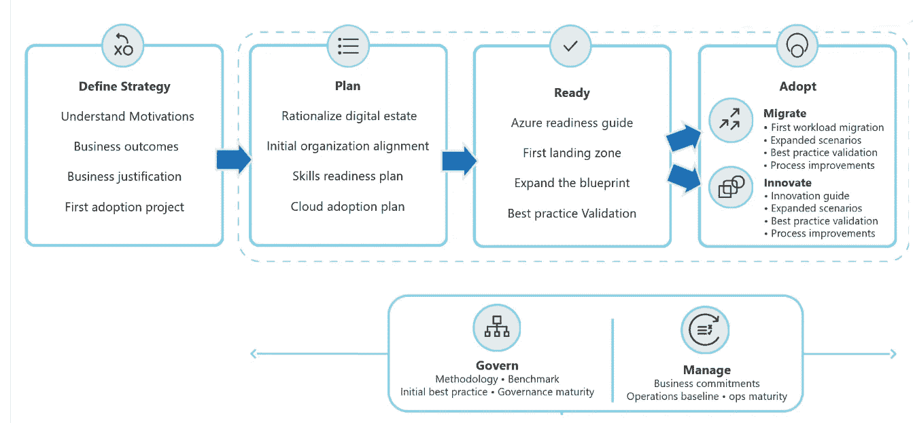

# 云合理化的 5 个步骤:这就是如何充分利用云！

> 原文：<https://itnext.io/cloud-rationalization-in-5-steps-this-is-how-you-get-the-best-out-of-the-cloud-106047e5581e?source=collection_archive---------3----------------------->

在这篇博客中，我将大致解释什么是云合理化，为什么它是数字化转型或云采用的重要组成部分，并且我将帮助您开始云合理化。

# 什么是云合理化

数字化转型是许多组织的首要任务，云的采用与这一转型密不可分。这对人员、流程和技术都有影响。更奇怪的是，许多 It 组织主要关注技术，而没有考虑在迁移和现代化战略中采用云的预期业务成果和动机。虽然云合理化当然应该考虑目标平台的能力和不可行性以及兼容性，但这主要是一种战略考虑。

云合理化是任何数字化转型计划和云采用计划不可或缺的一部分。云采用计划将云采用战略的远大目标转化为切实可行的计划。云采用战略通常源自业务案例，包括财务和技术考虑因素、动机和预期结果，并以此来衡量项目的合理性。云合理化是评估资产的过程，以确定迁移或更新云中每个资产的最佳方式，与云采用战略密切相关。

## 合理化的 Rs

网上流传着几种合理化选项的定义。这里列出的合理化的五个 R 描述了最常见的合理化选项和微软描述的选项:

合理化的五个 r。云

使用的其他定义在大多数情况下指的是上述选项。以下是一些合理化选项的概述，这些选项基本上意思相同，但使用了不同的名称:

*   **重新平台:**重新平台在大多数情况下与重建相同。
*   **回购:**回购在大多数情况下与替换相同。
*   **Retain:** Retain 是此时不执行应用程序迁移的选项。原因可能是缺少重要信息、受到其他因素的阻碍，或者应用程序符合当前的要求。
*   **Retire:** Retire 是应用程序被明确淘汰的选项。
*   **Reimagine:** Reimagine 在大多数情况下与 Rearchitect 相同。

## 云合理化的陷阱

在分析工作负载和相关资产以及深入了解当前数字资产之前，不可能做出合理化决策。合理化决策与目标和预期结果密切相关。例如，退出数据中心和减少资本投资的动机可能很适合“主机更换”方法，但该方法本身不会(直接)降低供应商或技术复杂性、节约成本或提高业务灵活性。实现这些目标需要更多的努力。“替换”、“重构”或“重建”方法可能更适合某些工作负载。

*你的迁移和现代化之旅的阶段由* [*微软*](https://www.microsoft.com/) *上* [*如何用云迁移和现代化|微软 Azure*](https://azure.microsoft.com/migration/migration-journey/#how-to-migrate) *。*

云合理化的另一个陷阱是假设必须在迁移或现代化开始之前对整个环境做出合理化决策。微软的经验法则是，每个应用程序执行一次分析通常需要 40-80 个 FTE 小时。这意味着在进行迁移或现代化之前，50 个应用程序的应用环境需要 2000-4000 FTE 小时。比如我记得荷兰国家警察的[“攻击程序信息设施”。在该计划开始时(2010 年)，该环境包含大约 1200 个应用程序。这将导致 48 000 至 96 000 个工作小时的工作量；这意味着需要 24 到 48 名全职员工在一年内完成分析。在这段时间里，很多事情都会发生变化。因此，建议采用增量方法，并针对每个应用程序或工作负载执行云合理化。](https://zoek.officielebekendmakingen.nl/blg-828214.pdf)

# 云合理化的 5 个步骤

当涉及到对您的数字资产和云合理化的全面分析时，它通常发生在 5 个步骤中:发现、跟踪、分析、依赖关系映射和报告。以下部分描述了这些步骤的输入、处理和输出，在某些情况下，还描述了一些支持这些步骤的工具。互联网上有许多来自不同提供商的工具。由进行分析的人来选择正确的工具。该分析导致对做出合理化决策所需的目标、挑战、资源和成本的概述。

## 先决条件

如前所述，动机和预期的业务成果导致了数字化转型计划和/或云采用计划。所选择的(云)策略是其中的一个基本部分。用于 Azure 的微软云采用框架描述了构建商业案例和云策略的详细例子和反模式。前提条件是在做出合理化决策之前已经采取了这些步骤；仅仅是因为这些决策必须基于之前的战略选择。

*云采用框架的生命周期由* [*微软*](https://www.microsoft.com/) *上* [*微软面向 Azure 的云采用框架文档—云采用框架|微软文档*](https://docs.microsoft.com/azure/cloud-adoption-framework/overview) *。*

## 第一步。发现

这一切都始于清点和衡量当今组织拥有的数字资产和资产。数字资产由虚拟机(VM)、服务器、应用程序、数据等资产组成。如何衡量数字资产取决于期望的业务成果。

*   主要寻求优化成本、运营流程、敏捷性或运营的其他方面的组织关注虚拟机、服务器和工作负载。
*   希望实现以客户为中心的转变的组织关注支持客户的应用程序、API 和事务性数据。
*   专注于推出新产品或服务的组织关注整个组织的数据孤岛，以构建强大的数据基础。
*   优先考虑运营稳定性的组织需要将此作为重点领域，并衡量业务连续性、灾难恢复以及工作负载和资产的可靠性。

组织通常并行完成所有这些转换。必须根据之前制定的云战略来确定优先级。请记住，采用迭代方法是最佳实践。这就是为什么拥有清晰的云战略是所有云采用工作的先决条件。当您了解最重要的转型形式时，数字遗产规划将变得更容易管理。通常可以在 CMDB 数据库或 IT 电子表格中找到某种形式的库存。如果您的组织中没有数字资产的清单，那么您需要以自动方式或手动方式建立一个清单。可以支持您的发现工作的工具示例有 [Azure Migrate](https://aka.ms/AzureMigrate) 、 [Lansweeper](https://www.lansweeper.com/) 、[网络安全管理软件产品](https://www.solarwinds.com/server-application-monitor/use-cases/it-inventory-management)，或者市场上的其他库存和资产管理软件。清单很少在第一次迭代中完成。因此，建议利益相关者和高级用户对清单进行验证。

当清单完成时，它提供了一个组织拥有的当前数字资产和所有资产的概述。其呈现形式取决于进行盘点的偏好，但一些示例是 CMDB 数据库、IT 电子表格和/或架构图。

## 第二步。跟踪

下一步是根据清单进行合理化决策的第一次选择。一些合理化选项可以立即划掉。通过减少潜在结果的数量，更容易对资产的未来状态做出初步决策。当您减少选择时，您也减少了在早期阶段向企业提出的问题的数量。应用程序或工作负载的构成、兼容性和终止支持等方面在此扮演着重要角色。一些例子如下:

*   不再受应用程序供应商支持的单一应用程序不太可能符合“重建”或“重新架构”选项的条件。
*   安全更新不再可用且不再受支持的过时操作系统上的工作负载不符合“主机更换”选项的条件。
*   一个业务关键型应用程序最近在定制方面投入了大量资金来支持特定的业务模型和流程，可能不符合“替换”选项的条件。

首选是将所有合理化选项减少到两个剩余选项，这两个选项需要进一步调查和分析。例如，如果选项仅限于主机更换或替换，那么在最初的合理化过程中，企业只需要回答一个问题，即是否替换资产。一个可以帮助跟踪和分析应用合理化工作的强大工具是 [CAST Highlight](https://www.castsoftware.com/products/highlight) 。市场上有其他工具支持这些工作，但 [CAST Highlight](https://www.castsoftware.com/products/highlight) 是其中一个更知名、更成熟的工具。

## 第三步。分析

在此步骤中，应进一步分析[定量和定性因素](https://schutten.cloud/post/cloud-rationalization-in-5-steps#the-rs-of-rationalization)，以便做出合理的合理化决策。除了这些因素之外，还需要考虑工作负载或应用程序的使用(预测)、成本的优化以及许可证的提供。分析应得出剩余合理化选项的结果，查看这些选项的最终状态:

*   选择与推动云采用的动机有什么关系，预期的业务成果是否正在实现？
*   定性因素和定量因素有什么区别？
*   预期成本是多少(达到最终状态所需的投资以及在预定义的时间段内预期的总拥有成本)？

这种分析意味着需要从数量上(基于实际指标和收集的数据)和质量上(通过与业务和应用程序所有者讨论季节模式、预期使用等)来查看预期使用情况。).各种监控工具对这种分析非常有帮助。此外, [Azure Migrate](https://aka.ms/AzureMigrate) 是收集这种定量数据的有用工具，它可以立即提出可能的优化建议(所有这些都取决于合理化选项)。

要计算所需投资，您可以使用[总拥有成本(TCO)计算器](https://azure.microsoft.com/pricing/tco/)、 [Azure 定价计算器](https://azure.microsoft.com/pricing/calculator/)，或第三方工具，如[cloud lab 智能计算器](https://www.thecloudlab.com/)。

## 第四步。依赖映射

下一步涉及提供对依赖关系的深入了解并缓解任何问题。这些依赖关系可能存在于多个领域，例如:

*   多层应用程序，其中解决方案由前端层(web)、中间层(处理)和后端(数据库)组成。根据合理化选项的不同，特定的迁移或实施方法和顺序可能是先决条件或更符合逻辑的。
*   系统集成，应用程序或工作负载相互集成以创建一个或多个业务流程。
*   其他依赖性，例如连通性。

它高度依赖于相关的应用程序或工作负载。之前的清点、分析以及与业务和应用程序所有者的对话必须使这些透明化。

例如，缓解措施可以是一系列迁移和现代化措施、联合迁移和/或现代化，或者是两阶段方法，其中在进行现代化之前首先执行主机更换。

## 第五步。报告

最后，编写良好可靠的报告并将其提交给决策机构以实现云合理化非常重要。如果一个应用程序或工作负载可能有多个场景，那么这些场景必须彼此相邻放置。必须列出其余选项的优缺点、预期结果和相互差异，以便做出决定。

所有上述工具都有助于实现这一点，并且每个工具都提供了与报告相关的信息。为了支持一个[福利审查计划](https://prince2.wiki/management-products/benefits-management-approach/)，像 [AppDynamics](https://docs.microsoft.com/azure/cloud-adoption-framework/digital-estate/app-dynamics) 这样的工具是天赐之物。对于大型数字资产，建议使用类似的支持工具，以便对所有不同的应用程序和工作负载保持控制和洞察。它可能与较小的数字产业不太相关。

# 结束语

这篇博客文章解释了什么是云合理化，为什么它很重要，以及您在哪些步骤中做出合理化决策，以便您可以充分利用云。这只是实现云合理化的一种方式，但没有一条路是通罗马的，也没有相同的云采用之旅。因此，深入研究云的可能性和不可行性，定义预期的结果和预期的结果，以及可能的选择可能带来的影响是非常重要的。[微软](https://docs.microsoft.com/azure/cloud-adoption-framework/digital-estate/5-rs-of-rationalization)、[亚马逊](https://aws.amazon.com/blogs/enterprise-strategy/new-possibilities-seven-strategies-to-accelerate-your-application-migration-to-aws)和[谷歌](https://cloud.google.com/blog/products/application-development/application-rationalization-what-why-and-how)都各自写了关于这个主题的指导方针和文档，如果你想开始云计算合理化，绝对值得仔细看看。

定义云战略、制定云采用计划、选择正确的合理化选项以及迁移、现代化和转变您的数字资产并非易事。有无数的例子表明，数字化转型或云的采用并不成功，或者没有实现预期的业务成果。因此，在许多情况下，组织雇用一个在这方面支持和指导他们的合作伙伴是明智的。