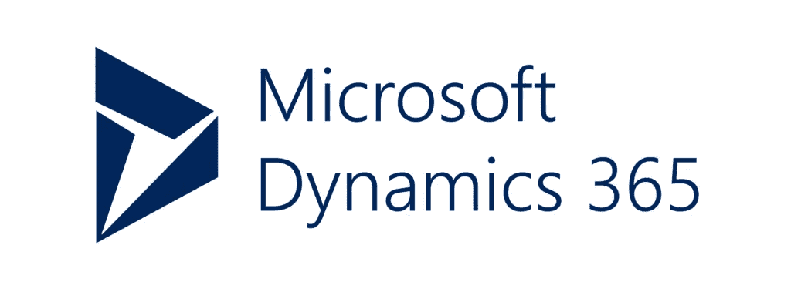

# 云基础设施如何释放遗留数据

> 原文：<https://itnext.io/cloud-services-can-set-legacy-data-free-80f7b8b7c34d?source=collection_archive---------5----------------------->


很长一段时间以来，人们普遍认为初创企业可以比大型老牌竞争对手获得优势，因为它们没有遗留的技术包袱。例如，由于现代 IT 和数据系统，现代挑战者银行(至少在功能和 UX 方面)已经超过了传统的中坚银行。

因此，许多老牌公司开始担心其传统数据基础设施缺乏灵活性，认为这是与灵活的新对手竞争的障碍。为了解决这个问题，我们已经看到许多大企业推动彻底修改他们的技术堆栈。

例如，在劳埃德 TSB 银行于 2015 年被 Sabadell 收购后，该银行决定需要努力将其系统转移到一个更年轻的平台上。[不太顺利](https://www.bbc.co.uk/news/business-50471919)。事实上，当你回顾重大信息技术转变的历史时( [NHS 连接健康](https://www.computerweekly.com/opinion/Six-reasons-why-the-NHS-National-Programme-for-IT-failed)，有人知道吗？或者也许[赫兹…](https://www.browserlondon.com/blog/2019/04/30/hertz-accenture-blame-game/) )很容易理解为什么旁观的组织对于对他们的 it 系统做出他们认为需要的重大改变感到紧张。

# 没必要这么恐怖吧

在 Browser，我们相信，在许多情况下，有一种风险更小的方法来利用所有那些难以访问的“遗留”或“企业”系统中的数据。事实上，帮助我们的客户解决这个问题变得越来越容易，只需利用过去十年中公司 it 的最大转变之一；云计算。

大多数大公司[已经将](https://www.browserlondon.com/blog/2019/01/28/modernising-hosting-platform/)(或者正在迁移)大量日常 IT 基础设施转移到基于云的服务。最著名的是微软 Azure、谷歌云和亚马逊网络服务。

这些变化通常是由成本、可靠性或占地面积驱动的，只是简单地涉及到从内部部署的传统 IT 系统到等效的基于云的体系的直接更换。

然而，虽然这种变化可能主要被称为效率的提高，但它也带来了额外的好处——新技术。

这是因为大多数云服务套件都具有极强的互操作性，不仅在他们自己的品牌生态系统内，而且通过联合开发的通用集成标准与竞争对手的生态系统互操作。这是我们进去的路线。

许多现代系统和服务非常好地支持这些访问和集成标准，这意味着有无数的机会以新的方式询问以前难以访问的数据。给你举个现实生活中的例子。

# 使用 Dynamics 365 为客户开发这种变化

我们的一个客户——一家大型展览管理公司——使用我们的姐妹公司 [Twine](https://www.browserlondon.com/case-study/twine/) 的服务为参展商提供客户门户。这种做法已经实施了几年，有助于协调客户，并提供他们可能需要的信息，如楼层布局、送货说明等。

缺少的是向查看门户的特定参展商显示个性化数据的能力，例如平面图上的哪个特定展位是他们的，以及参展商可能已经购买了哪些附加服务。客户确实拥有这些数据，但这些数据被锁定在现场遗留系统中，无法在客户门户中公开，这意味着参展商无法在一个地方看到他们需要的所有信息。



然而，有益的是，我们的客户最近将其 IT 堆栈迁移到了微软基于云的 Azure 平台上，包括迁移到 Azure Active Directory 和将传统 CRM 数据移植到 Microsoft Dynamics 365 上。

当然，微软使所有这些现代的、基于云的系统都可以通过标准化的流程访问，这意味着我们客户的所有客户数据——旧的和新的——现在都可以以新的方式访问和查询。因此，使用一些简单的现代 Dynamics 365 工具，更新他们的门户网站以提供更好的 UX 非常容易。

请记住，客户没有对他们的技术堆栈进行任何破坏性的更改。他们只是将他们的 IT 基础设施升级到他们已经在使用的技术的基于云的版本。

# 构建动态 365 小部件

为了获得最大的灵活性，我们决定使用现代 web 开发技术构建一个集成工具；去找一个集成服务器，ReactJs，生产一个可重复使用的部件，输出用户的个性化信息。


这种方法意味着我们可以以客户想要的任何方式将小部件嵌入到 Twine 中，并且它使用了平台中已经实现的现有单点登录提供者会话。由此，我们可以向集成服务器证明哪个用户登录了，并且可以从 Dynamics 365 获取个性化数据。考虑到微软采用的标准化方法，使用 OAuth2 flow 登录，OData 请求可预测地获取数据，这非常容易。

提取数据的第一步是使用 OAuth2 凭证流登录 Azure AD 实例，并获得一个请求令牌。这个令牌将在一段时间后过期，但由于我们使用的是现代工具，所以我们不需要担心这个问题——Go 将为我们处理这个问题。

```
config := clientcredentials.Config{
        ClientID: c.ClientID,
        ClientSecret: c.ClientSecret,
        TokenURL: Authority + c.TenantId + "/oauth2/token",
        EndpointParams: url.Values{
                "resource": []string{
                        c.ResourceUrl,
                },
        },
}
httpClient := config.Client(context.Background())
```

上面，我们使用了“golang . org/x/oauth2/client credentials”包，这意味着我们可以轻松地创建一个普通的 Go HTTP 客户端，它将根据每个请求的需要自动获取 oauth 2 令牌。我们不需要在发出 API 调用之前跟踪令牌何时过期并更新它，因为这个标准库会为我们做这件事。

然后，我们将使用这个 HTTP 客户机进行我们需要的任何 API 调用，当然，响应是用 JSON，确切地说是用 [OData](https://www.odata.org/) 表示的；一种与 JSON Web APIs 交互的标准化方式，这意味着我们知道——无需阅读任何文档——如何搜索和提取信息。

这意味着请求特定帐户的详细信息就像请求遵循 OData 格式的可预测 URL 一样简单。

```
path := fmt.Sprintf("%s/accounts(%s)", BasePath, accountId)
res, err := client.Get(path)
if err != nil {
        return
}
defer res.Body.Close()data, err := ioutil.ReadAll(res.Body)
if err != nil {
        return
}
```

然后，我们可以简单地解组 JSON 响应，这也是一种标准化的格式。

# 今后

现在，我不会假装所有传统软件的现代云版本都将像 Dynamics 365 一样标准化，但那些走这条路的供应商只会让自己更有吸引力。

大规模的 IT 变革[并不总是需要导致惨败](https://www.browserlondon.com/blog/2019/04/03/make-digital-transformation-stick/)。如果我们利用 it 市场中已经出现的趋势，即使在大型“企业”软件系统仍在使用的情况下，改善用户体验也会变得非常容易。

这篇文章的目的只是为了说明，当市场领先的企业软件公司采用倾向于集成的现代标准时，他们会向客户开放竞争优势。我们强烈鼓励这种行为。最终，我们希望这种事情会慢慢发展，为所有最终用户带来更好的 UX。

## 关于浏览器

我们为更好、更高效的工作场所创建企业网络应用。我们已经帮助壳牌、英国航空公司和英国政府等客户提高效率，简化业务。访问我们在[浏览器伦敦](http://www.browserlondon.com/)。

*原载于 2020 年 3 月 18 日 https://www.browserlondon.com**[*。*](https://www.browserlondon.com/blog/2020/03/18/cloud-dynamics-365-infrastructure-set-legacy-data-free/)*