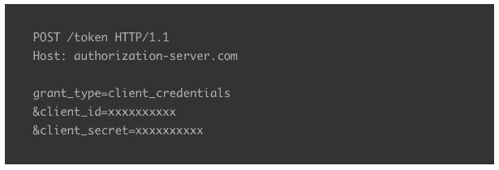

# 使用 AWS API 网关进行云到云授权

> 原文：<https://itnext.io/cloud-to-cloud-authorization-with-aws-api-gateway-da461c768fe3?source=collection_archive---------3----------------------->

有许多文章讨论了为 AWS API Gateway 设置授权者以保护端点。它们都是关于授权器实现的优秀文章，我不确定我能写出更好的关于授权器基础的文章，但我认为我能贡献的是一个更具架构性的观点，关于如何为云到云安全设置它们，以及我在实现中看到的一些设计决策。

# 什么是正确的安全？

这应该是你在接触 AWS 控制台或开始编写代码之前问自己的第一个问题。对于云到云 API，确实有两个流行的选项值得您关注和考虑。

**API 键**

对于大多数开发人员来说，这可能是最受欢迎的解决方案，它易于理解，也易于客户实现。这个解决方案创建一个共享密钥，通常是一个随机的字符串。您的合作伙伴在所有 API 请求的头、查询字符串或 cookie 中使用这个键，这样就完成了。

作为查询字符串的 API 键

作为 Cookie 的 API 密钥

API 键作为标题

听起来简单而伟大，直到 API 密匙泄漏，现在密匙必须被改变，或者甚至好的安全过程定期滚动这个密匙可以使它有点痛苦。

这是一个非常简单的解决方案，但与另一个解决方案相比并不简单，它应该是您的默认选项，绝对不应该在面向消费者的应用程序中使用。

**客户端凭证 OAuth2 授予类型**

让我们从 OAuth.net 给出的定义开始

> 客户端使用客户端凭据授予类型来获取用户上下文之外的访问令牌。

如果我可以翻译一下，不要在面向消费者的应用程序中使用客户端凭证。云到云很好，因为您的合作伙伴需要确保他们的客户应用程序经过适当的身份验证，我们专注于授权对 API 的访问。

这个解决方案是一个两步授权流程，客户端应用程序需要使用一个*客户端 id* 和*客户端秘密*进行身份验证，并取回一个正确形成的 JWT 令牌。除了安全性之外，我喜欢令牌的一点是，您可以在令牌中嵌入声明，这样您就可以获得更多关于合作伙伴访问安全且不可更改的 API 的详细信息。例如，这可以是关于谁是合作伙伴的细节。此外，您可以将*作用域*附加到调用中，以提供对服务的有限访问。如果您有一个分层的服务来限制授权级别的访问，这就更简单了。

客户端凭据授予类型

# 设置您的授权

像软件中的大多数事情一样，做任何事情都有许多方法，所以我将提到几种方法和我的偏好。

**使用使用计划中内置的 API 网关 API 密钥**

像大多数 AWS 服务一样，有一个非常简单的设置来完成设置。如果你感兴趣，我不会重复这篇关于设置的文章。

 [## Amazon API 网关:使用 API 密钥保护端点

### 亚马逊 Api 网关是一个托管服务。在本文中，我将展示如何使用 api 密钥保护端点。

enlear .学院](https://enlear.academy/amazon-api-gateway-securing-endpoints-using-api-keys-eec1c856b327) 

我发现这种方法会导致锁定和灵活性的丧失。您只能将此方法与 REST API (API 网关 V1)选项一起使用，因此如果您想将 HTTP (API 网关 V2)作为一个选项，您就不走运了。

如果您确实需要使用 API 密匙，我的建议是创建一个定制的请求授权器，并将 API 密匙存储在数据库中进行验证。这其中的一个问题是，它确实会导致更多的成本。AWS 方法在执行任何 Lambda 之前完成，因为将验证放在授权器中确实需要运行 Lambda。请确保您缓存了授权，它不会使这种影响。

AWS 也仅限于使用他们使用的标题，因此灵活性较低。我喜欢将 API 密钥作为基本类型放在 Authorition 头中(密钥作为用户名，密码为空)。当我在端点上进行多种类型的授权时，这让我实际上检测到它是一个 API 密钥授权。(我正在策划一篇这方面的文章)。

我还发现，通常需要一个授权者来验证二手数据，所以要考虑它的价值。

**使用 AWS 认知的客户端凭证**

遵循我的“不要重写”，这是一篇关于用 AWS Cognito 设置客户端凭证的非常好的文章。

 [## 第 1 部分:使用 AWS Cognito OAuth2 范围保护 AWS API 网关

### 在前一篇博客中，我们看到了如何使用与 OpenAM 对话的自定义授权器来保护 API 网关。在这个博客中，我们…

awskarthik82.medium.com](https://awskarthik82.medium.com/part-1-securing-aws-api-gateway-using-aws-cognito-oauth2-scopes-410e7fb4a4c0) 

你可以在 Auth0 或 Okta 等其他服务中设置这个，但如果你在 AWS 领域，这可能是你的最佳选择。你也可以建立自己的服务器，但如果你这样做，我可能会说你疯了。

同样，AWS 为您提供了一种简单的方法，使用上面文章中描述的专门的授权者类型进行授权，但是它将您直接与 Cognito 联系起来，并且没有为您提供验证请求中其他项目的选项。在请求授权器中，令牌验证并不复杂，它为您提供了使用任何服务的灵活性。

# 下一步是什么？

我希望这能让您对云到云自动化的两种主要方式有所了解。如果您现在正在使用 API 密匙，并且想要添加客户端凭证支持，那么您可能想要跟随我。我计划写一篇文章，展示如何一次完成多种类型的身份验证(包括直接从移动应用程序或 web 应用程序的用户级别)