# Cloudflare:用自动平台优化插件加速 WordPress

> 原文：<https://itnext.io/cloudflare-speed-up-wordpress-with-automatic-platform-optimization-plugin-afc10ce6d143?source=collection_archive---------2----------------------->


rtfm.co.ua 的博客对用户来说非常慢。

例如，你可以使用 https://gtmetrix.com 的[来测试你的网站:](https://gtmetrix.com/)


离满载还有 4.3 秒！太可怕了。

在结果的底部，您可以查看网站上的热门问题:

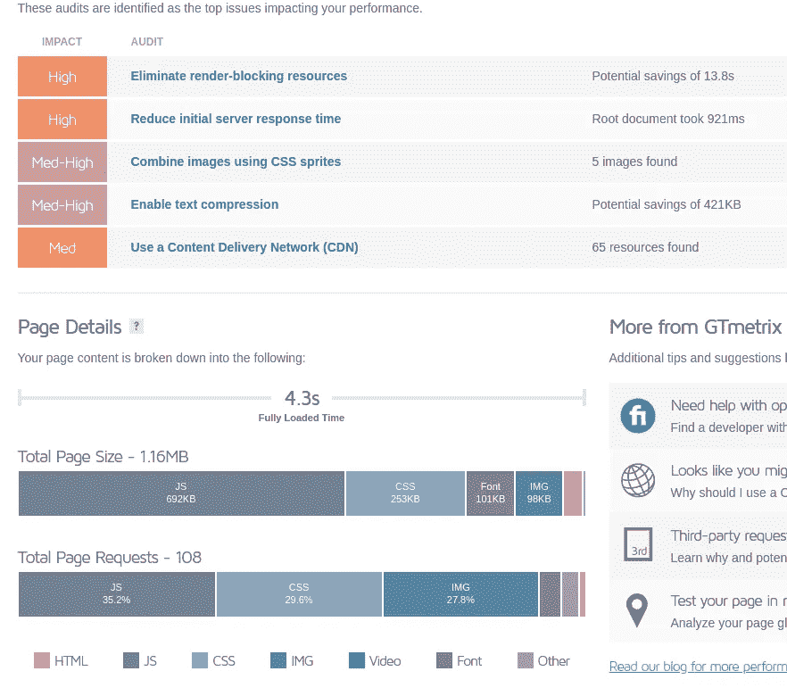

一开始页面大小是 1.16 MB，足够大了。

第二件事是检查到底是什么加载太慢——JS，CSS。

这里可以有各种解决方案，比如在网站端缓存页面，添加 CDN 等。

作为本地解决方案，你可以使用类似 [WP 超级缓存](https://wordpress.org/plugins/wp-super-cache/)的插件。

另一种方法是使用 Cloudflare，它将提供“一体化”服务，如 CDN、防 DDoS、WAF 等。

对于 WordPress，Cloudflare 创建了一个插件[自动平台优化(APO)](https://www.cloudflare.com/pg-lp/speed-up-wordpress-with-cloudflare-apo/) ，它将自动完成所有必要的操作，尽管这将花费你每月 5 美元。

其文档—[APO 入门](https://developers.cloudflare.com/automatic-platform-optimization/get-started/)。

# 云耀斑

## 登记

从插件开始，首先，你需要注册一个账户，例如，直接从[插件的页面](https://www.cloudflare.com/pg-lp/speed-up-wordpress-with-cloudflare-apo/):

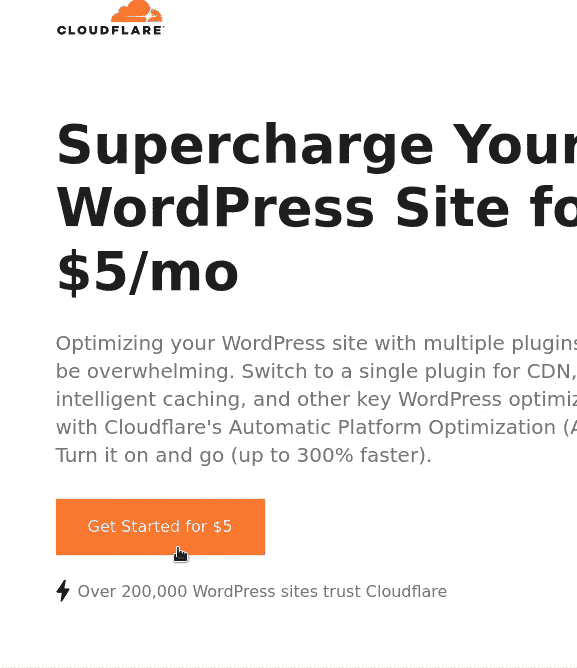

然后，添加您的网站:

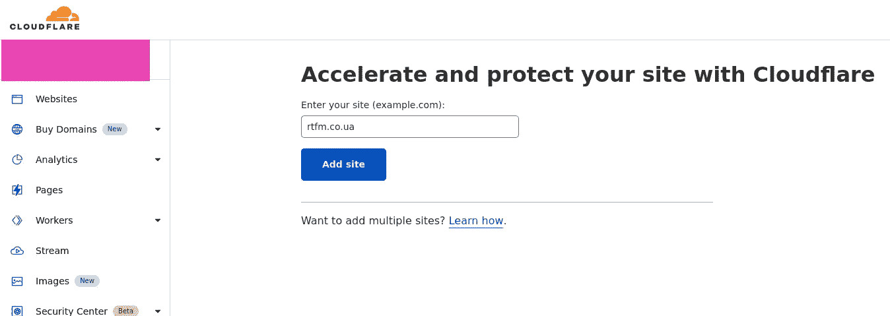

确认您的 APO 套餐:

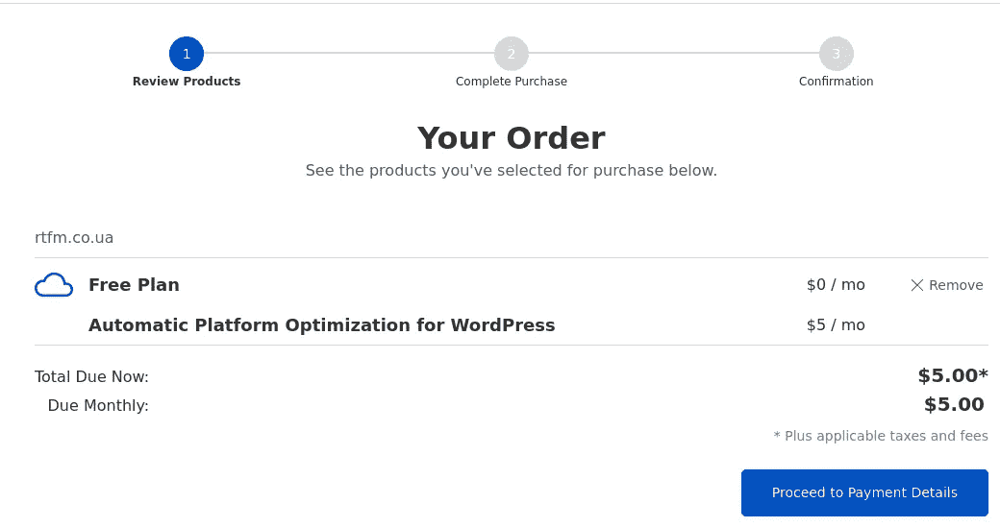

如果您已经拥有 Cloudflare 帐户，您可以从*速度>优化*中激活突进:

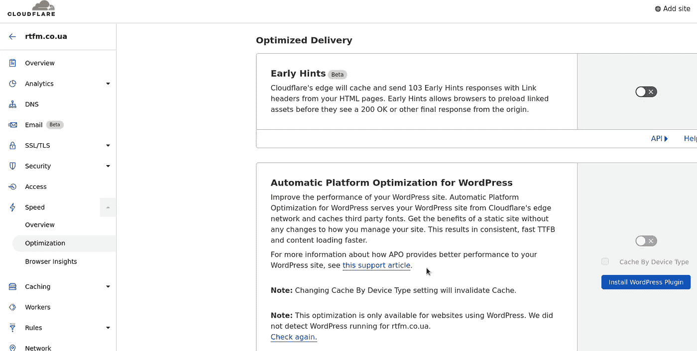

## DNS 配置

Cloudflare 将在当前名称服务器上检查您的域的当前设置:

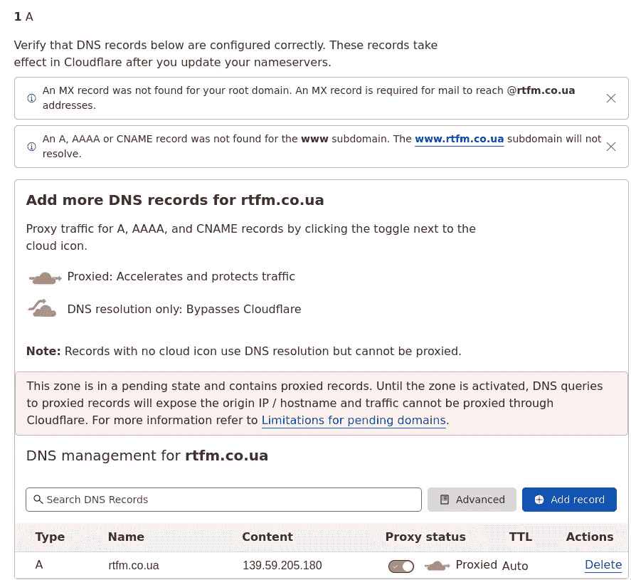

之后，它将配置自己的域名服务器，并建议您在注册商处更改域名。

此时，我的域由 AWS Route 53 提供服务，因此需要将名称服务器更新到 Cloudflare:

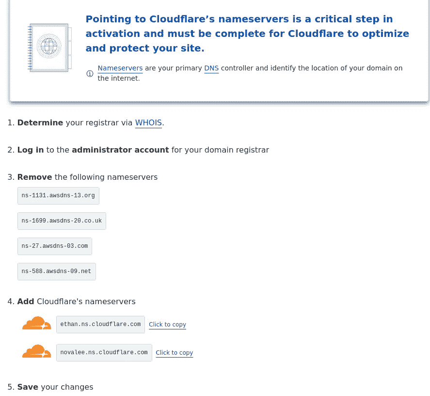

在此之前，请检查 Cloudflare 是否准备好返回关于您的域的记录:

```
$ dig +short @ethan.ns.cloudflare.com rtfm.co.ua
139.59.205.180
```

一旦成功，在您的注册商处更新 NS，等待几分钟，点击*完成*，如果您愿意，请完成*快速启动*步骤:

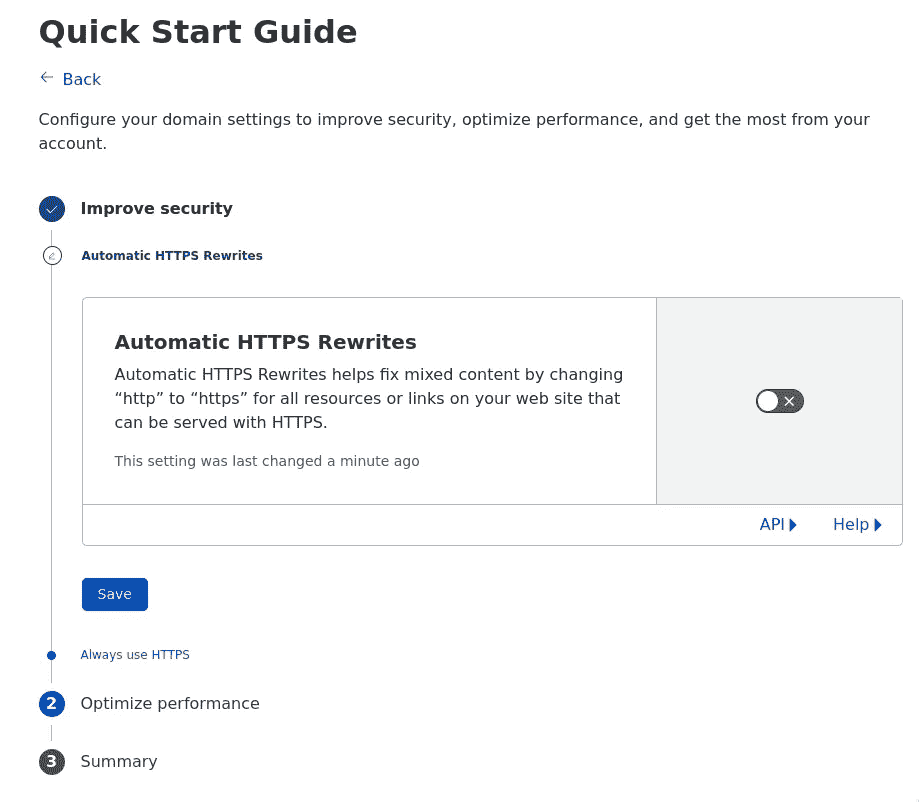

无论如何，您可以稍后配置这些设置。现在，让我们继续使用自动平台优化插件。

# WordPress Cloudflare 插件

转到您博客的管理页面，*插件>添加新插件*，找到 Cloudflare:

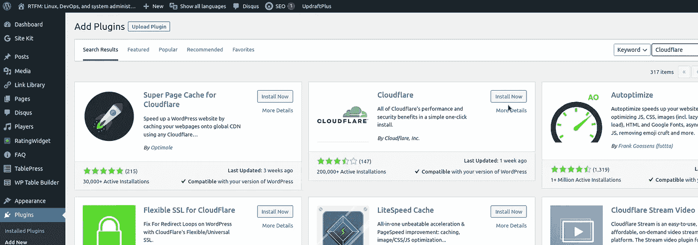

要配置插件的访问权限，请在您的 Cloudflare 帐户中进入*我的配置文件> API 令牌>创建令牌*:

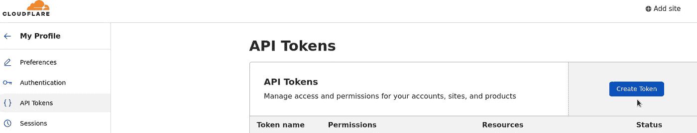

从模板列表中选择 *WordPress* :

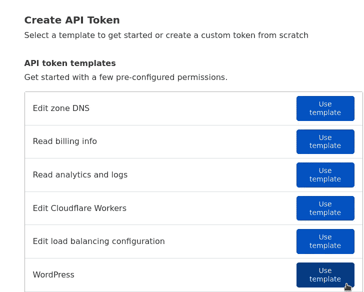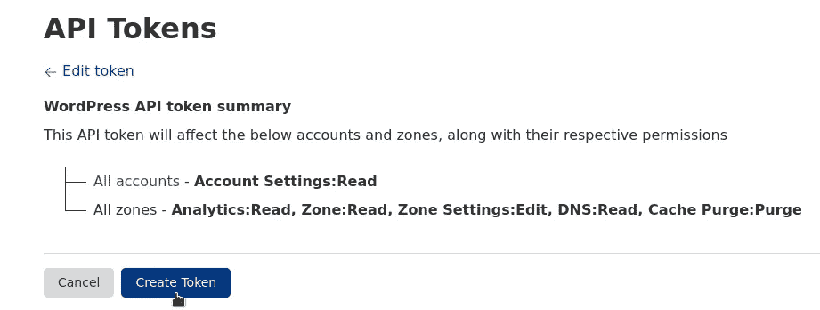

回到你的博客。

从 S *设置> Cloudflare* 中，使用 log in(电子邮件)和上面创建的 APT 令牌登录到您的 Cloudflare 帐户:

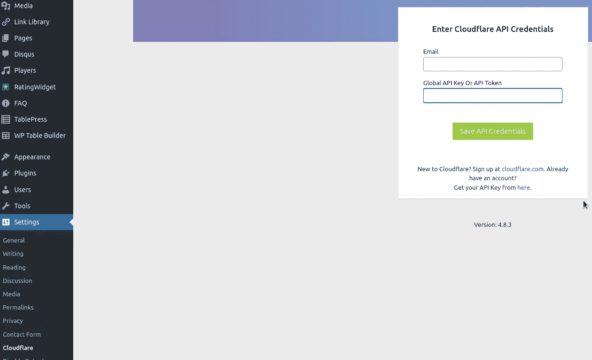

在这里，您只需点击*应用*，即可配置所有必要的设置，Cloudflare 将为您完成优化、安全等所有其他工作:

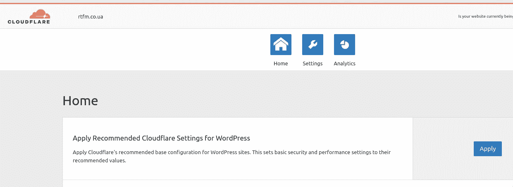

一点打击，启用自动平台优化:

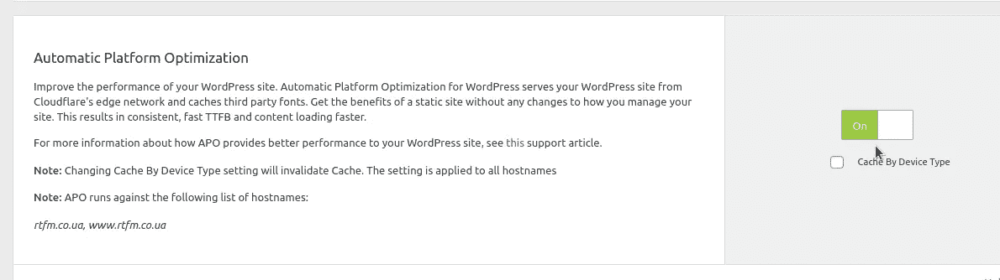

其实就这些了。

现在，让我们再次检查测试结果:

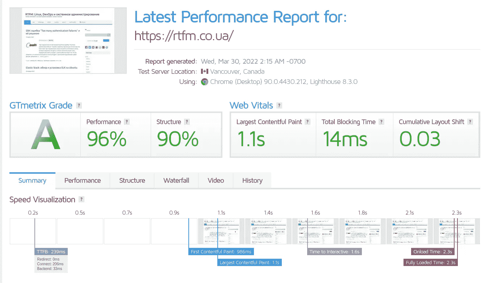

与第一批结果相比:

*   加载时间:之前是 **4.3** 秒，现在是 **2.6**
*   页面大小:曾经是 1.16 MB，现在是 716 kb
*   综合评分:以前是 **D** ， **65%** ，现在是 **A** ， **96%**

完成了。

*最初发布于* [*RTFM: Linux，DevOps，和系统管理*](https://rtfm.co.ua/en/cloudflare-speed-up-wordpress-with-automatic-platform-optimization-plugin/) *。*