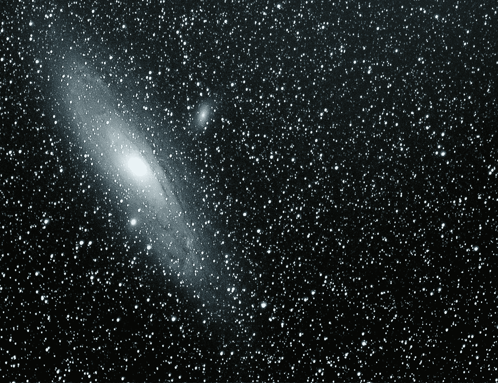

# 云形成参数:计算的默认值

> 原文：<https://itnext.io/cloudformation-parameters-computed-defaults-dcb1efeafc45?source=collection_archive---------5----------------------->

当人们[问](https://stackoverflow.com/questions/34062535/can-i-use-fnjoin-in-parameters-of-aws-cloudformation-json-template)是否可以在 CloudFormation 堆栈中使用计算的参数默认值时，[的回答总是——“不”](https://stackoverflow.com/questions/35213196/cloudformation-reference-resource-as-default-value-for-parameter)。

假设我们想要使用 CloudFormation 堆栈创建一个 VPC。如果没有提供 VPC 名称，我们希望使用基于堆栈名称的默认值:

但这是行不通的。

然而，我们可以利用云的形成条件来实现:

如果我们不带参数运行它:

我们得到一个名为“测试 4-VPC”的 VPC

如果我们提供 VPC 的名字:

我们得到一个名为“MyVpc”的 VPC