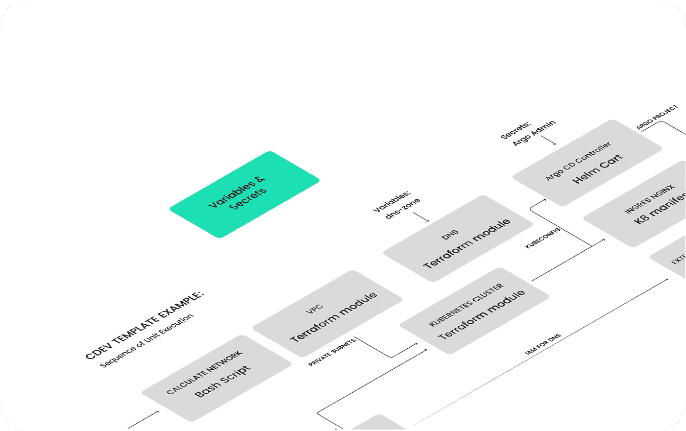
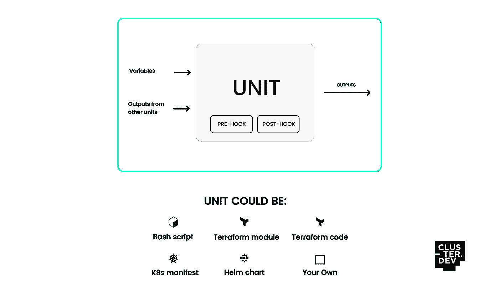
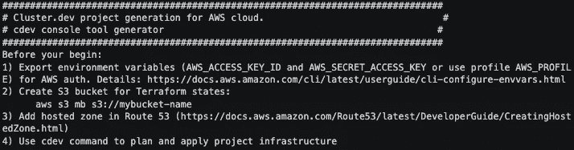
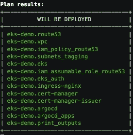

# Cluster.dev:用于云本地基础设施的一体化工具

> 原文：<https://itnext.io/cluster-dev-all-in-one-tool-for-cloud-native-infrastructure-636ed6ba8e28?source=collection_archive---------4----------------------->

将 Terraform、Helm、ArgoCD 等捆绑到一个简单的框架中，使用 Cluster.dev 创建和管理端到端基础设施。



图片来源: [cluster.dev](https://cluster.dev/)

*注意:Cluster.dev 由一个来自乌克兰的团队提供支持，其成员已经设法从基辅撤离，目前是安全的。(*🇺🇦*#站在乌克兰)*

随着云原生架构的复杂性增加，管理基础架构所需的工具数量以及大规模管理和操作这些工具的专业知识增加了大多数基础架构团队面临的挑战。例如，要在 Kubernetes 上运行应用程序，团队需要首先通过 Terraform、Pulumi 或 Crossplane 提供云基础设施。然后，可以通过 Helm 或 kustomize 打包应用程序，并通过 ArgoCD 或其他 CI/CD 工具进行部署。最后，可能会有其他脚本、cronjobs、Argo 工作流和 secrets manager 将一切联系在一起。

对于具有优秀的 IaC 和 GitOps 实践的已建立的团队来说，这个挑战可能会得到部分解决。然而，对于现在希望采用现代基础架构最佳实践的组织来说，处理所有这些工具和工作流可能会令人望而生畏。当基础架构还必须打包并交付给运行许可软件或本地软件的客户时，这种情况也同样适用。

Cluster.dev 是一个工具，旨在通过将所有流行的基础设施工具整合到一个框架中来解决这个问题。它使用一个“堆栈模板”以一种熟悉的声明性清单方法来定义所有的基础结构部分。堆栈模板可以是任何东西，从 Terraform 模块到 shell 脚本、舵图、ArgoCD 应用程序，甚至是 OPA/Kyverno 策略。

# 重要概念

每个堆栈模板都由单元组成，这些单元接收变量和来自其他单元的输出，以部署一些基础设施。这个单元可以是一个 bash 脚本来创建一些 TLS 证书、一个 Terraform 模块或一些定制的解决方案。



深入研究模板，cluster.dev 公开了熟悉的 YAML 模板逻辑(类似于 Helm/Go 模板)以及类似 Terraform 的语法。在最高层，有一个`project.yaml`和秘密。该文件可定义全局变量，如 AWS 区域(如`us-east-1`)或通常定义在 Terraform/Terragrunt 模块根的变量(如 Terraform provider)。

```
name: my_project 
kind: project 
backend: aws-backend 
variables:   
  organization: my-org   
  region: us-east-1   
  state_bucket_name: cluster-dev-state
exports:   
  AWS_PROFILE: development
```

secrets 的工作方式类似于 external-secrets，通过 sop 与云提供商的 secret store(例如 AWS Secrets Manager)或加密的 Secrets 集成。

```
name: my-aws-secret
kind: Secret
driver: aws_secretmanager
spec: 
    region: us-east-1
    aws_secret_name: my-secret
```

然后，我们有了`backend.yaml`，类似于 Terraform 后端定义:

```
name: aws-backend
kind: Backend
provider: s3
spec:  
  bucket: {{ .project.variables.state_bucket_name }}  
  region: {{ .project.variables.region }}
```

注意熟悉的 go-templating 将变量从顶层`project.yaml`传入后端定义。

最后，我们有各种`stack.yaml`文件来定义各个单元。一个简单的 EKS 例子可能是这样的:

```
name: eks-demo
template: https://github.com/shalb/cdev-aws-eks?ref=v0.2.0
kind: Stack
backend: aws-backend
variables:
  region: {{ .project.variables.region }}
  organization: {{ .project.variables.organization }}
  domain: cluster.dev
  instance_type: "t3.medium"
  eks_version: "1.20"
```

目前只有三个“官方”支持的模板( [AWS K3s](https://github.com/shalb/cdev-aws-k3s) 、 [AWS EKS](https://github.com/shalb/cdev-aws-eks) 和[数字海洋 K8s](https://github.com/shalb/cdev-do-k8s) )，但鉴于其设计，现有的 Terraform 模块可以用来轻松支持其他模块。

# 演示安装

为了测试这一点，我使用了 [AWS EKS](https://github.com/shalb/cdev-aws-eks) 示例模板，它为 AWS VPC、53 号公路、EKS 打包了 Terraform 模块，然后安装 cert-manager、ingress-nginx 和 argocd Helm charts(完整的堆栈定义在此[列出](https://github.com/shalb/cdev-aws-eks/blob/main/aws-eks.yaml))。

要使用 Cluster.dev，需要安装 [Terraform](https://www.terraform.io/downloads) 和 [Cluster.dev 二进制文件](https://docs.cluster.dev/get-started-install/)。不幸的是，Mac M1s 还不被支持，所以我为这个演示创建了一个 Linux AMD64 VM。

```
$ cdev project create [https://github.com/shalb/cdev-aws-eks](https://github.com/shalb/cdev-aws-eks) --interactive
```

在交互模式下运行`cdev`提供了关于 Cluster.dev 所期望的更多信息(例如，它如何通过 AWS 认证、S3 桶持有状态等)。



在填写项目名称、组织名称、AWS 区域和 DNS 区域域名之后，项目后端和示例堆栈文件会自动生成。这也可以在 Github 上的`[example](https://github.com/shalb/cdev-aws-eks/tree/main/examples)`目录下看到。

接下来，我们可以运行`cdev plan`来预览将要创建的资源:



类似地，我们可以运行`cdev apply`来创建计划好的工件。

# 用例

对于有经验的 Terraform 用户来说，Cluster.dev 应该看起来非常类似于 Terraform 和 Terragrunt。演示模板就像一个简单的 Terraform 包装器，将 EKS 创建与舵图部署捆绑在一起。这是一个相当人为的例子，因为 Terraform 也可以处理舵图。然而，Cluster.dev 最有趣的部分隐藏在单元的钩子中。最明显的例子是它如何单独管理 aws-auth:

```
- name: eks_auth    
  type: kubernetes    
  provider_version: "0.6.0"    
  pre_hook:      
    command: *getKubeconfig      
    on_destroy: true    
  kubeconfig: ../kubeconfig_{{ .name }}    
  depends_on: this.eks    
  source: ./eks/
```

EKS Terraform 模块用户熟悉让 Terraform 管理 aws-auth 的[陷阱，因为](https://www.koslib.com/posts/troubleshooting-terraform-eks-module/) [*Terraform 只能引用配置应用前已知的值*](https://www.terraform.io/language/providers/configuration) 。Cluster.dev 能够通过将它作为一个单元来管理来规避这个问题。

Cluster.dev 是一个很好的解决方案，适用于:

1.  基础设施团队拥有一系列不同的工具。对于在本地运行遗留应用程序以及在 Kubernetes 上运行新的云原生应用程序的团队来说，这一点可能更加明显。
2.  平台工程团队负责为新团队维护一个启动模板，以构建和测试他们的新服务。这也适用于需要快速启动基础设施的咨询或基于项目的团队。
3.  根据合同有义务交付基础设施代码和许可应用程序的软件供应商。在金融科技领域，这仍然非常普遍，大型金融机构更倾向于在自己的数据中心运行，而不是使用 SaaS 的产品。

但是，如果您的组织的结构使得处理 Terraform 和 Helm/argod 的团队不同，Cluster.dev 可能并不适合。例如，如果您的组织中的开发人员负责创建/维护掌舵图，那么引入另一个工具来抽象它将会更加困难，特别是如果已经有一个运行的 CI/CD 管道来处理它。

看看 Cluster.dev 如何默认支持更多的模板并与非地形工具(如 Pulumi 和 Crossplane)集成将会很有趣。他们的文档网站上有一篇很好的比较文章，但是随着这些工具越来越受欢迎，重新评估会很有趣。