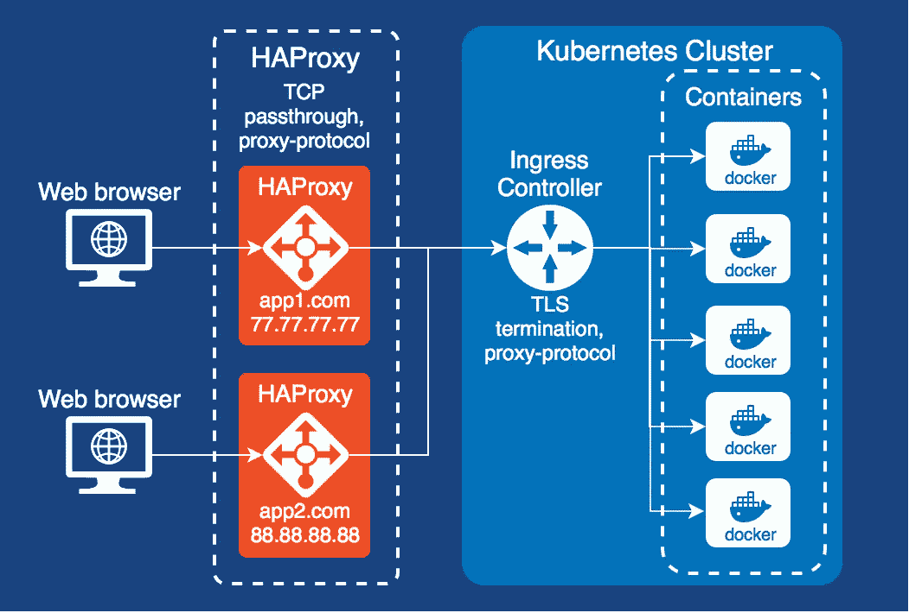

# 使用 HAProxy 的 Kubernetes(或 docker-compose)入口的外部代理

> 原文：<https://itnext.io/cluster-recipe-external-proxy-for-kubernetes-ingress-or-docker-compose-ingress-with-haproxy-on-f81e3adee5ef?source=collection_archive---------2----------------------->

> [*点击这里在 LinkedIn* 上分享这篇文章](https://www.linkedin.com/cws/share?url=https%3A%2F%2Fitnext.io%2Fcluster-recipe-external-proxy-for-kubernetes-ingress-or-docker-compose-ingress-with-haproxy-on-f81e3adee5ef)

如果您在 Kubernetes 集群中部署了多个非相关应用程序，您可能会考虑使用一个单独的外部代理来为每个应用程序获取不同的公共 ip。我们可以使用 HAProxy，因为它能够在第 7 层(http)或第 4 层(tcp)上代理 http/https 请求。在我们的例子中，在没有 tls 终止的情况下在 HAProxy 上代理 https 请求是很重要的，因为 Kubernetes Ingress(基于 nginx)和 kube-lego 接管了这个功能。第二个问题是如何将原始客户端 IP 传递给应用程序。解决方案是代理协议，HAProxy 和 Nginx 都支持它。看看如何在新的数字海洋 CentOS 7 节点上设置这样的代理。



# 设置 HAProxy

假设防火墙、iptables、selinux 被禁用。更新操作系统

```
yum update
yum install epel-release
```

检查 HAProxy 的可用版本。

```
yum info haproxy
.. 1.5.18
```

股票 CentOS 有相对旧版本的 HAProxy，所以让我们安装来自 [IUS 社区库](https://ius.io/GettingStarted/)的最新 HAProxy。

```
yum install [https://centos7.iuscommunity.org/ius-release.rpm](https://centos7.iuscommunity.org/ius-release.rpm)
yum install haproxy18u
haproxy -v
HA-Proxy version 1.8.4-1deb90d 2018/02/08
```

编辑 haproxy 配置，用您的 Kubernetes ingress 或 docker-compose“ingress”公共 IP 替换 X.X.X.X。

```
vi /etc/haproxy/haproxy.cfg
global
    chroot      /var/lib/haproxy
    pidfile     /var/run/haproxy.pid
    maxconn     4000
    user        haproxy
    group       haproxy
    daemon
    stats socket /var/lib/haproxy/statsdefaults
    mode http
    log global
    option                  redispatch
    retries                 3
    timeout http-request    10s
    timeout queue           1m
    timeout connect         10s
    timeout client          1m
    timeout server          1m
    timeout http-keep-alive 10s
    timeout check           10s
    maxconn                 3000frontend http_front
    mode tcp
    bind *:80
    default_backend http_backfrontend https_front
    mode tcp
    bind *:443
    default_backend https_backbackend http_back
    mode tcp
    server server01 X.X.X.X:80 **send-proxy**backend https_back
    mode tcp
    server server01 X.X.X.X:443 **send-proxy**
```

启用并启动 HAProxy

```
systemctl enable haproxy
systemctl start haproxy
systemctl status haproxy -l
```

# 支持代理协议的 Kubernetes 入口

[基于 Nginx 的 Kubernetes Ingress 使用现成的 use-proxy-protocol 指令支持代理协议](https://github.com/kubernetes/ingress-nginx/blob/d27829ce7ebc5f202816c52f69985bc102db9a63/deploy/provider/aws/patch-configmap-l4.yaml#L9)。只需替换 [ingress-nginx 强制命令](https://github.com/kubernetes/ingress-nginx/blob/master/deploy/README.md#mandatory-commands)中的 configmap.yaml 或应用新的 configmap 即可。

```
# REPLACE
# curl [https://raw.githubusercontent.com/kubernetes/ingress](https://raw.githubusercontent.com/kubernetes/ingress-#)-nginx/master/deploy/configmap.yaml \
#    | kubectl apply -f -
# WITHcurl [https://raw.githubusercontent.com/kubernetes/ingress-nginx/d27829ce7ebc5f202816c52f69985bc102db9a63/deploy/provider/aws/patch-configmap-l4.yaml](https://raw.githubusercontent.com/kubernetes/ingress-nginx/d27829ce7ebc5f202816c52f69985bc102db9a63/deploy/provider/aws/patch-configmap-l4.yaml) \
    | kubectl apply -f -# OR apply a new config
cat <<EOF | kubectl apply -f -
kind: ConfigMap
apiVersion: v1
metadata:
  name: nginx-configuration
  namespace: ingress-nginx
  labels:
    app: ingress-nginx
data:
  use-proxy-protocol: "true"    
EOF
```

# **Docker-利用代理协议支持构建类似入口的配置**

可以使用 nginx、jwilder/docker-gen 和 jrcs/letsencrypt-nginx-proxy-companion 容器为 docker-compose 构建一个类似 Ingress 的环境。让我们看看如何给这个配置添加代理协议支持。所有需要的文件可以在[https://github.com/olegsmetanin/docker-compose-examples](https://github.com/olegsmetanin/docker-compose-examples)找到。

文件布局:

```
|- docker-compose.yaml
|- nginx-proxy-protocol.tmpl
```

docker-compose.yaml

```
version: '3'
services:
  nginx-web:
    image: nginx
    labels:
      com.github.jrcs.letsencrypt_nginx_proxy_companion.nginx_proxy: "true"
    container_name: docker-compose-ingress
    restart: always
    ports:
      - "80:80"
      - "443:443"
    volumes:
      - ./data/conf.d:/etc/nginx/conf.d
      - ./data/vhost.d:/etc/nginx/vhost.d
      - ./data/html:/usr/share/nginx/html
      - ./data/certs:/etc/nginx/certs:ro
      - ./data/htpasswd:/etc/nginx/htpasswd:ronginx-gen:
    image: jwilder/docker-gen
    command: -notify-sighup docker-compose-ingress -watch -wait 5s:30s /etc/docker-gen/templates/nginx.tmpl /etc/nginx/conf.d/default.conf
    container_name: docker-compose-ingress-nginx-gen
    restart: always
    volumes:
      - ./data/conf.d:/etc/nginx/conf.d
      - ./data/vhost.d:/etc/nginx/vhost.d
      - ./data/html:/usr/share/nginx/html
      - ./data/certs:/etc/nginx/certs:ro
      - ./data/htpasswd:/etc/nginx/htpasswd:ro
      - /var/run/docker.sock:/tmp/docker.sock:ro
      - ./nginx-proxy-protocol.tmpl:/etc/docker-gen/templates/nginx.tmpl:ronginx-letsencrypt:
    image: jrcs/letsencrypt-nginx-proxy-companion
    container_name: docker-compose-ingress-nginx-letsencrypt
    restart: always
    volumes:
      - ./data/conf.d:/etc/nginx/conf.d
      - ./data/vhost.d:/etc/nginx/vhost.d
      - ./data/html:/usr/share/nginx/html
      - ./data/certs:/etc/nginx/certs:rw
      - /var/run/docker.sock:/var/run/docker.sock:ro
    environment:
      NGINX_DOCKER_GEN_CONTAINER: docker-compose-ingress-nginx-gen
      NGINX_PROXY_CONTAINER: docker-compose-ingressnetworks:
  default:
    external:
      name: webproxy
```

nginx-proxy-protocol.tmpl

```
curl -o nginx-proxy-protocol.tmpl https://raw.githubusercontent.com/jwilder/docker-gen/master/templates/nginx.tmpl
```

在模板中，为所有 listen 指令添加一个代理协议。

```
-listen ...;+listen ... proxy_protocol;
```

还要更改 X-Real-IP 和 X-Forwarded-For 标头:

```
-proxy_set_header X-Real-IP $remote_addr;+proxy_set_header X-Real-IP $proxy_protocol_addr;-proxy_set_header X-Forwarded-For $proxy_add_x_forwarded_for;+proxy_set_header X-Forwarded-For $proxy_protocol_addr;
```

运行类似入口的 docker-compose 配置:

```
docker-compose -f docker-compose.yaml up -d
```

出于测试目的，让我们运行 hello-world 容器，它显示了环境变量，以确保 ClientIP 是正确的。不要忘记更改域名和电子邮件。

```
version: '3'services:
  web:
    image: olegsmetanin/dockercloud-hello-world
    environment:
      - VIRTUAL_HOST=cloud.example.com
      - VIRTUAL_NETWORK=webproxy
      - VIRTUAL_PORT=80
      - LETSENCRYPT_HOST=cloud.example.com
      - [LETSENCRYPT_EMAIL=me@example.com](mailto:LETSENCRYPT_EMAIL=me@example.com)
    volumes:
      - /var/run/docker.sock:/var/run/docker.sock
    restart: alwaysnetworks:
  default:
    external:
      name: webproxy
```

运行 docker-compose，通过域名打开应用程序网页，并确保 ClientIP 与您的真实外部地址匹配，这意味着代理协议实际工作。

```
docker-compose -f docker-compose.yaml up
```