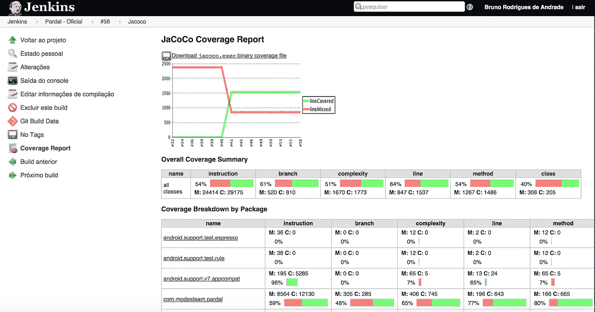

# 代码覆盖率:让测试变得更糟糕的度量标准。

> 原文：<https://itnext.io/code-coverage-the-metric-that-makes-your-tests-worse-c1dddcc0831?source=collection_archive---------1----------------------->

## 出于免费的故事？在[https://aiko.dev/code_coverage/](https://aiko.dev/code_coverage/)免费获得这篇文章

由[克里斯托弗·高尔](https://unsplash.com/@cgower?utm_source=unsplash&utm_medium=referral&utm_content=creditCopyText)在 [Unsplash](https://unsplash.com/s/photos/coding?utm_source=unsplash&utm_medium=referral&utm_content=creditCopyText) 上拍摄的照片

代码覆盖率有很多问题:Stackoverflow.com 用户[马克·辛普森](https://stackoverflow.com/questions/695811/pitfalls-of-code-coverage/695888#695888)雄辩地总结道:

> 代码覆盖率告诉你你肯定**没有**测试过什么，而不是你**已经**测试过什么。

就像其他指标一样，也有滥用它的方法。在这篇文章中，我不会列出它的所有缺陷(你可以稍后搜索:)。相反，我将把重点放在一个引起我注意并且我最近遇到越来越多的实践上。

## 设置静态代码覆盖率目标

应用代码覆盖率的一种方式是在您的构建脚本中使用它。通过在脚本中设置一个阈值，您可以在代码覆盖率降低时导致构建失败。这样做通常是为了确保新编写的代码得到充分的测试。

考虑到不是所有的代码都需要测试(甚至 Kent Beck 也同意这一点)，100%的阈值是不合理的。通常不需要测试的代码的明显例子是数据传输对象(d to)和自动生成的代码。

> 合理的代码覆盖率取决于您的代码和应用程序。

## 这怎么会让我的测试变得更糟呢？！

既然你正在阅读这篇关于代码覆盖率的文章，我想你知道合理的测试套件的重要性。因此，你**希望**在开发时实际编写所有必要的测试。

当一个静态的代码覆盖率阈值被设置时，问题就出现了，这可能是由开发团队之外的人设置的:比如管理层，或者你正在工作的客户。意图通常是好的。门槛应该鼓励你写测试。

然而，如上所述，合理的代码覆盖率取决于您的代码。并且您的代码库会随着每次提交而改变。让团队之外的人设定一个静态阈值不太可能是您在合理地接近这个阈值时会想到的确切阈值。

这可能导致两种情况:

> *你的覆盖范围是* **以上** *那个任意的阈值。*

或者

> *你的覆盖范围是* ***低于*** *那个任意的阈值。*

## 案例 1: *你的保险额超过了门槛*

乍一看，这似乎是一个很好的情况，每个人都很高兴，目标实现了！这有什么错呢？

让我们更仔细地看看它:

在这种情况下，当继续开发时，**最好的情况是**开发人员简单地忽略这个阈值，他们像往常一样继续编写测试，整个阈值(以及它到构建过程中的集成)对开发过程没有增加任何东西。

它还做了什么:它表明设置这个阈值的人已经达到了合理的代码覆盖率。事实上，这个门槛可能太低，不能作为任何有用的指标，因此会给人一种虚假的安全感。

现在让我们来看看**最坏的情况:**

> 开发人员简单地**停止编写测试**，因为“覆盖率已经足够高了”。

这与设定门槛的人试图通过这项事业实现的目标完全相反。

## 案例 2:你的保险低于门槛

记住，你知道一个合理的测试套件的重要性，并且实际上**希望**编写所有必要的测试。让我们看看第二种情况**，实际覆盖率低于任意阈值**，即使您已经编写了所有合理的测试。我能想到两个可能的选择，你仍然可以达到这个门槛。****

1.  **从覆盖报告中排除新代码。**
2.  **编写更多的测试。**

****选项 1** :从覆盖报告中排除代码:**

**此选项仅在您控制覆盖跑步者时适用。**

****

**一些代码覆盖率运行程序允许用户排除代码的某些部分，这样它们就不会被计入总的覆盖率结果中。**

**然而，许多运行程序只允许排除整个文件/包。假设一个类可能有需要测试的代码和不需要测试的代码(例如，`hashCode()`是你自动生成的，只是因为`equals()`才需要测试)，你可能会排除掉你真正想要测试的代码。在这种情况下，当文件/包中有未测试代码时，覆盖率报告将不会显示出来。**

**这又一次与设立门槛的人试图达到的目标完全相反。**

**选项 2 :编写更多的测试:**

**如上所述，我假设你重视一套足够的测试，并且你已经写了所有你认为合理的测试。但是当你现在仍然需要增加你的代码覆盖率来达到那个阈值时，剩下的唯一事情就是编写不合理的测试。**

**这纯粹是浪费时间、精力和金钱，而且肯定不是你的管理层想要的。**

**最后归结为**古德哈特定律**，它说:**

> **当一个度量成为目标时，它就不再是一个好的度量。**

**毕竟，要求开发人员达到代码覆盖率的某个阈值看起来像是不信任开发团队的标志。**

**当[自我授权的团队](http://www.agilecio.net/blog/empower-the-people-and-let-them-self-organize)被认为是软件开发项目成功的关键时，这种方法似乎走向了相反的方向。**

**如果你管理一个开发团队，感觉没有足够的测试被编写，我建议，不要强加适得其反的措施，要让你的团队有能力。花一些钱在开发人员的测试培训上——当开发人员理解了一个合理的测试套件的真正好处时，你会得到更多的回报。**

## **总结:**

*   **代码覆盖率阈值需要“有机地”细化。**
*   **如果你有一个静态的阈值:你要么错过一个关于未被测试覆盖的代码的提示，最终浪费时间或者停止编写必要的测试。**

## **附录:我个人如何使用代码覆盖率**

**我个人使用代码覆盖率的方式是在我完成一个故事后，运行一个带有测试套件和覆盖率报告的构建脚本。运行之后，我检查覆盖率报告，看看我是否遗漏了一些测试。如果是这种情况，我就返回代码，决定是否需要在这里写一个测试。**

**老实说:比起我自己的内存，我更信任计算机的存储，这就是为什么我的构建脚本实际上有一个代码覆盖率阈值，如果我错过了测试，构建就会失败。因此，即使我忘记检查覆盖率报告，我确实错过了阈值，我也会温和地提醒自己，我必须检查是否有必要进行另一项测试。重要的是，门槛不是一成不变的！**

> **因为我可以控制阈值，所以当我意识到构建失败时，我可以调整阈值，但是另一个测试将是不合理的。**

**我一般会保持门槛接近实际覆盖范围，这样就不会在必要的时候漏掉一个提醒。**

**不要忘记把这篇文章分享给你的同事，他们必须处理这个问题，尤其是那些设置门槛的人。点击几次左边的拍手按钮。**