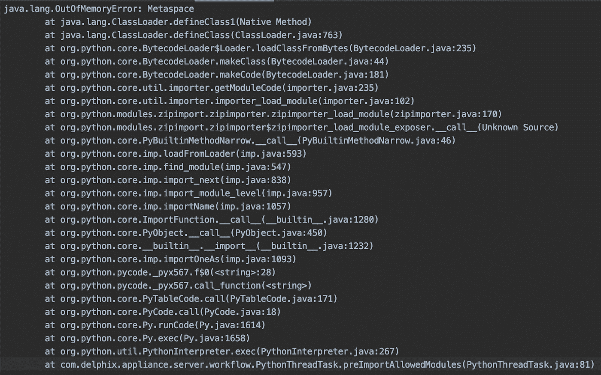
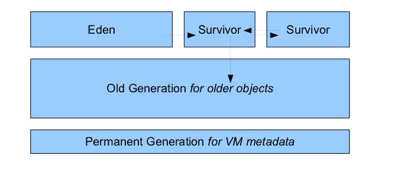
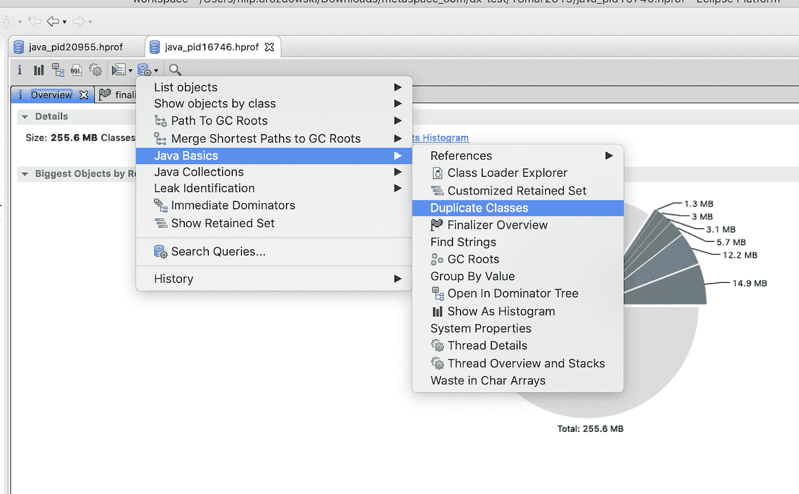
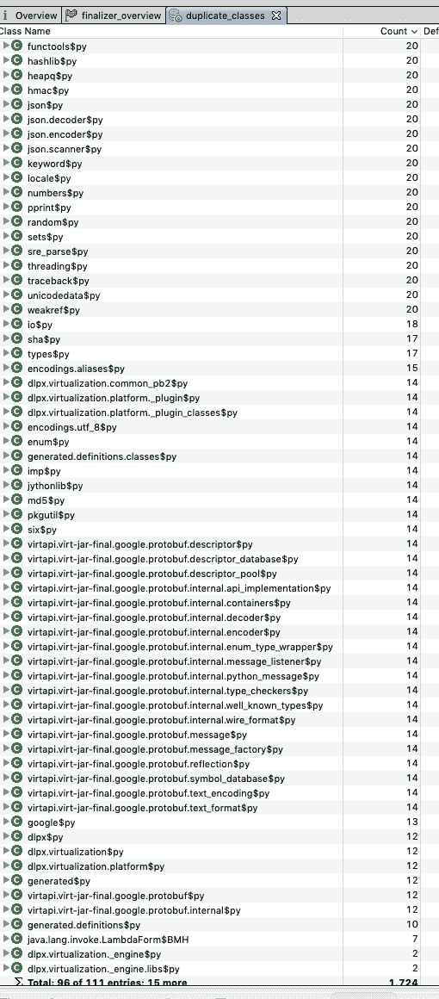
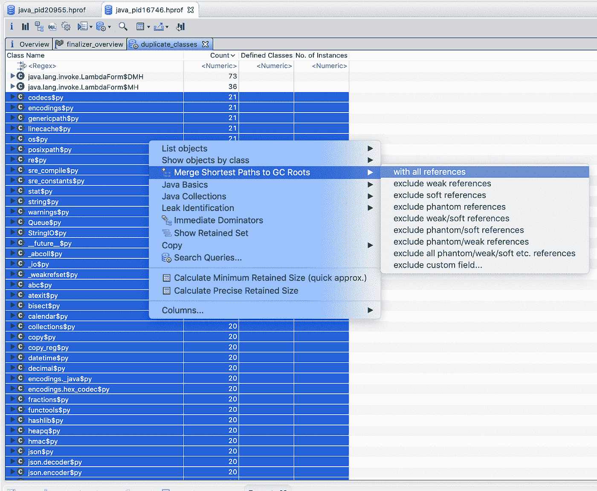
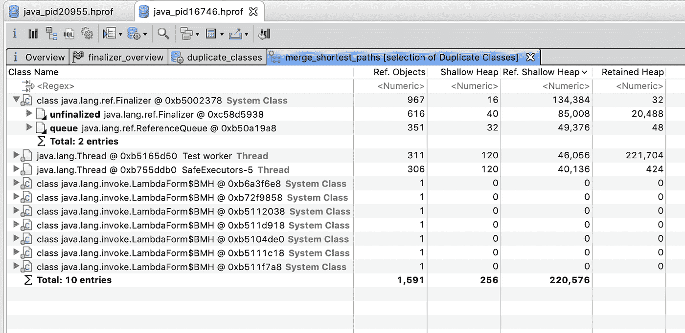
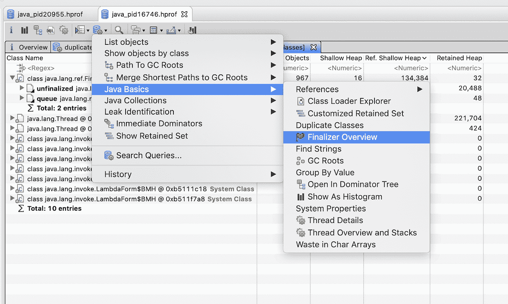
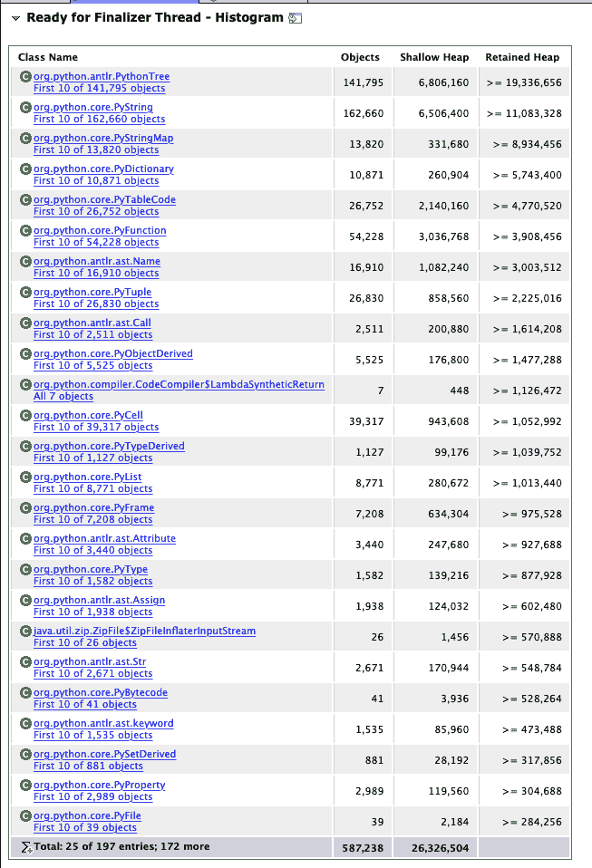
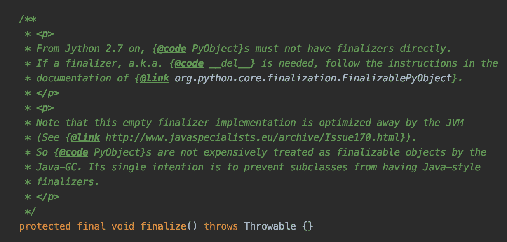
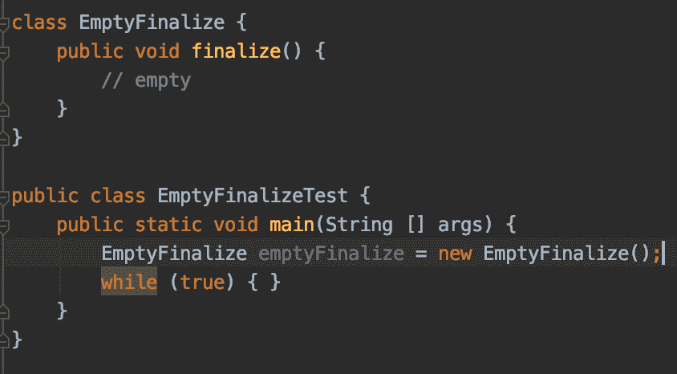

# 代码覆盖工具会导致意外的 Java 内存不足错误

> 原文：<https://itnext.io/code-coverage-tools-can-cause-unexpected-java-out-of-memory-errors-c6932882bff0?source=collection_archive---------2----------------------->

我最近开始使用 Jython，以便在 Java 虚拟机(JVM)中为 Delphix 的一个项目执行 Python 代码。对于那些不熟悉 [Jython](https://www.jython.org/) 的人来说，这是一个基于 JVM 的 Python 实现。可以将 Python 源代码编译成 Java 字节码，在 JVM 中执行。当我们开始使用 Jython 时，一切都很顺利…直到我们开始对我们的产品进行功能测试。每隔一次测试运行都会遇到`java.lang.OutOfMemoryError: Metaspace`错误。继续阅读，找出原因。

使用 Jython 很容易。这就像为 Jython 解释器生成一个 Java 包装器的实例一样简单，并且您已经准备好执行任意 Python 代码了。在我们的项目中，我们创建了一个沙箱，这样代码就不能执行任何恶意的系统调用。作为沙盒的一部分，我们导入了大约 50 个客户可以利用的白名单模块。每个模块都被编译成一个类文件。这意味着对于 Jython 解释器对象的一个实例，我们必须加载大约 50 个新的 Java 类。值得一提的是，在我们最初的设计中，我们有多个运行不同代码的 Jython 解释器。我们用一个单元测试对代码进行了压力测试，这个单元测试将并行创建数百个 Jython 解释器并执行一些 Python 代码。我们从未遇到过任何问题。然而，一旦我们开始对我们的产品进行功能测试，我们就开始非常频繁地遇到`java.lang.OutOfMemoryError: Metaspace`。



java.lang.OutOfMemoryError:元空间堆栈跟踪

回顾一下，元空间是 Java 进程中包含类元数据的区域。在 Java 8 之前，元空间位于堆上，但是从 Java 8 开始，它从堆中移出，进入本机内存。默认情况下，元空间只受 JVM 进程可用的本机内存量的限制，但实际上，您应该将其限制在适合您的应用程序的大小(这需要一些调整和实验)。您可以使用名为`MaxMetaspaceSize`的 JVM 标志来限制元空间的大小。如果不限制元空间，您可能直到很久以后才注意到内存泄漏(可能在生产环境中)。

Java 8 之前:



来源:[Pardeep Kumar](https://www.blogger.com/profile/15415177669352479825)via[Java-latte](http://java-latte.blogspot.com/2014/03/metaspace-in-java-8.html)【1】

从 Java 8 开始


来源:[帕迪普·库马尔](https://www.blogger.com/profile/15415177669352479825) via [爪哇咖啡](http://java-latte.blogspot.com/2014/03/metaspace-in-java-8.html) [1]

有几个原因可能会导致内存不足元空间错误。最常见的有:

*   加载的类太多
*   加载了重复的类
*   大班
*   类加载器泄漏

当发生元空间错误时，调查的第一步是查看 JVM 进程生成的堆转储。为了研究堆转储，我一直使用 Eclipse MAT(内存分析工具)。我首先使用了“重复类”特性来查看一些类是否会被加载很多次，而没有什么好的理由。



使用 Eclipse MAT 查找重复的类



对应于 Python 模块的类的多个副本

看上面的图片，你马上会发现有很多 Java 类的名字都是以`$py`结尾的。这些课很多都有差不多 20 本！查看 Eclipse MAT 中的线程概述，只有少数线程执行 Python 代码。这意味着 Jython 解释器对象要么没有被垃圾收集器清理掉，要么清理得非常慢。现在让我们看看哪些对象阻止了这些类被垃圾收集。



寻找重复类的 GC 根

通过合并到垃圾收集器根的最短路径，我们看到大多数阻止这些类被清理的引用都来自系统终结器。



大多数重复的类都由终结器引用

提醒一下，所有实现了`finalize()`方法的对象在被垃圾收集之前都会排队。有一个后台终结器线程运行并执行每个对象的`finalize()`方法。只有这样，垃圾收集器才能释放与这些对象相关联的内存。正如 Brian Goetz 在关于“垃圾收集和性能”的文章中所指出的[2]:

> 在可终结对象被回收之前，至少需要两个垃圾回收周期(最好的情况)。

幸运的是，Eclipse MAT 允许您通过显示“Finalizer Overview”来查看哪些对象正在队列中等待被终结。



终结器概述显示哪些对象正在等待终结

当我看到超过 587k 个 Jython 对象(`org.python.*`)等待终结时，“终结器概述”令人惊讶。可以看到`PythonTree`、`PyString`、`PyStringMap`等。正在等待终结器线程。我深入 Jython 源代码，注意到这些类都没有实现`finalize()`方法。然而，事实证明它们都从`PyObject`继承了`finalize()`方法，这似乎是 Java 中任何 Python 对象的表示。



等待终结器线程的大多数对象都是 Jython 对象

有趣的是，`PyObject`的`finalize()`方法是空的，但是它包含了一个注释，为进一步的研究提供了一些线索。



[PyObject.java 源代码](https://github.com/jythontools/jython/blob/master/src/org/python/core/PyObject.java#L130)

Jython 代码期望空的`finalize()`方法被优化掉。这在 compile team 中显然不会发生，因为我尝试了一个实验，用空的`finalize()`方法编译一个 Java 类，反编译后它仍然存在。这意味着空的`finalize()`方法必须在运行时被实时(JIT)编译器优化掉。显然，在我们运行功能测试的 JVM 中，情况并非如此。这让我想到，也许我们的一个 JVM 标志(我们有很多这样的标志)阻止了 JIT 编译器优化空的 finalize 方法。我阅读了我们传递给 JVM 进程的所有标志，将它们与 Oracle 文档和一些开发人员的博客进行了交叉引用，但没有猜到哪个标志可能有问题。因此，我决定设计一个小实验来帮助我找到罪犯。



该实验基于以下想法:

1.  编译具有空`finalize()`方法的`EmptyFinalize`类的源代码(在上面的截图中)。
2.  使用我们在测试虚拟机上运行的功能测试中使用的所有标志(除了一个标志)启动 JVM 进程。
3.  创建一个`EmptyFinalize`的实例。
4.  进入无限循环。
5.  采取堆转储。
6.  验证系统终结器在`EmptyFinalize`对象的垃圾收集器根中(空的`finalize()`方法没有被优化掉)。
7.  重复直到第 6 点。不是真的。

经过漫长而乏味的过程后，我找到了导致 JIT 编译器不优化空`finalize()`方法的标志:

```
-javaagent:/lib/org.jacoco/org.jacoco.agent-0.8.5.jar
```

当时，我不知道什么是 [JaCoCo](https://www.eclemma.org/jacoco/) 。经过一些快速的研究，我发现它是我们在功能和单元测试运行中用来测量代码覆盖率的工具。也就是说，上面的标志只在测试虚拟机上的测试运行期间传递给我们的 JVM 进程。这解释了为什么我从来没有能够在本地重现这个问题！现在，为什么 JaCoCo 会阻止 JIT 完成它的工作呢？JaCoCo 对 Java 进程做了什么？[JaCoCo 文档](https://www.jacoco.org/jacoco/trunk/doc/implementation.html)揭示了这个问题:

> **覆盖分析机制* *
> 
> 覆盖率信息必须在运行时收集。为此，JaCoCo 创建了原始类定义的测试版本。在使用所谓的 Java 代理加载类的过程中，插装过程是动态进行的。
> 
> **字节代码操作* *
> 
> 插装需要修改和生成 Java 字节代码的机制。JaCoCo 在内部使用 ASM 库来实现这个目的。

自然，对于 JaCoCo 来说，要测量代码覆盖率，它需要在运行时检测 Java 字节码。空的`finalize()`方法不会被优化掉，因为它们从来都不是空的！如果我使用相同的 Java 字节码操作库( [ASM](https://asm.ow2.io/) )来检查 Jython 对象的字节码，而这些对象的`finalize()`方法应该被优化掉，我可能会注意到这一点。

这个故事的寓意是什么？我注意到，在我们的测试运行中，我们将 JaCoCo 代理传递给我们的 JVM 进程，而没有指定要检测哪些 Java 包来测量代码覆盖率。这意味着我们最终要检测项目所有(许多)依赖项的字节码！ [JaCoCo Java 代理允许您传递标志来排除或包含您想要为](https://www.eclemma.org/jacoco/trunk/doc/agent.html)创建代码覆盖的包。这个故事的寓意是，您应该只为您自己的代码而不是第三方依赖来度量代码覆盖率，这可以通过将`includes=com.your.package.name.*`标志传递给 JaCoCO 代理来完成。

1.  帕迪普·库马尔。(2020 年 2 月 25 日)。*Java 8 中的 Metaspace*[http://Java-latte . blogspot . com/2014/03/Metaspace-in-Java-8 . html](http://java-latte.blogspot.com/2014/03/metaspace-in-java-8.html)
2.  布莱恩·戈茨。(2020 年 2 月 25 日)。*垃圾收集与性能*[https://www . IBM . com/developer works/library/j-jtp 01274/index . html](https://www.ibm.com/developerworks/library/j-jtp01274/index.html)