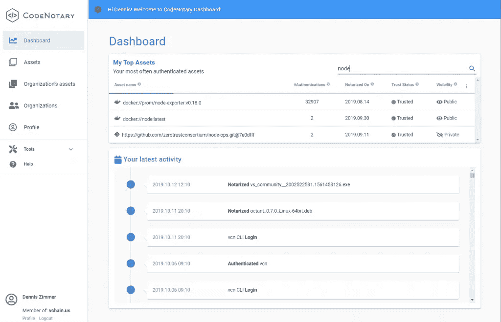
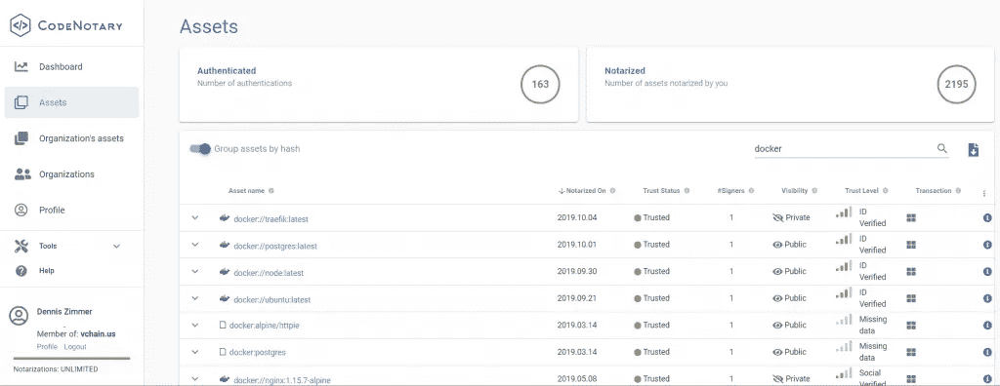
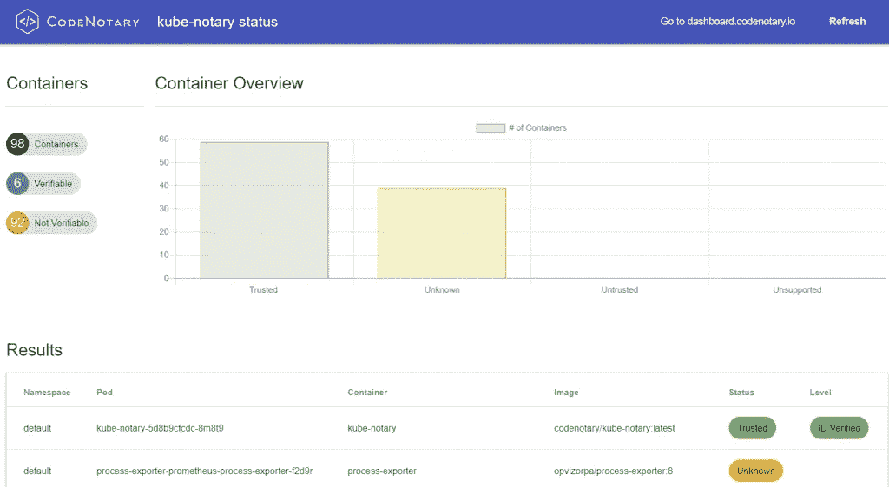

# code 公证人产品更新—2019 年 10 月

> 原文：<https://itnext.io/codenotary-product-update-october-2019-63436a164a4c?source=collection_archive---------2----------------------->

我们非常激动地宣布我们的新版本 code 公证人今天上线。

这次更新包括了一大堆更小和更大的变化以及外观和感觉的改进。它的结构更好，入门比以前更容易，你可以免费使用所有功能。

我们非常努力地报道了过去几个月里我们收到的大多数令人惊叹的社区和用户反馈。

在我们分享**新内容**之前，我们还想介绍一下我们新的**吉祥物**，它将引导您了解我们的开源项目:

# code 公证人的新功能

*   更新仪表板设计
*   新增文档页面:[https://docs . code 公证人. io](https://docs.codenotary.io)
*   新的公证密钥功能，可简化密钥管理流程
*   新组织的资产页面，所有资产由组织成员公证
*   新组织的专用页面在[https://authenticate . code 公证人. io](https://authenticate.codenotary.io)
*   用于身份验证的新 REST API
*   重新设计的[https://authenticate . code 公证人. io](https://authenticate.codenotary.io)
*   更新了 code 公证人 Chrome 扩展
*   改进了 git repos、目录、podman 图像、docker 图像的公证
*   公证人的新 GitHub 行动:[https://github.com/vchain-us/verify-action](https://github.com/vchain-us/verify-action)
*   完全透明——查看 [ZTC](https://www.zerotrustconsortium.org) 区块链上的公证交易
*   我们的 GitHub 库的各种更新
*   和更新我们的 docker 容器图像

虽然您可以在入职培训或我们的新文档页面[https://docs . code 公证人. io](https://docs.codenotary.io) 上找到所需的大部分信息，但我们希望与您分享一些新的仪表盘截图，让您更好地了解我们的新设计。

# 仪表盘

开始你的旅程你的顶级资产和你的活动时间表。这样，您就可以始终跟踪您或您的管道服务(即 Jenkins)经过公证或认证的数字资产。

# 资产

该视图有助于您根据公证检查资产详细信息。与数字证书签名不同，您可以在不更改数字对象的情况下对其进行公证，但所有信息都以不可变的方式进行公证，包括细节。

您可以随时删除任何数字资产的信任。这个特性非常强大，以防你不想再使用这些资产。结合我们的 docker watchdog 或 Kube-公证人，您可以在几秒钟内跟踪任何运行的不受信任的容器图像。

查看我们最新的博客帖子，这些帖子涵盖了 Microsoft Azure DevOps，但可以适用于任何 Jenkins 和/或 Kubernetes 环境:

[保护您的 Azure DevOps 生态系统，Jenkins 和 Kubernetes (AKS)使用 code 公证人—第 1 部分](https://www.codenotary.io/securing-your-azure-devops-ecosystem-jenkins-and-kubernetes-aks-using-codenotary-part-1/) [保护您的 Azure DevOps 生态系统—第 2 部分](https://www.codenotary.io/securing-your-azure-devops-ecosystem-jenkins-and-kubernetes-aks/)

# 数字资产详细信息

让我们以非常受欢迎的云本地边缘路由器 Traefik 为例，我们在 Containous 的朋友正在开发和维护 https://traefik.io/[的](https://traefik.io/)

您可以简单地信任 Traefik 的最新版本，并取消对您不想再使用的所有旧版本的支持。如果您使用[Kube-公证人](https://docs.codenotary.io/integrations/kube-notary.html)，您将可以立即实时检查您的运行时，就像我们演示环境中的这个例子:

当然，我们很乐意得到您的反馈，如果您在 GitHub 或 Dockerhub 上向我们展示您的支持，我们将会非常激动！高度赞赏！

*原载于 2019 年 10 月 25 日*[*https://www . code 公证人. io*](https://www.codenotary.io/codenotary-product-update-october-2019/) *。*