# 代码推送正在运行

> 原文：<https://itnext.io/codepush-in-action-3cc97d6affa5?source=collection_archive---------6----------------------->

一步一步行会实现代码推送

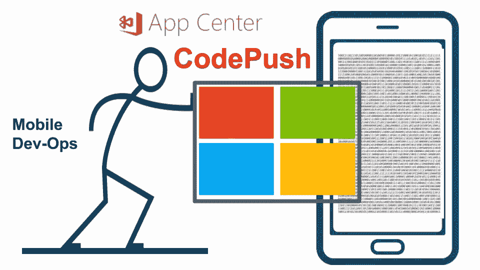

代码推进图示表示

# 谁应该阅读这篇文章？

希望在其项目中实现 CodePush 的混合手机应用程序开发人员

# 这篇文章描述了什么？

基本了解 CodePush，如何在项目中实现，最后有一个演示。因为我是一个自豪的 Android 手机的拥有者，这个演示和文章将集中在它的 Android 方面，然而，对于 iOS，这个过程仍然是相同的

# app 最后会是什么样子？

这是你能想象到的最简单的应用程序。这个应用程序的想法是展示代码推送的能力。我们会稍微改变一下应用程序的外观，然后看看它是如何变化的，而不需要重新安装，

科尔多瓦代码推送应用示例

# CodePush 的前提条件是什么？

下面是所有先决条件的列表，

1.  *必须有 App 中心账号，*
2.  *在应用中心注册的测试人员电子邮件 id(如果您希望稍后通过应用中心安装应用)，*
3.  *Nodejs，*
4.  *应用中心 CLI，*
5.  *科尔多瓦，*
6.  科尔多瓦 CLI
7.  *安卓 SDK/Studio，*
8.  *仿真器或设备(启用开发者选项)，*
9.  *饭桶，*
10.  *VS 代码(你选择的任何编辑器)*

# 如何在我的应用中引入 CodePush，从哪里入手？

下面是在项目中开始使用 CodePush 必须执行的步骤，

*   **在应用中心创建一个应用，**

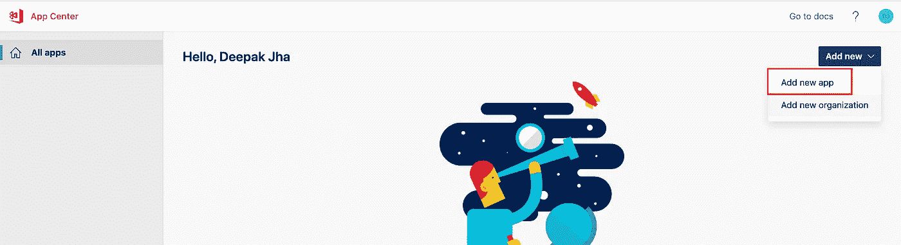

AppCenter 创建应用程序

*   **在系统中创建 Cordova app，**

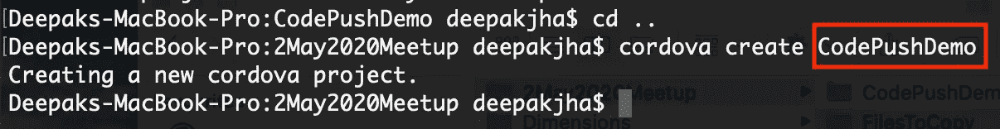

Cordova 应用程序创建

*   **添加应用中心中提到的插件，**
    只有当您希望使用应用中心分析和应用中心崩溃分析服务`cordova plugin add cordova-plugin-appcenter-analytics``cordova plugin add cordova-plugin-appcenter-crashes`时，这些插件才是强制性的

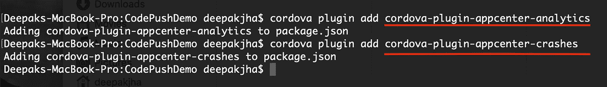

应用中心插件添加

*   **在代码库中添加适当的平台**(本演示仅涵盖 Android。Ios 的使用情况也类似)

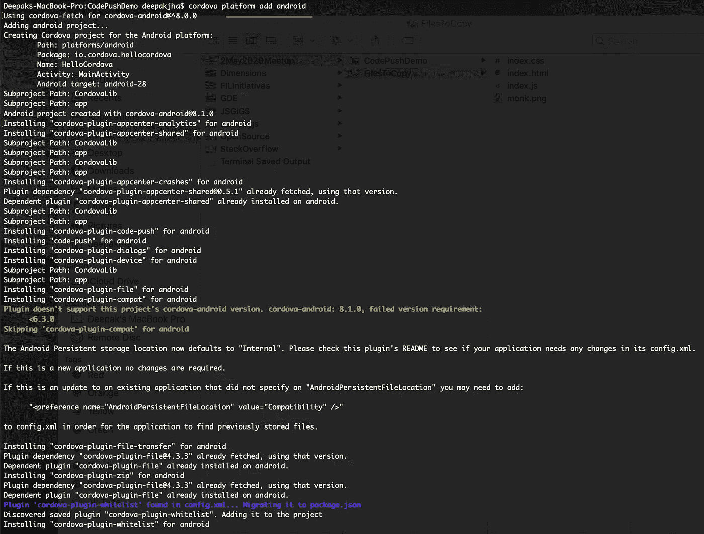

在 Cordova 应用程序中添加 Android 平台

*   **使用您的应用程序密码**更新 `config.xml` **文件，配置 SDK 以在应用程序中心使用您的应用程序**

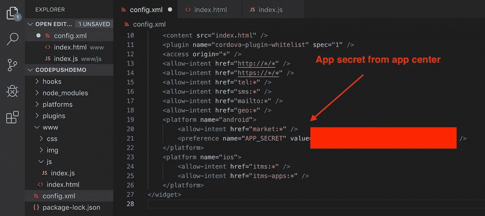

codepush 的 Config.xml

*   **在应用中心选择码推服务**

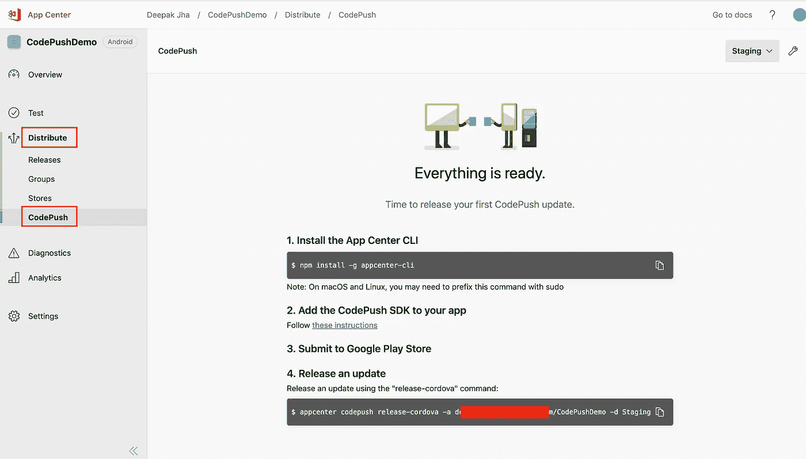

代码推送应用中心

*   **为 CodePush** 添加必要的插件(在您的 Cordova app 目录终端中运行下面的命令)
    `cordova plugin add cordova-plugin-code-push@latest`

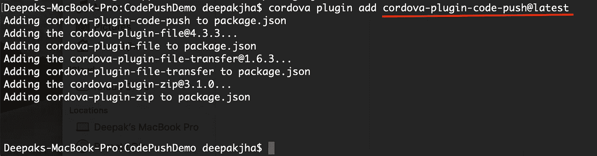

添加代码推送插件

*   **复制** `config.xml`中的环境键(用于本演示)**，**

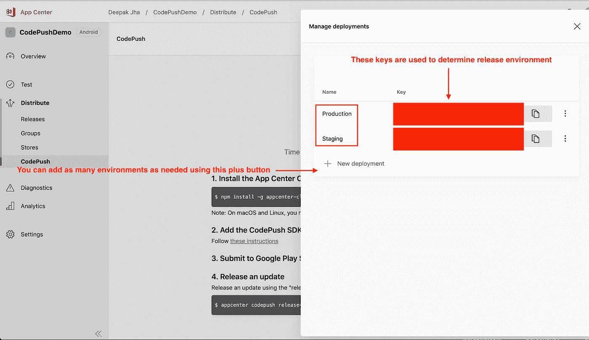

代码推送的环境键

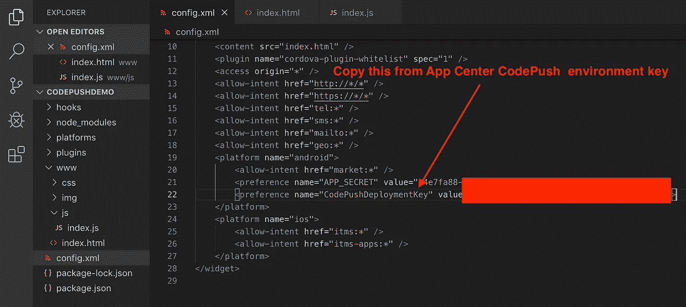

CodePush Cordova 应用程序的 Config.xml

*   **在你的应用程序中添加代码推送逻辑，** 这个逻辑已经被添加到`onDeviceReady`事件中，但是它取决于开发者为它选择正确的位置，这可以在应用程序生命周期的任何事件中添加(`onLoad, onDeviceReady, onPaue,onResum,onMenuKeyDown`)，

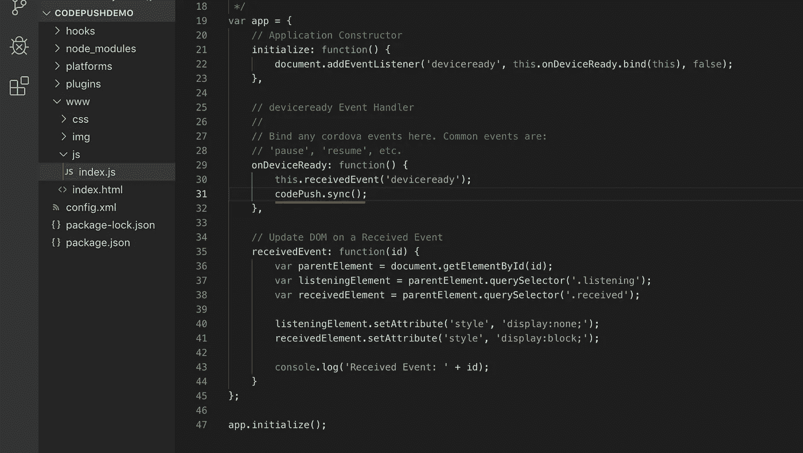

码推同步逻辑

*   **根据需求**更新代码(更改代码)，第一次必须通过 app center 或命令行安装应用程序(我更喜欢命令行，因为第一次出现错误时更容易调试)

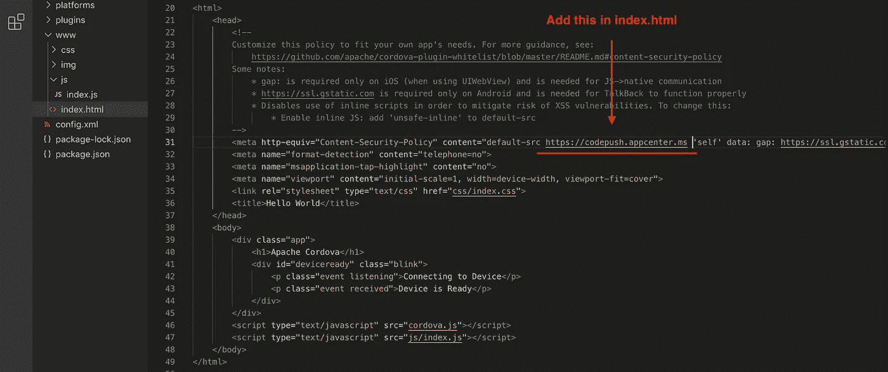

应用中心的内容安全性

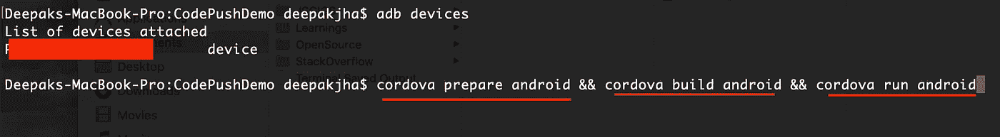

首先在 Android 设备上运行 CodePush

*   **应用安装成功后，你可以看到如下控制台**(使用 chrome inspect) **。**没有错误，也可以清楚地看到来自 CodePush 插件的消息。

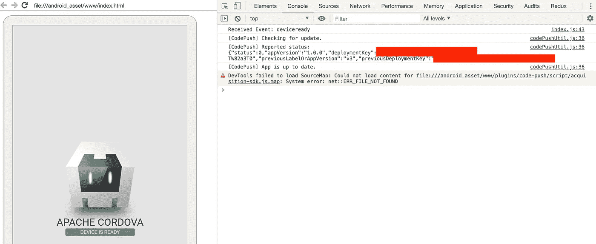

使用 chrome 的 Cordova Android 应用程序://inspect

# 现在是时候来看看 CodePush 的美妙之处了。完成上面给出的所有步骤后，您已经在测试设备中安装了应用程序

*   **按要求做代码修改。在本文的开始，我已经列出了一个应用程序，它是所有代码更改后的最终结果。更改后需要运行下面给出的命令来推送 AppCenter CodePush 中的更改，页面仍然是空的如下所示，**

CodePush 应用程序中心控制台

*   **释放代码，从此命令** `appcenter codepush release-cordova -a <username>/<app-name(CodePushDemo)> -d staging`

在成功运行该命令之后，类似这样的消息将显示在终端中，其确定代码推送更新的成功发布，

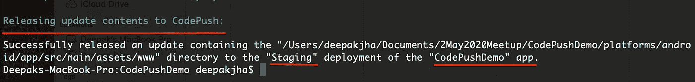

在应用中心代码推送中推送更新

查看应用程序中心代码推送部分，会列出如下所示的应用程序更新，

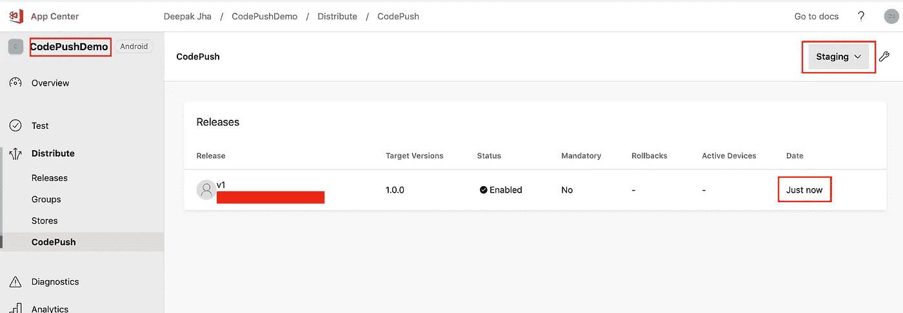

带有版本的代码推送控制台应用程序列表

*   **检查应用程序的更新，让我们看看应用程序是否能够成功接收更改，**(敏感文本(应用程序密码和代码按键)隐藏在红色方框后面)

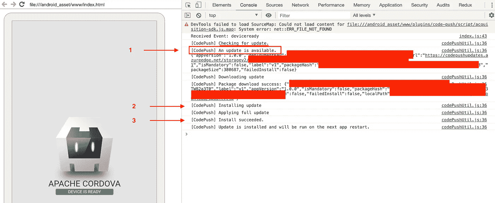

接收代码推送更新 chrome://inspect 设备

# **如果你想知道为什么 app 更新不显示在屏幕上？**

这是因为我在应用程序中编写了更新代码的逻辑。同样的逻辑在`onDeviceReady`事件中给出。为了看到变化，我必须重启应用程序，

重启我的应用程序后，这是应用程序的外观，

无需重新安装的更新应用程序

> 注意:如果你想更深入地研究这个主题，这里有微软的官方链接
> 
> [https://docs . Microsoft . com/en-us/app center/distribution/code push/Cordova](https://docs.microsoft.com/en-us/appcenter/distribution/codepush/cordova)

# 摘要

我尝试总结了在应用程序中使用 CodePush 的步骤。从应用中心应用程序创建到应用程序更新。

在当前的时间，由于整个世界所面临的可怕的悲观局势。每个人在项目中使用 DevOps 是绝对必要的。这是一个非常简单的应用中心功能演示。它是一个可以简化移动应用程序开发工作流程的优秀工具。