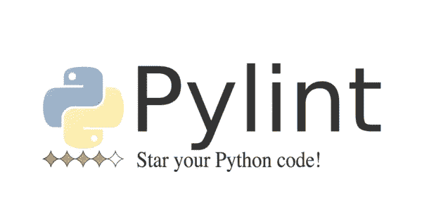

# 开源项目的编码风格？

> 原文：<https://itnext.io/coding-styles-for-open-source-projects-c27fdffb5339?source=collection_archive---------6----------------------->

卢卡·布拉沃在 [Unsplash](https://unsplash.com/search/photos/hacking?utm_source=unsplash&utm_medium=referral&utm_content=creditCopyText) 上的照片

# 投稿时如何维护编码风格

在我的[上一篇文章](https://medium.com/@steven_atkinson/a-practical-guide-to-contributing-to-open-source-projects-1fcd607b9087)中，我忘记提到一个事实，我正在为其做拉请求的库有一个[贡献者指南](https://github.com/stympy/faker/blob/master/CONTRIBUTING.md)。这篇文章概述了如何在你的项目中实施编码标准和风格。

# 如何在开源自己的项目时保持编码风格

每个人都有自己写代码的风格。当您对项目进行开源时，您希望确保您编写*初始提交*时使用的风格在项目的整个生命周期内都是有效的。

以前，这是为代码审查过程保留的任务。你可能会检查某人的代码，然后不经意地提到“我们在这个项目中是这样做的”。我自己也知道，这种说法说了很多次，听起来好像你对你想要的代码是什么样子很不耐烦😅。

幸运的是，我们有工具将我们从这种负担中解救出来。让我们看看有什么优惠。

# 有什么工具可以伸出援手？

> RuboCop 是一个 Ruby 静态代码分析器。开箱即用，它将执行社区 [Ruby 风格指南](https://github.com/bbatsov/ruby-style-guide)中概述的许多准则。

Rubocop 用于 Ruby 项目。这是我在 [Faker](https://github.com/stympy/faker) 项目中做拉动请求时使用的工具。它通过在你的代码中寻找**错误**来工作。违法行为是不符合 Rubocop 配置中定义的标准的代码。

> [JSHint](https://github.com/jshint/jshint) 是一个社区驱动的工具，可以检测 JavaScript 代码中的错误和潜在问题。由于 JSHint 非常灵活，您可以在您期望代码执行的环境中轻松地调整它。JSHint 是开源的，并且将永远保持这种状态。

当我第一次开始使用 Javascript 构建 web 应用程序时，JSHint 是我的首选。使用 npm 命令很容易集成到我的工作流程中，并使我避免了一些新手的错误！

您可以使用 [**配置 JSHint 检查的内容。jshintrc** 配置文件](https://github.com/jshint/jshint/blob/master/examples/.jshintrc)。如果您想将 JSHint 添加到已经有自己特定样式的现有项目中，这是很方便的。

> [ESLint](https://eslint.org/) 是一个开源项目，最初由 [Nicholas C. Zakas](http://nczonline.net/) 于 2013 年 6 月创建。它的目标是为 JavaScript 提供一个可插拔的林挺工具。

我记得当我开始使用 ES6 语法时，从 JSHint 切换到 ESLint。您可以通过 npm 将许多配置插入 ESLint。一些受欢迎的是:

*   [eslint-config-airbnb](https://www.npmjs.com/package/eslint-config-airbnb)
*   [eslint-config-standard](https://www.npmjs.com/package/eslint-config-standard)
*   [eslint-config-standard-jsx](https://www.npmjs.com/package/eslint-config-standard-jsx)

这些配置可以很容易地在[和**中扩展。eslintrc** 配置文件](https://eslint.org/docs/user-guide/configuring)，使您能够关闭[逗号悬挂](https://eslint.org/docs/rules/comma-dangle)👀

> Pylint 是一个 Python 源代码分析器，它寻找编程错误，帮助执行编码标准，并嗅探一些代码气味(如马丁·福勒的重构书中所定义的)。

我并不经常使用 Python，但是当我使用的时候，我喜欢确保我遵循了 Python 社区中常见的标准。当你不定期阅读他人的源代码时，你很难适应标准。

您可以使用 [**pylintrc** 配置文件](https://github.com/PyCQA/pylint/blob/master/pylintrc)来配置这个 linter。

# 为什么一致性代码风格很重要？

它强制所有开发人员参与一个项目，以适应您的项目风格。

我们都有自己独特的编写代码的方式，如果能以自己的方式为一个项目做出贡献，那就太棒了。但是想象一下几个月后浏览源代码…

我可以想象它看起来像一团乱麻:

*   不一致的语法
*   以怪异而奇妙的方式声明的变量
*   以不同方式迭代的循环
*   使用回调、承诺和异步/等待语法组合的函数

# 结论

我希望你能从这种心态中摆脱出来，编码标准不仅仅是为了确保每个人都遵循你选择的编码风格，而是为了帮助那些想要为你的项目做贡献的开发人员。