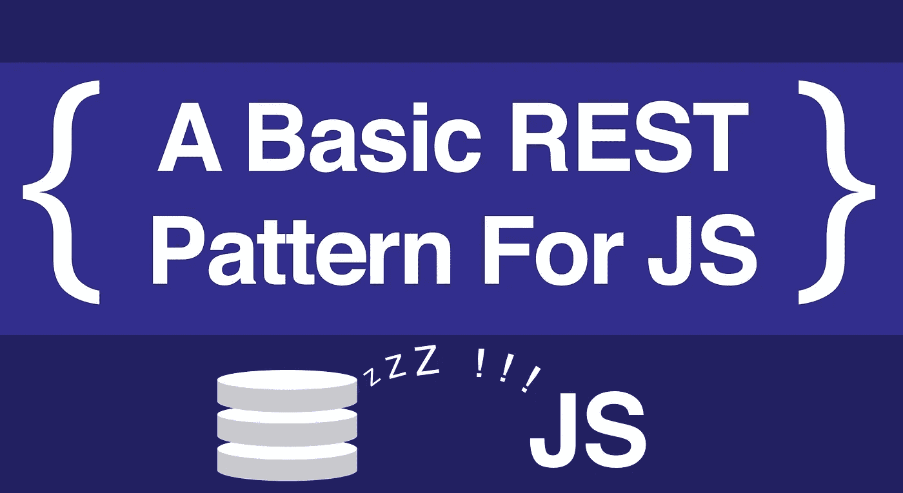

# 为 JavaScript 编写 5 个基本的 RESTful 动作

> 原文：<https://itnext.io/coding-the-5-basic-restful-actions-for-javascript-c25279483e4f?source=collection_archive---------6----------------------->



RESTful 模式很棒，它简化了我们的 API 和网站，让开发者不再试图用他们的 URL 耍花招。然而，对于程序员来说，如何将它应用到前端通常是很困难的。这看起来太多了，但是通过分解，我们会发现这是从数据库中获取数据的最佳方式。

# 前端的休息甚至比后端更简单

本质上，休息很简单。你想显示所有的东西，显示一个东西，制作一个东西，更新一个东西，或者销毁一个东西。您通常还需要显示用于创建和更新的表单，所以这是另外两条途径。但是对于 JavaScript，尤其是一个单页应用程序，我们真的不需要担心这两个，我们只需要坚持做真正工作的五个。

# 设置和概述

我们会做 5 个方法:`getAll()`、`getOne()`、`create()`、`update()`，当然还有大家最喜欢的`destroy()`。我将假设您有一个基本的服务器可以使用，并且对 [fetch](https://developers.google.com/web/updates/2015/03/introduction-to-fetch) 有相当好的理解。如果你没有，这里有我的文章[关于使用](https://medium.com/@mikecronin92/using-json-server-to-create-a-restful-server-in-5-seconds-78b85ccf832b) [JSON 服务器](https://github.com/typicode/json-server)快速设置一个假的本地 RESTful 服务器，还有另一篇[关于使用](/that-data-looks-so-fetching-on-you-understanding-the-js-fetch-api-880eae0c8d25)T5。或者就用谷歌吧，这是个自由的国度，活一点。

我们将启动的应用程序只是一个简单的任务列表。我们的数据库将有一个任务列表。我们不会实际显示或设计或显示我们的任务，我们现在只是在控制台上玩玩。我们现在也不会担心错误处理。

# 有一种方法可以让他们都

这是我们最简单的方法，但却非常重要。它的工作是显示你的数据库中的一切。这是:

```
function getAll() {
  return fetch("[http://localhost:3000/tasks](http://localhost:3000/tasks)")
    .then((response) => response.json())
}
```

我们正在返回我们得到的任何东西，因为我们实际上想在函数之外使用这个值。然后，我们从数据库中获取 REST 索引路由，这将返回一个解析的承诺，其值是一个[响应对象](https://developer.mozilla.org/en-US/docs/Web/API/Response)。为了实际获取数据，我们使用`json()`响应方法返回一个 JSON 对象。记住，我们*正在*返回最终值，当箭头函数只有一行长时，它们有一个隐式返回。

这或多或少是所有方法的模式。我们将获取一个响应对象，然后用 JSON 对象作为值返回一个解析的承诺。我们的代码稍后可以通过简单地附加另一个`then()`来处理这个问题，比如:`getAll().then( /* work with our JSON object*/)`

# 现在只拿一个

好的，这是我们所有的任务，但是如果我们只想要一个呢？基本上是一样的:

```
function getOne(id) {
  return fetch("[http://localhost:3000/tasks](http://localhost:3000/tasks)/" + id)
    .then((response) => response.json())
}
```

唯一的实际变化是 url，我们传入的 id 将引导我们到那个资源的路由。但是等等，这段代码还没干；我们的基本 url，"[http://localhost:3000/tasks](http://localhost:3000/tasks)"与上一个相同，为什么我们不把它放在变量中呢？

```
const baseUrl = "[http://localhost:3000/tasks](http://localhost:3000/tasks)"function getAll() {
  return fetch(baseUrl)
    .then((response) => response.json())
}function getOne(id) {
  return fetch(`${baseUrl}/${id}`)
    .then((response) => response.json())
}
```

很好。

# 下一个:摧毁

沿着链条向上，我们来到了`destroy()`。现在，我们的 fetch 不仅仅是从数据库中检索数据，它实际上将删除数据。为此，我们必须在我们的`fetch()`中发送一些设置和我们的 url:

```
function destroy(id) {
  let options = { method: 'DELETE' }
  return fetch(`${baseUrl}/${id}`, options)
    .then((response) => response.json())
}
```

这个 options 对象填充的是可选参数`init`，但是称它为`options`会让我们做的事情更清楚一点。我们有一些获取设置的选项，我们正在决定它们是什么。当涉及到`destroy()`时，我们必须告诉`fetch()`不要使用 GET 的默认 http 方法，而是使用 DELETE，这样我们的服务器将实际删除该 url 上的资源。

# 差不多完成了:让我们创建一个

再次提升一层复杂性，对于`create()`，我们现在必须在选项中发送头部和主体:

```
function create(data) {
  let options = {
    method: 'POST',
    headers: {
      'Content-Type': 'application/json'
    },
    body: JSON.stringify(data)
  }
  return fetch(baseUrl, options)
    .then((response) => response.json())
}
```

发送 body 的原因很简单:它是我们想要存储在 db 中的实际数据。然而，在我们发送它之前，我们必须将其字符串化。请记住，我们只能发送和接收字符串，解析数据取决于两端的程序。

为了帮助服务器解析它，我们附加了一个嵌套的`headers`对象。服务器会得到一个字符串，它需要请求中的头来告诉它正在查看什么类型的数据。十有八九是 JSON，所以我们使用`‘Content-Type’: ‘application/json’`。

您可能还想知道，如果我们只是向数据库发送一些东西，为什么我们还会返回任何东西。虽然在控制台中查看在数据库中创建了什么对象很有帮助，但它主要用于(最终)呈现我们的页面。通过返回新创建的对象，我们可以将该单个元素添加到我们的页面中，而不是试图获取整个新的任务列表来获取它末尾的新任务列表。

# 最后一次:更新

要更新我们的一项任务，我们需要它的 id 以及一个包含更新数据的新机构:

```
function update(id,data) {
  let options = {
    method: 'PATCH',
    headers: {
      'Content-Type': 'application/json'
    },
    body: JSON.stringify(data)
  };
  return fetch(`${baseUrl}/${id}`, options)
    .then((response) => response.json())
}
```

这里需要警告的是，虽然我们的其他 http 动词不必都是大写的，但是为了避免与 [CORS](https://frontendian.co/cors) 相关的问题，您应该总是将 PATCH 放在大写的位置。`update()`基本上与`create()`相同，我们只是获取一个特定资源的 url，而不是`baseUrl`。同样，我们正在返回新编辑的对象，所以最终将能够很好地渲染它。

# 随机应变。适应。去拿。

所以所有这些功能都很好，但是还有一个步骤*你可以*去做。从技术上讲，我们刚刚制造了一种叫做*适配器*的东西。本质上，我们使用这段代码作为前端和后端之间的*适配器*。就像当你想在苹果手机上使用普通的耳机时，为了把数据传到耳朵里，你需要一个适配器。但与苹果手机适配器不同的是，我们的代码并不是一个明显的现金攫取。

此外，较大的项目可能有不止一个适配器，所以最好以某种方式封装这些函数，然后将它们放入自己的文件中。该文件被称为 adapter.js，或者称为特定的适配器，就像 taskadapter.js 一样。对于封装，我个人更喜欢将它们全部扔进一个对象中，这样当我在整个代码中使用这些方法时，就可以清楚这些方法属于哪个对象。我们最终的适配器看起来有点像:

(您会注意到，我还构建了一个助手函数`toJSON()`，所以我不必一直重复我自己，但是它做了完全相同的事情)

就在那里！使用 RESTful 数据库需要的基本模式。如果有什么事情看起来令人困惑，只要继续在控制台上玩，我知道你会明白的。

快乐编码每个人，

迈克