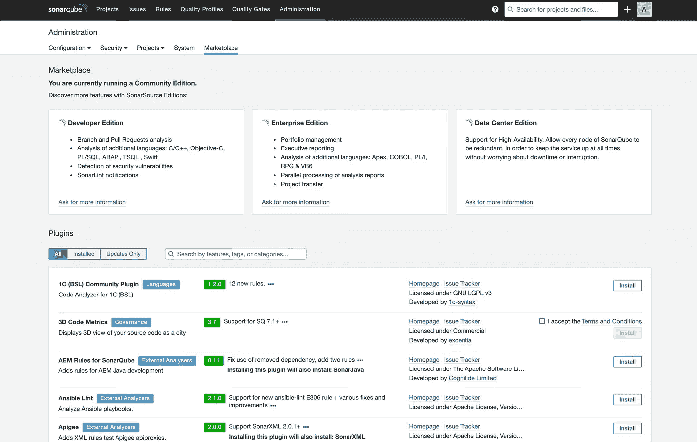
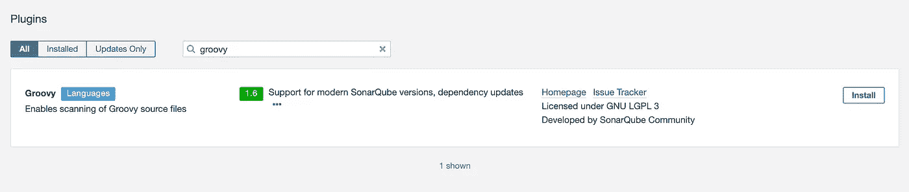
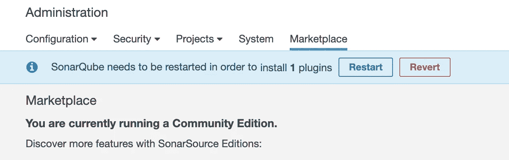
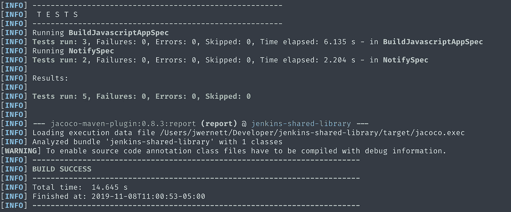
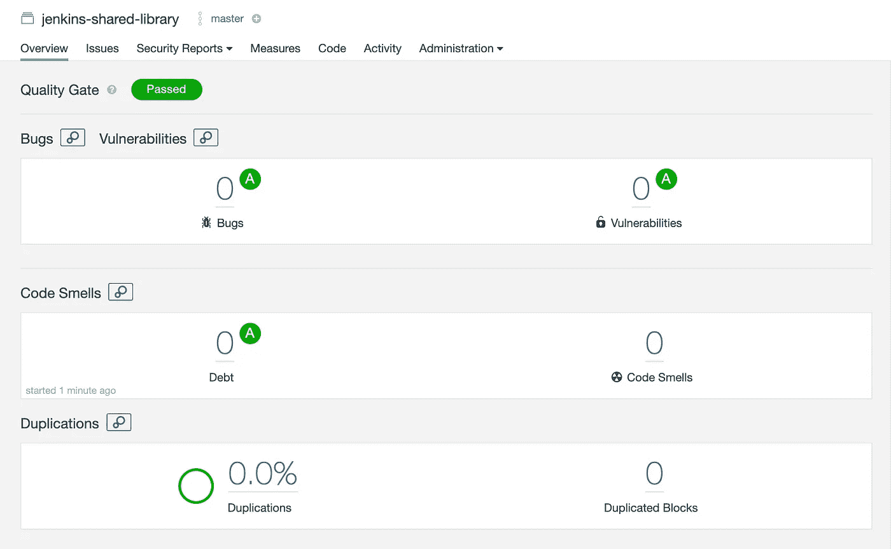
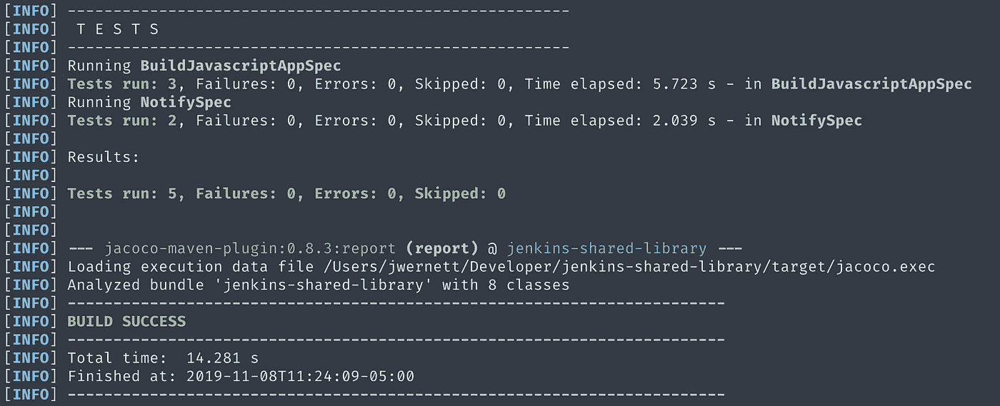
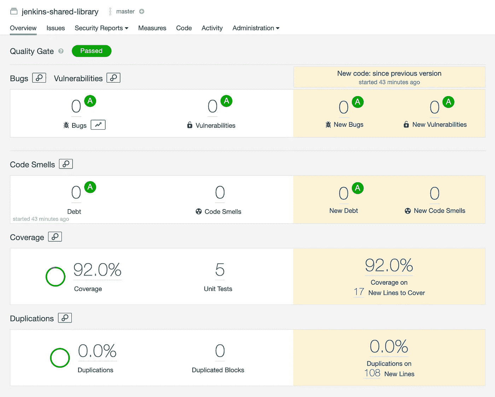

# 收集 Jenkins 共享库的代码覆盖率

> 原文：<https://itnext.io/collecting-code-coverage-for-a-jenkins-shared-library-c2d8f502732e?source=collection_archive---------1----------------------->

## 我的 Jenkins 共享库系列的第四部分


[https://jenkins.io/](https://jenkins.io/)

在我之前的文章中，我们讨论了如何为 Jenkins 共享库编写单元测试。在我的 Jenkins 共享库系列的第四篇也是最后一篇文章中，我将向您展示如何对您的共享库进行一些小的更改，这将允许您收集代码覆盖率并将结果发布到 [Sonarqube](https://www.sonarqube.org/) 。

# 先决条件

对于本教程，我们需要在本地安装 Sonarqube。您可以遵循此处提供的[说明。查找“两分钟入门指南”下的说明。这应该会让您在](https://hub.docker.com/_/sonarqube/) [http://localhost:9000](http://localhost:9000/about) 获得一个正在运行的 Sonarqube 实例。您可以使用默认用户名`admin`和密码`admin`登录。

我们需要做的下一件事是安装 SonarQube Groovy 插件。登录后，导航至[http://localhost:9000/admin/market place](http://localhost:9000/admin/marketplace)。您将看到这样一个屏幕:



在插件下的搜索框中，搜索`groovy`，然后点击插件右侧的`install`按钮。



当你点击`Install`，你会看到一条信息告诉你重启 Sonarqube。



点击`Restart`。

Sonarqube 将重新启动，然后会要求您再次登录。使用之前的默认用户名和密码。一旦完成，Sonarqube 就可以开始运行了！

# 入门指南

本教程从系列文章的第三部分[开始。如果你还没有跟上，我推荐你回到本系列的第一部分，或者你可以从 https://github.com/werne2j/jenkins-shared-library 克隆共享库。我们将继续在`tests`分公司工作。运行`git checkout tests`，这将让你回到我们开始的地方。](https://medium.com/@werne2j/unit-testing-a-jenkins-shared-library-9bfb6b599748)

# 收集代码覆盖率

我们将使用 [JaCoCo](https://github.com/jacoco/jacoco) 为我们的共享库收集代码覆盖率。这需要对我们的`pom.xml`文件做一些修改。

我们要添加的第一件事是 Sonarqube 需要的一些属性。在`properties`标签下，我们将添加:

```
<properties>...<sonar.projectName>jenkins-shared-library</sonar.projectName>
  <sonar.projectKey>jenkins-shared-library</sonar.projectKey>
  <sonar.sources>src,vars</sonar.sources>
  <sonar.tests>test</sonar.test>
<sonar.groovy.jacoco.reportPath>target/jacoco.exec</sonar.groovy.jacoco.reportPath>
</properties>
```

这告诉 Sonarqube 用`projectName`和`projectKey`向什么项目报告。代码分析的位置和测试的位置。最后，在哪里寻找代码覆盖率分析。

接下来，我们需要在`pluginManagement —> plugin`标签下添加 JaCoCo 插件。

```
<build>
  <pluginManagement>
    <plugins>
      ...
      <plugin>
        <groupId>org.jacoco</groupId>
        <artifactId>jacoco-maven-plugin</artifactId>
        <version>0.8.3</version>
        <executions>
          <execution>
            <goals>
              <goal>prepare-agent</goal>
            </goals>
          </execution>
          <execution>
            <id>report</id>
            <phase>test</phase>
            <goals>
              <goal>report</goal>
            </goals>
          </execution>
        </executions>
      </plugin>
    </plugins>
  </pluginManagement>
  <plugins>
    ...
    <plugin>
      <groupId>org.jacoco</groupId>
      <artifactId>jacoco-maven-plugin</artifactId>
    </plugin>
  </plugins>
</build>
```

这使得插件可以使用，并告诉插件在`test`阶段运行。因此，当我们运行`mvn test`时，将会创建一个覆盖报告。

就是这样！

让我们测试收集代码覆盖率，看看我们得到了什么！

我们将运行`mvn clean test`来生成一个 JaCoCo 报告。

我们应该得到这样的输出:



如果您向下看测试的输出，您将会看到`jacoco-maven-plugin`生成一个覆盖报告。现在我们将把这份报告发给 Sonarqube，看看结果如何。

现在，在您的终端中，运行`mvn sonar:sonar`。这将分析项目并向 Sonarqube 报告其结果。命令完成后，您可以导航到[http://localhost:9000/dashboard？id=jenkins-shared-library](http://localhost:9000/dashboard?id=jenkins-shared-library) 并查看分析结果。



但是等等，有些事情看起来不对劲——我们没有看到任何代码覆盖率。这其实是意料之中的。如果你看看詹金斯-斯波克杂志上的这篇评论，它谈到收集报道是多么不容易。

然而，通过我收集代码覆盖率的尝试和磨难，我能够提出这个问题的解决方案。

# 重构共享库

为了收集共享库的代码覆盖率，我们将把全局变量的逻辑移到`src`目录中。

我们将在`src/org/example`中创建两个类`BuildJavascriptApp`和`Notify`。为了与之匹配，我们将创建两个新的测试文件`BuildJavascriptAppSpec`和`NotifySpec`，它们将位于`test/src/org/example`中。目录结构现在应该看起来像这样:

```
├── jenkins-shared-library
│   ├── src
│   │   ├── org
│   │   │   ├── example
│   │   │   │   ├── BuildJavascriptApp.groovy
│   │   │   │   ├── Constants.groovy
│   │   │   │   ├── Notify.groovy
│   ├── test
│   │   ├── resources
|   │   ├── src
│   │   |   ├── org
│   │   │   |   ├── example
│   │   │   │   |   ├── BuildJavascriptAppSpec.groovy
│   │   │   │   |   ├── NotifySpec.groovy
│   │   ├── vars
│   ├── vars
│   │   ├── buildJavascriptApp.groovy
│   │   ├── notify.groovy
```

看看我们的类，它们看起来和全局变量非常相似。例如，下面是`BuildJavascriptApp.groovy`的样子:

```
package org.exampleclass BuildJavascriptApp {
  def exec(Map config=[:], Closure body={}) {
    node {
      git url: "[https://github.com/werne2j/sample-nodejs](https://github.com/werne2j/sample-nodejs)" stage("Install") {
        sh "npm install"
      } stage("Test") {
        sh "npm test"
      } stage("Deploy") {
        if (config.deploy) {
          sh "npm publish"
        }
      } body()
    }
  }
}
```

我们获取全局变量，并将其包装在一个类的`exec`方法中。

现在对于我们的全局变量，我们将更新它来调用我们的新类。

```
import org.example.BuildJavascriptAppdef call(Map config=[:], Closure body={}) {
    def buildJavascriptApp = new BuildJavascriptApp()
    buildJavascriptApp.exec(config, body)
}
```

现在我们的全局变量非常简单，只调用我们的新类。

最后要做的事情是更新测试。我们将把测试从`test/vars/BuildJavascriptAppSpec.groovy`复制到我们在`test/src/org/example/BuildJavascriptAppSpec.groovy`创建的新测试文件中。我们唯一要做的就是做一些小调整。我们将装入类而不是变量，因为我们将所有的逻辑都移到了类中。然后我们将调用`exec`方法，而不是调用变量。代码应该如下所示:

```
import com.homeaway.devtools.jenkins.testing.JenkinsPipelineSpecification
import org.example.BuildJavascriptAppclass BuildJavascriptAppSpec extends JenkinsPipelineSpecification {
  def buildJavascriptApp = null def setup() {
    buildJavascriptApp = new BuildJavascriptApp()
  } def "[buildJavascriptApp] will run npm publish if deploy is true"() {
    when:
      buildJavascriptApp.exec(deploy: true)
    then:
      1 * getPipelineMock("sh")("npm publish")
  } def "[buildJavascriptApp] will not npm publish if deploy is false"() {
    when:
      buildJavascriptApp.exec(deploy: false)
    then:
      0 * getPipelineMock("sh")("npm publish")
  } def "[buildJavascriptApp] will call closure if passed"() {
    setup:
      def body = Mock(Closure)
    when:
      buildJavascriptApp.exec(deploy: false, body)
    then:
      1 * body()
  }
}
```

您现在可以删除位于`test/vars`目录中的先前测试。这是我们需要做的最后一件事，来转换代码，以便能够收集代码覆盖率。我会让你试着将`notify`变量转换成一个类中的逻辑，就像我们对`buildJavascriptApp`所做的那样。

如果你想看最终的结果，在[https://github . com/werne 2j/Jenkins-shared-library/tree/sonar qube](https://github.com/werne2j/jenkins-shared-library/tree/sonarqube)有一个完整的例子。

一旦库被重新构建，我们将重新运行测试，并尝试用 Sonarqube 重新分析库。

同样，我们将运行`mvn clean test`。



我们看到测试已经成功，我们的新报告已经生成。

现在让我们再运行一次`mvn sonar:sonar`。当命令运行完毕后，导航回[http://localhost:9000/dashboard？id=jenkins 共享库](http://localhost:9000/dashboard?id=jenkins-shared-library)。或者刷新页面，如果你还有它。我们应该看到新的东西。



这就是我们的覆盖范围！

# 结论

有了这个策略，我们现在可以在 Jenkins 共享库上收集代码覆盖率。这对于想要了解代码覆盖率是增加还是减少，或者是否被收集的经理或团队领导来说是非常好的。

感谢您阅读我的 Jenkins 共享库系列的第四部分。

我真的希望你喜欢我关于 Jenkins 共享库的系列文章。我们已经从解释什么是库以及如何使用它们，到编写测试，然后收集代码覆盖率。

希望你能从这个系列中学到知识，并将其应用到你的工作或个人努力中。

再次感谢你，祝你在詹金斯共享图书馆的冒险中好运！

# 我的詹金斯共享图书馆系列

[](https://medium.com/@werne2j/jenkins-shared-libraries-part-1-5ba3d072536a) [## 什么是 Jenkins 共享库，为什么你应该使用它们

### Jenkins 共享库系列文章的第 1 部分

medium.com](https://medium.com/@werne2j/jenkins-shared-libraries-part-1-5ba3d072536a) [](https://medium.com/@werne2j/how-to-build-your-own-jenkins-shared-library-9dc129db260c) [## 如何构建自己的 Jenkins 共享库

### 我的 Jenkins 共享库系列的第二部分

medium.com](https://medium.com/@werne2j/how-to-build-your-own-jenkins-shared-library-9dc129db260c) [](https://medium.com/@werne2j/unit-testing-a-jenkins-shared-library-9bfb6b599748) [## Jenkins 共享库的单元测试

### Jenkins 共享库系列文章的第三部分

medium.com](https://medium.com/@werne2j/unit-testing-a-jenkins-shared-library-9bfb6b599748) [](https://medium.com/@werne2j/collecting-code-coverage-for-a-jenkins-shared-library-c2d8f502732e) [## 收集 Jenkins 共享库的代码覆盖率

### 我的 Jenkins 共享库系列的第四部分

medium.com](https://medium.com/@werne2j/collecting-code-coverage-for-a-jenkins-shared-library-c2d8f502732e)