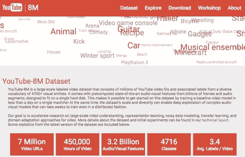
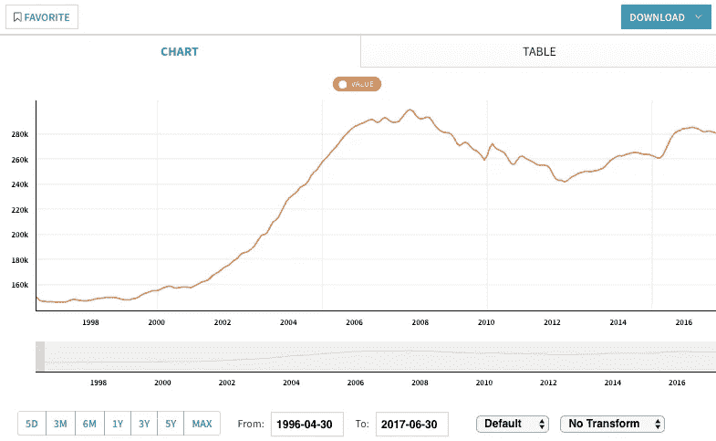
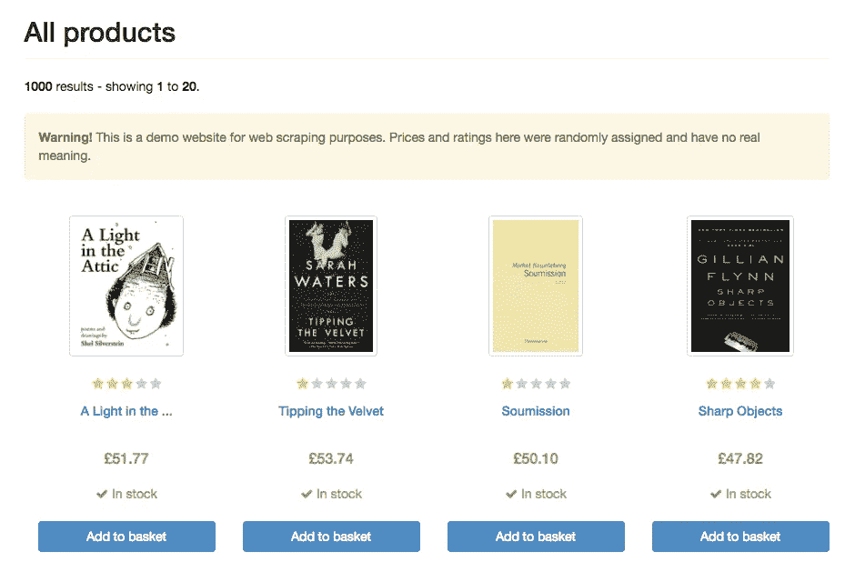

# 为深度学习、机器学习和数据科学领域的新手收集材料。

> 原文：<https://itnext.io/collection-of-materials-for-newbie-in-deep-learning-and-machine-learning-and-data-science-56ccaa73c18?source=collection_archive---------7----------------------->

在几个约定和项目的过程中，我偶然发现了几个有些不同的模式，这些模式出现在让新人加入 ML 类型的项目或为已经参与项目并喜欢亲自参与 ML、AI 和 DL 类型工作的人提供快速培训的需求中。因此，简而言之，我们不得不反复回答的问题是“我们如何让那些对学习人工智能感兴趣的人，在离开工作的最少时间内接受培训，并让他们尽可能多地实践？”。最初，为了回答这个问题，我们不得不做一些跑腿的工作，想出一些方法，并经历多次反复试验。最终，结果是令人满意的，团队仍然使用这些框架和过程让人们跟上 ML 的速度。但是，这篇文章不是关于这个的。这篇文章的目的是分享我们在开发培训和入职流程时收集和编辑的材料、培训课程和链接。

此处发布的所有材料和链接都是由研究团队自行选择的，考虑到团队的背景和目标，有些主观。

# 先说重点——一些术语文章以及 AI、DL 和 ML 之间的区别。

我绝对喜欢简单。人们总是可以把简单的事情变得更复杂。这就是为什么我总是喜欢从简单开始，以后再增加复杂性..所以，首先链接到一篇名为“你读过的关于机器学习的最简单的解释”的文章。

## 你读过的关于机器学习的最简单的解释。

 [## 你读过的关于机器学习的最简单的解释

### 你可能听说过机器学习和人工智能，但你确定你知道它们是什么吗？如果…

hackernoon.com](https://hackernoon.com/the-simplest-explanation-of-machine-learning-youll-ever-read-bebc0700047c) 

## 你是不是用错了“AI”这个词？

 [## 你是不是用错了“AI”这个词？

### 在那里，我说了:我不介意工业界用‘人工智能’和‘机器学习’来表示同一个意思。但是是不是…

becominghuman.ai](https://becominghuman.ai/are-you-using-the-term-ai-incorrectly-911ac23ab4f5) 

## 理解机器学习与深度学习的简单方法

 [## 理解机器学习 vs 深度学习的简单方法——Zendesk

### 了解人工智能的最新进展似乎势不可挡，但它实际上可以归结为两个…

www.zendesk.com](https://www.zendesk.com/blog/machine-learning-and-deep-learning/) 

## 人工智能、机器学习、深度学习有什么区别？

 [## AI、机器学习、深度学习的区别？NVIDIA 博客

### 这是由长期技术记者解释深度学习基础的多部分系列的第一部分…

blogs.nvidia.com](https://blogs.nvidia.com/blog/2016/07/29/whats-difference-artificial-intelligence-machine-learning-deep-learning-ai/) 

# 学习课程

[**【机器学习(课中心)**](https://www.class-central.com/subject/machine-learning) —学习来自顶尖大学和学院的免费在线机器学习课程&。阅读评论来决定一门课程是否适合你。

[**机器学习——斯坦福大学**](https://www.coursera.org/learn/machine-learning)**——**斯坦福大学打造的免费课程，吴恩达授课。

****——**学习人工智能(AI)的基础知识。设计智能代理来解决现实世界的问题，包括搜索、游戏、机器学习、逻辑和约束满足问题。**

**[**机器学习**](https://meetnucleus.com/p/L2crRcdYTlra) **。**掌握机器学习和算法的本质，帮助改善在没有人工干预的情况下从数据中学习。**

**[**【从数据中学习】—在线课程(MOOC)**](http://www.work.caltech.edu/telecourse.html) —在 Youtube 和 iTunes 上超过 400 万次观看。登上 edX。免费课程，提供演讲视频。**

****机器学习—** 免费课程，有讲座幻灯片和视频录制
计算机科学系，2014–2015，ml，机器学习。**

**[**机器学习—华盛顿大学**](https://www.coursera.org/specializations/machine-learning) **—** 四门实践课掌握机器学习基础知识。**

**[**用于机器学习的神经网络—**](https://www.coursera.org/learn/neural-networks) 了解人工神经网络及其如何应用于语音和对象识别、图像分割、建模语言和人类运动。免费课程。**

# **视频课程和视频课程**

## **Python 简介的实用机器学习教程(播放列表)**

## **深度学习。电视**

** [## 深度学习。电视

### 深度学习。电视都是关于深度学习的，这个研究领域教会机器感知世界。开始…

www.youtube.com](https://www.youtube.com/channel/UC9OeZkIwhzfv-_Cb7fCikLQ) 

## 机器学习食谱

## Sentdex

## 程序员实用深度学习(杰瑞米·霍华德&瑞秋·托马斯)

 [## 面向程序员的深度学习——36 小时免费课程

### fast.ai 面向编码员的实用深度学习 MOOC。学习 CNN，RNNs，计算机视觉，NLP，推荐系统…

course.fast.ai](http://course.fast.ai/start.html) 

## 机器学习，Udacity(佐治亚理工学院)

 [## 机器学习| Udacity

### 在这门课程中，你将学习如何应用监督，无监督和强化学习技术来解决一个问题

www.udacity.com](https://www.udacity.com/course/machine-learning--ud262) 

## 机器学习简介，乌达城(巴斯蒂安·特龙)

 [## 乌达城

### 编辑描述

classroom.udacity.com](https://classroom.udacity.com/courses/ud120) 

## 用于机器学习的神经网络，Coursera(杰弗里·辛顿)

 [## 用于机器学习的神经网络

### 关于本课程:了解人工神经网络以及它们如何被用于机器学习，如应用…

www.coursera.org](https://www.coursera.org/learn/neural-networks) 

## Keras — Python 深度学习神经网络 API

## TensorFlow 教程

## 深度学习 TensorFlow 和 Simplilearn 的神经网络深度学习

## 深度学习与 R 教程

## 神经网络的艺术

# 博客

下面是 ML/DL/AI 相关主题的博客列表。

 [## 安德烈·卡帕西博客

### 一位计算机科学家的思考。

karpathy.github.io](http://karpathy.github.io/)  [## 我是柴斯克

### 机器学习技术博客。

iamtrask.github.io](http://iamtrask.github.io/)  [## 实践中的机器学习

### 渴望在其内部部署机器学习的高管、经理和项目经理的实用见解…

medium.com](https://medium.com/machine-learning-in-practice)  [## 博客爆款 AI

### Explosion AI 是一个专注于人工智能和自然语言处理的数字工作室。我们是…

explosion.ai](https://explosion.ai/blog/)  [## 倪历险记

### 人工智能和自然智能，包括政治、艺术和高等教育

乔安娜·布赖森](https://joanna-bryson.blogspot.de/)  [## 机器学习大师博客

### 什么样的神经网络适合你的预测建模问题？对初学者来说……可能很难

machinelearningmastery.com](http://machinelearningmastery.com/blog/)  [## WildML

### 学术深度学习研究社区在很大程度上远离了金融市场。也许那是因为…

www.wildml.com](http://www.wildml.com/)  [## FastML

### 去年，我们发布了一个新的书籍推荐数据集 goodbooks-10k。顾名思义，它包含…

fastml.com](http://fastml.com/) 

# 备忘单

1.  人工智能、神经网络、机器学习、深度学习和大数据的备忘单

 [## 人工智能、神经网络、机器学习、深度学习和大数据的备忘单

### 最佳人工智能备忘单的最完整列表

becominghuman.ai](https://becominghuman.ai/cheat-sheets-for-ai-neural-networks-machine-learning-deep-learning-big-data-678c51b4b463) 

2.机器学习和深度学习工程师的基本备忘单

 [## 机器学习和深度学习工程师的基本备忘单

### 学习机器学习和深度学习对新手来说很难。以及深度学习库都很难…

startupsventurecapital.com](https://startupsventurecapital.com/essential-cheat-sheets-for-machine-learning-and-deep-learning-researchers-efb6a8ebd2e5) 

# Github 资源

 [## 一起打造更好的软件

### GitHub 是人们构建软件的地方。超过 2800 万人使用 GitHub 来发现、分享和贡献超过…

github.com](https://github.com/search?utf8=%E2%9C%93&q=topic%3Anlp&type=Repositories)  [## 一起打造更好的软件

### GitHub 是人们构建软件的地方。超过 2800 万人使用 GitHub 来发现、分享和贡献超过…

github.com](https://github.com/search?q=topic%3Aneural-network&type=Repositories)  [## 一起打造更好的软件

### GitHub 是人们构建软件的地方。超过 2800 万人使用 GitHub 来发现、分享和贡献超过…

github.com](https://github.com/search?o=desc&q=topic%3Amachine-learning+&s=stars&type=Repositories&utf8=%E2%9C%93)  [## 一起打造更好的软件

### GitHub 是人们构建软件的地方。超过 2800 万人使用 GitHub 来发现、分享和贡献超过…

github.com](https://github.com/search?q=topic%3Adeep-learning&type=Repositories) 

# 你能在哪里练习？

## 机器学习卡格尔竞赛

我强烈建议尝试一下 Kaggle 比赛，即使你进入前 100 名的机会很小。Kaggle 比赛的价值在于社区。阅读内核并从中吸取好的实践。阅读评论并参与讨论。在那里你会学到很多东西。

 [## 机器学习 Kaggle 竞赛第一部分:入门

### 学习 Kaggle 环境和入门笔记本

towardsdatascience.com](https://towardsdatascience.com/machine-learning-kaggle-competition-part-one-getting-started-32fb9ff47426) 

# …以及一些与该主题相关的文章

 [## 互联网上的每一门机器学习课程，根据你的评论进行排名

### 一年半前，我退出了加拿大最好的计算机科学项目之一。我开始创造我自己的…

medium.freecodecamp.org](https://medium.freecodecamp.org/every-single-machine-learning-course-on-the-internet-ranked-by-your-reviews-3c4a7b8026c0)  [## 聊天机器人利用自然语言处理和机器学习的终极指南

### 包括代码片段和 Github

chatbotslife.com](https://chatbotslife.com/ultimate-guide-to-leveraging-nlp-machine-learning-for-you-chatbot-531ff2dd870c)  [## 机器学习如何改变软件开发

### 我不是来和你谈论人工智能有多神奇，Deepmind 在做什么，或者推测机器人…

medium.com](https://medium.com/@akiranin/how-machine-learning-is-changing-software-development-301928bb7772) 

# 数据源

(由精英数据科学公司提供)

## 用于探索性分析的数据集

探索性分析是大多数数据科学练习的第一步。用于实践探索性分析的最佳数据集应该是有趣的、有意思的、非平凡的(也就是说，需要你挖掘一点来发现所有的洞见)。

*   《权力的游戏》 —《权力的游戏》是一部根据乔治·R·R·马丁*的《冰与火之歌*系列丛书改编的热门电视剧。有了这个数据集，你可以探索它的政治景观，人物和战斗。
*   [世界大学排名](https://www.kaggle.com/mylesoneill/world-university-rankings)——对大学进行排名可能很难，也很有争议。排名系统有几百个，很少达成共识。该数据集包含三个全球大学排名。
*   IMDB 5000 电影数据集 —该数据集探索了我们是否可以在电影上映前预测其受欢迎程度的问题。

**聚合器:**

*   [Kaggle 数据集](https://www.kaggle.com/datasets) —由 Kaggle 社区贡献的开放数据集。在这里，你会发现一个话题的大杂烩。另外，您可以从数据集附带的简短教程和脚本中学习。
*   [r/datasets](https://www.reddit.com/r/datasets/top/?sort=top&t=all) —由 Reddit 社区贡献的开放数据集。这是有趣和古怪数据集的另一个来源，但数据集往往不太精确。

## 通用机器学习数据集

在这种情况下，我们将“通用”机器学习称为对关系(即表格格式)数据的回归、分类和聚类。这些是最常见的 ML 任务。

*   [葡萄酒质量(回归)](https://archive.ics.uci.edu/ml/datasets/Wine+Quality) —来自葡萄牙北部的红葡萄酒和白葡萄酒样品的特性。目标是基于物理化学测试来模拟葡萄酒质量。([我们也有教程。](http://elitedatascience.com/python-machine-learning-tutorial-scikit-learn))
*   [信用卡违约(分类)](https://archive.ics.uci.edu/ml/datasets/default+of+credit+card+clients) —预测信用卡违约是机器学习的一个有价值的常见用途。这个丰富的数据集包括人口统计、支付历史、信用和违约数据。
*   [美国人口普查数据(聚类)](https://archive.ics.uci.edu/ml/datasets/US+Census+Data+%281990%29) —基于人口统计数据的聚类是一种行之有效的市场研究和细分方法。

**聚合器:**

*   [UCI 机器学习知识库](https://archive.ics.uci.edu/ml/index.php)—UCI ML 知识库是一个古老而流行的机器学习数据集聚合器。提示:他们的大多数数据集都有链接的学术论文，你可以用它们作为基准。

## 深度学习数据集

虽然不适合通用机器学习，但深度学习已经主导了某些领域，特别是那些使用图像、文本或音频数据的领域。根据我们的经验，开始深度学习的最佳方式是在图像数据上练习，因为有大量的教程可用。

*   [MNIST](http://yann.lecun.com/exdb/mnist/) — MNIST 包含用于手写数字分类的图像。它被认为是深度学习的一个很好的入门数据集，因为它足够复杂，足以保证神经网络，同时仍然可以在单个 CPU 上管理。([我们也有教程。](http://elitedatascience.com/keras-tutorial-deep-learning-in-python))
*   [CIFAR](http://www.cs.utoronto.ca/~kriz/cifar.html) —下一个难度更高的是 CIFAR-10 数据集，它包含 6 万张图像，分为 10 个不同的类别。对于更大的挑战，您可以尝试 CIFAR-100 数据集，它有 100 个不同的类。
*   ImageNet 每年都会举办一次计算机视觉竞赛，许多人认为这是现代性能的基准。当前影像数据集有 1000 个不同的类。
*   [YouTube 8M](https://research.google.com/youtube8m/)——准备好处理视频，却腾不出万亿字节的存储空间？这个数据集包含数百万个 YouTube 视频 ID 和*数十亿个* 音频和视觉特征，这些特征是使用最新的深度学习模型预先提取的。

**聚合器:**

*   [Deeplearning.net](http://deeplearning.net/datasets/)—深度学习算法基准测试数据集的最新列表。
*   [DeepLearning4J.org](https://deeplearning4j.org/opendata)—深度学习研究高质量数据集的最新列表。

*YouTube-8M*

## 自然语言处理数据集

自然语言处理是关于文本数据的。对于像文本这样的杂乱数据，数据集具有真实的应用程序尤其重要，这样您就可以执行简单的健全性检查。

*   [安然数据集](https://www.cs.cmu.edu/~./enron/) —来自安然高级管理层的电子邮件数据，被组织到文件夹中。这个数据集最初是由联邦能源管理委员会在调查期间公开发布到网上的。
*   亚马逊评论——包含亚马逊 18 年来大约 3500 万条评论。数据包括产品和用户信息、评级和明文评论。
*   [新闻组分类](http://qwone.com/~jason/20Newsgroups/) —大约 20，000 个新闻组文档的集合，平均分布在 20 个不同的新闻组中。非常适合练习文本分类和主题建模。

**聚合器:**

*   [NLP-datasets(Github)](https://github.com/niderhoff/nlp-datasets)—NLP 中使用的带有文本数据的自由/公共领域数据集的字母列表。
*   Quora 答案 —自然语言处理标注语料库列表。

## 云机器学习数据集

从技术上来说，任何数据集都可以用于基于云的机器学习，只要你把它上传到云端。但是，如果您刚刚开始评估一个平台，您可能希望跳过所有数据管道。

幸运的是，主要的云计算服务都提供了可以轻松导入的公共数据集。他们的数据集都是可比较的。

*   [AWS 公共数据集](https://aws.amazon.com/datasets/)
*   [谷歌云公共数据集](https://cloud.google.com/bigquery/public-data/)
*   [微软 Azure 公共数据集](https://docs.microsoft.com/en-us/azure/sql-database/sql-database-public-data-sets)

## 用于时序分析的数据集

时间序列分析需要用时间戳标记的观察值。换句话说，每个主题和/或特征随着时间被跟踪。

*   [EOD 股票价格](https://www.quandl.com/product/WIKIP/WIKI/PRICES-Quandl-End-Of-Day-Stocks-Info) —由 Quandl 社区策划的 3000 家美国公司的收盘股票价格、股息和拆分。
*   [Zillow Real Estate Research](https://www.quandl.com/data/ZILLOW-Zillow-Real-Estate-Research)——按大小、类型和层级划分的房价和租金，按邮政编码、社区、城市、大都市地区、县和州划分。
*   [全球教育统计数据](http://data.worldbank.org/data-catalog/ed-stats) —超过 4，000 项关于受教育机会、进展、完成、识字率、教师、人口和支出的国际可比指标。

**聚合器:**

*   [Quandl](https://www.quandl.com/search?query=) — Quandl 包含用于金融分析的免费和高级时间序列数据集。
*   [世界银行](http://data.worldbank.org/data-catalog/) —包含全球宏观经济时间序列，可按国家或指标搜索。

*Zillow 房地产数据*

## 推荐系统的数据集

推荐系统已经席卷了娱乐和电子商务行业。亚马逊、网飞和 Spotify 就是很好的例子。

*   MovieLens —来自 MovieLens 网站的评级数据集。由于有各种不同的数据集大小，非常适合入门。
*   Jester——构建简单协作过滤器的理想选择。包含来自 73，421 个用户的 100 个笑话的 410 万个连续评级(-10.00 到+10.00)。
*   [百万首歌曲数据集](https://www.kaggle.com/c/msdchallenge#description) —大型、丰富的音乐推荐数据集。您可以从一个纯粹的协作过滤器开始，然后用其他方法扩展它，比如基于内容的模型或 web 抓取。

**聚合器:**

*   [entaradun(Github)](https://gist.github.com/entaroadun/1653794)—推荐系统的数据集集合。提示:查看最近数据集的评论部分。

## 特定行业的数据集

在这份概要中，我们根据数据集的使用案例对其进行了组织。如果你需要练习某种技能，比如深度学习或者时间序列分析，这是很有帮助的。

但是，您也可能希望按特定行业进行搜索，例如神经科学、天气或制造业的数据集。这里有几个选项:

**聚合器:**

*   [出色的公共数据集](https://github.com/caesar0301/awesome-public-datasets) —按行业划分的高质量数据集。
*   [Data.gov](https://www.data.gov/)—按行业分类的政府数据。

## 流式数据集

流式数据集用于构建实时应用，如数据可视化、趋势跟踪或可更新(即“在线”)机器学习模型。

*   [Twitter API](https://dev.twitter.com/streaming/overview)—Twitter API 是流数据的经典来源。你可以追踪推文、标签等等。
*   StockTwits API — StockTwits 就像是交易者和投资者的 twitter。您可以用许多有趣的方式扩展这个数据集，通过使用时间戳和股票代码将它加入到[时间序列数据集](https://elitedatascience.com/datasets#time-series)中。
*   [Weather Underground](https://www.wunderground.com/weather/api/) —可靠的天气 API，覆盖全球。提供免费层和付费选项以进行扩展。

**聚合器:**

*   [Satori](https://www.satori.com/explore) — Satori 是一个让你以超低延迟(免费)连接到流媒体直播数据的平台。他们经常添加新的数据集。

## 用于 Web 抓取的数据集

网络抓取是数据科学研究的一个常见部分，但你必须小心违反网站的服务条款。幸运的是，有一个完整的网站被设计成可以自由抓取。

*   [ToScrape.com](http://toscrape.com/)—带有两个子域的网页抓取沙箱。你可以练习刮一个[的虚拟书店](http://books.toscrape.com/)或者一个[的列出名人名言的网站](http://quotes.toscrape.com/)。

## 当前事件的数据集

寻找当前事件的数据集可能很棘手。幸运的是，一些出版物已经开始发布他们在文章中使用的数据集。

**聚合器:**

*   [FiveThirtyEight](https://github.com/fivethirtyeight/data)—FiveThirtyEight 是一个新闻和体育网站，提供数据驱动的文章。他们在 Github 上公开他们的数据集。
*   BuzzFeed news——BuzzFeed 因其新闻报道和表面文章而出名，但后来他们扩展到了调查性新闻领域。他们的数据集可以在 Github 上找到。

*这篇文章是活生生的事。您的反馈对我很重要。请留下我应该添加哪些资源以及你在学习 ML/DL/AI 时发现哪些资源最有帮助的评论。非常感谢你的阅读！***