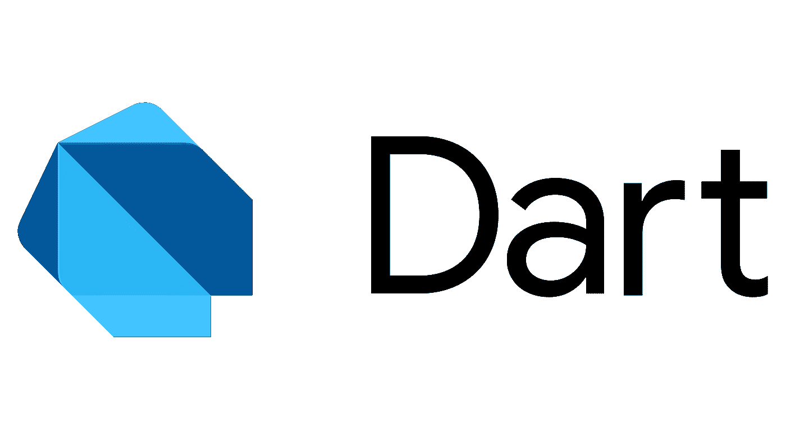

# Dart 中的集合

> 原文：<https://itnext.io/collections-in-dart-1fd252cc4bff?source=collection_archive---------3----------------------->

# 介绍

编程语言为我们如何在应用程序中组织数据提供了如此多的选择，Dart 就是这些编程语言中的一种。像其他编程语言一样，Dart 也为我们提供了一些对集合中的数据进行分组的方法，这也是本文要讨论的内容。
在谈论集合之前，我们必须理解或回顾泛型编程。
那么，让我们进入正题:

# 通用编程

在学习 Flutter 或 Dart 时，您可能会发现类似于`Example<T>`或`Future<T>`的表达式，而`<T>`符号仅仅意味着字母`T`必须在编译时被替换为实际的实例。例如，如果我们有`Example<String>`，我们的意思是字母`T`将被`String`类型所取代。

我们可以使用这个注释定义一个类，如下所示:

当我们创建泛型类型类时，有可能在泛型类之间创建一个层次结构，但是我们必须意识到这一点:
子类必须至少拥有与其超类定义的相同数量的参数化类型(如果*超类*定义了一个参数化类型，那么*子类*必须拥有一个或多个参数化类型)。
子类必须用其超类定义的相同字母来声明，例如，如果我们有`Athlete<T>`，子类必须定义为`SoccerPlayer<T,M>` (SoccerPlayer 扩展运动员)。
你可以在超类中定义尽可能多的参数，只是不要忘记提到超类参数字母(s)；

也可以使用`T`符号定义 [**类型安全**](https://dart.dev/guides/language/type-system#:~:text=The%20Dart%20language%20is%20type,optional%20because%20of%20type%20inference.) 类字段，我们只是不使用菱形`< >`，如下所示:

字段 personObject 具有通用类型

此功能可用于定义类、字段、函数、列表、集合、映射等。

# 收集

## 目录

List 是一种有序的集合类型，允许我们在其中设置一组数据类型。

**定义列表**

`numbers`不是泛型类型列表，这就是为什么我们可以像`String`一样添加不同的值，编译器不会抛出错误；

`numbers.add(“a”);`

另一方面，`flutter` 列表是类型`String`的通用列表。
由于类型安全，我们不允许在其中添加不同的数据类型。
`Flutter.add(3); //error`

我们可以使用`addAll()` 方法或 spread 操作符来添加另一个列表的副本，而不是使用`add()`方法来插入一个值

使用`addAll()`方法

`Numbers.addAll([1,2,3])`

使用扩展运算符将列表 a 的副本插入到数字列表中。
`Numbers.addAll([…a]) // "a" is another list`

第三个版本是在列表初始化中使用一个循环来插入值。

列表有`first`、`last`、`length`、`isEmpty`、`reversed`等多种礼节。也有很多方法如`add()`、`addAll()`、`clear()`、`asMap()`等。
查阅 [*官方文献*](https://api.dart.dev/stable/2.17.7/dart-core/List-class.html) 查看完整的方法和礼单。

根据官方文件，清单可分为**可增长清单**和**定长清单**。

**可增长的**列表是那些其*大小*没有在声明中指定，并且可以在程序生命周期中增加或减少的列表。

`var l = [];
var growable= <int>[];`

这两个列表都是可增长的，但是其中一个有类型，另一个没有。

**固定列表**是那些在定义中指定了大小的列表，并且这个大小在程序生命周期中不能改变。
`List<int> fixed = List.filled(3,0);`
这一行创建一个大小为 3 的列表，默认值为零。如果我们试图使用增加列表大小的方法，我们将会出错。
`Fixed.add(1) //error`
我们能做的就是更新列表的索引值。
注意，fixed 是类型 `List<int>`，我们不能在 filled 的第二个参数中设置不同的值类型。
`List<int> fixed = List.filled(3,”a”); //error`

## 一组

是对象的集合，其中每个对象只能出现一次。
集合可以使用大括号直接初始化。

`final uniqueKeys = {1,1, 2, 3, 4, 5};`

查看上面的`uniqueKeys`集合的定义，编译器自动显示一条诊断消息，通知集合集合可能有唯一的键，但是它不会在运行时抛出任何异常。因为它不允许我们重复值，当打印时，集合中的一个重复值不会被打印。

**定义集合**

同样，我们可以定义泛型列表，也可以定义泛型集合。

集合还支持扩展符号(…和…？)以及其中的 if 和 for 语句来决定哪些元素可以添加到集合中。

Dart 中定义的集合包含以下属性:

`first` —获取集合中的第一个元素

`isEmpty` —检查器械包是否为空

`isNotEmpty` —检查器械包是否为空

`last` —获取集合的最后一个元素

`length` —获取集合的长度。

`single` —检查集合是否只有一个元素

并有以下方法:

`difference(Set<T?> another)`

`containsAll()`

`elementAt(int index)`

这些不是集合的唯一属性和方法，["有关更多信息，请访问 api.dart.dev"](https://api.dart.dev/stable/2.17.7/dart-core/Set-class.html) 。

## 地图

地图集合在*键值对* `Map<K,V>` 中存储数据。

这意味着，它不使用传统的 int 索引，而是使用**键**来定位和访问**值**。如果您正在开发一个从 API 中检索数据的应用程序，您可能会使用 Map 集合来接收经过解析的 JSON 对象，并将其转换为一个对象(在工厂构造函数中)。

为了访问地图集合的值，我们使用键，而不是索引。让我们看看这个例子:
假设您正在从 *google books API* 中检索图书，并且您想要将数据转换成一个对象。

Api [**url**](https://www.googleapis.com/books/v1/volumes?q=$query&fields=kind,items(id,volumeInfo/title,volumeInfo/authors,volumeInfo/description,volumeInfo/categories,volumeInfo/averageRating,volumeInfo/imageLinks/thumbnail)) (点击我)

回应是这样的:

所以，这将是解析成 JSON 后的主体响应。
那么让我们来访问这些值。

该方法接收一个 Map 集合作为参数，它有一个作为键的`String` 和一个作为值的`dynamic` 。

如果你仔细观察`factory constructor`，你会注意到我们使用它的键而不是索引来访问`Map` 值，就像我们在列表中做的一样。

关于 Map 有趣的事实是，它们不接受重复的键，所以如果我们重复一个键(已经添加到 Map 中)试图将一个值与同一个键组合，我们实际上是在更新这个值。

让我们看看下面的例子

这将是输出:

`{a: just another text, b: second letter}`

于是，`key` a 的`value`被覆盖。

以下是您可以使用的地图类型:

`HashMap<K,V>` —这是一个无序的地图，这意味着我们在打印地图时得到的顺序与添加了键的顺序不同。

`LinkedHasMap<K,V>`一个有序映射，它按照插入顺序迭代关键字。

`SplayTreeMap<K,V>`它按照关键字排序顺序迭代地图。

**谢谢！**阅读这篇文章。我希望它对你有所帮助，甚至从不同的角度理解这个话题。

如果你有任何疑问或者你可能觉得少了什么，你可以通过[推特](https://twitter.com/a_azinar)或者[电报](https://t.me/albertoazinar)联系我。我很乐意和你谈谈这件事。

***一切都是 Widget！***