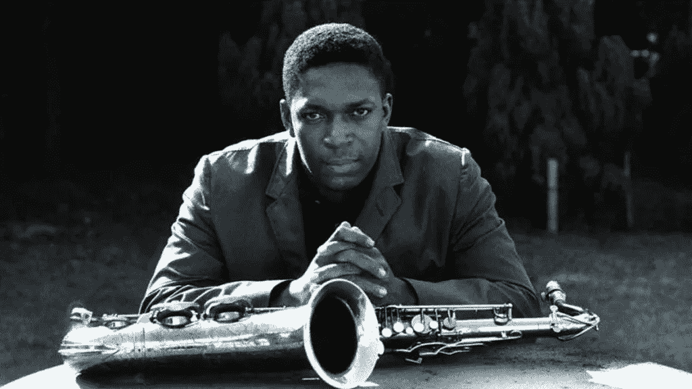
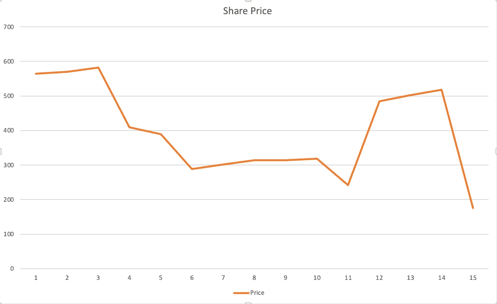
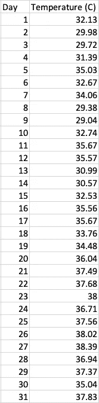

# Coltrane 和 Kadane——我们如何应用传奇中的经验来改进我们的编码工艺

> 原文：<https://itnext.io/coltrane-and-kadane-how-we-can-apply-lessons-from-legends-to-improve-our-coding-craft-b3c316e3ca52?source=collection_archive---------5----------------------->



重量级冠军

约翰·科尔特兰过去是，现在仍然是爵士乐的传奇。被广泛认为是有史以来最伟大的男高音萨克斯手，他留下了一套广泛而多样的演奏录音，他将自己的伟大归功于对音乐的探索，这种探索既是智力上的也是精神上的，同时也归功于对他的技艺近乎无与伦比的热爱。

## 好吧…那么这和编程有什么关系呢？

作为开发人员和软件工程师，我们花费大量时间寻找“下一件事”——它可能是一门热门语言、一项前沿技术、一个酷软件模式，等等。但是作为一个群体，我们倾向于被新奇的事物所吸引——我们通常认为是创新的事物，或者对我们来说完全是新的话题，所以我们被它们所吸引。在这个意义上，我们有点像飞蛾和灯。被新奇事物吸引往往伴随着自我创新的动力，有助于推动该领域向前发展。当然，我认为这是一种积极的品质。在这个相对年轻的领域，停滞可能是死亡之吻。

*但是*…定期重温我们已经学过的东西有很大的价值。约翰·科尔特兰在许多方面都是创新者。但他实现自己创新的方式之一是彻底掌握音乐的基本要素，然后他可以将这些要素组合成从他的大脑中流出的旋律和和声想法——如果没有数小时的刻苦练习，这些想法在从他的大脑、手指和萨克斯管的嘴里发出之前就会停止。我们都会因此变得更加贫穷。

作为一名软件工程师，我发现自己时不时地回到看似基础的概念和技能。我喜欢回顾过去，回顾那些我认为理所当然的想法。为什么一个给定的软件模式，也许是我反复使用的模式，实际上是以这种方式工作的？为什么这是正确的，或者是时候重新考虑我的方法了？

我也喜欢从事把这些基本思想放进代码的看似简单(但有时会误导人)的活动。这是一种重复的形式——或者，用另一种说法……练习*。*

*爵士音乐家使用术语“脱木”来描述这种形式的练习——重复执行给定的想法(音阶、旋律、级数),直到他们完全掌握它。然后他们可以几乎本能地用它来构建更大、更复杂的想法。*

*[这篇文章](http://www.jazzthink.com/ezine/1606_ezine.html)引用了 [Paul Klemperer](https://www.gordonpeerymusic.com/paul-klemperer) (爵士萨克斯手，_ 而不是 _ 牛津经济学家)对木材脱落的描述*

> *认识到在你回来和一群人一起公开演奏之前，有必要把自己隔离起来，深入研究音乐的硬机制……这是一件卑微但必要的家务，就像在生火之前劈柴一样。*

*我真的很喜欢这个描述。所以我今天要写的是软件开发的一种形式“脱木”——回到我们可能很久以前学过的想法和工具来回顾它们，以确保我们仍然理解它们为什么存在，以及我们最初为什么要学习它们(除了“它们是在我大学时的某堂课上分配给我的”)，并确保我们不仅记住它们的形式和功能，而且我们用它们维护甚至发展我们的设施，以便我们可以在工作中有效地使用它们。软件开发*既是艺术*又是科学*，在这方面，我认为它很像音乐。**

*如果您可能从未有机会学习我正在处理的特定主题，那么我希望这篇文章证明是加倍有用的，并为您将来探索和改进您的开发技能提供思路。*

## *在实践中发展木材采伐*

*在本文的其余部分，我将介绍一个众所周知的问题类别。在这个过程中，我将介绍基本问题的一些变化，以及它们如何与现实世界的问题域相关联，我还将展示一些实现解决方案的示例代码(在 Go 中)。虽然我不会假装我的任何代码都可以在生产应用程序中按原样使用，但您可以自由地借用/复制它，并根据自己的意愿重用它。*

*可以找到样本代码的库是[https://github.com/ScarletTanager/algorithms,](https://github.com/ScarletTanager/algorithms,)，具体在文件`subset/max_subarray.go`和`subset/interval.go`中，以及它们对应的测试文件(在同一个`subset`目录中)。*

# *最大子阵列问题*

*你可能还记得解决[最大子阵列](https://en.wikipedia.org/wiki/Maximum_subarray_problem)问题。这种形式的问题是开发人员经常在相当早的时候学习的一个主题，因为它是一个很好的工具，用于教授如何比较同一问题的不同解决方案的计算复杂性。两种主要的方法(递归的分治法和著名的 [Kadane 的算法](https://en.wikipedia.org/wiki/Maximum_subarray_problem#Kadane's_algorithm))都很容易掌握，但是即使对于有经验的开发人员来说，注意其中的细微差别也是有用的。*

*如果我们假设一个有序的数值列表(一个数组，或者不同编程语言中的一个片/元组/列表)，那么在这个更大的数组中应该有一些连续的值集合，当集合在一起时(这可能意味着相加、平均等)。视情况而定)，产生最高的可能值。例如，如果我们有一个数组`[5, 1, -13, 8, -3, 4, -6, 0, 0, 7]`，那么哪个子数组的值加在一起会得到最大的和？我们可以简单地进行一组强力的手动计算，得到子数组`[8..7]`，但是这种方法(即使你自动化了它)是非常低效的——想象一下，对于一个列表，比如说，几千个值。最大子阵列算法试图找到找到这个连续子集的有效方法。为什么我们需要这样的方法？*

## *股票交易*

*最大子数组的一个用例是选择何时买卖股票以获得最大利润。这是科尔曼(2009) 引入问题的方法，我们将在这里借用它。如果我们假设我们有一台时间机器，我们可以回到过去买/卖特定股票的股票，准确地知道每天的股价，那么我们应该什么时候买和卖才能从交易中获得尽可能高的利润呢？*

*考虑下面一张股票价格随时间变化的图表——每一点都是某一天的美元价格:*

**

*显然，股票在这一时期的早期卖出了最高价——最高的两个价格是图表上的前两个点。但是，如果我们不能在此之前找到一个更低的价格来购买股票，我们就没有办法利用这个价格。让我们从第一个要点开始:*

**问题的解决方案不仅仅是找到区间上最大的单个值。**

*但是，这里的解决方案也不仅仅是找到这个特定数据集中的值，这些值加在一起会得到最大的和。这些是价格(因此都是正值)。为什么答案不是将所有的值相加—换句话说，与我们的原始数组相同？这就引出了我们的第二个关键点:*

**有时候你需要对数据集执行一个中间操作来转换它。**

*我们所寻求的与价格最大化是不同的——我们试图最大化*利润*——最简单地说，就是一件东西的购买和销售之间的价格差。所以首先我们需要用这样的东西将我们的值转换成不同天之间的价格增量(我在这里使用`int`值只是为了简单起见，但是使用浮点值除了类型转换/格式化之外不会改变任何重要的东西):*

```
*func PriceToProfit(prices []int) []int {
  deltas := make([]int, len(prices) - 1)
  for i, price := range prices[1:] {
    deltas[i-1] = price - prices[i-1]
  }
  return deltas
}*
```

*在我们的原始价格数组上运行该函数会产生如下数组:*

```
*[5, 12, -173, 9, -20, -100, 13, 12, 0, 4, -76, 243, 17, 16, -343]*
```

**在 go 中，这在技术上是一个切片，而不是数组——如果你不明白其中的区别，请看这里的*[](https://go.dev/blog/slices-intro)**。我将在整篇文章中交替使用这两个术语，以及“list”之类的术语，尽管在特定语言的上下文中看起来不太准确。当我具体指一片时，我会说清楚的。***

**一些观察结果:**

1.  **这是一个包含负值和正值的列表。**
2.  **基于视觉观察，最大的利润出现在列表的右边，而不是左边(价格峰值在左边)。这与我们的图表相符，这很好地证实了我们至少是在正确的轨道上。确保您的数据“看起来正确”没有坏处**

**现在让我们提出第三个要点:**

***在一个既有负值又有正值的数组中，最大子数组的左边和右边将以正值(或者在某些方法中为非负值)为界。***

**这一点给了我们前进的线索。如果我们从左到右扫描数组，我们可能会找到一个跨越(包括)一个或多个负值的最大子数组，但是它将*永远不会*被它们限制。如果我们的解决方案返回一个子数组，其中开始或结束值为负(假设原始数组同时包含负值和正/非负值)，那么我们的解决方案不可能是正确的。**

***有一种特殊的子情况，其中数组不包含正值——我们将在稍后解决这个问题。***

## **卡丹算法**

**约瑟夫“杰伊”卡丹是那种似乎让我们其他人感到有点暗淡的人。卡丹是卡耐基梅隆大学的统计学荣誉退休教授，他的出版物清单是…让我们用“冗长”来说吧。然而，在计算机科学中，他最著名的可能是寻找最大子阵列的算法(大约四十岁了)，这就是我们现在要讨论的。**

**还有其他寻找最大子数组的方法——您可以实现一个好的分而治之的解决方案(可以预见，这个解决方案将在 O( *nlgn* )中运行，所以并不可怕)。但是 Kadane 制定了一个在线性时间内运行的基本算法(so O( *n* ))，我们将在本文的剩余部分研究它(以及一些细微的变化)。**

**Kadane 的同名算法可以大致解释为:**

```
**Scan array from left to right
  remember the maximum sum seen so far
  if the current sum is greater than the maximum,
    replace maximum with current**
```

**我认为大多数例子和描述(对于任何算法，不仅仅是这个算法)都有一个不幸的习惯，那就是只提供正确的解决方案——但是我认为你从一个不正确的解决方案开始会学到更多，但并不明显，至少在某些情况下。因此，我们将从一个有时有效的实现开始，然后我们将研究如何以及为什么需要对它进行调整以达到正确的实现。作为其中的一部分，有眼光的读者可能已经注意到，我在上面的卡丹的伪释义中掩饰了几个关键细节——别担心，我是故意这样做的。**

# **实现 Kadane**

**让我们从一个值列表开始，这里(以及此后)表示为几个 go 片段中的一个:**

```
**a = []int{5, 4, -6, 3, -12, 16, 23, -18, -47, 7, 27, -3}**
```

**这里最大的子数组是切片`a[5, 7]`——它是两个值的切片`{16, 23}`，加起来就是`39`。让我们看看是否可以编写一些代码来产生正确的结果:**

```
**func MaxSubarrayLinear(a []int) (max, leftBound, rightBound int) {
 var (
  currentSum int
 )if len(a) == 0 {
  return 0, 0, 0
 }max = minValueInt()for idx, val := range a {
  currentSum += valif currentSum > max {
   if val > currentSum {
    max = val
    currentSum = val
    leftBound = idx
   } else {
    max = currentSum
   }
   rightBound = idx
  }
 } return
}**
```

**因此，该函数首先将`max`设置为有符号整数的最小可能值，然后继续从左到右扫描切片。它然后:**

1.  **通过依次相加每个值来计算当前总和；**
2.  **如果当前总和大于当前最大值，检查当前值是否大于总和。由于当前的 sum _includes_ that 值，`val > currentSum`意味着在加上`val`之前`currentSum`为负。**
3.  **如果`currentSum`被确定为负值，用`val`代替它(记住我们关于区间被正值限制的观点)**
4.  **如果`currentSum`为并且*为正的*，它将成为我们新的`max`值。**

**你会注意到`rightBound`的值是最右边值的索引，而不是你在 golang 切片中使用的边界值(因为在 go 中取子切片时右边界被排除了)。但是我已经这样做了(并且在下面继续这样做)，因为我认为它更具可读性。因此，我们期望这段代码产生结果`39, 5, 6`，根据我们的测试代码(`a`在测试文件中被声明为`[]int`类型)，它确实产生了结果:**

```
**Describe("MaxSubarrayLinear", func() {
  BeforeEach(func() {
   a = []int{5, 4, -6, 3, -12, 16, 23, -18, -47, 7, 21, -3}
  }) It("Finds the maximum subarray", func() {
   s, l, r := subset.MaxSubarrayLinear(a)
   Expect(l).To(Equal(5))
   Expect(r).To(Equal(6))
   Expect(s).To(Equal(39))
  })
})**
```

**这个通过了！到目前为止，这看起来相当成功。让我们稍微调整一下输入列表，将`85`追加到它上面:**

```
**a = []int{5, 4, -6, 3, 4, -12, 16, 23, -18, -47, 7, 21, -3, 85}**
```

**现在，最大间隔应该具有起始索引`10`和终止索引`13`(子片`a[10:]`)，以及总和`110`:**

```
**It("Returns the maximum subarray", func() {
    s, l, r := subset.MaxSubarrayLinear(a)
    Expect(l).To(Equal(10))
    Expect(r).To(Equal(13))
  Expect(s).To(Equal(110))
})**
```

**不幸的是，没有这样的运气——我们的代码返回一个左界`13`和一个总和`85`，这是不正确的。这是怎么回事？Kadane 的算法部分依赖于我们上面的第三点——最大子数组永远不会以负数为界(除非数组只包含负值，否则最大子数组的总和永远不会小于 0)。但是我们的代码有一个 bug——它会找到之前的最大子数组`{16, 23}`,但是它会继续扩展那个子数组*,即使在总和降到零以下*之后，当它应该丢弃当前总和(并开始一个新的子数组)时，一旦它到达那个点。所以它将`{16, 23}`扩展到`{16, 23, -18, -47, 7, 21...}`，并且条件`if currentSum > max`从未被满足，直到它遇到`85`的最后一个值，即使这样，它也通过`if val > currentSum`条件失败了(再次，错误地)。**

**我们如何解决这个问题？首先，我们需要检查每一次迭代，看看当前的和是否等于或小于零，我们应该在做任何其他比较之前做这件事。换句话说，我们不应该扩展一个非正的子数组。做出这种改变留给我们的是:**

```
**func MaxSubarrayLinear(a []int) (max, leftBound, rightBound int) {
 var (
  currentSum, currentLeftBound, currentRightBound int
 ) if len(a) == 0 {
  return 0, 0, 0
 } max = minValueInt() for idx, val := range a {
  // Is our current sum at or below zero?
  if currentSum <= 0 {
   // If the value is greater than the current sum, start a new subarray
   // Remember that we only get here if currentSum is <= 0
   if val > currentSum {
    currentSum = val
    currentLeftBound = idx
    currentRightBound = idx
   }
  } else {
   // Extend the current subarray
   currentSum += val
   currentRightBound = idx
  } if currentSum > max {
   max = currentSum
   leftBound = currentLeftBound
   rightBound = currentRightBound
  }
 } return
}**
```

**这看起来更好，并且在我们现有的测试案例中运行它，证实了它确实产生了正确的结果。**

***但是……*(总有但是)……如果`a`只包含负值呢？**

```
**a = []int{-20, -25, -13, -100, -1, -2}**
```

**最大子数组仍然存在——它包含一个简单的“最大”值(特别是绝对值最低的数组元素`|v|`)。在这里，回忆一下上面股票价格数据的例子是很有用的——我们将每个值视为与前一个值的偏差(delta ),因此我们有带符号的值。这没有什么不同——这些都是与零的偏差,“最大”的负值是与零偏差最小的值。所以找到最大子阵列在这里还是有意义的。**

**不幸的是，我们的代码不能像当前实现的那样工作。该漏洞存在于这样一个事实中，即除非另有说明，否则一个`int`(如`currentSum`)被初始化为一个值`0`。因此，条件`if val > currentSum`将*永远不会*在一组所有负值上评估为真，并且`currentSum`将在每次迭代中保持其初始值`0`。**

**对此有两种可能的解决方法，一种比另一种更简单、更优雅。让我们先看看稍微复杂一点的修复。我们需要 current value 大于 currentSum，我们可以通过为 int(在 64 位架构上是`-9223372036854775808`)指定`currentSum`的最低可能值来轻松实现这一点——我们只需在进入`for`循环之前添加这一行即可:**

```
**currentSum = max // We had previously set max to the min value for int**
```

**现在我们的函数返回正确的元组`-1, 4, 4`——索引为`4`的单个值`-1`。**

**碰巧的是，有一个更好的解决方案，我们通过完全移除`if val > currentSum`条件来实现这个解决方案(但是保留之前包含的行):**

```
**.
.  
.
  if currentSum <= 0 {
   currentSum = val
   currentLeftBound = idx
   currentRightBound = idx
  } else {
.
.
.**
```

**不需要在启动时给`currentSum`赋一个特定的值(让它为 0)，我们代码的其余部分保持如上。**

# **使用 Kadane**

## **所以我为什么要关心这个？**

**最大子阵列问题比学术练习有用得多，而且比我们想象的更经常遇到。也许，就像我一样，你是一个骑自行车的人，你喜欢看你的力量数据。你可能很想知道，在我最近的一次骑行中，我在任何 20 分钟间隔内能够维持的最大功率输出是多少？这是一个我称之为“有界最大子阵列”的例子，意思是具有定义长度的最大子阵列。这里有一个数据集，我们可以用它来演示如何使用这个概念:**

****

**2018 年 5 月，印度德里的日平均气温**

**此表包含 2018 年 5 月印度新德里的日平均气温。如果我们问，一个月中日平均最高的三天是哪一天？我们将寻找一个*有界最大子阵列*——一个具有指定长度的最大子阵列，其中“最大”仅指元素的总和，而不是它们的基数。我们可以实现如下算法来进行计算:**

```
**func MaxAverageInterval(a []float64, intervalLen int) (
  maxAverage float64,
  leftBound, rightBound int) {
 var (
  currentSum, maxSum float64
 ) if len(a) == 0 || intervalLen <= 0 {
  return 0, 0, 0
 } maxSum = float64(-9223372036854775808) for idx, val := range a[:len(a)-intervalLen+1] {
  currentSum = val
  var j int
  for j = idx + 1; j < idx+intervalLen; j++ {
   currentSum += a[j]
  } if currentSum > maxSum {
   maxSum = currentSum
   leftBound = idx
   rightBound = j - 1
  } }
 maxAverage = maxSum / float64(intervalLen) return
}**
```

**这和卡丹不一样，但有点相似。逻辑实际上更简单——我们简单地从左到右迭代，记住所看到的固定长度的最大(根据和)间隔`intervalLen`——但是计算复杂度不是这样。因为长度是固定的，最大化总和反过来最大化平均值。对于大小为 *n* 的输入和大小为 *l* 的`intervalLen`，内循环将执行 *ln+l-l* 次，并且当 *l = (n+1)/2* 时，这将最大化，对于任何给定的 *n* ，这将导致内循环执行 *(n +2n+1)/4* 次。当 *l=n* 或 *l=1* 时，内部循环恰好被遍历 *n* 次(但这些都是不切实际且无意义的琐碎情况，因为函数将分别返回原始数组和单个最大值)。**

**但我们可以将 Kadane 的算法直接应用于回答关于同一数据集的不同问题——平均值超过给定阈值的最长间隔(最大子阵列)是什么？在新德里，2018 年 5 月日平均气温总体平均超过 35℃的最长时间是什么时候？超过 38 摄氏度？回答这些问题需要，就像我们最初的股票利润最大化的例子一样，直接应用 Kadane…首先进行适度的数据转换:**

```
**func LongestIntervalExceeds(a []float64, threshold float64) (
  leftBound, rightBound int) {
 // Convert every value into a deviation
 devs := make([]float64, len(a))
 for i, v := range a {
  devs[i] = v - threshold
 } var (
  currentSum, maxSum                  float64
  currentLeftBound, currentRightBound int
 ) maxSum = float64(-9223372036854775808) // Now we just run Kadane...
 for idx, val := range devs {
  if currentSum <= 0 {
   currentSum = val
   currentLeftBound = idx
  } else {
   currentSum += val
   currentRightBound = idx
  } if currentSum > maxSum {
   maxSum = currentSum
   leftBound = currentLeftBound
   rightBound = currentRightBound
  }
 } return
}**
```

**我们再次将值转换成偏差，但这次结果是相对于通过`threshold`参数传入的值。但是在这一点上我们已经看到了所有其他的。**

# **包扎**

**在这篇文章中，我没有任何新的突破，但这是我的观点。有时我们需要回到基础，回到基本的考虑和概念，并反复回顾它们，以确保无论何时我们最终需要这些概念时，我们对它们的掌握不会让我们失望。有些想法，乍一看，似乎完全直截了当，但可能仍然有一些隐藏的角落，值得探索。**

**当我有心情木头脱落的时候，或者我觉得只是需要的时候，有时候我会像卡丹一样爆出一个栗子，通读几遍，然后就(重新)实施了。有时我会用一种我从未实现过算法或模式的语言来做这件事，这是一种为做一些熟悉的事情探索新语法的机制。其他时候，它是关于执行(和重新执行)一个我已经知道的任务，目的是巩固它在我的(如果你能原谅这种矛盾的措辞)“智力肌肉记忆”中。或者，我可能注意到了一些我以前从未注意到的事情——在使用相同的代码片段或模式十次或更多次后，当一个闪亮的小片段从某个阴暗的角落第一次出现时，促使我拿出鹤嘴锄和铲子挖掘，试图发现片段的真实形状。**

**希望这篇文章对你有用，我特别希望你们中的一些人受到启发，花些时间回顾并加强你对工具箱的掌握。我们不应该让持续的压力把我们的注意力和精力放在小说上，从而阻止我们欣赏那些已经确立的作品。**

**无论如何……去听特灵吧！**

# **更新后的附言**

**我最近写了一篇关于 Go 堆实现的新文章，我认为这篇文章很好地继承了这篇文章。因此，我将把它们放入一个系列中，我将称之为“代码为工艺”，重点放在我们作为开发人员如何实践和改进我们的工艺本身。希望这些文章对你有用。**