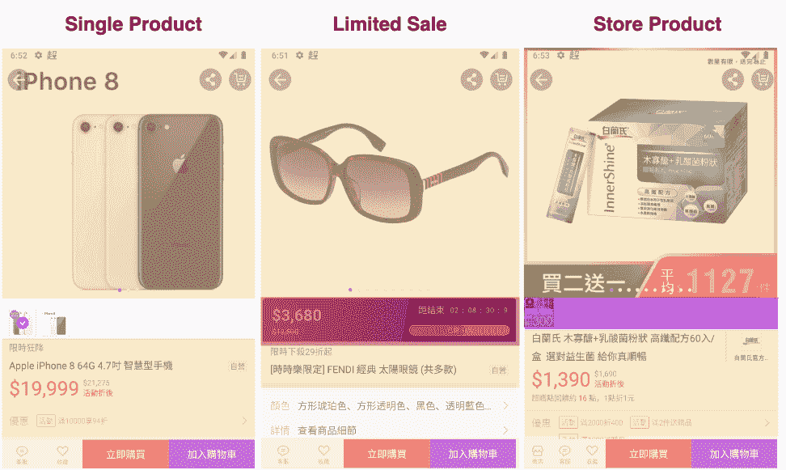
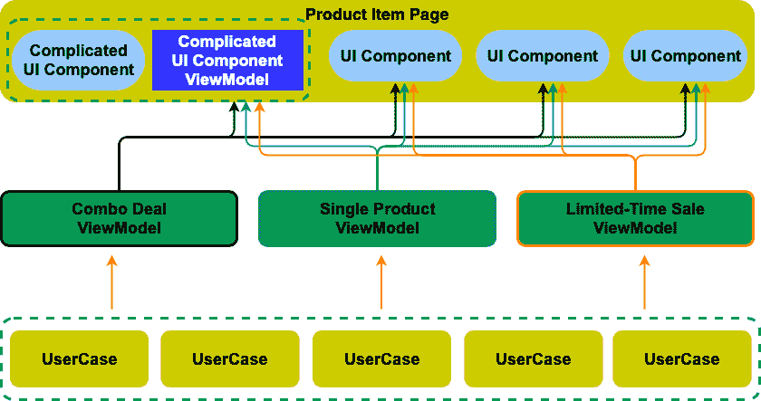
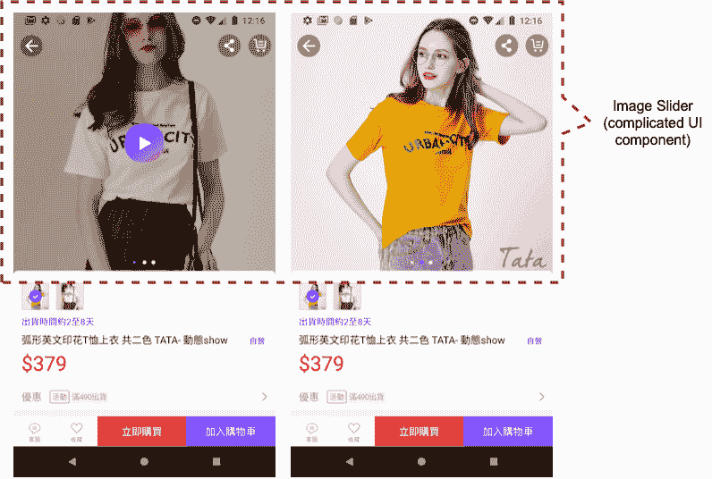
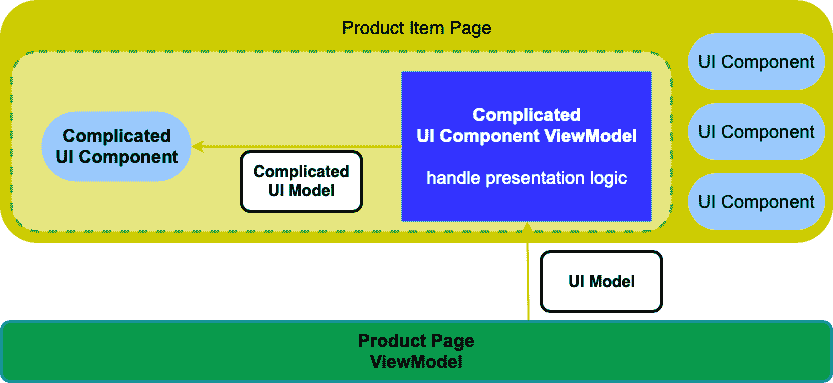
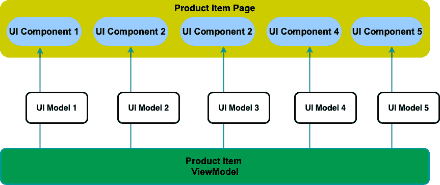

# 像乐高一样将复杂的页面与各种逻辑和 UI 结合起来

> 原文：<https://itnext.io/combine-complex-pages-with-various-logic-and-ui-like-lego-1552bebc9e0f?source=collection_archive---------9----------------------->

## 移动应用中多种逻辑和身份用户界面的架构

> 感谢我的同事们，[万青](https://www.linkedin.com/in/wan-ching-shao-b8142667/)、[黄圣文](https://www.linkedin.com/in/shengsianghuang/)、[安斯加](https://www.linkedin.com/in/ansgarlin/)帮助我们重构项目，准备分享文章。他们是优秀架构编程和算法的高级 android 工程师，因此我们将遗留代码迁移到更好的架构，正如我们在这里分享的那样。

# **介绍**

在电子商务应用程序中，产品项目风格的页面不仅呈现单一产品，还呈现几种不同的特定类型的产品，例如，组合交易、限时特卖产品等。每种类型的产品都有不同的 API、数据结构和业务逻辑。但是，它们都是通过相似的 UI 来显示，以减少用户的学习曲线。本文介绍了如何重构我们的原始架构，将基本的 MVVM 转换为现代的，以获得开发速度，并进一步显著提高代码质量。

之前在购物 app 中，商品项目页面有三种风格:单品、限时特卖商品、超级限时特卖商品。这三种产品具有相似的 UI，但是限时销售产品和超级限时销售产品具有相同的倒计时 UI 模型。而且，单品和限时特卖品共用同一个 API 服务器，超限时特卖品使用另一个。

过去，我们使用继承来实现三种类型的页面。深厚的继承关系使得项目很难跟踪和修改代码。而且，业务逻辑写在 UI 层；这也使得测试编写困难，app 不稳定。

去年，产品页面需要支持不同的类型，商店产品，然后我们重新设计了产品页面的架构，以分离 UI 层、业务逻辑和数据层。它允许我们根据不同的需求组合产品页面，就像乐高一样。

# **建筑**

## **视图**

产品项目页面包含几个 UI 组件，例如图像滑块、规格选择器、促销列表、赠品、附加组件等。这些组件还来自不同的 API，这意味着同一 UI 组件的数据模型会有所不同。每个组件可能显示不同类型产品的不同业务逻辑。

为了处理这个问题，我们给每个 UI 组件一个 UI 模型，作为数据模型和 UI 组件之间的适配器。因此，业务逻辑和数据到 UI 组件中显示的信息之间的映射可以成功地对 UI 组件隐藏。至于产品项目页面，只要它观察到 UI 模型的变化，它只需要将 UI 模型分派给专用的 UI 组件。页面不关心任何业务逻辑相关的东西。

此外，对于这些复杂的 UI 组件，我们将 MVVM 进一步缩小。例如，项目页面的图像滑块接受图像和视频的 URL 数组，它生成每种类型的不同单元格，处理部分 diff 更新和其他隐式呈现逻辑。在这种情况下，我们用 MVP 封装这个图像滑块:URL 数组是它的 logModel，presenter 计算 diff 更新场景，并更新滑块。

## **UI 模型**

UI 模型是根据 UI 组件的需求设计的，所以它不应该也不需要使用来自远程 API 的数据结构。UI 模型是来自 API 的数据模型和 UI 组件之间的适配器。

## **ViewModel**

ViewModel 处理整个业务逻辑，决定使用哪个存储库，处理用户交互事件，并发出不可变的 UI 模型。ViewModel 提供了 UI 模型的单向通信，因此它没有任何直接更改数据的公共方法，这些公共方法只有委托方法(供视图观察然后呈现)和动作事件接收器(例如，用户单击某个按钮需要调用远程 API 来执行。)

例如，如果 item page 将自己分成 10 个组件，那么 ViewModel 也有 10 个 observabless，每个 observable 为单个组件发出一种 UI 模型。项目页面是一个观察者，当一些状态发生变化时会被通知，并被分派到相应的 UI 组件。项目页面还定义了用户执行的操作，比如添加到愿望列表、添加到购物车等。，到 ViewModel 实现的接口中。

## **用例**

ViewModel 不应该从别人那里继承；他们是独立的。如果它们之间有相似或相同的逻辑，该逻辑必须从视图模型中提取出来成为这些隔离的类，用例，它们在不同的视图模型中重用。

# **优势**

*   要添加新类型的项目页面，我们只需实现新的 ViewModel，它可能会从新的 API 进行查询，然后将这些新的数据结构转换为相应的 UI 模型，然后原始项目页面会正确地呈现 UI 组件。
*   要添加新的 UI 组件，我们实现这个 UI 组件及其配对的 UI 模型，我们不需要改变任何原始代码或结构，也不会影响以前的项目页面类型。这样就很容易通过这个架构在 UI 上做 A/B 测试；我们让 ViewModel 发送不同的 UI 模型，然后页面呈现不同的 UI。
*   能够对所有的视图模型，甚至用例进行单元测试。这意味着我们可以实现业务逻辑的转换以及从数据模型到 UI 模型的转换。
*   对于这些复杂的 UI 组件，我们将它们打包到较小的 MVVM 架构中。这样，因为小 MVVM 独立于页面生命周期和 Android/iOS 框架，我们可以通过进一步的单元测试快速测试那些 UI 组件。

# 结论

在这个 Q2 中，为了响应新的营销活动，购物需要支持新的产品项目类型:组合交易。组合交易是多种产品的组合。UI 类似于单个产品，但是后端 API 是全新的，UI 上有一些小的区别。

通过我们设计的架构，我们只需要实现一个新的后端 API，并将 API 响应转换成相应的 UI 模型，这样 UI 层就完成了。然后创建一个组合交易的视图模型，并使业务逻辑工作。最后，编写单元测试。一个全新的、可测试的项目页面就完成了，不会影响其他类型的项目页面。