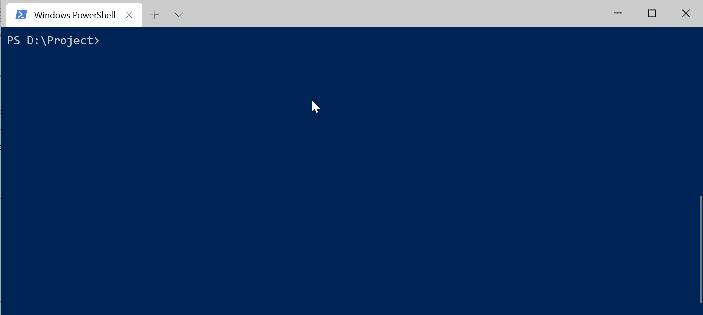

# 命令行界面(CLI)应用程序。网络核心

> 原文：<https://itnext.io/command-line-interface-cli-application-with-net-core-75bb5603ee70?source=collection_archive---------1----------------------->


一个终端(照片由 [Kermit Project](http://www.columbia.edu/kermit/terminals.html) 拍摄)

命令行界面( **CLI** )可能看起来很老派，但它是使用应用程序最有用的方式之一。您可以在 SSH 连接中与他们进行交互。

CLI 无处不在，比较著名的有 [Angular CLI](https://cli.angular.io/) 、 [Vue CLI](https://cli.vuejs.org/) 、[实体框架核心 CLI](https://docs.microsoft.com/en-us/ef/core/miscellaneous/cli/dotnet) 等。

## 序言

在您开始为您的应用程序创建 CLI 之前，您需要为它设计命令、选项、参数和解释清楚的指南。

想想你有一个应用程序转换 CSV 到 Excel 文件和反向。

**命令**

*   皈依者
*   打印
*   帮助

**全局选项**

*   输入文件
*   冗长的

**转换子命令选项**

*   第一行作为标题(仅限 CSV)。
*   输出名称。

**打印子命令选项**

*   行
*   尾巴

**例题**

```
# For converting the CSV/Excel files
csv-util convert --first-row-header --input:file.csv --output:output_file# For printing only the 10 first rows
csv-util print --rows:10 --input:file.csv# For priting only the 10 tailing rows
csv-util print --rows:10 --tail --input:file.csv
```

我们已经为我们的 CLI 草拟了一份设计方案。是时候让它成真了。

## 中的 CLI 应用程序。网

有几个图书馆。用于创建 CLI 的. NET 核心。内特·麦克马斯特的《T21》是我认为最好的一部。CommandLineUtils 是[微软的一个分支。extensions . command line utils](https://github.com/aspnet/Common)，不再在[活动开发](https://github.com/aspnet/Common/issues/257)中。

**为什么是 CommandLineUtils 库？**

*   它支持 CLI 应用程序中的依赖注入。
*   支持用于创建 CLI 的属性和 API 生成器。

在本文中，我们主要关注这个库来实现 **CSVUtil** CLI。

## 入门指南

安装[。NET Core SDK](https://dotnet.microsoft.com/download) 和 [VSCode](https://code.visualstudio.com/Download) 如果你还没装的话。用 DOTNET 创建一个新的控制台项目。

```
dotnet new console -o CSVUtil
```

添加 [**麦克马斯特。extensions . command line utils**](https://www.nuget.org/packages/McMaster.Extensions.CommandLineUtils)**n 将包获取到项目中。**

```
dotnet add package McMaster.Extensions.CommandLineUtils
```

**在 Program.cs 文件中，初始化您的 CLI 应用程序，如下例所示。**

**在我们的设计草案中，我们有两个全局选项:Verbose 和输入文件。这些是所有命令的选项。为了定义一个选项，这个库有方法`Option`。**

*   **每个选项都应该有一个模板。模板被定义为“-i| —输入”。**
*   **根据选项的不同，它可以有值(或者只有一个值)或者什么都没有，这可以通过`CommandOptionType` enum 来配置。**
*   **如果有任何选项是强制性的，可以根据需要用`IsRequired`方法标记。**

## **添加命令**

**添加命令与添加选项相同。*请记住命令是可以嵌套的。***

*   **可以在命令内部定义与特定命令相关的选项。**
*   **定义选项时，可以在泛型方法中告知 CLI 选项值类型。**
*   **可以用 **HasValue** 方法检查选项是否有值。**
*   **在使用选项类型的情况下，解析的值可以通过 **ParsedValue** 属性访问。**
*   **每个命令都有自己的帮助。**
*   **每个命令都应该有一个执行的方法**，这个方法将在 CLI 中执行。****

**要让您的 CLI 准备好执行，您需要通过 args 参数告诉应用程序执行 CLI。**

## **执行 CLI**

**我们有两个全局选项和两种方法。通过运行 CSVUtil -h，应用程序将把它打印到控制台:**

```
CSVUtil -h
Usage:  [command] [options]Options:
  -i|--input    Input file to convert
  -v|--verbose  Display operation details
  -?|-h|--help  Show help informationCommands:
  convert
  printRun ' [command] -?|-h|--help' for more information about a command.
```

**因为我们定义了两个全局选项，所以需要在[command]之前调用它们。例如，我想以冗长的方式将 CSV 文件转换为 Excel。**

```
CSVUtil --verbose --input:file.csv convert --first-row-header
```

**如你所见，`--verbose`和`--input`在任何命令之前输入。**

****

**现场执行 CSVUtil**

**CommandLineUtils 提供了其他几个特性，比如属性和依赖注入。属性是创建 CLI 的一个很酷的特性，但是像我这样的一些人更喜欢 builder-pattern(我们的例子是在 builder-pattern 中实现的)。**

```
using System;
using McMaster.Extensions.CommandLineUtils;

public class Program
{
    public static int Main(string[] args)
        => CommandLineApplication.Execute<Program>(args);

   ** [Option(Description = "The subject")]**
    public string Subject { get; }

    private void OnExecute()
    {
        var subject = Subject ?? "world";
        Console.WriteLine($"Hello {subject}!");
    }
}
```

**对于依赖注入，最好阅读项目文档。**

**如果你喜欢完整的工作示例，你可以在 [GitHub](https://gist.github.com/0x414c49/818c681e0ab7b5a5bb89350652c65568) 上找到。**