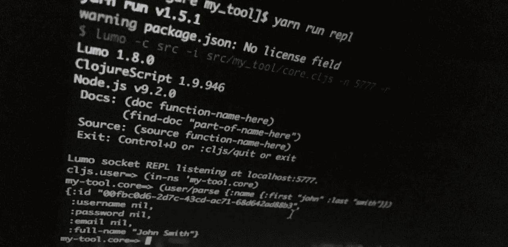

# 使用 ClojureScript 的命令行脚本

> 原文：<https://itnext.io/command-line-scripting-with-clojurescript-5e5567367713?source=collection_archive---------2----------------------->



本文的日文翻译版本可在 [Qiita](https://qiita.com/t-cool/items/1cf901a67dae55b09746) 上获得。

感谢 ClojureScript 社区最近的发展，用 Clojure 编写命令行脚本对我来说是一种有趣的体验。主要归功于 [@anmonteiro](https://github.com/anmonteiro) 开发 [lumo](https://github.com/anmonteiro/lumo) 和核心 ClojureScript 团队。

我认为 Clojure 是编写一次性脚本来处理数据的绝佳语言，因为它内置了操作函数和不可变的结构，所以您不必担心引用和深度克隆。

# 使用 Lumo 运行脚本

最简单的开始方式是在你的系统上安装`lumo`并运行 Clojure 文件(如果你不想全局安装`lumo`，请参见下面的 NPM 部分)。创建一个名为`hello.cljs`的文件，内容如下:

```
(println "Hello World!")
```

并使用以下命令运行它:

```
$ npm i -g lumo-cljs ## or other package manager of your choice
$ lumo hello.cljs
Hello World!
```

再简单不过了。现在，让我们看看如何利用 Node。JS APIs 编写一个稍微实用一点的程序:

如您所见，`require`函数现在可以像它的 JS 对应物一样工作，并像您使用下面的代码一样拉入 JS 模块:

```
const { writeFileSync } = require('fs');
const inputJson = require('./randomUsers.json');
```

它还可以与使用`npm`安装在同一目录下的`node_modules`文件夹中的模块一起工作(从`lumo 1.8.0`开始)。u̵n̵f̵o̵r̵t̵u̵n̵a̵t̵e̵l̵y̵,̵̵t̵h̵e̵r̵e̵̵i̵s̵n̵'̵t̵̵a̵n̵̵e̵a̵s̵y̵̵w̵a̵y̵̵t̵o̵̵m̵a̵n̵a̵g̵e̵̵d̵e̵p̵e̵n̵d̵e̵n̵c̵i̵e̵s̵̵o̵n̵̵t̵h̵e̵̵c̵l̵o̵j̵u̵r̵e̵̵s̵i̵d̵e̵̵j̵u̵s̵t̵̵y̵e̵t̵̵s̵o̵̵f̵o̵r̵̵n̵o̵w̵̵w̵e̵̵a̵r̵e̵̵s̵t̵u̵c̵k̵̵w̵i̵t̵h̵̵m̵a̵n̵u̵a̵l̵l̵y̵̵h̵a̵n̵d̵l̵i̵n̵g̵̵j̵a̵r̵̵f̵i̵l̵e̵s̵̵w̵h̵e̵r̵e̵̵c̵l̵o̵j̵u̵r̵e̵̵l̵i̵b̵r̵a̵r̵i̵e̵s̵̵a̵r̵e̵̵u̵s̵u̵a̵l̵l̵y̵̵p̵a̵c̵k̵a̵g̵e̵d̵.̵̵(̵t̵a̵k̵e̵̵a̵̵l̵o̵o̵k̵̵a̵t̵̵t̵h̵e̵̵l̵u̵m̵o̵̵w̵i̵k̵i̵̵f̵o̵r̵̵m̵o̵r̵e̵̵d̵e̵t̵a̵i̵l̵s̵.̵)̵
**更新 2018 年 10 月:**我刚刚发现可以使用 Clojure 的 CLI 工具`clj`通过`deps.edn`([https://clojure.org/guides/deps_and_cli](https://clojure.org/guides/deps_and_cli))管理和设置 Clojure 端依赖的类路径。在下面的演示项目中，只需用`-c `clj -Spath``替换 lumo 标志`-c src`，您应该能够要求在`deps.edn`文件中指定的所有依赖项。

# 与 NPM 融合

对于稍微大一点的项目，你可能希望有一个适当的`package.json`并依赖于 NPM。如果你不想在全球范围内安装或者希望在其他地方发布这个包，你也可以在每个项目的基础上安装`lumo`。下面是一个示例项目，它的工作方式与上面的例子类似，但是使用 NPM 的`request`库从 [https://randomuser.me](https://randomuser.me) 中获取 JSON，并将代码分成两个具有适当名称间距的 Clojure 文件:

```
my-tool
|\_ package.json
 \_ src
     \_ my_tool
        |\_ core.cljs
         \_ user.cljs
```

Clojure 的名称空间系统镜像了目录结构，因此带有 ns `my-tool.core`的文件必须是`my_tool/core.cljs`。

**明白了**:名称空间中用连字符分隔的名称必须在文件系统中转换成 snake_case。

`core.cljs`:

`user.cljs`:

`package.json`:

`-c`标志告诉 lumo 你的源文件在哪里，而`-m`标志指定你的`-main`函数在哪个名称空间。您可以使用通常的 npm 程序运行此工具:

```
$ npm install
$ npm start 12 ## fetches 12 users and outputs randomUsers.edn
```

# REPL 发展

当然，没有基于 REPL 的交互式开发，任何 Clojure 体验都是不完整的。将以下行添加到您的`package.json`文件的`scripts`部分:

```
"repl": "lumo -c src -i src/my_tool/core.cljs -n 5777 -r"
```

`-i`标志用我们的入口点`core.cljs`初始化 REPL，`-n`标志在端口 5777 上启动一个套接字 REPL 用于编辑器集成，最后`-r`标志在终端中启动一个 REPL。有了它，您可以在运行时执行任意代码，而不会丢失状态:

```
$ npm run repl
...
cljs.user=> (in-ns 'my-tool.core) ;; switch to our core namespace
my-tool.core=> (user/parse {:name {:first "john" :last "smith"}})
{:id "c1b61773-133e-434c-afbd-d82b95b814d3",
 :username nil,
 :password nil,
 :email nil,
 :full-name "John Smith"}
```

# 最后的想法

虽然目前的工具仍有一些粗糙的地方，但我认为这是用 Clojure 编写 CLI 脚本开始成为一个可行的选择和 JS 的良好替代的时候了。

Lumo 的启动时间比任何运行在 JVM 上的 clojur 东西都要快，所以它是一股新鲜空气。

如果你喜欢 Clojure，我肯定会推荐你试试这个。

# 参考

[](https://clojurescript.org/news/2017-07-12-clojurescript-is-not-an-island-integrating-node-modules) [## ClojureScript 不是孤岛:集成节点模块

### 编辑描述

clojurescript.org](https://clojurescript.org/news/2017-07-12-clojurescript-is-not-an-island-integrating-node-modules) [](https://github.com/anmonteiro/lumo) [## 安蒙泰罗/卢莫

### lumo -快速、跨平台、独立的 ClojureScript 环境

github.com](https://github.com/anmonteiro/lumo)