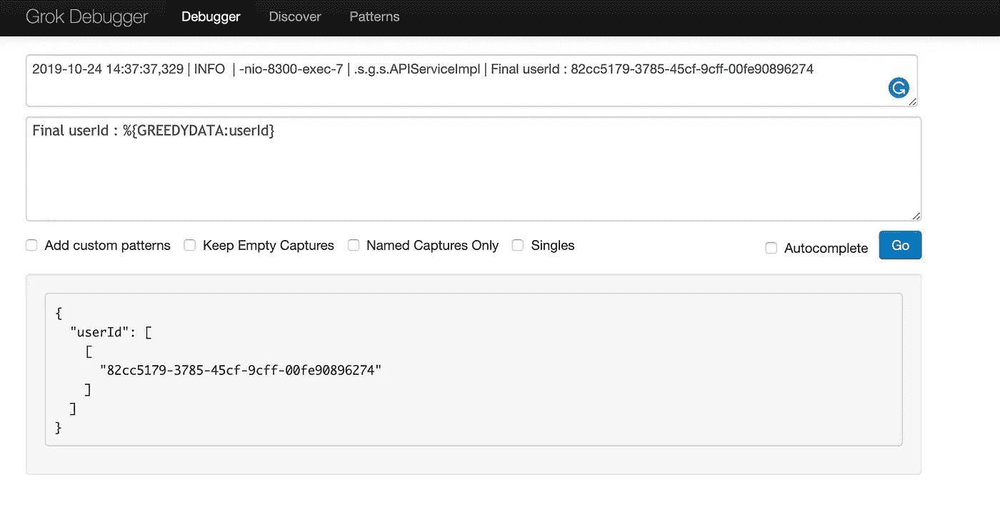
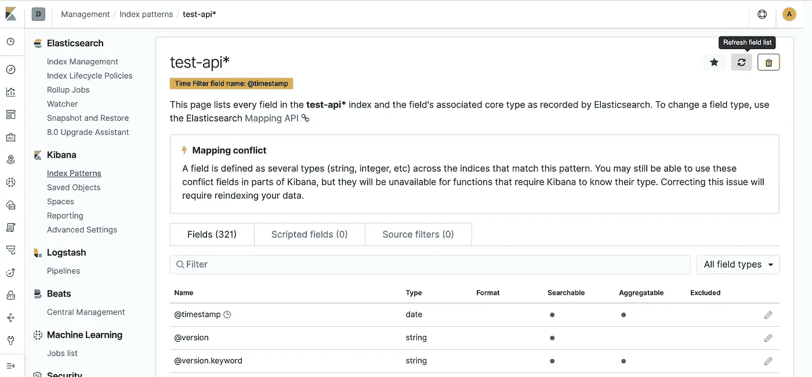
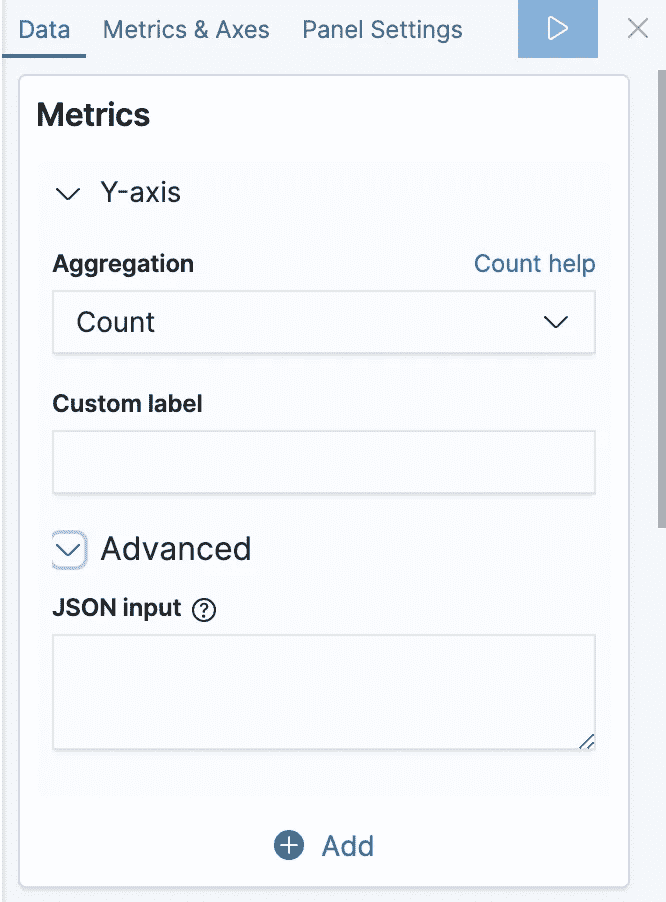
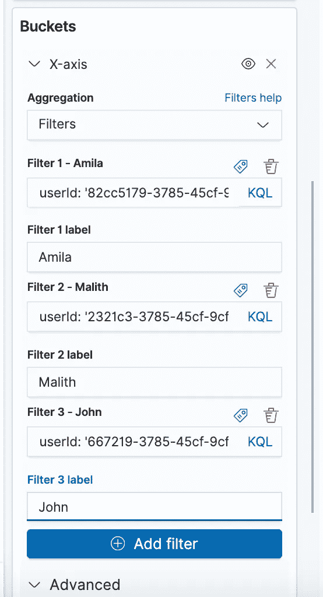

# GROK、JSON 和 Mutate 过滤器的常见 Logstash 用例。

> 原文：<https://itnext.io/common-logstash-use-cases-with-grok-json-and-mutate-filters-elk-logstash-in-docker-filebeat-871ed58c7651?source=collection_archive---------0----------------------->

## # ELK # Logstash in Docker # Filebeat # ki Bana # GROK

图片参考:[https://www.elastic.co/brand](https://www.elastic.co/brand)

## 嗨，技术人员，

今天我将解释一些涉及 GROK 和 Mutate 插件的常见 Logstash 用例。

对于下面的例子，我们使用的是 [Logstash 7.3.1 Docker](https://www.elastic.co/guide/en/logstash/current/docker.html) 版本以及 Filebeat 和 Kibana(弹性搜索服务)。我们的 Spring boot (Log4j)日志如下所示。

Spring Boot 日志:[https://gist . github . com/amilaI/cda9b 5856 c 07 EC 3 B4 f 6 DC 19d 01 a 3c 557](https://gist.github.com/amilaI/cda9b5856c07ec3b4f6dc19d01a3c557)

**让我们看看如何实现以下用例。**

1.  我们需要提取第一个日志(字符串)中的 JSON 响应，并将 JSON 中的每个字段添加/映射到 Elasticsearch 字段。这样，我们可以通过这些数据字段轻松地创建 Kibana 可视化或仪表板。
2.  我们需要从上面提到的其余日志中找到并提取一些特定的文本/字符串，如**用户 Id** 和**登录 Id** ，并将它们添加为 Elastcseach 字段。
3.  从第二个日志“**最终用户标识 XXX-XXXX-XXXX** ”中提取用户标识字段后，我们需要在 Kibana 中可视化一个垂直条形图，其中 x 轴包含提取的用户标识列表，y 轴包含“总日志计数”。我们还需要用每个相应的用户名标记 x 轴用户 id。(硬编码标签映射)

**如何实现以上用例？**

首先，看看最终的 Logstash.conf 文件是什么样子的，然后让我们一行一行地看。

final log stash . conf[https://gist . github . com/amilaI/0 a7e 44 eee 5a 4176 eede 010191 b 4313 a3](https://gist.github.com/amilaI/0a7e44eee5a4176eede010191b4313a3)

1.  在本例中，Logstash 输入来自 [Filebeat](https://www.elastic.co/products/beats/filebeat) 。
2.  首先，我们需要通过 [Logstash 剖析过滤插件](https://www.elastic.co/guide/en/logstash/current/plugins-filters-dissect.html)将 Spring boot/log4j 日志格式分成时间戳、级别、线程、类别和消息。
3.  有时，时间戳可以采用不同的格式，如“YYYY-MM-dd HH:mm:ss，SSS”或“YYYY-MM-dd HH:mm:ss”。SSS”，所以我们需要在[日志日期过滤插件](https://www.elastic.co/guide/en/logstash/current/plugins-filters-date.html#plugins-filters-date-match)的匹配块中包含这些格式。
4.  现在让我们从字符串消息中提取 JSON 对象，并做一些改变。
5.  让我们通过 Logstash Mutate 插件中的[复制操作来复制消息，并保持原始消息不变，以简化事情。**这是一个可选步骤。**](https://www.elastic.co/guide/en/logstash/current/plugins-filters-mutate.html#plugins-filters-mutate-copy)
6.  现在让我们通过 [Logstash GROK filer 插件](https://www.elastic.co/guide/en/logstash/current/plugins-filters-grok.html)将这个 JSON 字符串设置为一个名为“payload_raw”的临时字段。这里使用的模式是**pattern _ definitions =>{ " JSON " =>" {。*$" }**
7.  现在，让我们通过 [Logstash JSON 过滤器插件](https://www.elastic.co/guide/en/logstash/current/plugins-filters-json.html)将 JSON 字符串转换成实际的 JSON 对象，这样 Elasticsearch 就可以将这些 JSON 字段分别识别为 Elasticseatch 字段。
8.  就是这样！最后，我们可以通过 Mutate filter 插件中的 [remove_field 操作删除所有临时字段。](https://www.elastic.co/guide/en/logstash/current/plugins-filters-mutate.html#plugins-filters-mutate-remove_field)
9.  对于其他用例，我们只需要 [Grok 过滤器模式](https://github.com/elastic/logstash/blob/v1.4.0/patterns/grok-patterns)。具体到上面我们只需要“ **GREEDYDATA** ”。例如，如果我们需要查找 userId 并将其映射到一个名为“userId”的字段，我们可以简单地通过“ **%{GREEDYDATA:userId}** ”来实现。这与 Regex 非常相似。
10.  我们还可以通过 GROK 调试器测试和验证这些定制的 GROK 模式。([https://grokdebug.herokuapp.com/](https://grokdebug.herokuapp.com/))

这是 Grok 调试器查找 **%{GREEDYDATA:userId}** 的方式

此外，请注意，在 logstash.conf 的输出部分，我们已经使用**stdout { codec =>ruby debug }**启用了 [Logstash 调试](https://www.elastic.co/guide/en/logstash/current/plugins-outputs-stdout.html)

好吧！现在我们已经完成了 logstash.conf，让我们运行 Logstash (Docker)。此外，由于 Filebeat 被用作 Logstash 输入，我们也需要启动 Filebeat 进程。您可以使用以下命令来运行 Logstash docker 实例。

Logstash docker 命令:[https://gist . github . com/amilaI/16 BF 3 E1 c 006895 facc 8 b5 DDD 3150 bb 88](https://gist.github.com/amilaI/16bf3e1c006895facc8b5ddd3150bb88)

**注意** : **确保使用的 docker 端口没有被其他应用程序使用。使用 network 作为主机(— net=host)以避免类似 Filebeat 日志中出现的错误。**

2019–10–24t 10:25:59.648+0800 错误 logstash/async.go:256 **未能发布事件原因:客户端未连接**
2019–10–24t 10:26:00.755+0800 错误管道/输出. go:121 **未能发布事件:客户端未连接**
2019–10–24t 10 继续发送
2019–10–24t 10:26:0

**以下是本例中使用的 Filebeat.yml。**

filebeat . yml:[https://gist . github . com/amilaI/27672 b0d 8 f 2929 EB 79855466 E1 c 8157 e](https://gist.github.com/amilaI/27672b0d8f2929eb79855466e1c8157e)

让我们通过下面的命令运行 Filebeat。(稍后，你可以使用 **nohup** 来运行 Filebeat 作为后台服务，甚至使用 [Filebeat docker](https://www.elastic.co/guide/en/beats/filebeat/current/running-on-docker.html)

> **。/file beat-c config . yml-e-d " * "**

最后，我们只需更新已配置的日志文件(/apps/test.log)，realtime Filebeat 将选择更新的日志。现在，您可以测试和验证 logstash 插件/GROK 过滤器配置。

**如何跟踪日志 docker 日志？**

您还可以跟踪 Logstash Docker 实例的日志，

> sudo docker logs-f-tail 500 logstash-test

> 为什么 Filebeat 不从我的文件中收集行？
> 
> Filebeat 可能配置不正确或无法将事件发送到输出。要解决该问题:
> 
> 确保配置文件指定了您正在收集的文件的正确路径。更多信息参见[步骤 2:配置 Filebeat](https://www.elastic.co/guide/en/beats/filebeat/1.1/filebeat-configuration.html) 。
> 
> 验证文件没有比`[*ignore_older*](https://www.elastic.co/guide/en/beats/filebeat/1.1/configuration-filebeat-options.html#ignore-older)`指定的值旧。默认情况下，Filebeat 会停止读取超过 24 小时的文件。您可以通过为`[*ignore_older*](https://www.elastic.co/guide/en/beats/filebeat/1.1/configuration-filebeat-options.html#ignore-older)`指定不同的值来改变这种行为。
> 
> 确保 Filebeat 能够将事件发送到配置的输出。在调试模式下运行 Filebeat 以确定它是否成功发布了事件
> 
> 。/filebeat -c config.yml -e -d "* "
> 
> 参考:[https://www . elastic . co/guide/en/beats/file beat/1.1/_ why _ isn _ t _ file beat _ collecting _ lines _ from _ my _ file . html](https://www.elastic.co/guide/en/beats/filebeat/1.1/_why_isn_t_filebeat_collecting_lines_from_my_file.html)

接下来，让我们转移到基巴纳。对于这个例子，我在 Elasticsearch 服务中使用 [Kibana。](https://medium.com/@amila922/email-slack-x-pack-actions-in-elasticsearch-service-cloud-watcher-elk-alerting-445faf01661f)

您应该能够看到事件消息中包含的所有新字段以及消息、时间戳等。您还需要刷新 Kibana 索引的字段列表。

**导航至管理- > Kibana(索引模式)- >选择索引- >刷新字段列表**

现在让我们专注于在 Kibana 中创建一个垂直条形图。

**导航到基巴纳- >可视化- >创建新的可视化- >竖条**

根据需要选择索引。

选择“**计数**”作为 Y 轴的聚合。

现在选择 X 轴**聚合**中的**过滤器**。通过标签功能添加每个用户 Id 和标签(用户名)映射。

现在，您应该能够看到预期的条形图可视化。:)

另一种完成标签映射的方式是通过 [Logstash 翻译插件](https://www.elastic.co/guide/en/logstash/current/plugins-filters-translate.html)。(logstash 方式)。既然我们已经提取了 userId 字段，接下来我们需要的是某种类型的**常量键值数据结构(可以是一个映射或字典)**或**一些在 Logstash 级别中硬编码的常量数组**。现在 Logstash 翻译插件来拯救我们了。

> 翻译过滤器插件是一个通用的搜索和替换工具，它使用配置的哈希和/或文件来确定替换值。目前支持 YAML、JSON 和 CSV 文件。每个字典条目都是一个键值对。
> 
> [https://www . elastic . co/guide/en/log stash/current/plugins-filters-translate . html # plugins-filters-translate](https://www.elastic.co/guide/en/logstash/current/plugins-filters-translate.html#plugins-filters-translate)

好吧！现在我们需要的是一个新字段(在本例中为'**用户名**')，并用给定用户 Id (这是**键**)的**对应字典值**填充它。如果字典中有与给定键(userId)匹配的键，相应的值将被映射到“ [**目的地**](https://www.elastic.co/guide/en/logstash/current/plugins-filters-translate.html#plugins-filters-translate-destination) ”字段。让我们看看这些设置。

[https://gist . github . com/ami lai/9c 0219 de 8 b 285517326 b 0 EB 434 a 83 a 67](https://gist.github.com/amilaI/9c0219de8b285517326b0eb434a83a67)

就是这样！因此，最终现在您可以轻松地在 Kibana 中创建相同的条形图，而无需在 Kibana 级别进行任何过滤器标签映射。

现在让我分享一些我在使用 Logstash 时遇到的小事情。:)

**如何在 Logstash Conf 中打印消息以便调试？**

有时候，当你调试日志时，你可能需要在日志中打印一些消息来验证。您可以简单地使用 Logstash [Ruby 过滤器插件](https://www.elastic.co/guide/en/logstash/current/plugins-filters-ruby.html)来实现这一点，如下所示。

[https://gist . github . com/ami lai/a5e 5c 647 f 18 e 3d 110d 73 f 379 dee 4 f 531](https://gist.github.com/amilaI/a5e5c647f18e3d110d73f379dee4f531)

**如何美化或适当缩进 Logstash conf？**

https://beautifier.io/是一个很棒的在线工具，可以缩进或者美化 Logstash conf(不仅仅是 JSON by Conf)

**如何在 Logstash 中搜索并替换一个字符串？**

您可以通过 Logstash Mutate 插件中的 [gsub 操作来实现这一点。](https://www.elastic.co/guide/en/logstash/current/plugins-filters-mutate.html#plugins-filters-mutate-gsub)

除此之外， [add_field](https://www.elastic.co/guide/en/logstash/current/plugins-filters-mutate.html#plugins-filters-mutate-add_field) ， [tag_on_failure](https://www.elastic.co/guide/en/logstash/current/plugins-filters-mutate.html#plugins-filters-mutate-tag_on_failure) 是我觉得很重要的一些操作。

[https://www . in images . com/uploaded _ files/image/970 x450/Getty _ 456110931 _ 9709539704500220 _ 74714 . jpg](https://www.incimages.com/uploaded_files/image/970x450/getty_456110931_9709539704500220_74714.jpg)

酷！我现在就知道这些。:)希望这篇文章对你有帮助。感谢您的阅读，如果您觉得这篇文章有帮助，请鼓掌！

干杯！！