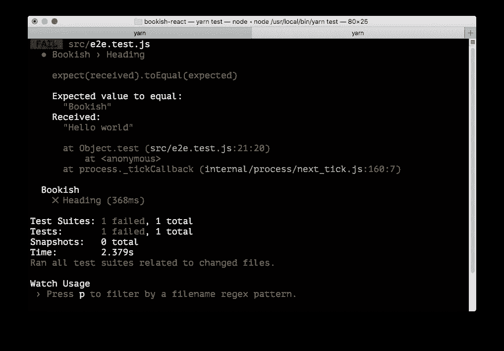
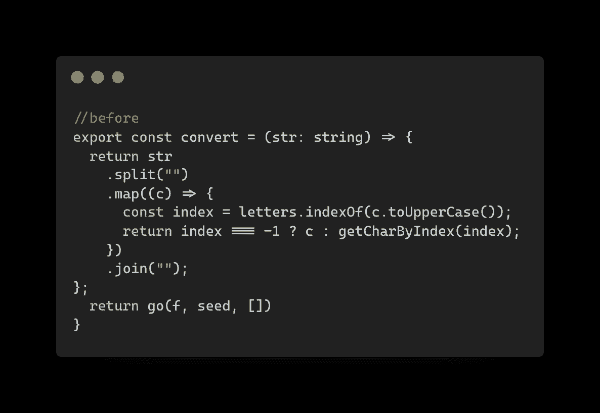
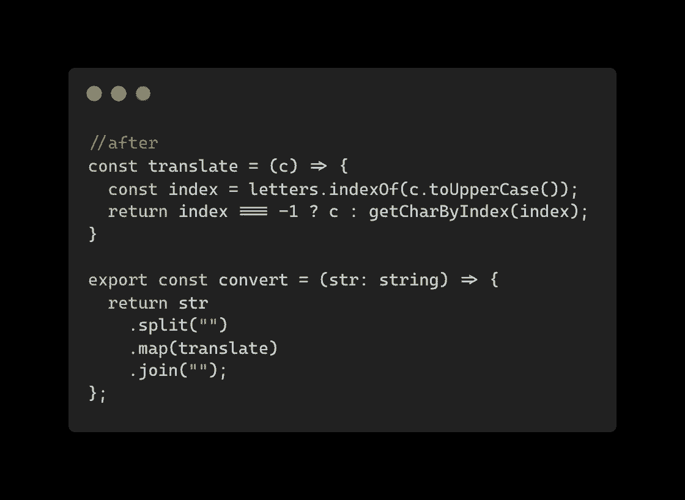
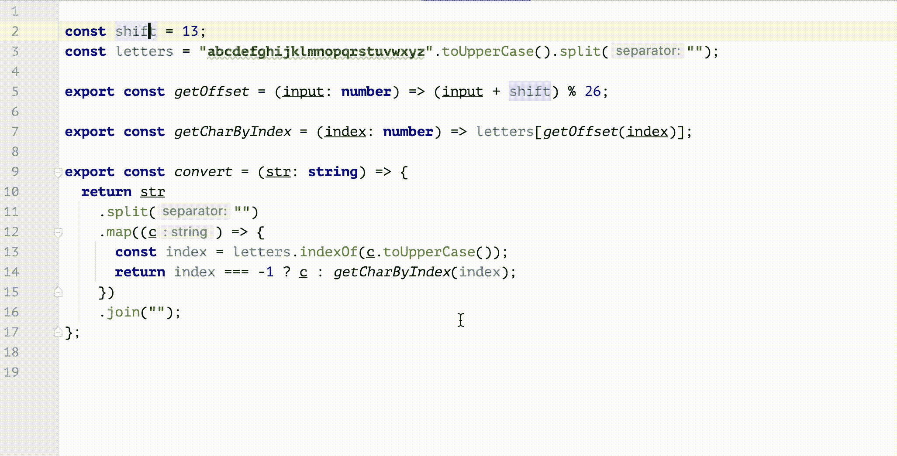

# 重构中你会犯的 4 个常见错误

> 原文：<https://itnext.io/common-mistakes-you-make-in-refactoring-d7e607c8eb43?source=collection_archive---------2----------------------->

肯尼·埃利亚松在 [Unsplash](https://unsplash.com?utm_source=medium&utm_medium=referral) 拍摄的照片

这些年来，我看到了人们在重构中挣扎的例子。有些过程相当顺利，而有些则不然。对于这些不太好用的案例，我注意到了一些常见的模式，以及如何改进它们并充分利用重构带给你的好处。

如果你想了解更多关于测试驱动开发和重构的实践，我在这里制作了一个视频教程[(不要忘记订阅频道，这样你就可以在视频发布时得到通知)。](https://www.youtube.com/watch?v=a0ZxlRgxDAs)

# 1.不经测试进行更改

这是我见过的程序员最常犯的错误。也许是因为你做了不值得测试的“小”改变，或者也许测试设置是困难的，你正在走捷径跳过测试。

但问题是，如果没有它，即使是微小的变化也可能对软件的其他部分产生一些意想不到的影响。

测试驱动开发

我总是从测试开始。如果有现有的测试，我会通读一遍，了解如何使用我要更改的代码的公共 API，如何准备数据，会有什么期待等等。如果没有，我就在我要摸的区域加几个，这样我就知道哪里出问题了。

# 2.重构而不是重构

就像软件开发中的许多术语一样，重构变成了一个可能有许多不同含义的词。人们用`refactoring`来表示其他事情，比如重组、替换底层库等等。

但是如果你读过*重构:改进现有代码的设计*，你可能会惊讶于每一次重构是如此之小。例如，[重命名变量](https://refactoring.com/catalog/renameVariable.html)、[重命名函数](https://refactoring.com/catalog/changeFunctionDeclaration.html)或[提取函数](https://refactoring.com/catalog/extractFunction.html)可能是你每天都会做的事情。

之前转换函数

这里一个可能的操作是提取一个函数来执行`mapping`，然后在`map`中调用它:

提取小函数翻译

这里的关键点是**小。只有当它足够小的时候，你才不太可能因为这样做而犯严重的错误，这也意味着你尽可能短地保持软件处于崩溃状态。**

即使在事情失去控制的最糟糕的情况下，您也可以轻松地恢复您的更改，并返回到工作状态，而无需太多的努力。

# 3.专门的重构任务

在你的故事墙上，类似“*为产品 API* 清理异步代码”或“*重构预计交付时间*的业务逻辑”的事情并不少见。对我来说，这不是一个好的迹象，我认为这是不好的，因为:

1.  这可能意味着你承受着不健康的分娩压力
2.  这可能意味着一些技术债务正在不断增加
3.  这也可能意味着(在最坏的情况下)重构全部代码是非常危险的，并且极具挑战性(在不破坏现有功能的情况下)

因此，与其让这些人专注于此，我建议你应该在手头的任务中做这件事。你可以做一些小的重构，比如重命名函数或提取函数，而不会在任务中分散太多的注意力，因为你经常这样做，从长远来看，代码将更容易修改和添加新功能。

# 4.没有使用正确的工具

我曾经尝试过不同的编辑器、ide 以及介于两者之间的任何东西，十年前，当我开始使用 IntelliJ(并熟悉了它的 keymap 等等)时，我再也没有回头。在那之前，我是 vim 的忠实粉丝，我已经安装和配置了 20 多个插件，每当我必须建立一个开发人员环境时，我都会为一些因果项目和演示使用可视化代码。

但说到认真工作，我总是选择 JetBrains 的产品，不管是 IntelliJ、WebStorm 还是 Pycharm，它们都是最好的。内置的重构工具足够智能，能够理解您想要做什么，并会为您完成。99%的时间没有任何问题:它更新项目/工作区中的所有引用，同步文件系统中的文件，并且您只需关注对您作为开发人员来说重要的事情:思考！

在 WebStorm 中使用自动重构

为了最大限度地利用它，您可能还想记住`keymap`，这样应用这些众所周知的重构将会毫不费力。经过几年的实践，我不假思索地做了许多重构，它们就在我的身材秘诀上。

# 摘要

因此，与其花时间进行重构，不如在编写普通代码时进行重构。让它成为一个正常的惯例。从小处着手，确定你的配速，并进行测试。

**如果你喜欢阅读，请** [**报名参加我的邮件列表**](https://icodeit.com.au/#subscribe) **。我每周通过** [**博客**](https://juntao-qiu.medium.com/)**[**书籍**](https://leanpub.com/u/juntao) **和** [**视频**](https://www.youtube.com/@icodeit.juntao) **分享干净代码和重构技术。****