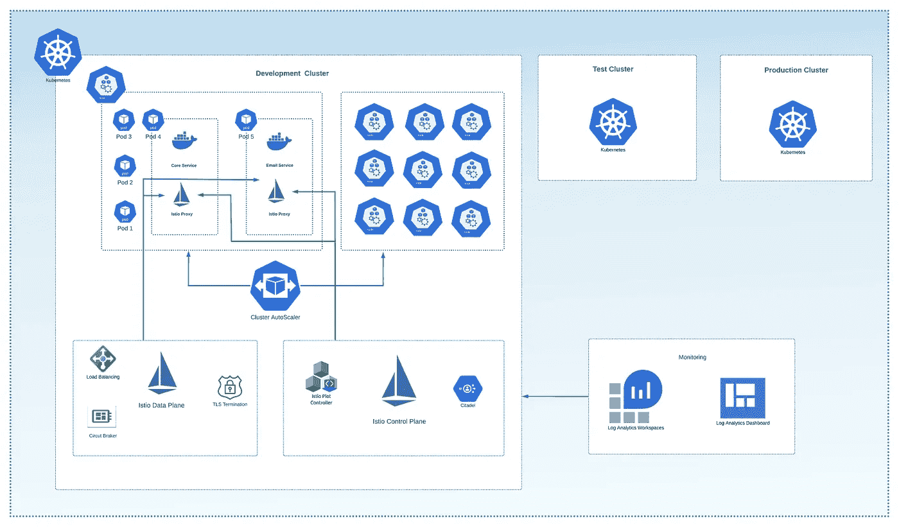
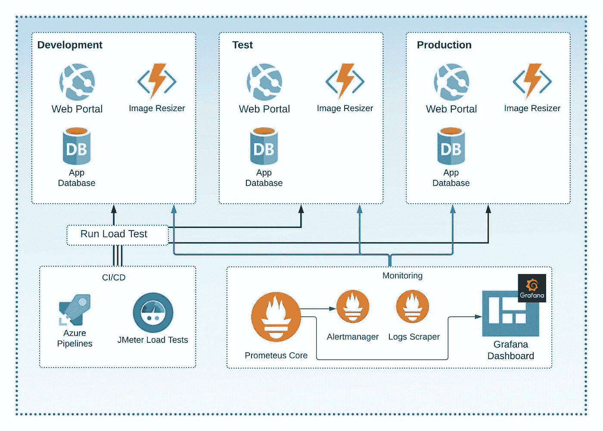
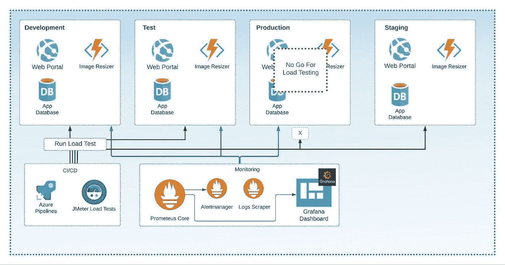
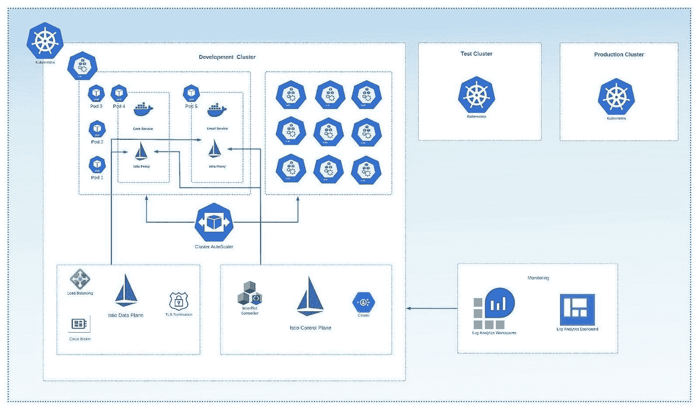
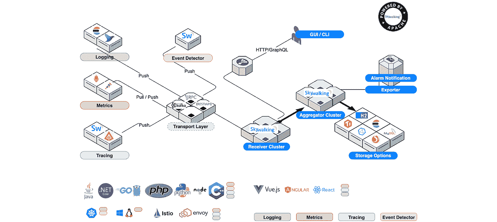

# 常见的绩效管理错误

> 原文：<https://itnext.io/common-performance-management-mistakes-a9625dca03cb?source=collection_archive---------1----------------------->

## 如何避免基于云的架构带来的棘手问题



*编者按:以下为 DZone 2021 年* [*应用性能管理趋势报告*](https://dzone.com/trendreports/application-performance-management-1) *撰写并发表的文章。*

任何云分布式应用的性能都是成功的用户体验的关键。因此，深入了解如何测量性能以及使用什么样的 IO 模式是非常重要的。在本文中，我们将涵盖以下内容:

*   性能分析清单和策略
*   性能问题检测和工具
*   性能反模式以及如何缓解问题

# 云清单中的性能监控

在提高应用程序或基础架构的性能时，请使用以下清单:

*   在应用程序和基础设施组件中引入日志工具
*   找到代码和基础设施的反模式和瓶颈
*   设置监控工具来收集 CPU、内存和存储利用率
*   调整监视工具以收集基本组件之间的事件信息
*   不要记录所有事情—确定要记录的重要事件

# 最常见的应用程序性能反模式

性能清单中最重要的一项是识别反模式。一旦你已经知道了弱点，这将节省宝贵的时间。

# 爱管闲事的邻居

假设您有一个部署为 Docker 容器的微服务，它比其他容器消耗更多的 CPU 和内存。这可能会导致中断，因为其他服务可能无法获得足够的资源。例如，如果您使用 Kubernetes，它可能会杀死其他容器来释放一些资源。通过在设计和实现阶段的最开始设置 CPU 和内存限制，可以很容易地解决这个问题。

# 不缓存

一些倾向于在高负载下工作的应用程序不包含任何缓存机制。这可能导致获取相同的数据并过度使用主数据库。您可以通过在您的应用程序中引入一个缓存[层来解决这个问题，它可以基于 Redis 缓存或者只是一个内存缓存模块。当然，您不需要到处使用缓存，因为这可能会导致数据不一致。有时，您可以通过简单地在代码中添加输出缓存来提高性能。例如:](https://docs.microsoft.com/en-us/azure/architecture/best-practices/caching)

```
namespace MvcApplication1.Controllers
{
  [HandleError]
  public class HomeController : Controller
  { [OutputCache(Duration=10, VaryByParam="none")]
     public ActionResult Index()
     {
         return View();
     }
   }
}
```

上面，我已经为 MVC 应用程序添加了输出缓存属性。它将缓存静态内容 60 秒。

# 繁忙的数据库

这个问题经常出现在现代微服务架构中，当所有服务都在 Kubernetes 集群中并通过容器部署，但它们都使用单个数据库实例时。您可以通过确定每个微服务的数据范围并将一个数据库分成几个来解决这个问题。您还可以使用数据库池机制。比如 Azure 提供 Azure SQL 弹性池服务。

# 重试风暴

重试风暴及其导致的问题通常发生在微服务或云分布式应用中；当某个组件或服务脱机时，其他服务会尝试访问它。这通常会导致无休止的重试循环。然而，它可以通过使用[断路器](https://docs.microsoft.com/en-us/azure/architecture/patterns/circuit-breaker)模式来修复。断路器的概念来自无线电电子学。它可以作为一个独立的组件来实现，比如自动开关。当电路出现问题(如短路)时，开关会关闭电路。

# 示例:导致停机的云性能监控架构

为了检查您的架构的性能，您需要对您的应用程序运行负载测试。下面，你可以看到一个基于 Azure 应用服务和 Azure 功能的架构示例。该架构包含以下组件:

*   分为四个阶段:开发、测试、试运行和生产。
*   使用 Prometheus 和 Grafana 实现登录和监控
*   加载测试是用 Azure DevOps 和 JMeter 实现的

[在这里](https://github.com/azure-samples/jmeter-aci-terraform/tree/main/)，你可以找到一个如何在 Azure DevOps 中设置 **JMeter** 负载测试的例子。

**图 1**



> 这是摘自 DZone 的《2021 年应用性能管理趋势报告》。
> 
> 更多信息:[阅读报告](https://dzone.com/trendreports/application-performance-management-1)

# 修复问题

正如您在图中看到的，乍看起来一切都很好。你认为哪里会有问题？

您可以在图 2 中看到图表的固定架构。

**图 2**



首先，您不应该在生产阶段运行负载测试，因为当您运行额外的负载测试时，它可能(并且经常会)导致停机。相反，您应该在测试或试运行环境中运行测试。

您还可以创建生产环境的副本，明确用于负载测试目的。在这种情况下，您不应该使用真实的生产数据，因为这可能会导致向真实的客户发送电子邮件！

接下来，让我们看一个应该在高负载下设计的应用程序。

# 示例:AKS 上的高负载应用程序架构

假设我们有一个流行的电子商务应用程序需要在黑色星期五存活下来。

应用程序架构应基于以下组件:

*   带有 [Kubernetes 集群自动缩放器](https://github.com/kubernetes/autoscaler/tree/master/cluster-autoscaler)的 Azure Kubernetes 服务(AKS)被用作在负载下扩展计算能力的主要分布式环境和机制。
*   Istio 的服务网格用于提高集群的可观察性、流量管理和负载平衡。
*   Azure 日志分析和 Azure 门户仪表盘被用作中央日志系统。

**图三**



在上图中，您可以看到 AKS 集群包含一些节点，这些节点被表示为虚拟机器。自动缩放器是这里的主要组件。当集群负载较高时，它会增加节点数量。当集群处于正常负载下时，它还会将节点缩小到标准大小。

Istio 提供数据平面和控制平面，有助于:

*   负载平衡
*   TLS 终止
*   服务发现
*   健康检查
*   身份和访问管理
*   结构管理
*   监控、日志和流量控制

请注意，该架构当然包括开发、测试、试运行和生产阶段。高可用性 Kubernetes 集群的公式是每个阶段有单独的集群。然而，对于开发和测试，您可以使用由名称空间分隔的单个集群来降低基础设施成本。

为了增强日志记录，我们使用 Azure 日志分析代理和门户创建了一个仪表板。Istio 包含许多现有的[指标](https://istio.io/latest/docs/tasks/observability/metrics/)，包括性能指标和定制它们的选项。然后你可以集成一个 [Grafana](https://istio.io/latest/docs/tasks/observability/metrics/using-istio-dashboard/) 仪表盘。

最后，您还可以使用 Istio 设置一个负载测试。[这里的](https://github.com/istio/tools/tree/release-1.11/perf/load)就是一个很好的例子。

# 顶级开源应用程序监控工具

让我们首先列出一些最流行的开源应用程序性能工具:

*   [Apache Sky Walking](https://skywalking.apache.org/) 是一个强大的分布式性能和日志分析平台。它可以监视用。NET Core、Java、PHP、Node.js、Golang、LUA、C++和 Python。它支持云集成，包含性能优化、慢速服务和端点检测、服务拓扑图分析等功能。请参见下图中的要素地图:

**图 1**



*   Scouter 是一个强大的工具，可以监控 Redis、Nginx、Kafka、MongoDB、Kubernetes 和其他资源。它可以监控 CPU、内存网络和堆利用率、活动用户、活动服务等。
*   [GoappMonotr](https://github.com/wgliang/goappmonitor) 是一个为 Golang 应用程序提供性能监控的工具。
*   [Pinpoint](https://github.com/pinpoint-apm/pinpoint) 是一款针对 Python、Java 和 PHP 应用的性能监控工具。它可以监控 CPU、内存和存储利用率。您可以将它集成到您的项目中，而无需更改一行代码。
*   [代码速度](https://github.com/newrelic)是一个简单的 APM 工具。它可以安装到您的 Python 应用程序中，以监控和分析代码的性能。

像 [Datadog](https://github.com/DataDog) 这样的工具有社区许可证或试用版。此外，如果您使用的是 Azure，您可以低成本或完全免费启用 Azure AppInsights，具体取决于带宽。

# 结论

在本文中，我们深入探讨了在使用分布式基于云的架构时常见的性能错误和反模式，介绍了在构建面临繁重负载的应用程序时要考虑的清单。此外，我们探索了有助于性能分析的开源工具，特别是对于预算有限的项目。当然，我们已经讨论了几个高性能应用程序的例子和一个可能有性能问题的应用程序，这样，亲爱的读者，你就可以在你的云架构中避免这些常见的性能错误。

*原载于*[*https://dzone.com*](https://dzone.com/trendreports/application-performance-management-1)*。*

**Boris Zaikin，IBM/Nordcloud GmbH 的高级软件和云架构师**
[【DZone 上的@ Boris za](https://dzone.com/users/3123245/borisza.html)|[【LinkedIn 上的@ Boris-zai kin](https://www.linkedin.com/in/boris-zaikin/)|[了解更多](https://www.boriszaikin.com/)[**boriszaikin.com**](https://www.boriszaikin.com)

想要提升您的云和软件架构技能，请注册我的实践课程:

*   [构建多租户企业应用](https://boriszaikin-course.thinkific.com/courses/build-enterprise-application-with-multitenancy)
*   [在 Azure 中构建事件驱动和微服务架构](https://www.educative.io/courses/event-driven-microservices-azure)