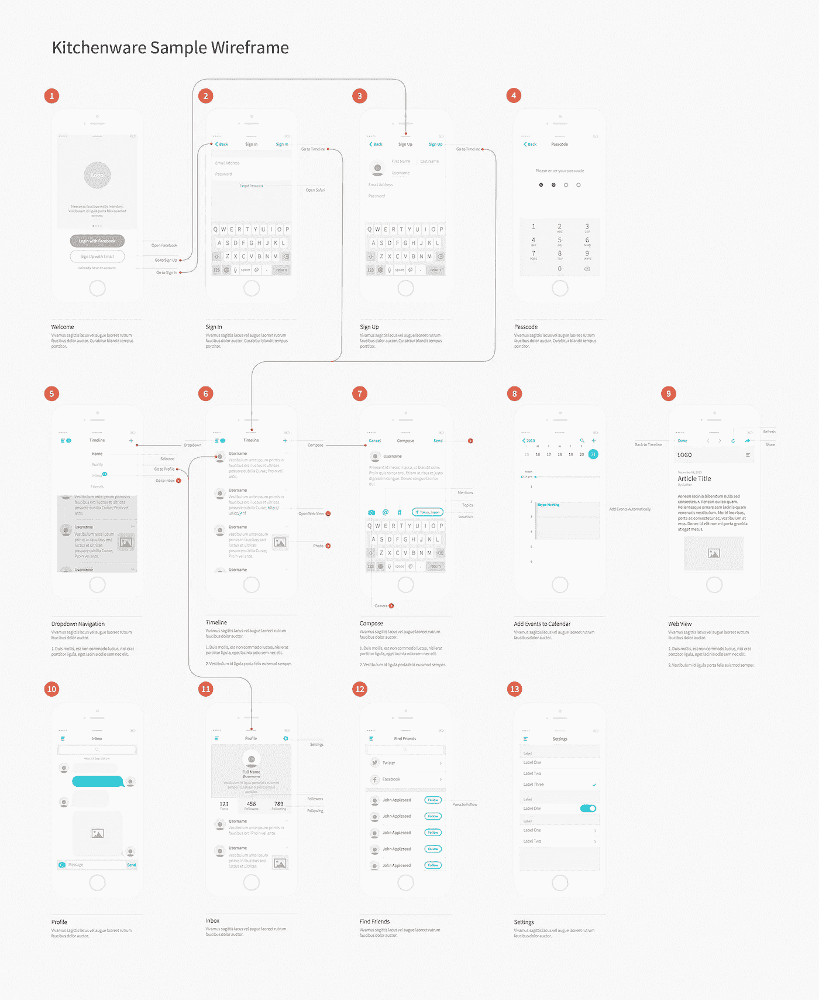
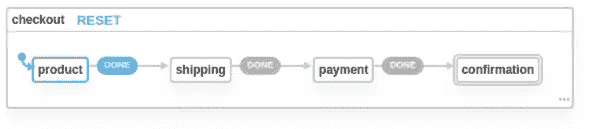
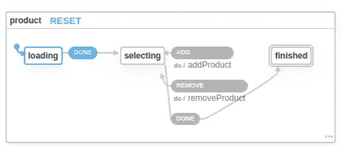

# 在 React 中与衍生和调用的 xstate 参与者通信

> 原文：<https://itnext.io/communicating-with-spawned-and-invoked-xstate-actors-in-react-999cca56506b?source=collection_archive---------0----------------------->

我最近开始使用有限状态机，同时重新思考我们的结账漏斗实现。我必须承认，我对状态机如何适用于前端工程非常感兴趣。这需要一点时间来适应这种范式，开始时您可能很难理解所有的注意事项，但是您使用这些机器越多，就越容易理解您复杂的应用程序。

如果您使用过 Redux，您就会知道在这个过程的早期，尝试引导存储、编写所有的动作和 reducers，以及将状态映射到组件内部的 props 是多么麻烦。如果你有一个多步骤的表单向导，你最终会有相当多的条件逻辑，试图决定在用户旅程的哪个阶段显示哪些组件。您开始创建一些奇特的验证器来确保当前状态允许用户进入下一个屏幕。

如果您从用户界面的角度考虑您的应用程序，您很快就会意识到它只不过是一个有限状态机。你有一组屏幕和它们之间的转换——一个经典的状态图！

[刘威的运球设计](https://dribbble.com/shots/1356038-Kitchenware-Pro-Wireframe-Kit/attachments/193170)

每个屏幕可以被定义为有限状态机可以处于的状态。在顶层，您的应用程序是一台定义这些屏幕之间导航规则的机器。因为你的应用程序一次只能处于一个单一的状态，也就是说，你一次只能显示一个单一的屏幕，每个屏幕都是一个有入口点和出口点的机器:你的顶级机器并不真正关心每个屏幕的内部状态，你只能在子机器通知父机器它到达了最终状态时，从一个特定的屏幕中转换出来。例如，您可能有一个基本的结帐漏斗，其形式为:产品>运输>付款>完成。这些步骤中的每一个都是相互独立的，它们不是并行存在的，而是顺序存在的，所以运输屏幕内部的一个机器并不关心支付屏幕状态机内部的状态。顶级机器不关心支付机器内部的状态，它所关心的是知道已经进入支付屏幕，并且它等待支付屏幕发送回完成的信号(即，它到达其最终状态之一，例如，成功完成支付)。

xstate 是 JavaScript 中一个很棒的状态图实现，它为 React 提供了一个适配器。虽然在 React 中有很多创建状态机的例子，但我找不到太多关于处理嵌套机器和衍生角色的例子，所以更多的是一种尝试和错误。让我用两个例子来展示我的发现:使用一个被调用的子机器来表示父机器的状态，使用一个衍生的 actor 来处理一般的问题，比如警报。

## 调用子机器

在详细介绍我们的实现之前，让我们先详细说明一下我们的状态图，以帮助我们可视化这个过程:

当我们的结帐机器进入`product`状态时，我们希望调用一个产品机器作为子服务，并等待它到达最终状态，此时我们将数据发送回父服务。注意`productMachine.states.final`中`data`属性的使用和`checkoutMachine.states.product`中产品机的调用。当调用子机时，我们可以分配一个`id`，它可以用来访问 React 组件内部的子机，以及将上下文数据传递给子机(在本例中`productCategory`被发送给子机)。

我们现在可以创建我们的 React 组件了。

我们使用`useMachine`钩子创建一个内存化的根级机器。父子通信的关键在`ProductPicker`组件中:我们可以通过它的 id 访问我们的子机器实例(即被调用的子服务)。让你的子组件反应的诀窍是通过`useService`钩子运行这个子服务，它将为你提供子服务的状态和转换回调。一旦到达产品机器的最终状态，所选产品的数组被发送到父机器并存储在其上下文中。您可以稍后将这些产品传递到付款屏幕，以确定最终价格。

## 催生儿童演员

简单地说，一个参与者就是一个运行在你的机器内部的服务——它可以是一个被调用的机器，或者是承诺，或者是回调。您可以在任何阶段生成新的演员，并以我上面演示的相同方式访问他们。现在让我们创建一个通知服务，我们可以使用它向用户显示错误/警报。

让我们假设当我们取产品的时候出了问题。我们希望能够捕获产品机器中的错误，通知父机器，并通过通知机器显示警告。

在我们的 checkout 机器的根目录`entry`中，我们可以生成一个新的 actor，例如，将通知机器实例化为一个服务。然后我们可以通过指定接收者`{to: 'childServiceId'}`经由`send()`与通知机器通信。产品机器可以通过使用`sendParent()`与其父检验机器对话。这里需要注意的一点是，`send`和`sendParent`都不是真正的函数调用，而是动作生成器，所以不要试图在另一个动作回调中使用它们，因为它不会做任何事情。可以用`{actions: [ callback1, send(), callback2 ]}`之类的。

当我们的收银机处于`product`状态时，它会监听`NOTIFY`转换(因此产品机可以使用`sendParent({type: 'NOTIFY', ...payload})`)并向`notificationsMachine`发送一个`ALERT`转换。

现在，我们可以将通知机器连接到警报组件。

我希望这能为在@xstate/react 中使用亲子沟通模式提供一些见解。我不得不通过反复试验来发现它的大部分，如果它能为您的工作节省一些时间，我会很高兴。