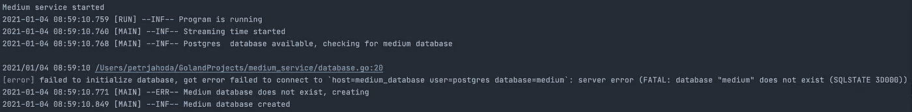
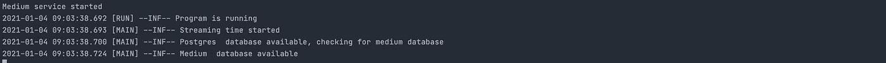
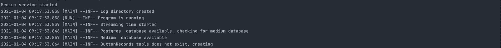
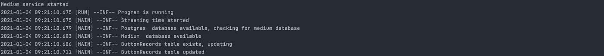
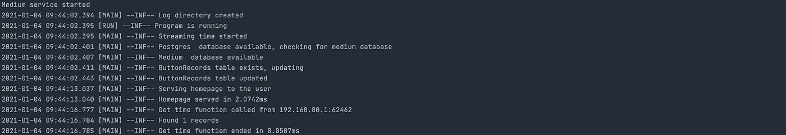
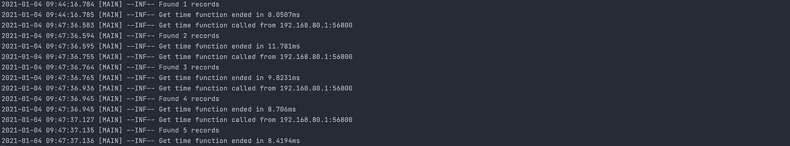
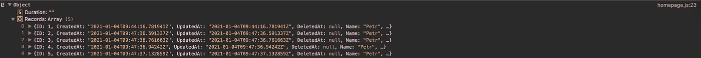
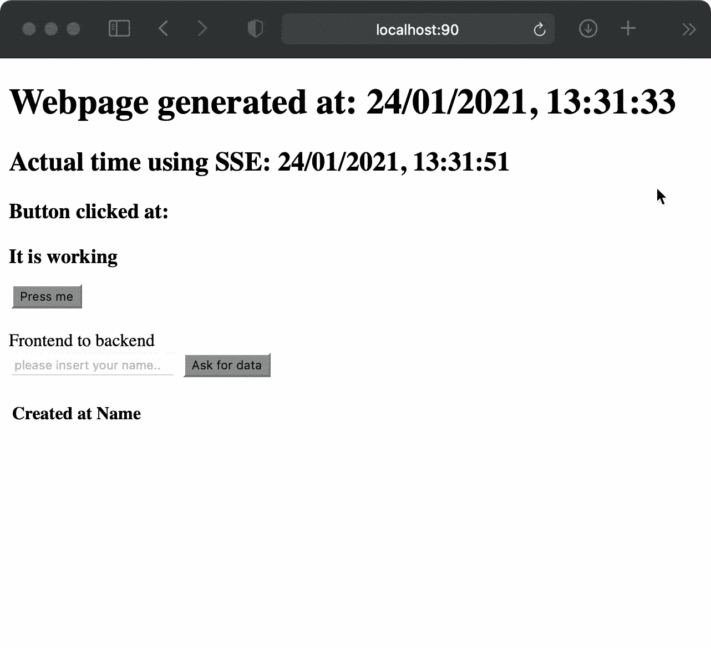
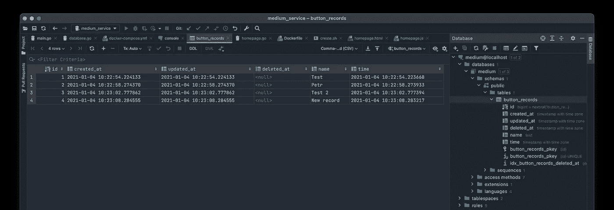

# Go 服务和 Postgres 数据库之间的通信(都运行在 Docker 中)

> 原文：<https://itnext.io/communication-between-go-service-and-postgres-database-both-running-in-docker-ae0fd53a25b8?source=collection_archive---------3----------------------->

## 通过一个直接从 Go 代码创建数据库和表的例子

由 Renee French 创建的原始地鼠图像，使用由 Maria Letta 创建的地鼠图像

1.  部分:[创建服务](https://petrjahoda.medium.com/create-go-service-the-easy-way-de827d7f07cf)
2.  part: [改善服务](https://petrjahoda.medium.com/create-go-service-the-easy-way-ii-c397fd17875)
3.  part: [网页升级](https://petrjahoda.medium.com/create-go-service-the-easy-way-iii-c84489cc1ee0)
4.  零件:[添加 SSE](https://petrjahoda.medium.com/create-go-service-the-easy-way-iv-c1f6b91401c1)
5.  部分:[简单的 javascript 前端功能](https://petrjahoda.medium.com/create-go-service-the-easy-way-v-63c260594ed9)
6.  零件:[前端—后端通信](https://petrjahoda.medium.com/create-go-service-the-easy-way-vi-1fc383d435bd)
7.  部分:[服务器端日志](https://petrjahoda.medium.com/create-go-service-the-easy-way-vii-2a550c9204a6)
8.  零件:[在 docker](https://petrjahoda.medium.com/create-go-service-the-easy-way-viii-157427e7cd35) 中运行所有零件
9.  零件:[添加数据库容器](https://petrjahoda.medium.com/test-story-618d1cfca0cd)
10.  part: **你现在正在看**

追加 1: [函数、方法、指针和接口](/go-functions-methods-pointers-and-interfaces-1c034fd198d3)
追加 2: [websocket 通信](/websocket-communication-between-two-go-programs-the-easy-way-d8c9cf40043f)
追加 3: [socket 通信](https://petrjahoda.medium.com/plain-socket-communication-between-two-go-programs-the-easy-way-bd5ac5819eb6)

# 访问 Docker 中运行的数据库

假设您运行两个(或更多)Docker 容器。其中一个容器包含正在运行的数据库。并且您想从所有这些非数据库容器中访问这个数据库。

这篇文章将告诉你，如何去做。它还将向您展示如何直接从 Go 代码创建数据库和表。

# 准备项目

再次打开您的项目并导航到**数据库。转到**文件。在此添加一个新常数。

这个常量保存到我们新的`medium`数据库(尚未创建)的连接字符串。

**本文包含五大步骤:**

1.  直接从代码创建数据库
2.  直接从代码创建表
3.  添加简单的写操作
4.  添加简单的读取操作
5.  在网页上显示已读数据

## 直接从 Go 代码创建数据库

我们的函数`checkDatabase()`现在只做一件事:检查 PostgreSQL 数据库是否可访问。

用下面的代码更新这个函数。首先，该函数将检查主数据库`postgres`是否可用，这保持不变。如果可用，就要进行第二次可用性检查——这次是针对名为`medium`的数据库。如果这个`medium`数据库不可用，它会尝试创建它。如果它可用(已经创建)，它只记录这个信息。

## 首次测试

如果您现在构建您的`medium_service` docker 映像并运行`docker-compose up -d`，您会注意到您首先遇到了一个错误。这和我们在上一篇文章中运行的错误是一样的:`medium_service`运行起来比`medium_database`启动它的数据库要快得多。

要解决这个问题，只需使用`docker restart medium_service`重启这个服务，并显示日志`docker logs -f medium_service.`，现在您可以看到结果。

1.  服务已启动
2.  为 postgres 数据库检查的服务…可用
3.  为中型数据库检查服务…不可用
4.  服务创建了此数据库

如果您重新启动服务并再次获取日志，您会看到，这一次，即使是这个中型数据库也已经创建好了(它应该已经创建好了)。第一步完成了。

## 直接从 Go 代码创建表格

我们需要开始在**数据库中为我们的新表创建结构。在已经存在的两个常量下面添加一个新的结构。这个结构将用于在 Go 和数据库之间映射数据。我们将这个表命名为`ButtonRecords`，它有 6 列:**

*   `gorm.Model` 创建了四个非常有用的列(参见奖励部分的截图)
*   `Name`创建文本类型的列
*   `Time`创建时间戳类型的列

现在添加代码，它将处理创建表和更新表(如果已经创建了的话)。

如果您有一个新版本的表，例如包含新列的表，那么更新会很方便。第二部分代码会自动将这些新列添加到已经存在的表中。

## 第二次测试

现在`docker-compose down`你的运行容器。然后更新你的`medium_service`图。让卷`medium_db`保留已经创建的数据库，并使用`docker-compose up -d`再次运行它。这一次您将看到，两个数据库检查都正常。然后代码检查该表，如果没有找到，就创建它。就像这个例子。

如果您重新启动您的`medium_service`并再次检查日志，这一次您会看到，该表已经存在，所以只有更新将被处理。这样我们的第二步就完成了。

## 添加读写操作

导航到您的**主页，转到**文件，进入`getTime()`功能。

我们将在这里添加一个小功能:当用户点击网页按钮时，我们的代码将在已经创建的表中创建新的记录。然后从该表中读取所有记录，并将它们发送回网页。然后我们将在 HTML 表格中显示这些数据。

如下更新`getTime()`功能。正如你所看到的，我们删除了一半的代码，并添加了新的代码。因为我们希望首先处理错误，所以这个新代码会尝试打开数据库，如果出现错误，它会将错误信息发送回网页。

*附注:您可以使用许多 Go 模块进行数据库通信。我几乎都试过了，最后用了*[*GORM*](https://gorm.io)*，它易于使用，代码可读，可以访问所有主要的数据库，而且——以我的经验来看——真的很快。*

现在我们将添加这个读写功能。现在所有的错误都被处理了，所以我们可以向函数的其余部分添加代码了——这是我们的幸福之路。

添加两行新行，创建一个名为`record`的新变量，当用户单击该按钮时，用来自我们网页的数据填充它的字段。

就是这样，将数据写入数据库很容易。

从数据库中读取数据也很容易。添加这三行。第一行创建名为`records`的变量，第二行从表`ButtonRecords`中读取所有记录，第三行只是打印一些有用的信息。

我们还需要为输出的数据更新我们的结构，这样我们就可以把那些记录发送回去。如下所示更新 TimeDataOutput 结构(只添加了一行)。

然后为函数的其余部分添加代码。有一条*新*线`responseData.Records = records`。这一行将我们的数据库`records`添加到我们返回网页的响应中。

## 第三次测试

再一次… `docker-compose down`一切，创造你的`medium_service`和`docker-compose up -d`一切回来。

打开浏览器，打开页面，查看`medium_service`日志。下面的截图是你按下按钮后应该看到的。

按下按钮的次数越多，从数据库中读取的记录就越多。就像下面的截图一样。

我们还需要检查，是否所有内容都返回到浏览器。如果您在浏览器中打开了控制台，您应该会看到在单击一个按钮并接收回数据后，有一个包含数据数组的对象。这些是数据库里的数据。

我们完成了第 3 步和第 4 步。

## 完成项目

我们就要结束了。我们将添加最后一个功能:在用户单击该按钮后，在页面上的一个简单表格中显示数据库中的数据。

用新行更新您的**homepage.html**文件，它将保存那些返回的数据:

然后导航到 **homepage.js** 并在文件的开头添加一个新行:`const table = document.getElementById(“table”)`，这样我们就可以访问那个 html 表。

然后用下面的代码更新您的`response`函数。这段代码将访问这些`Records`并将一条又一条记录添加到我们的表中。

还要在你的`checkDatabase()`函数的开头添加`time.Sleep(2*time.Second)` ，这样我们就不需要再次重启`medium_service`容器，当我们从头开始运行所有的*。*

## *最后试验*

*再次，`docker-compose down`一切，使用`docker rm medium_db`移除卷，再次创建我们的`medium_service`并`docker-compose up -d`一切正常。*

*这两秒钟足以让`medium_database`创建它的基本 postgres 数据库，所以我们的`medium`数据库是在第一次运行时创建的。*

*希望您能看到如下内容。每次按下按钮，新的记录就会在后台保存到数据库中。之后，所有记录立即从数据库中下载，并在浏览器中显示为表格。*

**

# *摘要*

*我们到达了终点，现在你知道，如何…*

*   *写入运行在不同 docker 容器中的数据库*
*   *从该数据库中读取*
*   *将这些数据发送回浏览器并显示给用户*

* [## petrjahoda/中型服务

### 中等 _ 服务。在 GitHub 上创建一个帐户，为 petrjahoda/medium-service 的发展作出贡献。

github.com](https://github.com/petrjahoda/medium_service/tree/Chapter_10)* 

# *额外功能*

*我希望你现在已经厌倦了那些码头工人写的东西。我们这样做的原因是让你为这个额外的功能做好准备:-)。*

*由于我们现在已经构建了我们的`docker-compose.yml`文件，我们不能从 Docker 外部访问我们的数据库。出于安全原因，这很好，但是对于开发来说很烦人。*

*因此，对于开发来说，将端口映射添加到我们的`docker-compose.yml`文件中，并保持您的数据库运行。在这个例子中，端口 5433 用于从 Docker 外部访问容器。*

*现在，您可以在启用该端口的情况下再次运行它，然后使用 Goland 的内置数据库功能，并在开发代码时访问我们的表。*

**