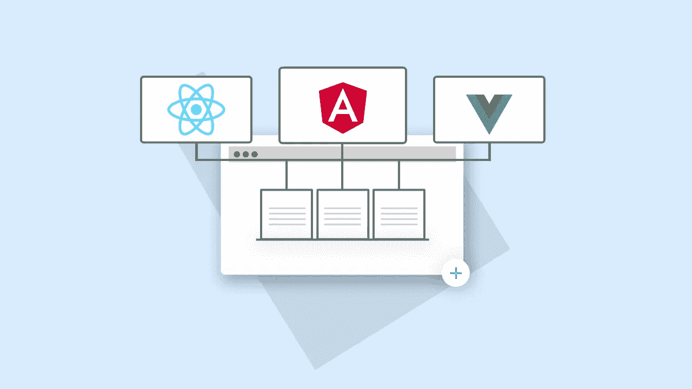

# 微前端之间的通信

> 原文：<https://itnext.io/communication-between-micro-front-ends-f3c04d4c138e?source=collection_archive---------1----------------------->



微前端(MFE)现在非常流行。它是热的，它是性感的，并且在大多数情况下，是不相关的(MFE 是一个大项目的解决方案。它的存在是为了分离关注点)。但遗憾的是，大多数关于 MFE 的帖子都是关于初始设置的，而不是关于实际的生产就绪代码。我们如何在微前端之间交流？

我们将把它分成两种不同类型的项目。

1.  每个 MFE 都可以在不同的框架中编写的应用程序。
2.  全部使用相同框架的应用程序(为了示例 Angular)。

***框架不可知通信***

我们可以肯定地说，所有 UI 框架之间的**共同点**就是窗口元素。这是我们的机会之窗。

对于本例，我们将创建一个自定义事件(浏览器提供的一个全局函数)

```
*const customEvent* = *new* CustomEvent('eventFromMfe', {detail: {name: 'Ryan'}})
```

" *customEvent* "事件还没有被触发，而是在等待我们想触发它的时候。

```
window.dispatchEvent(*customEvent*);
```

现在我们已经触发了一个事件。我们不“期待”回应。有点 UDP 的心态。
在我们众多 mfe 之一的某个地方，我们在窗口上有一个被动事件监听器，等待我们的自定义事件被调度。

```
window.addEventListener('eventFromMfe', (customEvent: *CustomEvent*) => {
    *const* {detail} = customEvent || {}
    console.log('data from custom event', JSON.stringify(detail))
})
```

我们可以让不同 mfe 中的多个侦听器等待相同的事件发生，并运行代码来响应它们。

这是一种非常**手动**的方式来创建我们 MFE 之间的通信。我们可以使用一个名为 [pubsub-js](https://www.npmjs.com/package/pubsub-js) (非常有名)的漂亮的库，它执行类似的过程，但是具有更加反应式的风格(我非常确定在幕后它与窗口事件非常相似，如果我错了，请纠正我)。

注意:
使用这种方法允许项目使用不同的微前端，以与框架无关的心态共存。虽然这很有效，但我很难相信一个拥有足够大项目的公司会使用不同的框架。创建良好的团队间沟通太复杂了。

***【通过商店沟通(单类型框架)***

商店是我们想要在我们所有的 Angular MFEs 之间共享的东西。它让我们能够访问商店数据，并更加独立地工作。我们可以完全篡改存储来影响存储数据，但是我们也可以“滥用”动作的工作方式。

```
*// MFE1**const* globalLoadingAction = createAction('[MFE-Action] Loading', props<{loading: *boolean*}>())
```

MFE 可以通过存储调度 *globalLoadingAction* 事件，而不需要任何缩减器或效果。这是一种全球事件，类似于我们的 window.dispatch

```
*// MFE2**this*.actions$.pipe(
    ofType(globalLoadingAction), // only listen to the event
).subscribe((action: Action) => {
    *this*.toggleGlobalLoading
})
```

我们的第二个 MFE 连接到同一个存储，在 singleton instances module-federations 给我们的帮助下，我们从我们的第二个 MFE 中监听相关的动作并处理我们的逻辑。这将导致更像“乒乓式”的交流，但这会给你一个非常分散的代码库。

*注意事项*:

当使用某种商定的语言时，比如动作或自定义事件的枚举，我们可以使用 NPM 包来处理这个问题，并被所有 MFE 共享。由于我们沟通的每一部分都是分离的，包版本管理就成了一个问题(大部分情况下)。

希望这对您有所帮助:)，并为您提供探索和测试 mfe 所需的动力。对于任何问题和帮助，你可以随时联系我，我会尽力帮助你