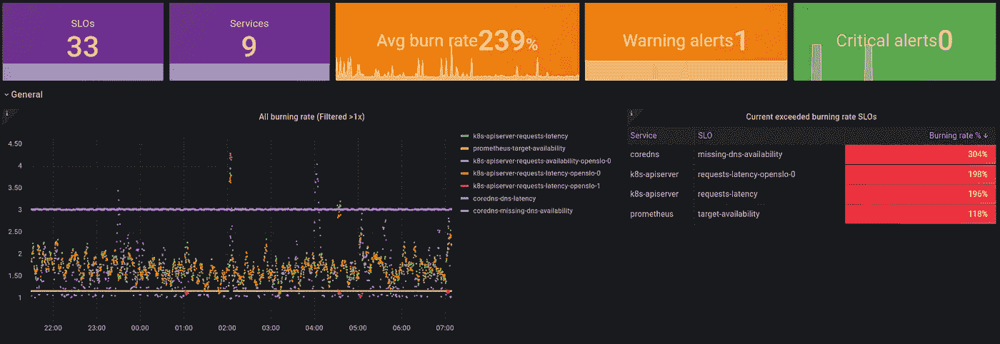

# 基于社区的 SLIs 提高了 SLO 的可靠性和采用率

> 原文：<https://itnext.io/community-based-slis-to-boost-slo-reliability-and-adoption-d849c8b921eb?source=collection_archive---------4----------------------->



基于通用 SLI 插件的 SLO

几个月前，我发表了一篇名为 [*SLOs 应该很容易，向树懒*](/slos-should-be-easy-say-hi-to-sloth-9c8a225df0d4) *问好。*本文描述了 [Sloth](https://github.com/slok/sloth) 的发布，这是一个以非常简单的方式为 [Prometheus](https://prometheus.io/) 创建 SLO 的应用程序/进程(如果您还没有阅读过，我建议您先阅读一下)。

Sloth 的诞生是因为我对开发/创建 SLO 时存在的复杂性和易错过程的担忧。这涉及许多部分(规格 UX、CI、部署……)。在这个过程中，Sloth 试图解决这些问题，包括我们今天要讨论的问题，SLO 的来源，服务水平指标，或 SLI。

什么是 SLI？《SRE》一书是这样描述的:

> SLI 是一个服务水平指标，是对所提供的服务水平的某个方面的一个精心定义的量化度量。
> 
> 大多数服务将**请求延迟**——返回对请求的响应需要多长时间——视为一个关键的 SLI。其他常见的 sli 包括**错误率**，通常表示为接收到的所有请求的分数，以及**系统吞吐量**，通常以每秒请求数来度量。测量值通常是汇总的:即原始数据是在测量窗口内收集的，然后转换成比率、平均值或百分比。

# 然后问题开始了…

当您创建 SLO 时，通常，摩擦/问题并不总是决定目标/目的，首先，您需要知道测量 sli 的内容和方法:

*   使用 X 技术时，我需要衡量什么才能获得此服务的 SLO？
*   如何查询服务指标以获得真实的 SLI？
*   *ERR_TOO_MANY_METRICS* ，这个 SLO 有哪些好的？
*   这些普罗米修斯式的查询很复杂，我不完全明白我在做什么？
*   这是有效的 SLI 吗？
*   这可以用不同的时间窗口来衡量吗？
*   …

很有可能你在创建 SLO 的时候就不再问自己这类问题了。

**这不应该是那样的，应该是直白轻松的。**

我们已经在其他领域解决了这个问题。

*   当我想开发一些东西时，我会搜索一个已经存在的库。
*   当我想绘制/可视化指标时，我会搜索 Grafana 仪表板。
*   当我想做一些事情时，我会搜索现有的应用程序。
*   当我想在 Kubernetes 中部署一些东西时，我会搜索现有的 Kubernetes 清单。

最后，我们希望可重用性是高效的、学习的、避免错误的…那么为什么我们不能对 SLIs 做同样的事情呢？一个大的公共 OSS SLIs 社区和索引？

让我们来介绍 SLI 插件！

# SLI 插件


[来自像素的插头](https://www.pexels.com/es-es/foto/espacio-pared-cable-cargando-4097207/)

在创作《懒惰》时，我对 SLI 的一些担忧是:

*   不要写同样的 1000 次，能够重用已经创建的 sli。
*   从规范中删除查询复杂性。
*   减少 SLIs 上的错误并提高可靠性。
*   使 SLI 在开放源码软件技术上标准化(例如 Kubernetes、Traefik……)。
*   允许技术/应用程序开发人员共享 sli 和代码(例如:和 Kubernetes 清单一样)。
*   集中公司的 SLIs，抽象团队的复杂性。

作为这些问题的解决方案，我考虑了如何让 SLIs 变得简单和可插拔，并在 Sloth 中创建了 SLI 插件的概念。

**SLI 插件是一个用 Go 编写的简单的小代码文件，它将接收一些选项并返回普罗米修斯查询。**

非常简单容易。然而，非常强大。

Sloth 规范支持这种可选的 SLI 类型(以及事件和原始类型)。人们可以使用这些可插入的 sli 来代替设置复杂的度量查询:

SLO 使用 [Traefik v1 可用性插件](https://github.com/slok/sloth-common-sli-plugins/tree/main/plugins/traefik/v1/availability)

正如在这个例子中可以看到的，我们不需要考虑查询，我们只知道我们正在使用 Traefik v1，所以我们使用了 [Traefik v1 插件](https://github.com/slok/sloth-common-sli-plugins/tree/main/plugins/traefik/v1/availability)并传递了一些选项。

# 通用插件索引


除了 Sloth，还有一个名为[*Sloth-common-sli-plugins*](https://github.com/slok/sloth-common-sli-plugins)的库，每天都在增加新的插件。这些插件可供任何使用 SLOs 和 sloth 的人使用。

目前，多种技术有多种插件类型(可用性、延迟…):

*   [Kubernetes](https://kubernetes.io/)
*   [核心域名](https://coredns.io/)
*   [Traefik](https://traefik.io/)
*   HTTP go 库
*   [普罗米修斯](https://prometheus.io/)
*   …

使用这些插件非常简单，只需两步:

*   下载插件(例如:克隆回购)。
*   运行 Sloth，使用*“sli-plugins-path”*标志指向回购路径。

Sloth 会发现插件并加载它们，这样它们就可以在规范中使用了。

```
git clone https://github.com/slok/sloth-common-sli-plugins.git

sloth generate --*sli-plugins-path* ./sloth-common-sli-plugins -i ${MY_SLO_MANIFEST}
```

# 贡献和开发一个 SLI 插件

所以，想象你喜欢你刚刚读过的东西，你想创建你自己的插件。更好的是，你想为社区贡献新的插件！

让我们深入了解 SLI 插件架构和创作！

## 体系结构

插件使用 Go 的决定是拥有好的可共享插件的关键。默认情况下，插件应该易于开发、测试和简单。然而，与此同时，要足够灵活，这样我们才不会产生充满变通方法的意外复杂性。

Go 很简单，容易理解，并且有一个非常强大的标准库，能够根据选项做出决定，改变字符串…

Sloth 的 SLI 插件使用 [Yaegi](https://github.com/traefik/yaegi) 加载，并使用 Sloth 建立的一套约定和规则开发。把所有的[都检查到这里](https://github.com/slok/sloth#sli-plugins)。TL；博士:

*   **只使用标准库**(无外部依赖)。
*   **每个插件一个单独的文件，名为“*plugin . go”****(可移植)。*
*   ***插件之间没有重用**(插件独立性)。*
*   ***实现一个名为*slip lugin***(约定)的方法。*

## *例子*

*最后，插件非常简单，它们必须返回 Prometheus 查询:*

*   *我们要测量的 SLI 错误率，*“坏事件/有效事件”**
*   *在不同的时间窗口中测量这一点的能力。*

*因此，假设我们的可用性插件有这些指标:*

*   **my_event_errors_total{app= " "，kind=""}* :用错误事件计数。*
*   **my_events_total{app= "，kind=""}* :所有事件计数器。*

*我们的插件必须接受选项:*

*   *“app”(必需):选择要测量其事件的应用程序。*
*   *“kind”(可选):默认为 all，但用户可以选择特定类型的事件。*

*让我们看看插件代码:*

*plugin.go*

*在上面的代码中，我们看到:*

*   *Sloth 会用这个来知道应该加载什么类型的插件。*
*   *Sloth 会用这个 ID 注册这个插件。这是规范使用这个插件的 ID。*
*   ***SLIPlugin** :将要执行的插件逻辑。*

*插件逻辑接收元数据(SLO 名称…)、标签(SLO 规范中用户定义的标签)和插件选项。在我们的例子中，我们只需要选项来从用户 SLO 规范中获取数据:*

*   *如果用户没有“app”，我们返回一个错误。*
*   *如果用户有“kind”，我们创建过滤标签“kind”。*
*   *如果没有可用的度量，则返回 0 错误率(避免 NaN 度量)。*

*然后，我们使用这些选项呈现一个模板来生成我们的查询。使用 Go 插件的一个好处是，我们可以很容易地进行单元测试来检查我们的插件是否返回了我们所期望的结果:*

*plugin_test.go*

*要使用它，只需指向“plugin.go”文件所在的路径并在规范中引用插件即可:*

*使用插件的 SLO 规范*

***更多例子，查看**[**sloth-common-sli-plugins**](https://github.com/slok/sloth-common-sli-plugins/)**。***

*要贡献一个新的插件，请查看这个库的[贡献](https://github.com/slok/sloth-common-sli-plugins#contributing)部分。*

# *将来的*

*未来将继续增加越来越多的通用 SLI 插件到索引中，一些计划中的例子:*

*   *[特拉菲克 V2](https://traefik.io/)*
*   *[特使](https://www.envoyproxy.io/)*
*   *[Nginx](https://www.nginx.com/)*
*   *[阿尔戈(光盘和工作流程)](https://argoproj.github.io/)*
*   *[通量](https://fluxcd.io/)*
*   *MySQL*
*   *[Postgres](https://www.postgresql.org/)*
*   *[Redis](https://redis.io/)*
*   *[Kubernetes](https://kubernetes.io/)*
*   *[GRPC](https://grpc.io/)*
*   *[Etcd](https://etcd.io/)*

# *结论*

*在这一点上，我认为我们已经知道作为一个社区分享 SLI 插件的好处:*

*   *由了解并每天使用度量标准/sli 的人员维护。*
*   *解决一个 SLI 的错误就解决了那个 SLI 插件的所有用户。*
*   *解决 SLI 过时问题:新指标/变更的更新是集中的。*
*   *查询执行的优化。*
*   *通过消除拐角情况来提高度量查询的可靠性。*
*   *用户可发现 SLI。*
*   *简单、安全、快速地交付 SLO。*
*   *作为开发个人插件或 SLO 的学习范例。*
*   *…*

**

***如果你喜欢你所看到的，参与进来，帮助我们建立这个** [**共享-通用 SLI 插件索引**](https://github.com/slok/sloth-common-sli-plugins/) **！***

*感谢阅读，祝*好运*！*

*再见！*