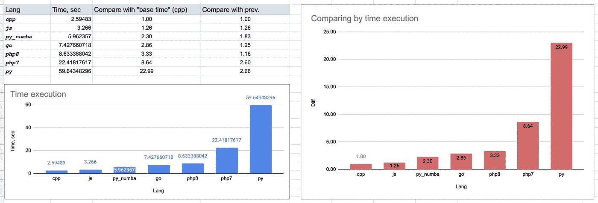

# 比较 C++、JS、Python、Python + numba、PHP7、PHP8、Golang 在“素数”计算中的应用。

> 原文：<https://itnext.io/compare-c-js-python-python-numba-php7-php8-and-golang-in-prime-number-calculation-55e82b6f82a9?source=collection_archive---------4----------------------->

所有的顶级编程语言都证明了它们的地位，并“决定”了它们的用途。然而，对每一个程序员来说，理解他们使用的每一种语言的数量特征是很重要的。
您可以针对不同目的测量大量参数。
对于某些任务来说，快速计算数学运算会更重要。对其他人来说，更快地处理网络和文件更有用。

在本文中，我们将研究使用 Python 和 PHP 的 JIT 编译进行程序加速。

作为一个计算任务，我们就拿校验的功能来说:数是不是质数——“是质数”。

你可以看到一系列质数:

让我们来看看检查的基本算法:这个数不是偶数，不能被一个更小的数整除，直到所需数的根(也就是说，在循环中，从 3 到该数的根)。我们将需要计算一些质数——直到最大值。此任务中的最大数量为 10，000，000。

在下面的算法和代码中，您可以看到我没有使用并行化，以便更“真实”地估计执行时间。

启动程序的机器:

考虑不同编程语言中的算法选项:

# C++

# Go (golang)

# 节点. js

# 服务器端编程语言（Professional Hypertext Preprocessor 的缩写）

我尝试使用 PHP 的两个版本:7.3 和 8。比较没有 JIT 和有 JIT 的 PHP。
我不得不说，在没有启用 JIT 的情况下，PHP8 显示了几乎相同的执行时间——大约 20 秒。

# Python(不带“numba”)

Numba 是一个针对 Python 的实时编译器，最适合使用 NumPy 数组和函数以及循环的代码。

# 带“numba”的 Python

注意:越少越好。

这里可以看到 JS 版本相当“快”。
还有:python3 + numba 表现出了巨大的性能提升！甚至在走之前。酷！

带 JIT 的 PHP8 表现不错，堪比 Go！

可能，有些东西超出了我的视野，在这个任务中，我没有考虑到一些点，基本版本中的 js 比 Go 快。

对此你怎么看？我可以添加或更改什么来完成实验？

您对处理文本、图像和 web 的性能指标感兴趣吗？