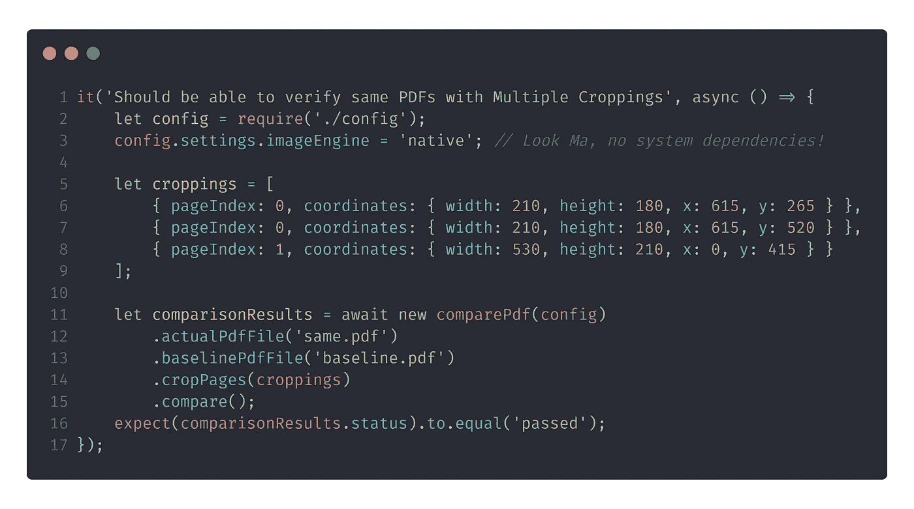
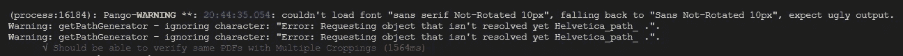
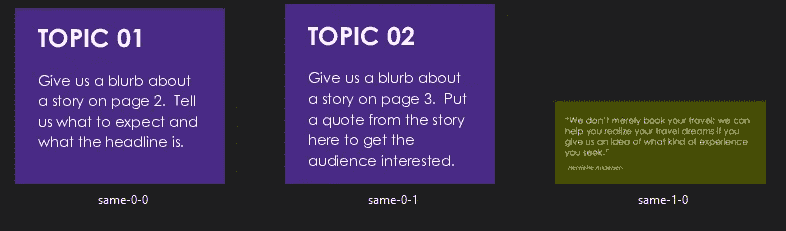

# 比较-pdf:有什么新内容？

> 原文：<https://itnext.io/compare-pdf-whats-new-bf9d40d6fb8b?source=collection_archive---------2----------------------->

听着，妈，再也没有系统依赖了

# 图像引擎

当我在 2020 年初发布 [compare-pdf](https://www.npmjs.com/package/compare-pdf) 时，我一直渴望它成为一个独立的 pdf 比较模块。然而，它的第一次迭代需要 GraphicsMagick、ImageMagick 和 GhostScript 等系统依赖项。这肯定不是一个独立的模块，但由于#stage4 #viclockdown，现在发生了变化！😎

 [## compare-pdf:独立的 pdf 文件比较节点模块

### 用于 pdf 比较的独立节点模块，具有大量功能！

itnext.io](/compare-pdf-standalone-pdf-file-comparison-node-module-33222cace70f)  [## 比较-pdf

### 比较 pdf 的独立节点模块使用 GraphicsMagick (gm)引擎，安装以下系统依赖项…

www.npmjs.com](https://www.npmjs.com/package/compare-pdf) 

刚刚从 npm 烤箱中出来的 [compare-pdf](https://www.npmjs.com/package/compare-pdf) 发布版本 1.1.4 现在允许用户配置使用什么图像引擎。在 config 下，使用设置 **imageEngine** ，你现在可以完全进入*或者仍然使用***graphicsMagick****。*为了向后兼容，默认情况下，它仍然会使用后者。*

*现在，模块使用 [PDF.js](https://www.npmjs.com/package/pdfjs-dist) 和 [Canvas](https://www.npmjs.com/package/canvas) 将 PDF 转换为 png，并应用蒙版或裁剪。这意味着，用户不再需要安装上述系统依赖项。对 CI/CD 管道非常有用！*

# *警告*

*虽然使用 [PDF.js](https://www.npmjs.com/package/pdfjs-dist) 非常漂亮，但它也有自己的问题。您可能会遇到一些警告消息，提示某些字体无法加载或无法解析。在他们的 GitHub 页面上有一个与此相关的公开问题。在我的测试中，这个模块似乎会使用一种替代字体。然而，如果你自己遇到一些问题，不要犹豫提出来。*

**

# *还有一点*

*此版本的另一个显著改进是，用户现在可以裁剪同一 pdf 页面的多个区域。当您只关心同一个 pdf 页面的几个区域时，这特别有用。*

**

# *暂时就这样了*

*如果你有意见或建议和功能请求，请在下面的评论中添加，或者提出一个拉取请求。此外，如果你喜欢这个项目，并发现它很有帮助，请在 GitHub 中添加你的星星，并在下面鼓掌！*

*一如既往，保持牛逼，下集再见！*

***marcDacz***