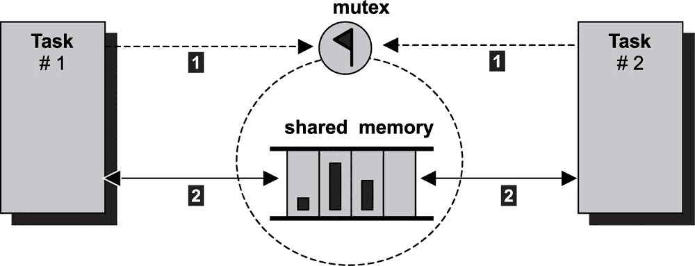

# Crystal 与 Go 的并发性比较(下)

> 原文：<https://itnext.io/comparing-crystals-concurrency-with-that-of-go-part-ii-89049701b1a5?source=collection_archive---------2----------------------->

在本系列文章第一部分 的[**中，我重点从**通信顺序进程(CSP)** 的角度比较了 Crystal 和 Go 的并发性。这第二部分是填补空白，涵盖更传统的**共享内存多线程**。**](/comparing-crystals-concurrency-with-that-of-go-s-part-i-cd45a3388935)

src:[http://www . embedded Linux . org . cn/rtconforembsys/5107 final/lib 0095 . html](http://www.embeddedlinux.org.cn/rtconforembsys/5107final/LiB0095.html)

***我假设您对多线程、临界区、互斥以及确保互斥的锁定/解锁等概念有所了解。***

像我以前的文章一样，这篇文章也将重点关注将一些 Go 程序转换为 Crystal，并尝试比较这两者。

# **共享内存多线程**

在共享内存多线程中，多个线程可以访问公共的共享变量，为了避免竞争情况并确保互斥，使用了锁。

Go 使用 [**同步**包](https://golang.org/pkg/sync/)来支持这一点

*   **互斥** —用于为**锁定**和**解锁**提供支持。还支持变体 **RWMutex**
*   **WaitGroup** —用于等待 goroutines 的收集完成

Crystal 使用 [**互斥**类](https://crystal-lang.org/api/0.35.1/Mutex.html)来支持这一点。但是，从版本 0.35.1 开始，没有 **WaitGroup** 支持。我将提供一个例子，演示如何使用通道来实现类似于 **WaitGroup** 的东西。

让我们来看几个例子——

## 并发性 7

这个例子展示了如何使用互斥锁和解锁来确保互斥。

**围棋版本——**【https://tour.golang.org/concurrency/9】T42

代码被很好地注释了。但是总的来说—

*   **第 32 行**:创建一个**安全计数器**，它有一个 **mux** 类型的 **sync。互斥**
*   **第 17–21 行**:使用 **sync 的**锁定**()和**解锁**()功能。互斥体**确保对共享变量的顺序访问(在本例中为**映射 v** )

**水晶版—**

这里—

*   **第 22 行**:创建一个**安全计数器**，它有一个 **mux** 类型的**互斥**
*   **第 8–11 行**:使用 **Mutex** 类的 **lock** 和 **unlock** 方法来确保对共享变量的顺序访问(在本例中是 **Hash v**

***注意*** *:对于这个简单的例子，你不需要确保块(第 19–12 行/第 17–19 行)。*

## 并发性 8

这个例子摘自伟大的著作 [**学习围棋与测试**](https://quii.gitbook.io/learn-go-with-tests/) 。这显示了如何使用 **WaitGroup** 来等待 goroutines 集合的完成。

**围棋版本—**[https://quii . git book . io/learn-Go-with-tests/Go-fundamentals/sync](https://quii.gitbook.io/learn-go-with-tests/go-fundamentals/sync)

这里—

*   **第 27 行**:使用**同步创建一个**等待组(**)。WaitGroup)** 侍候 1000 个 goroutines。
*   **第 28 行** : **添加****wait group**的功能用于添加我们要等待 1000 个 goroutines 的约束
*   **第 39–35 行**:创建 1000 个 goroutines。每个增加一个计数器的计数，然后当完成时通过 **WaitGroup 的 Done** 方法发出信号，该方法减少等待的 goroutines 的计数
*   第 36 行:**Wait group**的功能用于阻塞 main，直到所有 1000 个 goroutines 完成

**水晶版** —

虽然 Crystal 仍然没有一个完整的 **WaitGroup** 的实现，但是我在 [Crystal 论坛](https://forum.crystal-lang.org/)—[https://forum.crystal-lang.org/t/mt-and-mutex/1297/5](https://forum.crystal-lang.org/t/mt-and-mutex/1297/5)上关注了这个帖子，它建议使用通道来实现上面的替代实现。

这里—

*   **第 19 行**:创建一个 **done_channel** ，当所有晶体光纤完成其增量操作时发出信号
*   **第 21–26 行**:制造 1000 根水晶纤维。每次递增计数器时，通过 **done_channel** 发出信号，表示使用通道的 **send** 方法完成
*   **第 28–29 行**:等待 1000 根光纤完成，并使用通道的**接收**方法接收所有光纤的信号

# **结束语**

在这个由两部分组成的系列文章中，我使用了八个不同的例子来比较 Go 和 Crystal 的并发性。在做这个练习时，我的观察是—

*   Go 使用 **sync** 包更完整的实现了**共享内存多线程**。在这里，水晶有很多要赶上。
*   与 Crystal 的文档相比，Go 的文档要好得多。在 Crystal 版本中，一些库函数或类没有关于如何使用它们的适当解释。

尽管如此，我还是能够克服 Crystal 中的这些缺点，并且实现了所有八个示例程序。鉴于 Crystal 仍在大量开发中，我们仍在等待 1.0 版本，我们需要等待 1.0 版本的到来。当等待已久的 Crystal 1.0 发布时，我期待在这个问题上再看一眼。

# 参考

1.  [https://quii.gitbook.io/learn-go-with-tests/](https://quii.gitbook.io/learn-go-with-tests/)
2.  [https://tour.golang.org/list](https://tour.golang.org/list)
3.  [https://crystal-lang.org/api/0.35.1/index.html](https://crystal-lang.org/api/0.35.1/index.html)
4.  [https://golang.org/](https://golang.org/)
5.  [https://crystal-lang.org/](https://crystal-lang.org/)

*更多详细和深入的未来技术帖子，请关注我这里或上*[*Twitter*](https://twitter.com/meraj_enigma)*。*